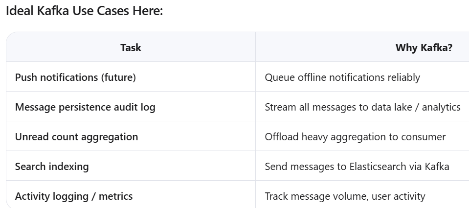

## 🎯 **Where to Use Kafka:** CLAUDE

### **Use Case 1: Message Processing Pipeline**
```
User sends message → Save to DB → Publish to Kafka → Return success
                                         ↓
                           Kafka Consumer processes:
                           - Update conversation
                           - Send notifications
                           - Update analytics
                           - Trigger webhooks
```

### **Use Case 2: Notification Fan-out**
Instead of looping through participants in the socket handler, Kafka consumers handle distribution.




## 🎯 QWEN

###### 🔸 Note: Don’t over-engineer. If you’re a small app, Kafka adds ops overhead. But for >10k users, it’s worth it.

✨ Final Recommendations
Refactor into smaller functions (improve readability/testability).
Fix async loop → use for...of.
Fetch sender profile once.
Add early returns on errors.
Consider idempotency keys for message deduplication.
Use constants/enums instead of magic numbers.
Add comprehensive logging (with correlation IDs).
Add unit/integration tests for core logic.

> Only add Kafka when needed — start with RabbitMQ or BullMQ if lighter weight is preferred.

Monitor performance of aggregate() for unread counts — cache in Redis if slow.


