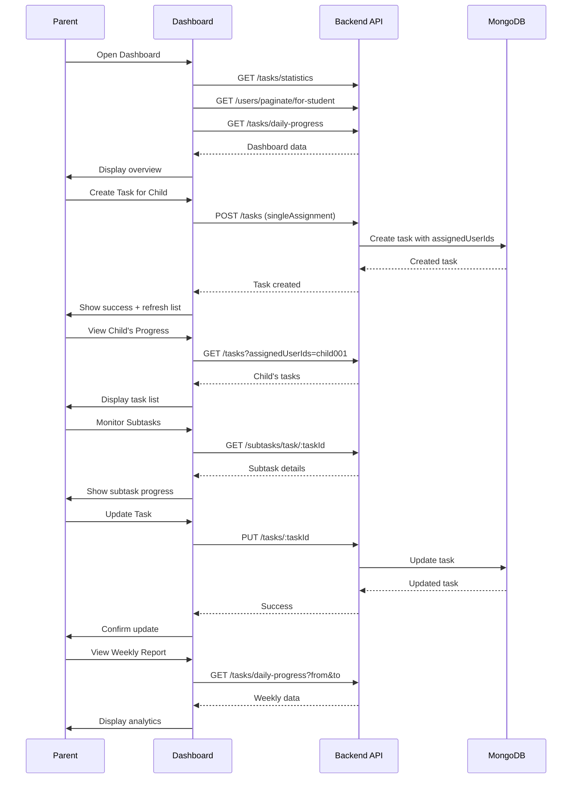

# 📱 API Flow: Business/Parent - Dashboard Task Monitoring

**Role:** `business` (Parent / Teacher / Group Owner)  
**Figma Reference:** `figma-asset/teacher-parent-dashboard/dashboard/`  
**Module:** Task Management  
**Date:** 10-03-26  
**Version:** 1.0

---

## 🎯 User Journey Overview

This document maps the complete API flow for a **Business/Parent user** monitoring tasks in their **Dashboard**.

```
┌─────────────────────────────────────────────────────────────┐
│              DASHBOARD TASK MONITORING FLOW                 │
├─────────────────────────────────────────────────────────────┤
│  1. Login → Get Access Token                                │
│  2. Load Dashboard → Get Overview Statistics                │
│  3. View All Tasks → Paginated List                         │
│  4. Monitor Child Progress → Daily/Weekly Reports           │
│  5. Create Task for Child → Assignment Flow                 │
│  6. Update Child's Task → Modify Assignment                 │
│  7. Delete Task → Remove Assignment                         │
└─────────────────────────────────────────────────────────────┘
```

---

## 📍 Flow 1: Dashboard Initial Load

### Screen: Dashboard Home (Overview)

**Figma:** `teacher-parent-dashboard/dashboard/dashboard-flow-01.png`

### API Calls (Parallel):

#### 1.1 Get Overall Task Statistics
```http
GET /api/v1/tasks/statistics
Authorization: Bearer {{accessToken}}
```

**Purpose:** Load dashboard overview cards

**Response:**
```json
{
  "code": 200,
  "message": "Task statistics retrieved successfully",
  "data": {
    "total": 50,
    "pending": 20,
    "inProgress": 10,
    "completed": 20,
    "completionRate": 40
  },
  "success": true
}
```

#### 1.2 Get Children/Students Overview
```http
GET /api/v1/users/paginate/for-student?page=1&limit=10
Authorization: Bearer {{accessToken}}
```

**Purpose:** Load list of children/students under supervision

**Response:**
```json
{
  "code": 200,
  "message": "Students retrieved successfully",
  "data": {
    "docs": [
      {
        "_id": "child001",
        "name": "John Student",
        "email": "john@student.com",
        "role": "child",
        "profileImage": "https://...",
        "taskStats": {
          "totalTasks": 15,
          "completedTasks": 8,
          "pendingTasks": 7
        }
      },
      {
        "_id": "child002",
        "name": "Jane Student",
        "email": "jane@student.com",
        "role": "child",
        "profileImage": "https://...",
        "taskStats": {
          "totalTasks": 12,
          "completedTasks": 10,
          "pendingTasks": 2
        }
      }
    ],
    "pagination": {
      "page": 1,
      "limit": 10,
      "total": 2,
      "totalPages": 1
    }
  },
  "success": true
}
```

#### 1.3 Get Today's Daily Progress (All Children)
```http
GET /api/v1/tasks/daily-progress?date=2026-03-10
Authorization: Bearer {{accessToken}}
```

**Purpose:** Show today's completion rate across all children

**Response:**
```json
{
  "code": 200,
  "message": "Daily progress retrieved successfully",
  "data": {
    "date": "2026-03-10T00:00:00.000Z",
    "totalTasks": 20,
    "completedTasks": 12,
    "pendingTasks": 8,
    "completionRate": 60,
    "byChild": [
      {
        "childId": "child001",
        "childName": "John Student",
        "totalTasks": 10,
        "completedTasks": 6,
        "completionRate": 60
      },
      {
        "childId": "child002",
        "childName": "Jane Student",
        "totalTasks": 10,
        "completedTasks": 6,
        "completionRate": 60
      }
    ],
    "tasks": [...]
  },
  "success": true
}
```

---

## 📍 Flow 2: View All Tasks with Filters

### Screen: Dashboard → Task Management Section

**Figma:** `teacher-parent-dashboard/dashboard/dashboard-flow-01.png`

### API Calls:

#### 2.1 Get All Tasks with Pagination
```http
GET /api/v1/tasks/paginate?page=1&limit=20&sortBy=-startTime
Authorization: Bearer {{accessToken}}
```

**Purpose:** Load all tasks (created by parent + assigned to children)

**Response:**
```json
{
  "code": 200,
  "message": "Tasks retrieved successfully with pagination",
  "data": {
    "tasks": [
      {
        "_id": "task001",
        "title": "Math Homework",
        "description": "Complete algebra exercises",
        "status": "inProgress",
        "priority": "high",
        "taskType": "singleAssignment",
        "scheduledTime": "10:30 AM",
        "dueDate": "2026-03-15T23:59:59.000Z",
        "totalSubtasks": 5,
        "completedSubtasks": 2,
        "completionPercentage": 40,
        "createdById": {
          "_id": "parent001",
          "name": "Parent User",
          "email": "parent@example.com"
        },
        "ownerUserId": {
          "_id": "parent001",
          "name": "Parent User",
          "email": "parent@example.com"
        },
        "assignedUserIds": [
          {
            "_id": "child001",
            "name": "John Student",
            "email": "john@student.com"
          }
        ]
      }
    ],
    "pagination": {
      "page": 1,
      "limit": 20,
      "total": 50,
      "totalPages": 3
    }
  },
  "success": true
}
```

#### 2.2 Filter by Child
```http
GET /api/v1/tasks/paginate?page=1&assignedUserIds=child001
Authorization: Bearer {{accessToken}}
```

**Purpose:** View tasks assigned to specific child

#### 2.3 Filter by Status
```http
GET /api/v1/tasks/paginate?page=1&status=pending
Authorization: Bearer {{accessToken}}
```

**Purpose:** View only pending tasks

#### 2.4 Filter by Date Range
```http
GET /api/v1/tasks/paginate?from=2026-03-01&to=2026-03-31
Authorization: Bearer {{accessToken}}
```

**Purpose:** View tasks within date range

---

## 📍 Flow 3: Create Task for Child

### Screen: Dashboard → Create Task Button → Task Form → Submit

**Figma:** `teacher-parent-dashboard/dashboard/dashboard-flow-01.png`

### API Calls:

#### 3.1 Create Single Assignment Task
```http
POST /api/v1/tasks
Authorization: Bearer {{accessToken}}
Content-Type: application/json
```

**Request:**
```json
{
  "title": "Science Project",
  "description": "Build a volcano model for science fair",
  "taskType": "singleAssignment",
  "assignedUserIds": ["child001"],
  "priority": "high",
  "scheduledTime": "2:00 PM",
  "startTime": "2026-03-11T14:00:00.000Z",
  "dueDate": "2026-03-20T23:59:59.000Z"
}
```

**Response:**
```json
{
  "code": 201,
  "message": "Task created successfully",
  "data": {
    "_id": "task002",
    "title": "Science Project",
    "taskType": "singleAssignment",
    "status": "pending",
    "assignedUserIds": ["child001"],
    "createdById": "parent001",
    "ownerUserId": "parent001",
    "completionPercentage": 0
  },
  "success": true
}
```

**Post-Create Actions:**
1. Show success toast: "Task assigned to John!"
2. Navigate back to task list
3. Refresh task list (Flow 2)
4. Optional: Send notification to child

---

## 📍 Flow 4: Create Collaborative Task (Multiple Children)

### Screen: Dashboard → Create Task → Select Multiple Children → Submit

**Figma:** `teacher-parent-dashboard/team-members/`

### API Calls:

#### 4.1 Create Collaborative Task
```http
POST /api/v1/tasks
Authorization: Bearer {{accessToken}}
Content-Type: application/json
```

**Request:**
```json
{
  "title": "Group Science Project",
  "description": "Work together on solar system model",
  "taskType": "collaborative",
  "assignedUserIds": ["child001", "child002", "child003"],
  "priority": "medium",
  "scheduledTime": "3:00 PM",
  "startTime": "2026-03-12T15:00:00.000Z",
  "dueDate": "2026-03-25T23:59:59.000Z",
  "groupId": "group001"
}
```

**Response:**
```json
{
  "code": 201,
  "message": "Collaborative task created successfully",
  "data": {
    "_id": "task003",
    "title": "Group Science Project",
    "taskType": "collaborative",
    "status": "pending",
    "assignedUserIds": ["child001", "child002", "child003"],
    "groupId": "group001",
    "completionPercentage": 0
  },
  "success": true
}
```

**Validation:**
- `taskType: collaborative` requires 2+ assigned users
- All assigned users must be in the same group (if groupId provided)

---

## 📍 Flow 5: Update Child's Task

### Screen: Dashboard → Task Details → Edit → Save

**Figma:** `teacher-parent-dashboard/dashboard/dashboard-flow-01.png`

### API Calls:

#### 5.1 Get Task Details
```http
GET /api/v1/tasks/:taskId
Authorization: Bearer {{accessToken}}
```

**Response:** (Same as Flow 4 in child-student-home-flow.md)

#### 5.2 Update Task
```http
PUT /api/v1/tasks/:taskId
Authorization: Bearer {{accessToken}}
Content-Type: application/json
```

**Request:**
```json
{
  "title": "Updated Science Project",
  "description": "Build volcano OR solar system model",
  "priority": "high",
  "dueDate": "2026-03-25T23:59:59.000Z"
}
```

**Response:**
```json
{
  "code": 200,
  "message": "Task updated successfully",
  "data": {
    "_id": "task002",
    "title": "Updated Science Project",
    "priority": "high",
    "dueDate": "2026-03-25T23:59:59.000Z"
  },
  "success": true
}
```

---

## 📍 Flow 6: Monitor Task Completion

### Screen: Dashboard → Task Details → View Subtasks

**Figma:** `teacher-parent-dashboard/task-monitoring/`

### API Calls:

#### 6.1 Get Subtasks for Task
```http
GET /api/v1/subtasks/task/:taskId
Authorization: Bearer {{accessToken}}
```

**Response:**
```json
{
  "code": 200,
  "message": "Subtasks retrieved successfully",
  "data": [
    {
      "_id": "sub001",
      "taskId": "task002",
      "title": "Research volcanoes",
      "description": "Learn about different types",
      "duration": "1 hour",
      "isCompleted": true,
      "completedAt": "2026-03-11T15:00:00.000Z",
      "order": 1,
      "createdById": {
        "_id": "parent001",
        "name": "Parent User"
      },
      "assignedToUserId": {
        "_id": "child001",
        "name": "John Student"
      }
    },
    {
      "_id": "sub002",
      "taskId": "task002",
      "title": "Build model",
      "description": "Create physical volcano model",
      "duration": "3 hours",
      "isCompleted": false,
      "order": 2,
      "createdById": {
        "_id": "parent001",
        "name": "Parent User"
      }
    }
  ],
  "success": true
}
```

#### 6.2 Get Subtask Statistics
```http
GET /api/v1/subtasks/statistics
Authorization: Bearer {{accessToken}}
```

**Response:**
```json
{
  "code": 200,
  "message": "Subtask statistics retrieved successfully",
  "data": {
    "total": 25,
    "completed": 15,
    "pending": 10,
    "completionRate": 60
  },
  "success": true
}
```

---

## 📍 Flow 7: Delete Task

### Screen: Dashboard → Task Details → Delete → Confirm

**Figma:** `teacher-parent-dashboard/dashboard/dashboard-flow-01.png`

### API Calls:

#### 7.1 Soft Delete Task
```http
DELETE /api/v1/tasks/:taskId
Authorization: Bearer {{accessToken}}
```

**Response:**
```json
{
  "code": 200,
  "message": "Task deleted successfully",
  "data": {
    "_id": "task002",
    "isDeleted": true
  },
  "success": true
}
```

**Post-Delete Actions:**
1. Remove task from local state
2. Show success toast
3. Refresh task list

---

## 📍 Flow 8: Weekly/Monthly Progress Report

### Screen: Dashboard → Analytics → Weekly Report

**Figma:** `teacher-parent-dashboard/dashboard/dashboard-flow-01.png`

### API Calls:

#### 8.1 Get Weekly Task Progress
```http
GET /api/v1/tasks/daily-progress?from=2026-03-03&to=2026-03-10
Authorization: Bearer {{accessToken}}
```

**Response:**
```json
{
  "code": 200,
  "message": "Weekly progress retrieved successfully",
  "data": {
    "period": {
      "from": "2026-03-03T00:00:00.000Z",
      "to": "2026-03-10T23:59:59.000Z"
    },
    "totalTasks": 35,
    "completedTasks": 20,
    "pendingTasks": 15,
    "completionRate": 57,
    "dailyBreakdown": [
      {
        "date": "2026-03-04",
        "totalTasks": 5,
        "completedTasks": 3,
        "completionRate": 60
      },
      {
        "date": "2026-03-05",
        "totalTasks": 6,
        "completedTasks": 4,
        "completionRate": 67
      }
    ],
    "byChild": [
      {
        "childId": "child001",
        "childName": "John Student",
        "totalTasks": 18,
        "completedTasks": 10,
        "completionRate": 56
      },
      {
        "childId": "child002",
        "childName": "Jane Student",
        "totalTasks": 17,
        "completedTasks": 10,
        "completionRate": 59
      }
    ]
  },
  "success": true
}
```

---

## 📍 Flow 9: Task Assignment with Permissions

### Screen: Dashboard → Group Settings → Permission Management

**Figma:** `teacher-parent-dashboard/settings-permission-section/`

### API Calls:

#### 9.1 Get Group Members with Permissions
```http
GET /api/v1/groups/:groupId/members
Authorization: Bearer {{accessToken}}
```

**Response:**
```json
{
  "code": 200,
  "message": "Group members retrieved successfully",
  "data": [
    {
      "_id": "member001",
      "userId": "child001",
      "name": "John Student",
      "role": "member",
      "permissions": {
        "canCreateTasks": true,
        "canViewAllTasks": false,
        "canEditTasks": false
      }
    }
  ],
  "success": true
}
```

#### 9.2 Update Member Permissions
```http
PUT /api/v1/groups/:groupId/members/:memberId/permissions
Authorization: Bearer {{accessToken}}
Content-Type: application/json
```

**Request:**
```json
{
  "canCreateTasks": true,
  "canViewAllTasks": true,
  "canEditTasks": false
}
```

**Response:**
```json
{
  "code": 200,
  "message": "Permissions updated successfully",
  "data": {
    "userId": "child001",
    "permissions": {
      "canCreateTasks": true,
      "canViewAllTasks": true,
      "canEditTasks": false
    }
  },
  "success": true
}
```

---

## 🔄 Complete Dashboard Session Flow



---

## 📊 State Management

### Dashboard State After Each Flow:

| Flow | State Updated | Cache Invalidated |
|------|---------------|-------------------|
| 1. Dashboard Load | Statistics, children list | Dashboard cache (5 min) |
| 2. Task List | All tasks | Task list cache (2 min) |
| 3. Create Task | New task added | Task list + stats cache |
| 4. Collaborative Task | Group task created | Task list cache |
| 5. Update Task | Task modified | Task detail + list cache |
| 6. Monitor Subtasks | Subtask progress | Parent task cache |
| 7. Delete Task | Task removed | All task caches |
| 8. Weekly Report | Analytics data | Report cache (10 min) |

---

## 🚨 Error Handling

### Common Errors & Recovery:

#### 400 - Daily Task Limit Exceeded
```json
{
  "code": 400,
  "message": "Daily task limit reached. Child already has 5 tasks scheduled for this day (max: 5)",
  "success": false
}
```

**Recovery:**
1. Show error dialog
2. Suggest different date
3. Display existing tasks for that day

#### 403 - Permission Denied
```json
{
  "code": 403,
  "message": "You do not have permission to create tasks for this group",
  "success": false
}
```

**Recovery:**
1. Show permission error
2. Redirect to group settings
3. Contact group owner

#### 404 - Task Not Found
```json
{
  "code": 404,
  "message": "Task not found",
  "success": false
}
```

**Recovery:**
1. Refresh task list
2. Remove task from local state
3. Show "Task no longer exists"

---

## 🎯 Performance Considerations

### Caching Strategy for Dashboard:

| Data Type | Cache Duration | Cache Key |
|-----------|----------------|-----------|
| Dashboard Stats | 5 minutes | `dashboard:stats:{parentId}` |
| Task List | 2 minutes | `dashboard:tasks:{parentId}:{filters}` |
| Child List | 10 minutes | `dashboard:children:{parentId}` |
| Weekly Report | 10 minutes | `dashboard:report:{parentId}:{week}` |

### Optimizations:

1. **Lazy Loading:** Load children list first, then tasks per child
2. **Virtual Scrolling:** For large task lists (100+ tasks)
3. **Debounced Filters:** 300ms delay before API call
4. **Background Refresh:** Silent cache refresh every 2 minutes

---

## 📱 Flutter Integration Points

### Required Flutter Services:

```dart
// 1. Dashboard Service
class DashboardService {
  Future<DashboardStats> getStatistics();
  Future<List<Child>> getChildren();
  Future<DailyProgress> getDailyProgress(DateTime date);
  Future<WeeklyReport> getWeeklyReport(DateTime from, DateTime to);
}

// 2. Task Management Service
class ParentTaskService {
  Future<List<Task>> getAllTasks({filters});
  Future<Task> createTask(CreateTaskRequest request);
  Future<Task> updateTask(String id, UpdateTaskRequest request);
  Future<void> deleteTask(String id);
  Future<List<Subtask>> getSubtasks(String taskId);
}

// 3. Permission Service
class PermissionService {
  Future<List<GroupMember>> getGroupMembers(String groupId);
  Future<void> updatePermissions(String memberId, Permissions perms);
}
```

---

## ✅ Testing Checklist

Test each flow with:

- [ ] Parent with multiple children
- [ ] Parent with single child
- [ ] Parent without children (empty state)
- [ ] Task creation with validation errors
- [ ] Permission denied scenarios
- [ ] Network failures during create/update
- [ ] Concurrent modifications (two parents editing)
- [ ] Large datasets (50+ tasks, 10+ children)

---

**Document Version:** 1.0  
**Last Updated:** 10-03-26  
**Next Review:** After Flutter integration testing
