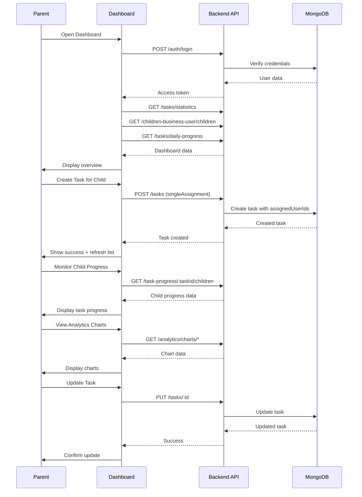

# 📱 API Flow: Business/Parent - Dashboard Task Monitoring (v1.5 - Updated HTTP Only)

**Role:** `business` (Parent / Teacher / Group Owner)  
**Figma Reference:** `teacher-parent-dashboard/dashboard/`  
**Module:** Task Management + Analytics + childrenBusinessUser  
**Date:** 12-03-26  
**Version:** 1.5 - **Updated HTTP Only** (Legacy Reference)  

**Note:** This is an **updated legacy reference**. For HTTP + Socket.IO real-time monitoring, see **Flow 07 (v2.0)**.

---

## 🔧 What Was Updated (v1.0 → v1.5)

| Item | v1.0 | v1.5 |
|------|------|------|
| Base Path | `/api/v1/` | `/v1/` |
| Group Endpoints | `/groups/` | `/children-business-user/` |
| Permission Logic | Group-based | childrenBusinessUser (Secondary User) |
| TaskProgress | ❌ Missing | ✅ Added (6 endpoints) |
| Chart Endpoints | ❌ Missing | ✅ Added (10 endpoints) |

---

## 🎯 User Journey Overview

```
┌─────────────────────────────────────────────────────────────┐
│              DASHBOARD TASK MONITORING FLOW                 │
├─────────────────────────────────────────────────────────────┤
│  1. Login → Get Access Token                                │
│  2. Load Dashboard → Get Overview Statistics                │
│  3. View All Tasks → Paginated List                         │
│  4. Monitor Child Progress → TaskProgress Endpoints         │
│  5. Create Task for Child → Assignment Flow                 │
│  6. Update Child's Task → Modify Assignment                 │
│  7. View Analytics Charts → 10 Chart Endpoints              │
│  8. Manage Team Members → childrenBusinessUser              │
└─────────────────────────────────────────────────────────────┘
```

---

## 📍 Flow 1: Dashboard Initial Load

### Screen: Dashboard Home (Overview)

**Figma:** `teacher-parent-dashboard/dashboard/dashboard-flow-01.png`

### API Calls (Parallel):

#### 1.1 Get Overall Task Statistics
```http
GET /v1/tasks/statistics
Authorization: Bearer {{accessToken}}
```

**Purpose:** Load dashboard overview cards

**Response:**
```json
{
  "success": true,
  "data": {
    "total": 50,
    "pending": 20,
    "inProgress": 10,
    "completed": 20,
    "completionRate": 40
  }
}
```

#### 1.2 Get Children/Students Overview ⭐ UPDATED
```http
GET /v1/children-business-user/children?page=1&limit=10
Authorization: Bearer {{accessToken}}
```

**Purpose:** Load list of children/students under supervision

**Response:**
```json
{
  "success": true,
  "data": {
    "docs": [
      {
        "_id": "rel001",
        "childUserId": "child001",
        "childName": "John Student",
        "email": "john@student.com",
        "isSecondaryUser": false,  // ⭐ NEW: Secondary User flag
        "status": "active"
      },
      {
        "_id": "rel002",
        "childUserId": "child002",
        "childName": "Jane Student",
        "email": "jane@student.com",
        "isSecondaryUser": true,   // ⭐ NEW: Can create tasks for family
        "status": "active"
      }
    ],
    "pagination": {
      "page": 1,
      "limit": 10,
      "total": 2,
      "totalPages": 1
    }
  }
}
```

#### 1.3 Get Today's Daily Progress (All Children)
```http
GET /v1/tasks/daily-progress?date=2026-03-10
Authorization: Bearer {{accessToken}}
```

**Purpose:** Show today's completion rate across all children

**Response:**
```json
{
  "success": true,
  "data": {
    "date": "2026-03-10T00:00:00.000Z",
    "totalTasks": 20,
    "completedTasks": 12,
    "pendingTasks": 8,
    "completionRate": 60,
    "byChild": [
      {
        "childId": "child001",
        "childName": "John Student",
        "totalTasks": 10,
        "completedTasks": 6,
        "completionRate": 60
      },
      {
        "childId": "child002",
        "childName": "Jane Student",
        "totalTasks": 10,
        "completedTasks": 6,
        "completionRate": 60
      }
    ],
    "tasks": [...]
  }
}
```

---

## 📍 Flow 2: View All Tasks with Filters

### Screen: Dashboard → Task Management Section

**Figma:** `teacher-parent-dashboard/dashboard/dashboard-flow-01.png`

### API Calls:

#### 2.1 Get All Tasks with Pagination
```http
GET /v1/tasks/paginate?page=1&limit=20&sortBy=-startTime
Authorization: Bearer {{accessToken}}
```

**Purpose:** Load all tasks (created by parent + assigned to children)

**Response:**
```json
{
  "success": true,
  "data": {
    "tasks": [
      {
        "_id": "task001",
        "title": "Math Homework",
        "description": "Complete algebra exercises",
        "status": "inProgress",
        "priority": "high",
        "taskType": "singleAssignment",
        "scheduledTime": "10:30 AM",
        "dueDate": "2026-03-15T23:59:59.000Z",
        "totalSubtasks": 5,
        "completedSubtasks": 2,
        "completionPercentage": 40,
        "createdById": {
          "_id": "parent001",
          "name": "Parent User",
          "email": "parent@example.com"
        },
        "ownerUserId": {
          "_id": "parent001",
          "name": "Parent User",
          "email": "parent@example.com"
        },
        "assignedUserIds": [
          {
            "_id": "child001",
            "name": "John Student",
            "email": "john@student.com"
          }
        ]
      }
    ],
    "pagination": {
      "page": 1,
      "limit": 20,
      "total": 50,
      "totalPages": 3
    }
  }
}
```

#### 2.2 Filter by Child
```http
GET /v1/tasks/paginate?page=1&assignedUserIds=child001
Authorization: Bearer {{accessToken}}
```

**Purpose:** View tasks assigned to specific child

#### 2.3 Filter by Status
```http
GET /v1/tasks/paginate?page=1&status=pending
Authorization: Bearer {{accessToken}}
```

**Purpose:** View only pending tasks

#### 2.4 Filter by Date Range
```http
GET /v1/tasks/paginate?from=2026-03-01&to=2026-03-31
Authorization: Bearer {{accessToken}}
```

**Purpose:** View tasks within date range

---

## 📍 Flow 3: Monitor Child Progress (TaskProgress) ⭐ NEW!

### Screen: Dashboard → Task Monitoring → Child Progress

**Figma:** `teacher-parent-dashboard/task-monitoring/`

### API Calls:

#### 3.1 Get All Children's Progress on Task
```http
GET /v1/task-progress/:taskId/children
Authorization: Bearer {{accessToken}}
```

**Purpose:** See each child's independent progress on collaborative task

**Response:**
```json
{
  "success": true,
  "data": {
    "taskId": "task001",
    "taskTitle": "Clean the house",
    "totalSubtasks": 3,
    "childrenProgress": [
      {
        "childId": "child001",
        "childName": "John",
        "status": "completed",
        "startedAt": "2026-03-09T10:00:00.000Z",
        "completedAt": "2026-03-09T11:30:00.000Z",
        "progressPercentage": 100,
        "completedSubtaskCount": 3
      },
      {
        "childId": "child002",
        "childName": "Jane",
        "status": "inProgress",
        "startedAt": "2026-03-09T10:30:00.000Z",
        "completedAt": null,
        "progressPercentage": 33.33,
        "completedSubtaskCount": 1
      }
    ],
    "summary": {
      "totalChildren": 2,
      "notStarted": 0,
      "inProgress": 1,
      "completed": 1,
      "completionRate": 50,
      "averageProgress": 66.67
    }
  }
}
```

#### 3.2 Get Child's All Tasks Progress
```http
GET /v1/task-progress/child/:childId/tasks
Authorization: Bearer {{accessToken}}
```

**Purpose:** View all tasks for a specific child with progress

#### 3.3 Update Child's Task Progress Status
```http
PUT /v1/task-progress/:taskId/status
Authorization: Bearer {{accessToken}}
Content-Type: application/json
```

**Request:**
```json
{
  "userId": "child001",
  "status": "inProgress"
}
```

**Purpose:** Manually update child's progress (if needed)

#### 3.4 Complete Child's Subtask
```http
PUT /v1/task-progress/:taskId/subtasks/0/complete
Authorization: Bearer {{accessToken}}
Content-Type: application/json
```

**Request:**
```json
{
  "userId": "child001"
}
```

**Purpose:** Mark subtask as complete for specific child

---

## 📍 Flow 4: Analytics & Charts ⭐ NEW!

### Screen: Dashboard → Analytics Section

**Figma:** `teacher-parent-dashboard/dashboard/dashboard-flow-01.png`

### API Calls:

#### 4.1 Get Family Task Activity Chart
```http
GET /v1/analytics/charts/family-activity/:businessUserId?days=7
Authorization: Bearer {{accessToken}}
```

**Purpose:** Bar chart showing daily task completions

**Response:**
```json
{
  "success": true,
  "data": {
    "labels": ["Mar 06", "Mar 07", "Mar 08", "Mar 09", "Mar 10", "Mar 11", "Mar 12"],
    "datasets": [
      {
        "label": "Tasks Completed",
        "data": [3, 5, 2, 7, 4, 6, 5],
        "color": "#3B82F6"
      }
    ]
  }
}
```

#### 4.2 Get Child Progress Comparison Chart
```http
GET /v1/analytics/charts/child-progress/:businessUserId
Authorization: Bearer {{accessToken}}
```

**Purpose:** Radar/bar chart comparing children's completion rates

**Response:**
```json
{
  "success": true,
  "data": {
    "labels": ["John", "Jane", "Bob"],
    "datasets": [
      {
        "label": "Completion Rate (%)",
        "data": [85, 72, 90],
        "color": "#8B5CF6"
      }
    ]
  }
}
```

#### 4.3 Get Task Status by Child Chart
```http
GET /v1/analytics/charts/status-by-child/:businessUserId
Authorization: Bearer {{accessToken}}
```

**Purpose:** Stacked bar chart showing task status for each child

#### 4.4 Get Completion Trend Chart
```http
GET /v1/analytics/charts/completion-trend/:childId?days=30
Authorization: Bearer {{accessToken}}
```

**Purpose:** Line chart showing cumulative task completions

#### 4.5 Get Activity Heatmap
```http
GET /v1/analytics/charts/activity-heatmap/:childId?days=30
Authorization: Bearer {{accessToken}}
```

**Purpose:** Calendar heatmap showing task activity by day/hour

#### 4.6 Get Collaborative Task Progress
```http
GET /v1/analytics/charts/collaborative-progress/:taskId
Authorization: Bearer {{accessToken}}
```

**Purpose:** Progress bars showing each child's progress

---

## 📍 Flow 5: Create Task for Child

### Screen: Dashboard → Create Task Button → Task Form → Submit

**Figma:** `teacher-parent-dashboard/dashboard/dashboard-flow-01.png`

### API Calls:

#### 5.1 Create Single Assignment Task
```http
POST /v1/tasks
Authorization: Bearer {{accessToken}}
Content-Type: application/json
```

**Request:**
```json
{
  "title": "Science Project",
  "description": "Build a volcano model for science fair",
  "taskType": "singleAssignment",
  "assignedUserIds": ["child001"],
  "priority": "high",
  "scheduledTime": "2:00 PM",
  "startTime": "2026-03-11T14:00:00.000Z",
  "dueDate": "2026-03-20T23:59:59.000Z"
}
```

**Response:**
```json
{
  "success": true,
  "data": {
    "_id": "task002",
    "title": "Science Project",
    "taskType": "singleAssignment",
    "status": "pending",
    "assignedUserIds": ["child001"],
    "createdById": "parent001",
    "ownerUserId": "parent001",
    "completionPercentage": 0
  }
}
```

**Post-Create Actions:**
1. Show success toast: "Task assigned to John!"
2. Navigate back to task list
3. Refresh task list (Flow 2)
4. Optional: Send notification to child

---

## 📍 Flow 6: Create Collaborative Task (Multiple Children)

### Screen: Dashboard → Create Task → Select Multiple Children → Submit

**Figma:** `teacher-parent-dashboard/team-members/`

### API Calls:

#### 6.1 Create Collaborative Task
```http
POST /v1/tasks
Authorization: Bearer {{accessToken}}
Content-Type: application/json
```

**Request:**
```json
{
  "title": "Group Science Project",
  "description": "Work together on solar system model",
  "taskType": "collaborative",
  "assignedUserIds": ["child001", "child002", "child003"],
  "priority": "medium",
  "scheduledTime": "3:00 PM",
  "startTime": "2026-03-12T15:00:00.000Z",
  "dueDate": "2026-03-25T23:59:59.000Z",
  "subtasks": [
    { "title": "Research planets", "duration": "1 hour" },
    { "title": "Build model", "duration": "2 hours" },
    { "title": "Prepare presentation", "duration": "1 hour" }
  ]
}
```

**Response:**
```json
{
  "success": true,
  "data": {
    "_id": "task003",
    "title": "Group Science Project",
    "taskType": "collaborative",
    "status": "pending",
    "assignedUserIds": ["child001", "child002", "child003"],
    "completionPercentage": 0
  }
}
```

**Validation:**
- `taskType: collaborative` requires 2+ assigned users
- All assigned users should be in same family (childrenBusinessUser)

---

## 📍 Flow 7: Manage Team Members (childrenBusinessUser) ⭐ UPDATED

### Screen: Dashboard → Team Members Section

**Figma:** `teacher-parent-dashboard/team-members/team-member-flow-01.png`

### API Calls:

#### 7.1 Get My Children
```http
GET /v1/children-business-user/children?page=1&limit=10
Authorization: Bearer {{accessToken}}
```

**Purpose:** Get all children in family

**Response:**
```json
{
  "success": true,
  "data": {
    "docs": [
      {
        "_id": "rel001",
        "childUserId": "child001",
        "childName": "John Student",
        "email": "john@student.com",
        "isSecondaryUser": false,
        "status": "active"
      }
    ],
    "totalPages": 1,
    "page": 1,
    "limit": 10
  }
}
```

#### 7.2 Create Child Account
```http
POST /v1/children-business-user/create-child
Authorization: Bearer {{accessToken}}
Content-Type: application/json
```

**Request:**
```json
{
  "name": "Alex Child",
  "email": "alex@example.com",
  "password": "ChildPass123!"
}
```

**Purpose:** Create new child account (adds to family)

#### 7.3 Set Secondary User Permission ⭐ NEW!
```http
PUT /v1/children-business-user/set-secondary-user
Authorization: Bearer {{accessToken}}
Content-Type: application/json
```

**Request:**
```json
{
  "childUserId": "child001",
  "isSecondaryUser": true
}
```

**Purpose:** Grant task creation permission to one child

**Note:** Only ONE child per business user can be Secondary User

#### 7.4 Update Child
```http
PUT /v1/children-business-user/:id
Authorization: Bearer {{accessToken}}
Content-Type: application/json
```

**Purpose:** Update child information

#### 7.5 Remove Child
```http
DELETE /v1/children-business-user/:id
Authorization: Bearer {{accessToken}}
```

**Purpose:** Remove child from family (soft delete)

---

## 📍 Flow 8: Update Child's Task

### Screen: Dashboard → Task Details → Edit → Save

**Figma:** `teacher-parent-dashboard/dashboard/dashboard-flow-01.png`

### API Calls:

#### 8.1 Get Task Details
```http
GET /v1/tasks/:taskId
Authorization: Bearer {{accessToken}}
```

**Response:** (Same as Flow 4.1 in v1.0)

#### 8.2 Update Task
```http
PUT /v1/tasks/:taskId
Authorization: Bearer {{accessToken}}
Content-Type: application/json
```

**Request:**
```json
{
  "title": "Updated Science Project",
  "description": "Build volcano OR solar system model",
  "priority": "high",
  "dueDate": "2026-03-25T23:59:59.000Z"
}
```

**Response:**
```json
{
  "success": true,
  "data": {
    "_id": "task002",
    "title": "Updated Science Project",
    "priority": "high",
    "dueDate": "2026-03-25T23:59:59.000Z"
  }
}
```

---

## 📍 Flow 9: Delete Task

### Screen: Dashboard → Task Details → Delete → Confirm

**Figma:** `teacher-parent-dashboard/dashboard/dashboard-flow-01.png`

### API Calls:

#### 9.1 Soft Delete Task
```http
DELETE /v1/tasks/:taskId
Authorization: Bearer {{accessToken}}
```

**Response:**
```json
{
  "success": true,
  "data": {
    "_id": "task002",
    "isDeleted": true
  }
}
```

**Post-Delete Actions:**
1. Remove task from local state
2. Show success toast
3. Refresh task list

---

## 📍 Flow 10: Weekly/Monthly Progress Report

### Screen: Dashboard → Analytics → Weekly Report

**Figma:** `teacher-parent-dashboard/dashboard/dashboard-flow-01.png`

### API Calls:

#### 10.1 Get Weekly Task Progress
```http
GET /v1/tasks/daily-progress?from=2026-03-03&to=2026-03-10
Authorization: Bearer {{accessToken}}
```

**Response:**
```json
{
  "success": true,
  "data": {
    "period": {
      "from": "2026-03-03T00:00:00.000Z",
      "to": "2026-03-10T23:59:59.000Z"
    },
    "totalTasks": 35,
    "completedTasks": 20,
    "pendingTasks": 15,
    "completionRate": 57,
    "dailyBreakdown": [
      {
        "date": "2026-03-04",
        "totalTasks": 5,
        "completedTasks": 3,
        "completionRate": 60
      },
      {
        "date": "2026-03-05",
        "totalTasks": 6,
        "completedTasks": 4,
        "completionRate": 67
      }
    ],
    "byChild": [
      {
        "childId": "child001",
        "childName": "John Student",
        "totalTasks": 18,
        "completedTasks": 10,
        "completionRate": 56
      },
      {
        "childId": "child002",
        "childName": "Jane Student",
        "totalTasks": 17,
        "completedTasks": 10,
        "completionRate": 59
      }
    ]
  }
}
```

---

## 🔄 Complete Dashboard Session Flow



---

## 📊 State Management

### Dashboard State After Each Flow:

| Flow | State Updated | Cache Invalidated |
|------|---------------|-------------------|
| 1. Dashboard Load | Statistics, children list | Dashboard cache (5 min) |
| 2. Task List | All tasks | Task list cache (2 min) |
| 3. Child Progress | Progress per child | TaskProgress cache |
| 4. Analytics Charts | Chart data | Chart cache (5 min) |
| 5. Create Task | New task added | Task list + stats cache |
| 6. Collaborative Task | Group task created | Task list cache |
| 7. Manage Children | Children list updated | Children cache |
| 8. Update Task | Task modified | Task detail + list cache |
| 9. Delete Task | Task removed | All task caches |
| 10. Weekly Report | Analytics data | Report cache (10 min) |

---

## 🚨 Error Handling

### Common Errors & Recovery:

#### 400 - Daily Task Limit Exceeded
```json
{
  "success": false,
  "message": "Daily task limit reached. Child already has 5 tasks scheduled for this day (max: 5)"
}
```

**Recovery:**
1. Show error dialog
2. Suggest different date
3. Display existing tasks for that day

#### 403 - Permission Denied
```json
{
  "success": false,
  "message": "You do not have permission to create tasks for this group"
}
```

**Recovery:**
1. Show permission error
2. Redirect to children management
3. Check Secondary User status

#### 404 - Task Not Found
```json
{
  "success": false,
  "message": "Task not found"
}
```

**Recovery:**
1. Refresh task list
2. Remove task from local state
3. Show "Task no longer exists"

---

## 🎯 Performance Considerations

### Caching Strategy:

| Data Type | Cache Duration | Cache Key |
|-----------|----------------|-----------|
| Dashboard Stats | 5 minutes | `dashboard:stats:{parentId}` |
| Task List | 2 minutes | `dashboard:tasks:{parentId}:{filters}` |
| Child List | 10 minutes | `dashboard:children:{parentId}` |
| Weekly Report | 10 minutes | `dashboard:report:{parentId}:{week}` |
| Chart Data | 5 minutes | `analytics:chart:{type}:{params}` |
| TaskProgress | 5 minutes | `taskprogress:{taskId}:{childId}` |

### Optimizations:

1. **Lazy Loading:** Load children list first, then tasks per child
2. **Virtual Scrolling:** For large task lists (100+ tasks)
3. **Debounced Filters:** 300ms delay before API call
4. **Background Refresh:** Silent cache refresh every 2 minutes

---

## 📱 Flutter Integration Points

### Required Flutter Services:

```dart
// 1. Dashboard Service
class DashboardService {
  Future<DashboardStats> getStatistics();
  Future<List<Child>> getChildren();
  Future<DailyProgress> getDailyProgress(DateTime date);
  Future<WeeklyReport> getWeeklyReport(DateTime from, DateTime to);
}

// 2. Task Management Service
class ParentTaskService {
  Future<List<Task>> getAllTasks({filters});
  Future<Task> createTask(CreateTaskRequest request);
  Future<Task> updateTask(String id, UpdateTaskRequest request);
  Future<void> deleteTask(String id);
  Future<List<Subtask>> getSubtasks(String taskId);
}

// 3. TaskProgress Service ⭐ NEW!
class TaskProgressService {
  Future<ChildrenProgress> getChildrenProgress(String taskId);
  Future<List<ChildTaskProgress>> getChildTasks(String childId);
  Future<void> updateProgress(String taskId, String childId, String status);
  Future<void> completeSubtask(String taskId, int subtaskIndex, String childId);
}

// 4. Analytics Service ⭐ NEW!
class AnalyticsService {
  Future<ChartSeries> getFamilyActivity(String businessUserId, {int days = 7});
  Future<ChartSeries> getChildProgress(String businessUserId);
  Future<ChartSeries> getStatusByChild(String businessUserId);
  Future<ChartSeries> getCompletionTrend(String childId, {int days = 30});
  Future<HeatmapData> getActivityHeatmap(String childId, {int days = 30});
  Future<CollaborativeProgress> getCollaborativeProgress(String taskId);
}

// 5. ChildrenBusinessUser Service ⭐ UPDATED!
class ChildrenBusinessUserService {
  Future<List<Child>> getChildren();
  Future<Child> createChild(CreateChildRequest request);
  Future<void> setSecondaryUser(String childId, bool isSecondary);
  Future<void> updateChild(String id, UpdateChildRequest request);
  Future<void> removeChild(String id);
}
```

---

## ✅ Testing Checklist

Test each flow with:

- [ ] Parent with multiple children
- [ ] Parent with single child
- [ ] Parent without children (empty state)
- [ ] Task creation with validation errors
- [ ] Permission denied scenarios
- [ ] Network failures during create/update
- [ ] Concurrent modifications (two parents editing)
- [ ] Large datasets (50+ tasks, 10+ children)
- [ ] Chart endpoints return correct format
- [ ] TaskProgress endpoints work correctly
- [ ] Secondary User permission works
- [ ] childrenBusinessUser CRUD operations

---

## 📝 Related Documentation

### For Real-Time Features (HTTP + Socket.IO):
- **Flow 07 (v2.0)**: Parent dashboard with real-time monitoring
- **Flow 04 (v2.0)**: Same content, different naming

### For Task Progress:
- **Flow 05 (v2.0)**: Child task progress with real-time parent notifications

### For Chart Endpoints:
- **Postman Collection**: `01-User-Common-Part2-Charts-Progress.postman_collection.json`
- **Chart Guide**: `src/modules/analytics.module/chartAggregation/CHART_AGGREGATION_ENDPOINTS.md`

### For childrenBusinessUser:
- **Module Docs**: `src/modules/childrenBusinessUser.module/`
- **Postman Collection**: `01-User-Common-Part2-Charts-Progress.postman_collection.json`

---

## 🔧 Changelog

### v1.5 (12-03-26) - Updated HTTP Only
- ✅ Fixed base path: `/api/v1/` → `/v1/`
- ✅ Replaced `/groups/` → `/children-business-user/`
- ✅ Added TaskProgress endpoints (6 endpoints)
- ✅ Added Chart aggregation endpoints (10 endpoints)
- ✅ Updated permission logic for Secondary User
- ✅ Added childrenBusinessUser management section
- ✅ Marked as legacy (see v2.0 for Socket.IO)

### v1.0 (10-03-26) - Original HTTP Only
- ✅ Initial flow documentation

---

**Document Version**: 1.5 - Updated HTTP Only (Legacy Reference)  
**Last Updated**: 12-03-26  
**Status**: ✅ Updated with current endpoints  
**For Real-Time**: See Flow 07 (v2.0) - HTTP + Socket.IO
