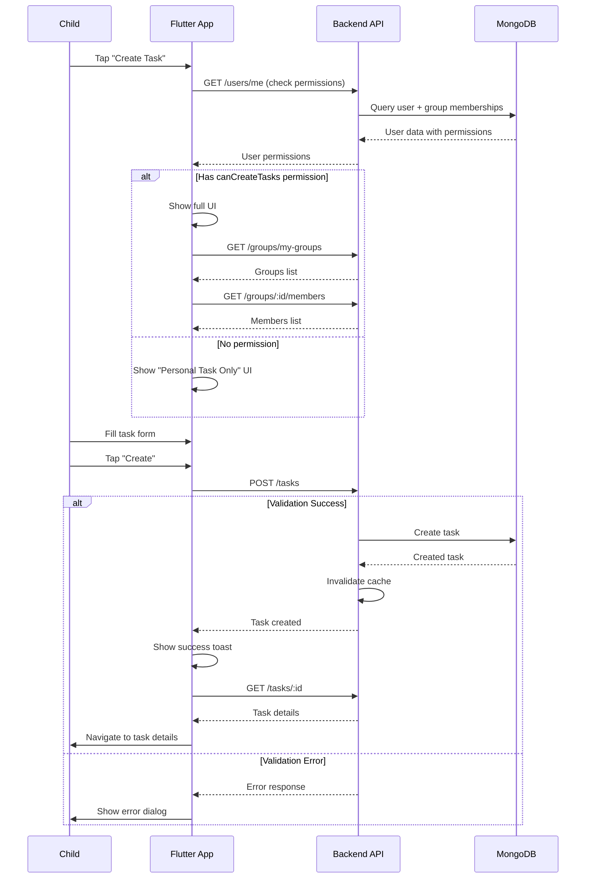

# 📱 API Flow: Child/Student - Create Task Flow (With Permission Logic)

**Role:** `child` (Student / Group Member)  
**Figma Reference:** `figma-asset/app-user/group-children-user/add-task-flow-for-permission-account-interface.png`  
**Module:** Task Management  
**Date:** 10-03-26  
**Version:** 1.0

---

## 🎯 User Journey Overview

This document maps the complete API flow for a **Child/Student user** creating tasks, including **permission-based UI variations**.

```
┌─────────────────────────────────────────────────────────────┐
│                  TASK CREATION FLOW                         │
├─────────────────────────────────────────────────────────────┤
│  1. Check Permissions → Can child create tasks?             │
│  2. Open Create Task Screen → Show appropriate UI           │
│  3. Select Task Type → Personal vs Group                    │
│  4. Fill Task Details → Form validation                     │
│  5. Submit Task → Backend validation                        │
│  6. Handle Response → Success or error                      │
└─────────────────────────────────────────────────────────────┘
```

---

## 📍 Flow 1: Permission Check (Pre-Screen Load)

### Screen: Before Create Task Screen Opens

**Figma:** `app-user/group-children-user/profile-permission-account-interface.png`

### API Calls:

#### 1.1 Get User Profile with Permissions
```http
GET /api/v1/users/me
Authorization: Bearer {{accessToken}}
```

**Purpose:** Check if child has permission to create tasks

**Response:**
```json
{
  "code": 200,
  "message": "Profile retrieved successfully",
  "data": {
    "_id": "child001",
    "name": "John Student",
    "email": "john@student.com",
    "role": "child",
    "profileImage": "https://...",
    "groupMemberships": [
      {
        "groupId": "group001",
        "groupName": "Math Class",
        "role": "member",
        "permissions": {
          "canCreateTasks": true,
          "canViewAllTasks": false,
          "canEditTasks": false,
          "canDeleteTasks": false
        }
      },
      {
        "groupId": "group002",
        "groupName": "Science Club",
        "role": "member",
        "permissions": {
          "canCreateTasks": false,
          "canViewAllTasks": true,
          "canEditTasks": false,
          "canDeleteTasks": false
        }
      }
    ]
  },
  "success": true
}
```

### Permission Logic:

```typescript
// Frontend Permission Check
function canCreateTask(user, taskType) {
  // Personal tasks: Always allowed for child users
  if (taskType === 'personal') {
    return true;
  }
  
  // Group/Collaborative tasks: Need permission
  if (taskType === 'singleAssignment' || taskType === 'collaborative') {
    const groupMembership = user.groupMemberships.find(g => g.groupId === targetGroupId);
    return groupMembership?.permissions.canCreateTasks === true;
  }
  
  return false;
}
```

---

## 📍 Flow 2: Create Task Screen - With Permission (Full UI)

### Screen: Create Task (Child has `canCreateTasks: true`)

**Figma:** `app-user/group-children-user/add-task-flow-for-permission-account-interface.png`

### UI Elements Shown:
- ✅ Task type selector (Personal / Single Assignment / Collaborative)
- ✅ Group selector (if user belongs to multiple groups)
- ✅ Assign to other users (for single/collaborative)
- ✅ All form fields enabled

### API Calls:

#### 2.1 Get User's Groups (for Group Task Creation)
```http
GET /api/v1/groups/my-groups
Authorization: Bearer {{accessToken}}
```

**Purpose:** Load groups where child can create tasks

**Response:**
```json
{
  "code": 200,
  "message": "Groups retrieved successfully",
  "data": [
    {
      "_id": "group001",
      "name": "Math Class",
      "description": "Mathematics study group",
      "memberCount": 25,
      "role": "member",
      "permissions": {
        "canCreateTasks": true
      }
    },
    {
      "_id": "group002",
      "name": "Science Club",
      "description": "Science enthusiasts",
      "memberCount": 15,
      "role": "member",
      "permissions": {
        "canCreateTasks": false
      }
    }
  ],
  "success": true
}
```

#### 2.2 Get Group Members (for Assignment)
```http
GET /api/v1/groups/:groupId/members?permissions=canCreateTasks
Authorization: Bearer {{accessToken}}
```

**Purpose:** Load members who can be assigned to tasks

**Response:**
```json
{
  "code": 200,
  "message": "Group members retrieved successfully",
  "data": [
    {
      "_id": "child001",
      "userId": "child001",
      "name": "John Student",
      "email": "john@student.com",
      "profileImage": "https://...",
      "role": "member"
    },
    {
      "_id": "child002",
      "userId": "child002",
      "name": "Jane Student",
      "email": "jane@student.com",
      "profileImage": "https://...",
      "role": "member"
    }
  ],
  "success": true
}
```

---

## 📍 Flow 3: Create Personal Task (Always Allowed)

### Screen: Create Task → Select "Personal" → Submit

**Figma:** `app-user/group-children-user/add-task-flow-for-permission-account-interface.png`

### API Calls:

#### 3.1 Create Personal Task
```http
POST /api/v1/tasks
Authorization: Bearer {{accessToken}}
Content-Type: application/json
```

**Request:**
```json
{
  "title": "Study Math Chapter 5",
  "description": "Read and solve exercises 1-20",
  "taskType": "personal",
  "priority": "high",
  "scheduledTime": "4:00 PM",
  "startTime": "2026-03-10T16:00:00.000Z",
  "dueDate": "2026-03-10T23:59:59.000Z"
}
```

**Backend Validation:**
```typescript
// task.middleware.ts
function checkDailyTaskLimit(req, res, next) {
  const startOfDay = new Date();
  startOfDay.setHours(0, 0, 0, 0);
  const endOfDay = new Date();
  endOfDay.setHours(23, 59, 59, 999);
  
  const personalTaskCount = await Task.countDocuments({
    createdById: req.user.id,
    taskType: 'personal',
    startTime: { $gte: startOfDay, $lte: endOfDay },
    isDeleted: false
  });
  
  if (personalTaskCount >= 5) {
    return res.status(400).json({
      code: 400,
      message: 'Daily task limit reached. You already have 5 tasks scheduled for this day (max: 5)',
      success: false
    });
  }
  
  next();
}
```

**Response (Success):**
```json
{
  "code": 201,
  "message": "Task created successfully",
  "data": {
    "_id": "task001",
    "title": "Study Math Chapter 5",
    "taskType": "personal",
    "status": "pending",
    "priority": "high",
    "createdById": "child001",
    "ownerUserId": "child001",
    "assignedUserIds": [],
    "completionPercentage": 0
  },
  "success": true
}
```

**Response (Daily Limit Exceeded):**
```json
{
  "code": 400,
  "message": "Daily task limit reached. You already have 5 tasks scheduled for this day (max: 5)",
  "success": false,
  "existingTasks": 5,
  "maxLimit": 5
}
```

---

## 📍 Flow 4: Create Single Assignment Task (Permission Required)

### Screen: Create Task → Select "Single Assignment" → Select Group → Select User → Submit

**Figma:** `app-user/group-children-user/add-task-flow-for-permission-account-interface.png`

### API Calls:

#### 4.1 Create Single Assignment Task
```http
POST /api/v1/tasks
Authorization: Bearer {{accessToken}}
Content-Type: application/json
```

**Request:**
```json
{
  "title": "Group Presentation Prep",
  "description": "Prepare slides for Monday presentation",
  "taskType": "singleAssignment",
  "groupId": "group001",
  "assignedUserIds": ["child002"],
  "priority": "high",
  "scheduledTime": "10:00 AM",
  "startTime": "2026-03-11T10:00:00.000Z",
  "dueDate": "2026-03-13T23:59:59.000Z"
}
```

**Backend Validation:**
```typescript
// task.middleware.ts
async function verifyTaskAccess(req, res, next) {
  const task = await Task.findById(req.body.taskId || req.params.id);
  
  if (!task) {
    return res.status(404).json({
      code: 404,
      message: 'Task not found',
      success: false
    });
  }
  
  // Check if user is creator, owner, or assigned
  const isCreator = task.createdById.toString() === req.user.id;
  const isOwner = task.ownerUserId.toString() === req.user.id;
  const isAssigned = task.assignedUserIds.some(id => id.toString() === req.user.id);
  
  if (!isCreator && !isOwner && !isAssigned) {
    return res.status(403).json({
      code: 403,
      message: 'You do not have permission to access this task',
      success: false
    });
  }
  
  next();
}

async function validateTaskTypeConsistency(req, res, next) {
  const { taskType, assignedUserIds } = req.body;
  
  if (taskType === 'personal' && assignedUserIds?.length > 0) {
    return res.status(400).json({
      code: 400,
      message: "Task type 'personal' cannot have assigned users",
      success: false
    });
  }
  
  if (taskType === 'singleAssignment' && assignedUserIds?.length !== 1) {
    return res.status(400).json({
      code: 400,
      message: "Task type 'singleAssignment' must have exactly 1 assigned user",
      success: false
    });
  }
  
  if (taskType === 'collaborative' && (!assignedUserIds || assignedUserIds.length < 2)) {
    return res.status(400).json({
      code: 400,
      message: "Task type 'collaborative' requires 2 or more assigned users",
      success: false
    });
  }
  
  next();
}
```

**Response (Success):**
```json
{
  "code": 201,
  "message": "Task created successfully",
  "data": {
    "_id": "task002",
    "title": "Group Presentation Prep",
    "taskType": "singleAssignment",
    "status": "pending",
    "groupId": "group001",
    "assignedUserIds": ["child002"],
    "createdById": "child001",
    "ownerUserId": "child001",
    "completionPercentage": 0
  },
  "success": true
}
```

**Response (Permission Denied):**
```json
{
  "code": 403,
  "message": "You do not have permission to create tasks for this group. Please contact the group owner to request access.",
  "success": false,
  "groupId": "group002",
  "requiredPermission": "canCreateTasks"
}
```

---

## 📍 Flow 5: Create Collaborative Task (Multiple Assignees)

### Screen: Create Task → Select "Collaborative" → Select Group → Select Multiple Users → Submit

**Figma:** `app-user/group-children-user/add-task-flow-for-permission-account-interface.png`

### API Calls:

#### 5.1 Create Collaborative Task
```http
POST /api/v1/tasks
Authorization: Bearer {{accessToken}}
Content-Type: application/json
```

**Request:**
```json
{
  "title": "Science Fair Project",
  "description": "Build volcano model together",
  "taskType": "collaborative",
  "groupId": "group001",
  "assignedUserIds": ["child001", "child002", "child003"],
  "priority": "medium",
  "scheduledTime": "2:00 PM",
  "startTime": "2026-03-12T14:00:00.000Z",
  "dueDate": "2026-03-20T23:59:59.000Z"
}
```

**Response (Success):**
```json
{
  "code": 201,
  "message": "Collaborative task created successfully",
  "data": {
    "_id": "task003",
    "title": "Science Fair Project",
    "taskType": "collaborative",
    "status": "pending",
    "groupId": "group001",
    "assignedUserIds": ["child001", "child002", "child003"],
    "createdById": "child001",
    "ownerUserId": "child001",
    "completionPercentage": 0
  },
  "success": true
}
```

---

## 📍 Flow 6: Create Task Screen - Without Permission (Restricted UI)

### Screen: Create Task (Child has `canCreateTasks: false`)

**Figma:** `app-user/group-children-user/without-permission-task-create-for-only-self-interface.png`

### UI Elements Shown:
- ❌ Task type selector (HIDDEN or disabled)
- ❌ Group selector (HIDDEN)
- ❌ Assign to others (HIDDEN)
- ✅ Only "Personal" task creation allowed
- ✅ Form shows "Personal Task Only" banner

### Frontend Logic:

```dart
// Flutter UI Logic
if (user.role == 'child') {
  final canCreateGroupTasks = user.groupMemberships
      .any((g) => g.permissions.canCreateTasks);
  
  if (!canCreateGroupTasks) {
    // Show restricted UI
    return PersonalTaskOnlyForm();
  } else {
    // Show full UI
    return FullTaskCreationForm();
  }
}
```

---

## 📍 Flow 7: Validation Errors

### Error 1: Task Type Mismatch

**Scenario:** User selects "Personal" but adds assigned users

**Request:**
```json
{
  "title": "My Personal Task",
  "taskType": "personal",
  "assignedUserIds": ["child002"]
}
```

**Response:**
```json
{
  "code": 400,
  "message": "Task type 'personal' cannot have assigned users",
  "success": false,
  "validationErrors": [
    {
      "field": "assignedUserIds",
      "message": "Personal tasks cannot have assigned users"
    }
  ]
}
```

### Error 2: Single Assignment with Wrong User Count

**Scenario:** User selects "Single Assignment" but adds 0 or 2+ users

**Request:**
```json
{
  "title": "Task for Someone",
  "taskType": "singleAssignment",
  "assignedUserIds": ["child001", "child002"]
}
```

**Response:**
```json
{
  "code": 400,
  "message": "Task type 'singleAssignment' must have exactly 1 assigned user",
  "success": false,
  "validationErrors": [
    {
      "field": "assignedUserIds",
      "message": "Single assignment tasks require exactly 1 user",
      "currentCount": 2,
      "requiredCount": 1
    }
  ]
}
```

### Error 3: Collaborative with Insufficient Users

**Scenario:** User selects "Collaborative" but adds only 1 user

**Request:**
```json
{
  "title": "Group Task",
  "taskType": "collaborative",
  "assignedUserIds": ["child001"]
}
```

**Response:**
```json
{
  "code": 400,
  "message": "Task type 'collaborative' requires 2 or more assigned users",
  "success": false,
  "validationErrors": [
    {
      "field": "assignedUserIds",
      "message": "Collaborative tasks require at least 2 users",
      "currentCount": 1,
      "minimumCount": 2
    }
  ]
}
```

### Error 4: Group Permission Denied

**Scenario:** Child tries to create task in group without permission

**Request:**
```json
{
  "title": "Group Task",
  "taskType": "singleAssignment",
  "groupId": "group002",
  "assignedUserIds": ["child002"]
}
```

**Response:**
```json
{
  "code": 403,
  "message": "You do not have permission to create tasks for this group. Please contact the group owner to request access.",
  "success": false,
  "groupId": "group002",
  "requiredPermission": "canCreateTasks",
  "userPermission": false
}
```

---

## 📍 Flow 8: Post-Creation Flow

### After Successful Task Creation

**Screen:** Create Task → Success → Navigate to Task Details

### API Calls:

#### 8.1 Get Created Task Details
```http
GET /api/v1/tasks/:taskId
Authorization: Bearer {{accessToken}}
```

**Purpose:** Load fresh task data for details screen

#### 8.2 Refresh Task List
```http
GET /api/v1/tasks?status=pending
Authorization: Bearer {{accessToken}}
```

**Purpose:** Update task list with newly created task

---

## 🔄 Complete Task Creation Flow



---

## 📊 Permission Matrix

### Task Creation Permissions by Role

| Role | Personal Task | Single Assignment | Collaborative | Notes |
|------|---------------|-------------------|---------------|-------|
| `child` (no permission) | ✅ Always allowed | ❌ Not allowed | ❌ Not allowed | Personal only |
| `child` (with `canCreateTasks`) | ✅ Allowed | ✅ In allowed groups | ✅ In allowed groups | Group-restricted |
| `business` | ✅ Always allowed | ✅ Always allowed | ✅ Always allowed | Full access |
| `admin` | ✅ Always allowed | ✅ Always allowed | ✅ Always allowed | Full access |

---

## 🚨 Error Handling

### Common Errors & Recovery:

#### 400 - Validation Error
```json
{
  "code": 400,
  "message": "Task type 'personal' cannot have assigned users",
  "success": false,
  "validationErrors": [...]
}
```

**Recovery:**
1. Show field-specific error messages
2. Highlight invalid fields
3. Keep form data (don't clear)
4. Let user fix and resubmit

#### 403 - Permission Denied
```json
{
  "code": 403,
  "message": "You do not have permission to create tasks for this group",
  "success": false
}
```

**Recovery:**
1. Show permission error dialog
2. Offer to contact group owner
3. Switch to personal task creation
4. Remove group selection

#### 400 - Daily Limit Exceeded
```json
{
  "code": 400,
  "message": "Daily task limit reached. You already have 5 tasks scheduled for this day (max: 5)",
  "success": false,
  "existingTasks": 5
}
```

**Recovery:**
1. Show limit reached dialog
2. Display existing tasks for that day
3. Suggest different date
4. Offer to delete existing task first

---

## 🎯 Performance Considerations

### Caching Strategy:

| Data Type | Cache Duration | Cache Key |
|-----------|----------------|-----------|
| User Permissions | 15 minutes | `user:permissions:{userId}` |
| Group List | 10 minutes | `groups:list:{userId}` |
| Group Members | 5 minutes | `group:members:{groupId}` |
| Task Creation | No cache | Always fresh |

### Optimizations:

1. **Prefetch Permissions:** Load permissions on app launch
2. **Lazy Load Members:** Only fetch members when group selected
3. **Debounce Validation:** Wait 300ms after form change
4. **Optimistic UI:** Show success immediately, rollback on error

---

## 📱 Flutter Integration Points

### Required Flutter Services:

```dart
// 1. Permission Service
class PermissionService {
  Future<UserPermissions> getPermissions();
  bool canCreateTask(TaskType type, String? groupId);
  bool canEditTask(Task task);
  bool canDeleteTask(Task task);
}

// 2. Task Creation Service
class TaskCreationService {
  Future<Task> createPersonalTask(CreateTaskRequest request);
  Future<Task> createSingleAssignmentTask(CreateTaskRequest request);
  Future<Task> createCollaborativeTask(CreateTaskRequest request);
}

// 3. Group Service
class GroupService {
  Future<List<Group>> getMyGroups();
  Future<List<GroupMember>> getMembers(String groupId);
}
```

### Flutter Form Validation:

```dart
class TaskCreationForm extends StatefulWidget {
  @override
  _TaskCreationFormState createState() => _TaskCreationFormState();
}

class _TaskCreationFormState extends State<TaskCreationForm> {
  TaskType _selectedType = TaskType.personal;
  String? _selectedGroupId;
  List<String> _assignedUsers = [];
  
  void _validateAndSubmit() async {
    // Client-side validation
    if (_selectedType == TaskType.singleAssignment && 
        _assignedUsers.length != 1) {
      showError('Single assignment requires exactly 1 user');
      return;
    }
    
    if (_selectedType == TaskType.collaborative && 
        _assignedUsers.length < 2) {
      showError('Collaborative task requires at least 2 users');
      return;
    }
    
    // Submit to backend
    try {
      final task = await taskService.createTask(TaskRequest(
        title: _titleController.text,
        taskType: _selectedType,
        groupId: _selectedGroupId,
        assignedUserIds: _assignedUsers,
      ));
      showSuccess('Task created!');
      Navigator.pushNamed(context, '/task-details', arguments: task);
    } catch (e) {
      showError(e.message);
    }
  }
}
```

---

## ✅ Testing Checklist

Test each flow with:

- [ ] Child with `canCreateTasks: true`
- [ ] Child with `canCreateTasks: false`
- [ ] Business user (full permissions)
- [ ] Daily task limit (5 tasks)
- [ ] Task type validation errors
- [ ] Group permission denied
- [ ] Network failure during creation
- [ ] Concurrent task creation (race conditions)

---

**Document Version:** 1.0  
**Last Updated:** 10-03-26  
**Next Review:** After Flutter integration testing
