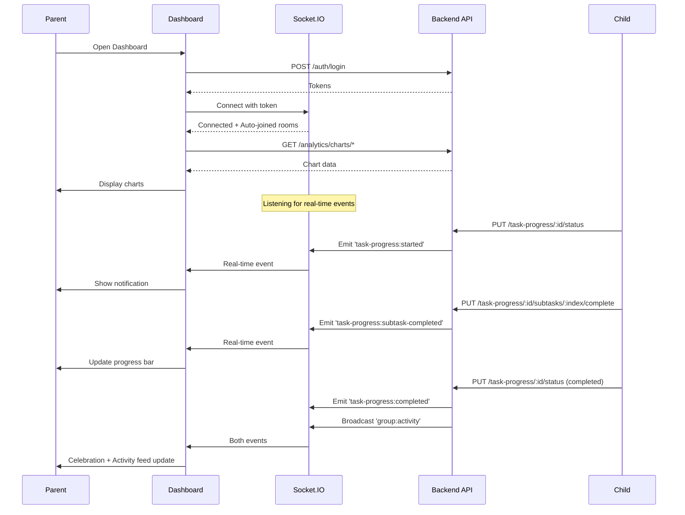

# 📱 API Flow: Parent Dashboard - Real-Time Task Monitoring

**Role:** `business` (Parent / Teacher / Group Owner)
**Figma Reference:** `teacher-parent-dashboard/dashboard/dashboard-flow-01.png`
**Module:** Task Progress Monitoring + Real-Time Updates
**Date:** 12-03-26
**Version:** 2.0 - **NEW: Real-Time Socket.IO Integration**

---

## 🎯 User Journey Overview

This document maps the complete API flow for **Real-Time Parent Dashboard** monitoring with Socket.IO integration.

```
┌─────────────────────────────────────────────────────────────┐
│        REAL-TIME DASHBOARD MONITORING FLOW                  │
├─────────────────────────────────────────────────────────────┤
│  1. Login + Connect Socket.IO                               │
│  2. Auto-Join Family Room                                   │
│  3. Load Dashboard + Charts                                 │
│  4. Receive Real-Time Updates (Socket.IO)                   │
│  5. Monitor Child Progress (Live)                           │
│  6. View Activity Feed (Real-Time)                          │
└─────────────────────────────────────────────────────────────┘
```

---

## 📍 Flow 1: Login + Socket.IO Connection

### Screen: Login → Dashboard with Real-Time Connection

**Figma:** `teacher-parent-dashboard/dashboard/dashboard-flow-01.png`

### Step 1: HTTP Login
```http
POST /api/v1/auth/login
Content-Type: application/json
```

**Request:**
```json
{
  "email": "parent@example.com",
  "password": "SecurePass123!"
}
```

**Response:**
```json
{
  "success": true,
  "data": {
    "user": {
      "_id": "parent001",
      "name": "Parent User",
      "email": "parent@example.com",
      "role": "business"
    },
    "tokens": {
      "accessToken": "eyJhbGciOiJIUzI1NiIs...",
      "refreshToken": "eyJhbGciOiJIUzI1NiIs..."
    }
  }
}
```

### Step 2: Connect Socket.IO
```javascript
import { io } from 'socket.io-client';

const socket = io('http://localhost:5000', {
  auth: {
    token: accessToken
  }
});

socket.on('connect', () => {
  console.log('✅ Socket.IO connected');
  // Auto-joined to personal room: parent001
  // Auto-joined to family room: parent001 (as business user)
});
```

### Step 3: Listen for Real-Time Events
```javascript
// Listen for child task progress updates
socket.on('task-progress:started', (data) => {
  console.log('🔔 Child started task:', data);
  // Update dashboard UI
  showNotification(`${data.childName} started "${data.taskTitle}"`);
});

socket.on('task-progress:subtask-completed', (data) => {
  console.log('🔔 Subtask completed:', data);
  // Update progress bar
  updateProgress(data.taskId, data.progressPercentage);
});

socket.on('task-progress:completed', (data) => {
  console.log('🔔 Task completed:', data);
  // Show celebration
  showCelebration(`${data.childName} completed "${data.taskTitle}"!`);
});

// Listen for family activity feed updates
socket.on('group:activity', (activity) => {
  console.log('📢 Family activity:', activity);
  // Add to live activity feed
  addToActivityFeed(activity);
});
```

---

## 📍 Flow 2: Load Dashboard Charts

### Screen: Dashboard with Analytics Charts

**Figma:** `dashboard-flow-01.png` (Live Activity section)

### API Calls (Parallel):

#### 2.1 Get Family Task Activity Chart
```http
GET /api/v1/analytics/charts/family-activity/parent001?days=7
Authorization: Bearer {{accessToken}}
```

**Purpose:** Load bar chart showing daily task completions

**Response:**
```json
{
  "success": true,
  "data": {
    "labels": ["Mar 06", "Mar 07", "Mar 08", "Mar 09", "Mar 10", "Mar 11", "Mar 12"],
    "datasets": [
      {
        "label": "Tasks Completed",
        "data": [3, 5, 2, 7, 4, 6, 5],
        "color": "#3B82F6"
      }
    ]
  }
}
```

**Chart.js Integration:**
```javascript
new Chart(ctx, {
  type: 'bar',
  data: response.data,
  options: {
    responsive: true,
    plugins: {
      legend: { display: true },
      title: { display: true, text: 'Family Task Activity (Last 7 Days)' }
    }
  }
});
```

#### 2.2 Get Child Progress Comparison
```http
GET /api/v1/analytics/charts/child-progress/parent001
Authorization: Bearer {{accessToken}}
```

**Purpose:** Radar/bar chart comparing children's completion rates

**Response:**
```json
{
  "success": true,
  "data": {
    "labels": ["John", "Jane", "Bob"],
    "datasets": [
      {
        "label": "Completion Rate (%)",
        "data": [85, 72, 90],
        "color": "#8B5CF6"
      }
    ]
  }
}
```

#### 2.3 Get Task Status by Child
```http
GET /api/v1/analytics/charts/status-by-child/parent001
Authorization: Bearer {{accessToken}}
```

**Purpose:** Stacked bar chart showing task status for each child

**Response:**
```json
{
  "success": true,
  "data": {
    "labels": ["John", "Jane", "Bob"],
    "datasets": [
      {
        "label": "pending",
        "data": [2, 1, 0],
        "color": "#F59E0B"
      },
      {
        "label": "inProgress",
        "data": [3, 2, 1],
        "color": "#3B82F6"
      },
      {
        "label": "completed",
        "data": [5, 7, 9],
        "color": "#10B981"
      }
    ]
  }
}
```

---

## 📍 Flow 3: Real-Time Child Progress Updates

### Screen: Dashboard → Live Progress Updates via Socket.IO

**Figma:** `dashboard-flow-01.png` (Live Activity section)

### Scenario: Child Starts Task

**Child Action:**
```javascript
// Child's app
socket.emit('join-task', { taskId: 'task123' });

// Child clicks "Start Task"
PUT /api/v1/task-progress/task123/status
{
  "userId": "child001",
  "status": "inProgress"
}
```

**Parent Receives (Real-Time):**
```javascript
socket.on('task-progress:started', (data) => {
  // data = {
  //   taskId: 'task123',
  //   taskTitle: 'Clean Room',
  //   childId: 'child001',
  //   childName: 'John',
  //   status: 'inProgress',
  //   timestamp: new Date(),
  //   message: 'John started working on "Clean Room"'
  // }
  
  // Update dashboard
  updateChildStatus('child001', 'inProgress');
  showLiveNotification('🔔 John started "Clean Room"');
});
```

---

### Scenario: Child Completes Subtask

**Child Action:**
```javascript
// Child completes subtask 0
PUT /api/v1/task-progress/task123/subtasks/0/complete
{
  "userId": "child001"
}
```

**Parent Receives (Real-Time):**
```javascript
socket.on('task-progress:subtask-completed', (data) => {
  // data = {
  //   taskId: 'task123',
  //   taskTitle: 'Clean Room',
  //   subtaskIndex: 0,
  //   subtaskTitle: 'Pick up toys',
  //   childId: 'child001',
  //   childName: 'John',
  //   progressPercentage: 33.33,
  //   timestamp: new Date(),
  //   message: 'John completed "Pick up toys" (33.33% done)'
  // }
  
  // Update progress bar
  updateProgressBar('task123', 33.33);
  showLiveNotification('✅ John completed "Pick up toys"');
  
  // Update activity feed
  addToActivityFeed({
    type: 'subtask_completed',
    actor: { name: 'John' },
    task: { title: 'Clean Room' },
    subtask: 'Pick up toys',
    timestamp: data.timestamp
  });
});
```

---

### Scenario: Child Completes Task

**Child Action:**
```javascript
// Child completes entire task
PUT /api/v1/task-progress/task123/status
{
  "userId": "child001",
  "status": "completed"
}
```

**Parent Receives (Real-Time):**
```javascript
socket.on('task-progress:completed', (data) => {
  // data = {
  //   taskId: 'task123',
  //   taskTitle: 'Clean Room',
  //   childId: 'child001',
  //   childName: 'John',
  //   status: 'completed',
  //   timestamp: new Date(),
  //   message: 'John completed "Clean Room"'
  // }
  
  // Show celebration
  showCelebration('🎉 John completed "Clean Room"!');
  
  // Update task status
  markTaskComplete('task123');
  
  // Update statistics
  refreshStatistics();
  
  // Broadcast to family room
  // (Other family members also receive this)
});

// Also receives family activity broadcast
socket.on('group:activity', (activity) => {
  // activity = {
  //   type: 'task_completed',
  //   actor: { userId: 'child001', name: 'John' },
  //   task: { taskId: 'task123', title: 'Clean Room' },
  //   timestamp: new Date()
  // }
  
  addToActivityFeed(activity);
});
```

---

## 📍 Flow 4: Live Activity Feed

### Screen: Dashboard → Live Activity Section

**Figma:** `dashboard-flow-01.png` (Live Activity feed)

### Initial Load (HTTP)
```http
GET /api/v1/analytics/charts/collaborative-progress/task123
Authorization: Bearer {{accessToken}}
```

**Response:**
```json
{
  "success": true,
  "data": {
    "taskId": "task123",
    "children": [
      {
        "childId": "child001",
        "childName": "John",
        "status": "completed",
        "progressPercentage": 100,
        "completedSubtasks": 3
      },
      {
        "childId": "child002",
        "childName": "Jane",
        "status": "inProgress",
        "progressPercentage": 33,
        "completedSubtasks": 1
      }
    ]
  }
}
```

### Real-Time Updates (Socket.IO)

**Listen for Activity:**
```javascript
socket.on('group:activity', (activity) => {
  // Prepend to activity feed
  activityFeed.unshift(activity);
  
  // Animate new activity
  animateNewActivity(activity);
  
  // Keep only last 50 activities
  if (activityFeed.length > 50) {
    activityFeed.pop();
  }
});
```

**Activity Feed Display:**
```javascript
// Example activity feed UI
[
  {
    type: 'task_completed',
    actor: { name: 'John', profileImage: '...' },
    task: { title: 'Clean Room' },
    message: 'John completed "Clean Room"',
    timestamp: '2 minutes ago'
  },
  {
    type: 'subtask_completed',
    actor: { name: 'Jane' },
    task: { title: 'Homework' },
    subtask: 'Math problems',
    message: 'Jane completed "Math problems"',
    timestamp: '5 minutes ago'
  },
  {
    type: 'task_started',
    actor: { name: 'Bob' },
    task: { title: 'Science Project' },
    message: 'Bob started "Science Project"',
    timestamp: '10 minutes ago'
  }
]
```

---

## 📍 Flow 5: Monitor Multiple Children

### Screen: Dashboard → Child Comparison View

**Figma:** `dashboard-flow-02.png`

### Initial Load
```http
GET /api/v1/analytics/charts/child-progress/parent001
Authorization: Bearer {{accessToken}}
```

### Real-Time Updates

**Listen for All Children:**
```javascript
// Track multiple children
const childrenToTrack = ['child001', 'child002', 'child003'];

childrenToTrack.forEach(childId => {
  socket.on(`task-progress:started`, (data) => {
    if (data.childId === childId) {
      updateChildCard(childId, 'inProgress');
    }
  });
  
  socket.on(`task-progress:completed`, (data) => {
    if (data.childId === childId) {
      updateChildCard(childId, 'completed');
      animateCelebration(childId);
    }
  });
});
```

**Update Comparison Chart:**
```javascript
// Real-time chart update
function updateComparisonChart(childId, newCompletionRate) {
  const chart = getChartInstance('childProgressChart');
  const childIndex = chart.data.labels.indexOf(getChildName(childId));
  
  if (childIndex !== -1) {
    chart.data.datasets[0].data[childIndex] = newCompletionRate;
    chart.update('active'); // Animate update
  }
}
```

---

## 📍 Flow 6: Task Monitoring with Heatmap

### Screen: Task Monitoring → Activity Heatmap

**Figma:** `task-monitoring-flow-01.png`

### Load Heatmap Data
```http
GET /api/v1/analytics/charts/activity-heatmap/child001?days=30
Authorization: Bearer {{accessToken}}
```

**Response:**
```json
{
  "success": true,
  "data": {
    "days": ["Sun", "Mon", "Tue", "Wed", "Thu", "Fri", "Sat"],
    "hours": [0, 1, 2, ..., 23],
    "activity": [
      { "day": "Mon", "hour": 10, "count": 5 },
      { "day": "Mon", "hour": 14, "count": 8 },
      { "day": "Tue", "hour": 9, "count": 3 },
      { "day": "Wed", "hour": 15, "count": 12 },
      ...
    ]
  }
}
```

**Heatmap Visualization:**
```javascript
// React Calendar Heatmap example
<CalendarHeatmap
  startDate={subDays(new Date(), 30)}
  endDate={new Date()}
  values={heatmapData}
  classForValue={(value) => {
    if (!value) return 'color-empty';
    return `color-github-${Math.min(value.count, 4)}`;
  }}
  tooltipDataClass="react-calendar-heatmap-tooltip"
/>
```

---

## 🔄 Complete Real-Time Session Flow



---

## 📊 State Management

### Dashboard State Updates:

| Event | State Updated | UI Action |
|-------|---------------|-----------|
| `task-progress:started` | Child status | Show notification, update card |
| `task-progress:subtask-completed` | Progress bar | Update percentage, animate |
| `task-progress:completed` | Task status | Celebration, refresh stats |
| `group:activity` | Activity feed | Prepend to feed, animate |

---

## 🚨 Error Handling

### Socket.IO Disconnection
```javascript
socket.on('disconnect', () => {
  console.log('❌ Socket.IO disconnected');
  showReconnectingBanner();
  
  // Auto-reconnect
  socket.connect();
});

socket.on('reconnect', () => {
  console.log('✅ Socket.IO reconnected');
  hideReconnectingBanner();
  refreshDashboard(); // Refresh data that may have changed
});
```

### HTTP Errors
```javascript
try {
  const response = await fetch('/analytics/charts/...');
  if (!response.ok) throw new Error('Failed to load chart');
  const data = await response.json();
  displayChart(data);
} catch (error) {
  showError('Failed to load chart data');
  // Show cached data if available
  displayCachedChart();
}
```

---

## 🎯 Performance Optimizations

### Socket.IO Optimizations:
1. **Room-based emission** - Only send to relevant users
2. **Debounced updates** - Wait 100ms before UI update
3. **Batch activity feed** - Update every 500ms
4. **Cache latest state** - Store in localStorage

### Chart Optimizations:
1. **Redis caching** - 5 min TTL for chart data
2. **Lazy loading** - Load charts as they scroll into view
3. **Virtual scrolling** - For activity feed (50+ items)
4. **Throttled updates** - Max 1 update per second

---

## ✅ Testing Checklist

Real-Time Testing:

- [ ] Socket.IO connection on login
- [ ] Auto-join family room
- [ ] Receive `task-progress:started` event
- [ ] Receive `task-progress:subtask-completed` event
- [ ] Receive `task-progress:completed` event
- [ ] Receive `group:activity` broadcast
- [ ] Activity feed updates in real-time
- [ ] Progress bars animate smoothly
- [ ] Multiple children tracked simultaneously
- [ ] Socket.IO reconnection works
- [ ] Charts update with real-time data
- [ ] Celebration animations trigger correctly

---

**Document Version:** 2.0 - Real-Time Edition  
**Last Updated:** 12-03-26  
**Status:** ✅ Complete with Socket.IO Integration
