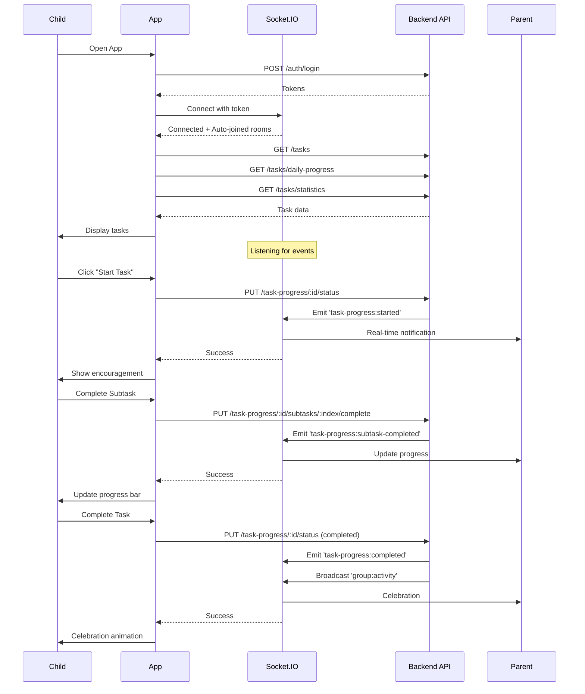

# 📱 API Flow: Child/Student - Task Progress with Real-Time Updates

**Role:** `child` (Student / Group Member)
**Figma Reference:** `app-user/group-children-user/` + Real-Time Updates
**Module:** Task Progress Tracking + Socket.IO
**Date:** 12-03-26
**Version:** 2.0 - **NEW: Real-Time Socket.IO Integration**

---

## 🎯 User Journey Overview

This document maps the complete API flow for a **Child/Student user** tracking their task progress with **real-time parent notifications**.

```
┌─────────────────────────────────────────────────────────────┐
│          CHILD TASK PROGRESS FLOW (Real-Time)               │
├─────────────────────────────────────────────────────────────┤
│  1. Login + Connect Socket.IO                               │
│  2. Load My Tasks                                           │
│  3. Start Task → Parent Notified (Real-Time)                │
│  4. Complete Subtask → Parent Notified (Real-Time)          │
│  5. Complete Task → Parent Notified + Celebration           │
│  6. View Progress Chart                                     │
└─────────────────────────────────────────────────────────────┘
```

---

## 📍 Flow 1: Login + Socket.IO Connection

### Screen: Login → Home Screen with Socket Connection

**Figma:** `app-user/group-children-user/home-flow.png`

### Step 1: HTTP Login
```http
POST /api/v1/auth/login
Content-Type: application/json
```

**Request:**
```json
{
  "email": "child@example.com",
  "password": "ChildPass123!"
}
```

**Response:**
```json
{
  "success": true,
  "data": {
    "user": {
      "_id": "child001",
      "name": "John Child",
      "email": "child@example.com",
      "role": "child"
    },
    "tokens": {
      "accessToken": "eyJhbGciOiJIUzI1NiIs...",
      "refreshToken": "eyJhbGciOiJIUzI1NiIs..."
    }
  }
}
```

### Step 2: Connect Socket.IO
```javascript
import { io } from 'socket.io-client';

const socket = io('http://localhost:5000', {
  auth: {
    token: accessToken
  }
});

socket.on('connect', () => {
  console.log('✅ Connected to Socket.IO');
  // Auto-joined to personal room: child001
  // Auto-joined to family room: parent001 (as child of parent)
});

// Listen for parent messages (if any)
socket.on('task:assigned', (data) => {
  showNotification(`New task assigned: ${data.taskTitle}`);
});
```

---

## 📍 Flow 2: Load My Tasks

### Screen: Home Screen with Task List

**Figma:** `home-flow.png`

### API Calls (Parallel):

#### 2.1 Get My Tasks
```http
GET /api/v1/tasks?status=pending&limit=10
Authorization: Bearer {{accessToken}}
```

**Response:**
```json
{
  "success": true,
  "data": [
    {
      "_id": "task001",
      "title": "Math Homework",
      "description": "Complete algebra exercises 1-10",
      "status": "pending",
      "priority": "high",
      "taskType": "personal",
      "scheduledTime": "10:30 AM",
      "totalSubtasks": 3,
      "completedSubtasks": 0,
      "progressPercentage": 0,
      "createdById": {
        "_id": "parent001",
        "name": "Parent User"
      }
    },
    {
      "_id": "task002",
      "title": "Clean Room",
      "status": "pending",
      "priority": "medium",
      "taskType": "singleAssignment",
      "totalSubtasks": 5,
      "completedSubtasks": 0,
      "progressPercentage": 0
    }
  ]
}
```

#### 2.2 Get Daily Progress
```http
GET /api/v1/tasks/daily-progress?date=2026-03-12
Authorization: Bearer {{accessToken}}
```

**Response:**
```json
{
  "success": true,
  "data": {
    "date": "2026-03-12",
    "total": 5,
    "completed": 2,
    "pending": 3,
    "inProgress": 0,
    "progressPercentage": 40,
    "tasks": [
      {
        "_id": "task001",
        "title": "Math Homework",
        "status": "completed",
        "progressPercentage": 100
      },
      {
        "_id": "task002",
        "title": "Clean Room",
        "status": "pending",
        "progressPercentage": 0
      }
    ]
  }
}
```

#### 2.3 Get Task Statistics
```http
GET /api/v1/tasks/statistics
Authorization: Bearer {{accessToken}}
```

**Response:**
```json
{
  "success": true,
  "data": {
    "total": 25,
    "pending": 10,
    "inProgress": 5,
    "completed": 10,
    "completionRate": 40
  }
}
```

---

## 📍 Flow 3: Start Task (Real-Time Notification to Parent)

### Screen: Task Details → Click "Start Task" → Confirmation

**Figma:** `edit-update-task-flow.png`

### Step 1: Join Task Room (Socket.IO)
```javascript
// Join task-specific room for real-time updates
socket.emit('join-task', { taskId: 'task001' }, (response) => {
  if (response.success) {
    console.log('✅ Joined task room');
  }
});
```

### Step 2: Update Task Status (HTTP)
```http
PUT /api/v1/task-progress/task001/status
Authorization: Bearer {{accessToken}}
Content-Type: application/json
```

**Request:**
```json
{
  "userId": "child001",
  "status": "inProgress"
}
```

**Response:**
```json
{
  "success": true,
  "data": {
    "_id": "progress001",
    "taskId": "task001",
    "userId": "child001",
    "status": "inProgress",
    "startedAt": "2026-03-12T10:30:00.000Z",
    "progressPercentage": 0
  },
  "message": "Task progress updated successfully"
}
```

### Step 3: Parent Receives Real-Time Notification

**Parent's Device (via Socket.IO):**
```javascript
// Parent receives this event instantly
socket.on('task-progress:started', (data) => {
  // data = {
  //   taskId: 'task001',
  //   taskTitle: 'Math Homework',
  //   childId: 'child001',
  //   childName: 'John',
  //   status: 'inProgress',
  //   timestamp: new Date(),
  //   message: 'John started working on "Math Homework"'
  // }
  
  // Parent's app shows notification
  showNotification('🔔 John started "Math Homework"');
  
  // Update dashboard
  updateChildProgress('child001', 'inProgress');
});
```

### Step 4: Update UI
```javascript
// Child's app
updateTaskStatus('task001', 'inProgress');
showToast('Task started! Keep it up! 💪');

// Update progress card
updateProgressCard({
  taskId: 'task001',
  status: 'inProgress',
  startedAt: new Date()
});
```

---

## 📍 Flow 4: Complete Subtask (Real-Time Update)

### Screen: Task Details → Check Subtask → Progress Updates

**Figma:** `task-details-with-subTasks.png`

### Step 1: Complete Subtask (HTTP)
```http
PUT /api/v1/task-progress/task001/subtasks/0/complete
Authorization: Bearer {{accessToken}}
Content-Type: application/json
```

**Request:**
```json
{
  "userId": "child001"
}
```

**Response:**
```json
{
  "success": true,
  "data": {
    "progressId": "progress001",
    "taskId": "task001",
    "userId": "child001",
    "completedSubtaskIndexes": [0],
    "progressPercentage": 33.33,
    "status": "inProgress",
    "message": "Subtask completed! 33.33% done"
  }
}
```

### Step 2: Parent Receives Real-Time Update

**Parent's Device:**
```javascript
socket.on('task-progress:subtask-completed', (data) => {
  // data = {
  //   taskId: 'task001',
  //   taskTitle: 'Math Homework',
  //   subtaskIndex: 0,
  //   subtaskTitle: 'Exercise 1-3',
  //   childId: 'child001',
  //   childName: 'John',
  //   progressPercentage: 33.33,
  //   timestamp: new Date(),
  //   message: 'John completed "Exercise 1-3" (33.33% done)'
  // }
  
  // Update progress bar
  updateProgressBar('task001', 33.33);
  
  // Show notification
  showNotification('✅ John completed "Exercise 1-3"');
  
  // Add to activity feed
  addToActivityFeed({
    type: 'subtask_completed',
    actor: { name: 'John' },
    task: { title: 'Math Homework' },
    subtask: 'Exercise 1-3',
    timestamp: data.timestamp
  });
});
```

### Step 3: Update Child's UI
```javascript
// Update subtask checkbox
markSubtaskComplete('task001', 0);

// Update progress bar
updateProgressBar('task001', 33.33);

// Show encouragement
showEncouragement('Great job! 33% complete! 🎉');

// Update support mode message based on user preference
if (supportMode === 'encouraging') {
  showMessage('Awesome work! You\'re crushing it! 🌟');
} else if (supportMode === 'calm') {
  showMessage('Good progress. Keep going. 👍');
} else if (supportMode === 'logical') {
  showMessage('1/3 complete. 2 more to go. 📊');
}
```

---

## 📍 Flow 5: Complete Entire Task (Real-Time Celebration)

### Screen: Task Details → Click "Complete Task" → Confirmation → Celebration

**Figma:** `edit-update-task-flow.png`

### Step 1: Complete Task (HTTP)
```http
PUT /api/v1/task-progress/task001/status
Authorization: Bearer {{accessToken}}
Content-Type: application/json
```

**Request:**
```json
{
  "userId": "child001",
  "status": "completed"
}
```

**Response:**
```json
{
  "success": true,
  "data": {
    "progressId": "progress001",
    "taskId": "task001",
    "userId": "child001",
    "status": "completed",
    "completedAt": "2026-03-12T11:30:00.000Z",
    "progressPercentage": 100,
    "message": "Congratulations! Task completed!"
  }
}
```

### Step 2: Parent Receives Real-Time Celebration

**Parent's Device:**
```javascript
// Receive task completion event
socket.on('task-progress:completed', (data) => {
  // data = {
  //   taskId: 'task001',
  //   taskTitle: 'Math Homework',
  //   childId: 'child001',
  //   childName: 'John',
  //   status: 'completed',
  //   timestamp: new Date(),
  //   message: 'John completed "Math Homework"'
  // }
  
  // Show celebration animation
  showCelebration('🎉 John completed "Math Homework"!');
  
  // Update task status
  markTaskComplete('task001');
  
  // Update statistics
  refreshStatistics();
  
  // Play sound (optional)
  playCelebrationSound();
});

// Also receive family activity broadcast
socket.on('group:activity', (activity) => {
  // activity = {
  //   type: 'task_completed',
  //   actor: { userId: 'child001', name: 'John' },
  //   task: { taskId: 'task001', title: 'Math Homework' },
  //   timestamp: new Date()
  // }
  
  // Add to live activity feed
  addToActivityFeed(activity);
});
```

### Step 3: Child's Celebration UI
```javascript
// Show celebration animation
showCelebration({
  type: 'confetti',
  message: '🎉 Congratulations! Task Complete! 🎉',
  duration: 3000
});

// Update task list
updateTaskStatus('task001', 'completed');
moveTaskToCompletedSection('task001');

// Update statistics
refreshStatistics();

// Show reward (if applicable)
if (streak >= 7) {
  showReward('7-day streak! 🏆');
}

// Navigate back to home
navigateTo('/home');
```

---

## 📍 Flow 6: View Progress Chart

### Screen: Progress/Analytics → View Charts

**Figma:** `home-flow.png` (Daily Progress section)

### API Call: Get Completion Trend
```http
GET /api/v1/analytics/charts/completion-trend/child001?days=30
Authorization: Bearer {{accessToken}}
```

**Response:**
```json
{
  "success": true,
  "data": {
    "labels": ["Feb 11", "Feb 12", ..., "Mar 12"],
    "datasets": [
      {
        "label": "Cumulative Completed",
        "data": [1, 3, 5, 8, 12, 15, 18, 22, 25],
        "color": "#10B981"
      }
    ]
  }
}
```

**Chart Display:**
```javascript
new Chart(ctx, {
  type: 'line',
  data: response.data,
  options: {
    responsive: true,
    plugins: {
      legend: { display: true },
      title: { display: true, text: 'My Progress (Last 30 Days)' }
    },
    scales: {
      y: {
        beginAtZero: true,
        title: { display: true, text: 'Tasks Completed' }
      }
    }
  }
});
```

---

## 📍 Flow 7: View Activity Heatmap

### Screen: Analytics → Activity Heatmap

**Figma:** Custom analytics view

### API Call
```http
GET /api/v1/analytics/charts/activity-heatmap/child001?days=30
Authorization: Bearer {{accessToken}}
```

**Response:**
```json
{
  "success": true,
  "data": {
    "days": ["Sun", "Mon", "Tue", "Wed", "Thu", "Fri", "Sat"],
    "hours": [0, 1, 2, ..., 23],
    "activity": [
      { "day": "Mon", "hour": 10, "count": 5 },
      { "day": "Wed", "hour": 15, "count": 8 },
      { "day": "Fri", "hour": 14, "count": 12 }
    ]
  }
}
```

**Heatmap Display:**
```javascript
<CalendarHeatmap
  startDate={subDays(new Date(), 30)}
  endDate={new Date()}
  values={heatmapData}
  classForValue={(value) => {
    if (!value) return 'color-empty';
    return `color-success-${Math.min(value.count, 4)}`;
  }}
/>
```

---

## 🔄 Complete Real-Time Session Flow



---

## 📊 State Management

### Child App State:

| Action | State Updated | Real-Time Event |
|--------|---------------|-----------------|
| Start Task | Task status → inProgress | `task-progress:started` sent to parent |
| Complete Subtask | Progress % updated | `task-progress:subtask-completed` sent |
| Complete Task | Task → completed | `task-progress:completed` + `group:activity` |

---

## 🚨 Error Handling

### Socket.IO Disconnection
```javascript
socket.on('disconnect', () => {
  console.log('❌ Disconnected from Socket.IO');
  showBanner('Reconnecting...');
});

socket.on('reconnect', () => {
  console.log('✅ Reconnected to Socket.IO');
  hideBanner();
  refreshData(); // Refresh data that may have changed
});
```

### HTTP Errors
```javascript
try {
  const response = await fetch('/task-progress/:id/status', {
    method: 'PUT',
    headers: { Authorization: `Bearer ${token}` }
  });
  
  if (!response.ok) throw new Error('Failed to update');
  
  const data = await response.json();
  updateUI(data);
} catch (error) {
  showError('Failed to update progress');
  // Keep local state, retry later
}
```

---

## 🎯 Performance Optimizations

### Socket.IO:
1. **Join task rooms** - Only receive relevant updates
2. **Debounced emits** - Wait 100ms before sending
3. **Batch subtask updates** - Send every 500ms if multiple

### UI:
1. **Optimistic updates** - Update UI immediately
2. **Rollback on error** - Revert if API fails
3. **Cache task data** - 2 min TTL
4. **Lazy load charts** - Load when visible

---

## ✅ Testing Checklist

Real-Time Testing:

- [ ] Socket.IO connection on login
- [ ] Auto-join family room
- [ ] Start task → Parent receives notification
- [ ] Complete subtask → Parent receives update
- [ ] Complete task → Parent receives celebration
- [ ] Activity feed updates
- [ ] Progress bars animate smoothly
- [ ] Socket.IO reconnection works
- [ ] Offline mode (queue updates)
- [ ] Support mode messages work
- [ ] Celebration animations trigger
- [ ] Charts load and update

---

**Document Version:** 2.0 - Real-Time Edition  
**Last Updated:** 12-03-26  
**Status:** ✅ Complete with Socket.IO Integration
