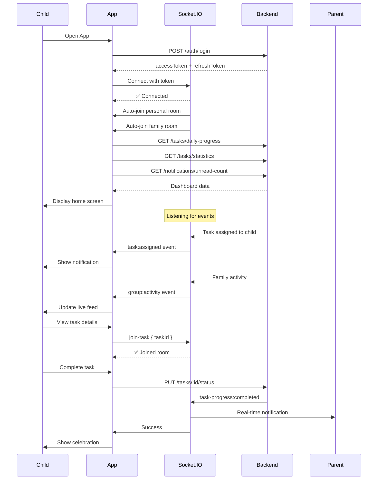

# 📱 API Flow: Child/Student - Home Screen (v2.0 with Real-Time)

**Role:** `child` (Student / Group Member)  
**Figma Reference:** `app-user/group-children-user/home-flow.png`  
**Module:** Task Management + Socket.IO Real-Time  
**Date:** 12-03-26  
**Version:** 2.0 - **HTTP + Socket.IO Real-Time**  

**Related Flows**:
- Flow 01 (v1.0): HTTP endpoints only (legacy reference)
- Flow 05 (v2.0): Child task progress with real-time parent notifications

---

## 🎯 What's New in v2.0

### v1.0 (HTTP Only) vs v2.0 (HTTP + Socket.IO)

| Feature | v1.0 | v2.0 |
|---------|------|------|
| HTTP Endpoints | ✅ Yes | ✅ Yes |
| Socket.IO Connection | ❌ No | ✅ **NEW!** |
| Real-Time Updates | ❌ No | ✅ **NEW!** |
| Task Assigned Events | ❌ No | ✅ **NEW!** |
| Live Activity Feed | ❌ No | ✅ **NEW!** |

---

## 🔄 Complete User Journey Overview

```
┌─────────────────────────────────────────────────────────────┐
│              HOME SCREEN FLOW (v2.0 Real-Time)              │
├─────────────────────────────────────────────────────────────┤
│  1. Login → Get Access Token (HTTP)                         │
│  2. Connect Socket.IO → Auto-Join Rooms                     │
│  3. Load Home → Get Tasks + Statistics (HTTP)               │
│  4. Listen for Real-Time Events (Socket.IO)                 │
│     ├─ Task Assigned → Notification                         │
│     ├─ Family Activity → Live Feed Update                   │
│     └─ Task Updates → Refresh UI                            │
│  5. View Task Details (HTTP)                                │
│  6. Complete Task → Parent Notified (HTTP + Socket.IO)      │
│  7. Pull to Refresh → Get Updated List (HTTP)               │
└─────────────────────────────────────────────────────────────┘
```

---

## 📍 Flow 1: Login + Socket.IO Connection

### Screen: Login Screen → Home Screen with Socket.IO

**Figma:** `app-user/group-children-user/home-flow.png`

### Step 1: HTTP Login (Same as v1.0)

```http
POST /v1/auth/login
Content-Type: application/json
```

**Request:**
```json
{
  "email": "student@example.com",
  "password": "SecurePass123!",
  "fcmToken": "optional-push-notification-token"
}
```

**Response:**
```json
{
  "success": true,
  "data": {
    "user": {
      "_id": "child001",
      "name": "John Student",
      "email": "student@example.com",
      "role": "child"
    },
    "tokens": {
      "accessToken": "eyJhbGciOiJIUzI1NiIs...",
      "refreshToken": "eyJhbGciOiJIUzI1NiIs..."
    }
  }
}
```

---

### Step 2: Connect Socket.IO ⭐ NEW!

```javascript
import { io } from 'socket.io-client';

// Connect immediately after receiving accessToken
const socket = io('http://localhost:5000', {
  auth: {
    token: accessToken  // From login response
  }
});

// Connection event
socket.on('connect', () => {
  console.log('✅ Connected to Socket.IO');
  
  // Auto-joined rooms (handled by backend):
  // 1. Personal room: child001
  // 2. Family room: parent001 (auto-joined via childrenBusinessUser)
  
  // Start listening for events
  listenForRealTimeEvents();
});

// Handle disconnection
socket.on('disconnect', () => {
  console.log('❌ Disconnected from Socket.IO');
  showReconnectingBanner();
});

// Handle reconnection
socket.on('reconnect', () => {
  console.log('✅ Reconnected to Socket.IO');
  hideReconnectingBanner();
  refreshData(); // Refresh data that may have changed
});
```

---

### Step 3: Listen for Real-Time Events ⭐ NEW!

```javascript
function listenForRealTimeEvents() {
  
  // Event 1: New task assigned to you
  socket.on('task:assigned', (data) => {
    // data = {
    //   taskId: 'task123',
    //   taskTitle: 'Math Homework',
    //   assignedBy: { userId: 'parent001', name: 'Parent' },
    //   timestamp: new Date()
    // }
    
    showNotification(`📌 New task assigned: ${data.taskTitle}`);
    refreshTaskList(); // Refresh to show new task
  });
  
  // Event 2: Family activity (live feed)
  socket.on('group:activity', (activity) => {
    // activity = {
    //   type: 'task_completed',
    //   actor: { userId: 'child002', name: 'Jane' },
    //   task: { taskId: 'task456', title: 'Clean Room' },
    //   timestamp: new Date()
    // }
    
    addToLiveActivityFeed(activity);
  });
  
  // Event 3: Task progress updates (if you're monitoring)
  socket.on('task-progress:started', (data) => {
    updateTaskStatus(data.taskId, 'inProgress');
  });
  
  socket.on('task-progress:completed', (data) => {
    updateTaskStatus(data.taskId, 'completed');
    showCelebration(`${data.childName} completed "${data.taskTitle}"!`);
  });
}
```

---

## 📍 Flow 2: Home Screen Initial Load (HTTP + Real-Time)

### Screen: Home Screen (Loading → Content)

**Figma:** `home-flow.png`

### HTTP API Calls (Parallel - Same as v1.0)

#### 2.1 Get Today's Tasks
```http
GET /v1/tasks/daily-progress?date=2026-03-12
Authorization: Bearer {{accessToken}}
```

**Response:** (Same as v1.0)
```json
{
  "success": true,
  "data": {
    "date": "2026-03-12",
    "total": 5,
    "completed": 2,
    "pending": 3,
    "progressPercentage": 40,
    "tasks": [...]
  }
}
```

#### 2.2 Get Task Statistics
```http
GET /v1/tasks/statistics
Authorization: Bearer {{accessToken}}
```

#### 2.3 Get Unread Notifications Count
```http
GET /v1/notifications/unread-count
Authorization: Bearer {{accessToken}}
```

---

### Real-Time Updates ⭐ NEW!

While the user is viewing the home screen, Socket.IO keeps the data fresh:

```javascript
// Background real-time updates
socket.on('task:assigned', (newTask) => {
  // Automatically add new task to list
  taskList.unshift(newTask);
  showBadge('New task!');
});

socket.on('group:activity', (activity) => {
  // Update live activity feed in real-time
  activityFeed.unshift(activity);
  
  // Keep only last 20 activities
  if (activityFeed.length > 20) {
    activityFeed.pop();
  }
});
```

---

## 📍 Flow 3: Pull to Refresh (HTTP)

### Screen: Home Screen → User Pulls Down → Refresh

**Figma:** `home-flow.png`

### HTTP API Call (Same as v1.0)

```http
GET /v1/tasks?status=pending&sortBy=-startTime
Authorization: Bearer {{accessToken}}
```

**Response:** (Same as v1.0)

### Real-Time Sync ⭐ NEW!

After refresh, ensure Socket.IO room is synced:

```javascript
async function pullToRefresh() {
  try {
    // Show loading indicator
    setLoading(true);
    
    // Fetch fresh data
    const response = await fetch('/v1/tasks?status=pending', {
      headers: { Authorization: `Bearer ${accessToken}` }
    });
    const data = await response.json();
    
    // Update task list
    setTaskList(data.data);
    
    // Sync with Socket.IO rooms
    // (Ensure we're in the right rooms for real-time updates)
    data.data.forEach(task => {
      socket.emit('join-task', { taskId: task._id });
    });
    
  } catch (error) {
    showError('Failed to refresh');
  } finally {
    setLoading(false);
  }
}
```

---

## 📍 Flow 4: View Task Details (HTTP)

### Screen: Home Screen → Tap Task → Task Details Screen

**Figma:** `task-details-with-subTasks.png`

### HTTP API Call (Same as v1.0)

```http
GET /v1/tasks/:taskId
Authorization: Bearer {{accessToken}}
```

**Response:** (Same as v1.0)

### Join Task Room for Real-Time ⭐ NEW!

```javascript
async function viewTaskDetails(taskId) {
  // Fetch task details
  const task = await fetchTask(taskId);
  
  // Join task room for real-time updates
  socket.emit('join-task', { taskId }, (response) => {
    if (response.success) {
      console.log('✅ Joined task room');
    }
  });
  
  // Navigate to details screen
  navigateTo('/task-details', { task });
}

// Cleanup: Leave task room when leaving screen
function leaveTaskDetails(taskId) {
  socket.emit('leave-task', { taskId });
}
```

---

## 📍 Flow 5: Complete Task (HTTP + Real-Time to Parent)

### Screen: Task Details → Click "Complete Task" → Confirmation

**Figma:** `edit-update-task-flow.png`

### HTTP API Call (Same as v1.0)

```http
PUT /v1/tasks/:taskId/status
Authorization: Bearer {{accessToken}}
Content-Type: application/json
```

**Request:**
```json
{
  "status": "completed",
  "completedTime": "2026-03-12T12:00:00.000Z"
}
```

**Response:** (Same as v1.0)

---

### Real-Time Parent Notification ⭐ NEW!

**What Happens on Backend:**
1. Task status updated in DB
2. Socket.IO event emitted to parent
3. Parent receives instant notification

**Parent's Device Receives:**
```javascript
// Parent's Socket.IO listener
socket.on('task-progress:completed', (data) => {
  // data = {
  //   taskId: 'task123',
  //   taskTitle: 'Math Homework',
  //   childId: 'child001',
  //   childName: 'John',
  //   status: 'completed',
  //   timestamp: new Date(),
  //   message: 'John completed "Math Homework"'
  // }
  
  showCelebration('🎉 John completed "Math Homework"!');
  updateDashboard();
});

// Also broadcast to family room
socket.on('group:activity', (activity) => {
  // All family members see this in live feed
  addToActivityFeed({
    type: 'task_completed',
    actor: { name: 'John' },
    task: { title: 'Math Homework' },
    timestamp: new Date()
  });
});
```

---

## 📍 Flow 6: Update Subtask Progress (HTTP + Real-Time)

### Screen: Task Details → Check Subtask → Progress Updates

**Figma:** `task-details-with-subTasks.png`

### HTTP API Call (Same as v1.0)

```http
PUT /v1/tasks/:taskId/subtasks/progress
Authorization: Bearer {{accessToken}}
Content-Type: application/json
```

**Request:**
```json
{
  "subtasks": [
    { "title": "Exercise 1-3", "isCompleted": true, "duration": "15 min" },
    { "title": "Exercise 4-6", "isCompleted": true, "duration": "20 min" },
    { "title": "Exercise 7-10", "isCompleted": false, "duration": "25 min" }
  ]
}
```

**Response:** (Same as v1.0)

---

### Alternative: TaskProgress Endpoint ⭐ NEW!

For more granular progress tracking with real-time parent notifications:

```http
PUT /v1/task-progress/:taskId/subtasks/0/complete
Authorization: Bearer {{accessToken}}
Content-Type: application/json
```

**Request:**
```json
{
  "userId": "child001"
}
```

**Response:**
```json
{
  "success": true,
  "data": {
    "progressPercentage": 33.33,
    "message": "Subtask completed! 33.33% done"
  }
}
```

**Real-Time Parent Update:**
```javascript
// Parent receives instantly
socket.on('task-progress:subtask-completed', (data) => {
  // data = {
  //   taskId: 'task123',
  //   subtaskTitle: 'Exercise 1-3',
  //   progressPercentage: 33.33,
  //   childName: 'John'
  // }
  
  updateProgressBar(33.33);
  showNotification('✅ John completed "Exercise 1-3"');
});
```

---

## 📍 Flow 7: Filter Tasks (HTTP)

### Screen: Home Screen → Filter Dropdown → Select Status/Priority

**Figma:** `home-flow.png`

### HTTP API Calls (Same as v1.0)

#### Filter by Status
```http
GET /v1/tasks?status=pending
Authorization: Bearer {{accessToken}}
```

#### Filter by Priority
```http
GET /v1/tasks?priority=high
Authorization: Bearer {{accessToken}}
```

#### Paginated List
```http
GET /v1/tasks/paginate?page=2&limit=10
Authorization: Bearer {{accessToken}}
```

---

## 🔄 Complete Session Flow Diagram



---

## 📊 State Management

### App State After Each Flow:

| Flow | HTTP State | Socket.IO State | Cache Invalidated |
|------|------------|-----------------|-------------------|
| 1. Login + Connect | User session, tokens | Connected, rooms joined | All cleared |
| 2. Home Load | Task list, statistics | Listening for events | Task cache set |
| 3. Pull Refresh | Updated task list | Room sync | Task cache refreshed |
| 4. Task Details | Selected task | Joined task room | Task detail cache set |
| 5. Complete Task | Task status updated | Parent notified | Task cache invalidated |
| 6. Update Subtask | Progress updated | Parent notified | Task cache invalidated |

---

## 🚨 Error Handling

### Socket.IO Disconnection
```javascript
socket.on('disconnect', () => {
  console.log('❌ Disconnected');
  showBanner('Reconnecting to real-time updates...');
});

socket.on('reconnect', () => {
  console.log('✅ Reconnected');
  hideBanner();
  refreshData(); // Refresh data that may have changed during disconnect
});

socket.on('connect_error', (error) => {
  console.error('Connection error:', error);
  showError('Real-time updates unavailable');
  // Continue with HTTP-only mode
});
```

### HTTP Errors (Same as v1.0)

#### 401 Unauthorized (Token Expired)
```json
{
  "success": false,
  "message": "Token expired"
}
```

**Recovery:**
```javascript
// Use refresh token to get new access token
const newToken = await refreshToken();
// Retry original request with new token
```

#### 404 Not Found
```json
{
  "success": false,
  "message": "Task not found"
}
```

**Recovery:**
1. Remove task from local list
2. Leave task room: `socket.emit('leave-task', { taskId })`
3. Refresh task list

---

## 🎯 Performance Optimizations

### Socket.IO Optimizations ⭐ NEW!

```javascript
// 1. Debounced room joins
const joinTaskRoom = debounce((taskId) => {
  socket.emit('join-task', { taskId });
}, 300);

// 2. Batch event handlers
socket.on('task-progress:completed', (data) => {
  // Batch UI updates
  batchUpdates(() => {
    updateTaskStatus(data.taskId, 'completed');
    showCelebration();
    refreshStatistics();
  });
});

// 3. Lazy room joins
// Only join task room when viewing details, not on list view
function viewTaskDetails(taskId) {
  socket.emit('join-task', { taskId }); // Join on demand
}

// 4. Cleanup on unmount
useEffect(() => {
  return () => {
    socket.emit('leave-task', { taskId }); // Leave room when leaving screen
  };
}, [taskId]);
```

### HTTP Caching (Same as v1.0)

| Data Type | Cache Duration | Cache Key |
|-----------|----------------|-----------|
| Task List | 2 minutes | `task:list:{userId}:{filters}` |
| Task Detail | 5 minutes | `task:detail:{taskId}` |
| Statistics | 5 minutes | `task:stats:{userId}` |
| Daily Progress | 2 minutes | `task:daily:{userId}:{date}` |

---

## 📱 Flutter Integration Points

### Required Services:

```dart
// 1. Socket.IO Service ⭐ NEW!
class SocketService {
  static SocketService? _instance;
  static io.Socket? _socket;
  
  static SocketService get instance {
    _instance ??= SocketService();
    return _instance!;
  }
  
  Future<void> connect(String token) async {
    _socket = io('http://localhost:5000', {
      'auth': {'token': token},
    });
    
    _socket!.onConnect((_) {
      print('✅ Socket.IO connected');
      _setupListeners();
    });
    
    _socket!.onDisconnect((_) => print('❌ Disconnected'));
  }
  
  void _setupListeners() {
    // Task assigned
    _socket!.on('task:assigned', (data) {
      showNotification('New task assigned: ${data['taskTitle']}');
    });
    
    // Family activity
    _socket!.on('group:activity', (data) {
      addToActivityFeed(data);
    });
    
    // Task progress
    _socket!.on('task-progress:completed', (data) {
      showCelebration('${data['childName']} completed task!');
    });
  }
  
  void joinTaskRoom(String taskId) {
    _socket!.emit('join-task', {'taskId': taskId});
  }
  
  void leaveTaskRoom(String taskId) {
    _socket!.emit('leave-task', {'taskId': taskId});
  }
}

// 2. Task Service (HTTP - Same as v1.0)
class TaskService {
  Future<List<Task>> getTasks({filters});
  Future<Task> getTaskById(String id);
  Future<Task> updateTaskStatus(String id, String status);
  Future<Task> updateSubtaskProgress(String id, List<Subtask> subtasks);
  Future<TaskStatistics> getStatistics();
  Future<DailyProgress> getDailyProgress(DateTime date);
}
```

---

## ✅ Testing Checklist

### HTTP Endpoints (Same as v1.0)
- [ ] Login with valid credentials
- [ ] Get daily progress
- [ ] Get task statistics
- [ ] Get tasks with filters
- [ ] Get task by ID
- [ ] Update task status
- [ ] Update subtask progress
- [ ] Expired token refresh flow
- [ ] Offline mode handling

### Socket.IO Integration ⭐ NEW!
- [ ] Connect with valid token
- [ ] Auto-join personal room
- [ ] Auto-join family room
- [ ] Receive `task:assigned` event
- [ ] Receive `group:activity` event
- [ ] Receive `task-progress:completed` event
- [ ] Join task room on view
- [ ] Leave task room on exit
- [ ] Reconnection after disconnect
- [ ] Handle connection errors gracefully
- [ ] Batch UI updates on events

### Combined Flow ⭐ NEW!
- [ ] Login → Connect Socket.IO → Load data
- [ ] Complete task → Parent receives real-time notification
- [ ] Pull refresh → Sync Socket.IO rooms
- [ ] View task → Join room → Leave on exit
- [ ] Background app → Reconnect on foreground

---

## 📝 Comparison: v1.0 vs v2.0

| Feature | v1.0 (HTTP Only) | v2.0 (HTTP + Socket.IO) |
|---------|------------------|------------------------|
| **Login** | HTTP only | HTTP + Socket.IO connect |
| **Load Tasks** | HTTP polling | HTTP + Real-time updates |
| **Task Assigned** | Manual refresh | Instant notification |
| **Complete Task** | HTTP update | HTTP + Parent notified |
| **Activity Feed** | Manual refresh | Real-time updates |
| **Battery Usage** | Higher (polling) | Lower (push events) |
| **User Experience** | Good | **Excellent** ⭐ |

---

## 🎯 When to Use Which Version

### Use v1.0 (HTTP Only) When:
- Building MVP quickly
- Real-time not critical
- Limited backend resources
- Testing basic functionality

### Use v2.0 (HTTP + Socket.IO) When:
- Production-ready app
- Real-time updates important
- Parent monitoring required
- Best user experience needed

---

## 📞 Support & Resources

### Related Documentation:
- **Flow 01 (v1.0)**: HTTP endpoints only (legacy reference)
- **Flow 05 (v2.0)**: Child task progress with real-time parent notifications
- **Flow 04 (v2.0)**: Parent real-time monitoring dashboard
- **Socket.IO Guide**: `src/helpers/socket/SOCKET_IO_INTEGRATION.md`

### API Endpoints:
- **Postman Collection**: `01-User-Common-Part1-UPDATED.postman_collection.json`
- **Chart Endpoints**: `01-User-Common-Part2-Charts-Progress.postman_collection.json`

---

**Document Version**: 2.0 - HTTP + Socket.IO Real-Time  
**Last Updated**: 12-03-26  
**Status**: ✅ Complete with Real-Time Integration  
**Backward Compatible**: ✅ Yes (v1.0 endpoints still work)
