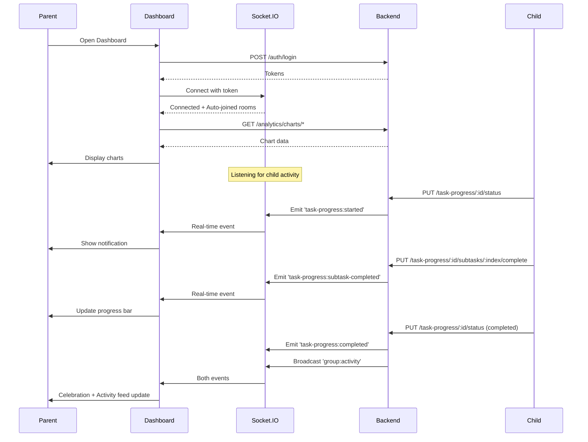

# 📱 API Flow: Parent Dashboard - Real-Time Monitoring (v2.0)

**Role:** `business` (Parent / Teacher / Group Owner)  
**Figma Reference:** `teacher-parent-dashboard/dashboard/dashboard-flow-01.png`  
**Module:** Task Progress + Socket.IO Real-Time  
**Date:** 12-03-26  
**Version:** 2.0 - **HTTP + Socket.IO Real-Time**  

**Related Flows**:
- Flow 02 (v1.0): HTTP endpoints only (legacy reference)
- Flow 04 (v2.0): Same content, different naming
- Flow 06 (v2.0): Child home screen with real-time

---

## 🎯 What's New in v2.0

### v1.0 (HTTP Only) vs v2.0 (HTTP + Socket.IO)

| Feature | v1.0 | v2.0 |
|---------|------|------|
| HTTP Endpoints | ✅ Yes | ✅ Yes |
| Socket.IO Connection | ❌ No | ✅ **NEW!** |
| Real-Time Task Updates | ❌ No | ✅ **NEW!** |
| Live Activity Feed | ❌ No | ✅ **NEW!** |
| Child Progress Tracking | HTTP polling | ✅ **Real-time!** |
| Chart Endpoints | ❌ No | ✅ **10 NEW endpoints!** |

---

## 🔄 Complete User Journey Overview

```
┌─────────────────────────────────────────────────────────────┐
│        DASHBOARD FLOW (v2.0 Real-Time Monitoring)           │
├─────────────────────────────────────────────────────────────┤
│  1. Login → Get Access Token (HTTP)                         │
│  2. Connect Socket.IO → Auto-Join Family Room               │
│  3. Load Dashboard → Charts + Statistics (HTTP)             │
│  4. Listen for Real-Time Events (Socket.IO)                 │
│     ├─ Child Started Task → Update Dashboard                │
│     ├─ Child Completed Subtask → Progress Update            │
│     └─ Child Completed Task → Celebration + Feed            │
│  5. View Child Progress (HTTP)                              │
│  6. Monitor Live Activity Feed (Real-Time)                  │
│  7. View Analytics Charts (HTTP)                            │
└─────────────────────────────────────────────────────────────┘
```

---

## 📍 Flow 1: Login + Socket.IO Connection

### Screen: Login → Dashboard with Real-Time Connection

**Figma:** `teacher-parent-dashboard/dashboard/dashboard-flow-01.png`

### Step 1: HTTP Login (Same as v1.0)

```http
POST /v1/auth/login
Content-Type: application/json
```

**Request:**
```json
{
  "email": "parent@example.com",
  "password": "SecurePass123!"
}
```

**Response:**
```json
{
  "success": true,
  "data": {
    "user": {
      "_id": "parent001",
      "name": "Parent User",
      "email": "parent@example.com",
      "role": "business"
    },
    "tokens": {
      "accessToken": "eyJhbGciOiJIUzI1NiIs...",
      "refreshToken": "eyJhbGciOiJIUzI1NiIs..."
    }
  }
}
```

---

### Step 2: Connect Socket.IO ⭐ NEW!

```javascript
import { io } from 'socket.io-client';

// Connect immediately after login
const socket = io('http://localhost:5000', {
  auth: {
    token: accessToken  // From login response
  }
});

socket.on('connect', () => {
  console.log('✅ Connected to Socket.IO');
  
  // Auto-joined rooms (handled by backend):
  // 1. Personal room: parent001
  // 2. Family room: parent001 (as business user)
  //    OR parent's businessUserId if different
  
  // Start listening for child activity
  listenForChildActivity();
});

socket.on('disconnect', () => {
  console.log('❌ Disconnected from Socket.IO');
  showBanner('Real-time updates paused');
});

socket.on('reconnect', () => {
  console.log('✅ Reconnected to Socket.IO');
  hideBanner();
  refreshDashboard(); // Refresh data that may have changed
});
```

---

### Step 3: Listen for Child Activity ⭐ NEW!

```javascript
function listenForChildActivity() {
  
  // Event 1: Child started a task
  socket.on('task-progress:started', (data) => {
    // data = {
    //   taskId: 'task123',
    //   taskTitle: 'Math Homework',
    //   childId: 'child001',
    //   childName: 'John',
    //   status: 'inProgress',
    //   timestamp: new Date(),
    //   message: 'John started working on "Math Homework"'
    // }
    
    showNotification(`🔔 ${data.childName} started "${data.taskTitle}"`);
    updateChildStatus(data.childId, 'inProgress');
    updateDashboard();
  });
  
  // Event 2: Child completed a subtask
  socket.on('task-progress:subtask-completed', (data) => {
    // data = {
    //   taskId: 'task123',
    //   taskTitle: 'Math Homework',
    //   subtaskIndex: 0,
    //   subtaskTitle: 'Exercise 1-3',
    //   childId: 'child001',
    //   childName: 'John',
    //   progressPercentage: 33.33,
    //   message: 'John completed "Exercise 1-3" (33.33% done)'
    // }
    
    updateProgressBar(data.taskId, data.progressPercentage);
    showNotification(`✅ ${data.childName} completed "${data.subtaskTitle}"`);
    
    // Add to live activity feed
    addToActivityFeed({
      type: 'subtask_completed',
      actor: { name: data.childName },
      task: { title: data.taskTitle },
      subtask: data.subtaskTitle,
      timestamp: data.timestamp
    });
  });
  
  // Event 3: Child completed entire task
  socket.on('task-progress:completed', (data) => {
    // data = {
    //   taskId: 'task123',
    //   taskTitle: 'Math Homework',
    //   childId: 'child001',
    //   childName: 'John',
    //   status: 'completed',
    //   message: 'John completed "Math Homework"'
    // }
    
    showCelebration(`🎉 ${data.childName} completed "${data.taskTitle}"!`);
    markTaskComplete(data.taskId);
    refreshStatistics();
    
    // Play celebration sound (optional)
    playCelebrationSound();
  });
  
  // Event 4: General family activity
  socket.on('group:activity', (activity) => {
    // activity = {
    //   type: 'task_completed',
    //   actor: { userId: 'child001', name: 'John' },
    //   task: { taskId: 'task123', title: 'Math Homework' },
    //   timestamp: new Date()
    // }
    
    addToActivityFeed(activity);
  });
}
```

---

## 📍 Flow 2: Load Dashboard Charts (HTTP)

### Screen: Dashboard with Analytics Charts

**Figma:** `dashboard-flow-01.png`

### HTTP API Calls (Parallel)

#### 2.1 Get Family Task Activity Chart ⭐ NEW!
```http
GET /v1/analytics/charts/family-activity/parent001?days=7
Authorization: Bearer {{accessToken}}
```

**Response:**
```json
{
  "success": true,
  "data": {
    "labels": ["Mar 06", "Mar 07", "Mar 08", "Mar 09", "Mar 10", "Mar 11", "Mar 12"],
    "datasets": [
      {
        "label": "Tasks Completed",
        "data": [3, 5, 2, 7, 4, 6, 5],
        "color": "#3B82F6"
      }
    ]
  }
}
```

**Chart.js Integration:**
```javascript
new Chart(ctx, {
  type: 'bar',
  data: response.data,
  options: {
    responsive: true,
    plugins: {
      legend: { display: true },
      title: { display: true, text: 'Family Task Activity (Last 7 Days)' }
    }
  }
});
```

---

#### 2.2 Get Child Progress Comparison ⭐ NEW!
```http
GET /v1/analytics/charts/child-progress/parent001
Authorization: Bearer {{accessToken}}
```

**Response:**
```json
{
  "success": true,
  "data": {
    "labels": ["John", "Jane", "Bob"],
    "datasets": [
      {
        "label": "Completion Rate (%)",
        "data": [85, 72, 90],
        "color": "#8B5CF6"
      }
    ]
  }
}
```

---

#### 2.3 Get Task Status by Child ⭐ NEW!
```http
GET /v1/analytics/charts/status-by-child/parent001
Authorization: Bearer {{accessToken}}
```

**Response:**
```json
{
  "success": true,
  "data": {
    "labels": ["John", "Jane", "Bob"],
    "datasets": [
      {
        "label": "pending",
        "data": [2, 1, 0],
        "color": "#F59E0B"
      },
      {
        "label": "inProgress",
        "data": [3, 2, 1],
        "color": "#3B82F6"
      },
      {
        "label": "completed",
        "data": [5, 7, 9],
        "color": "#10B981"
      }
    ]
  }
}
```

---

## 📍 Flow 3: Real-Time Child Progress Updates

### Screen: Dashboard → Live Progress Updates via Socket.IO

**Figma:** `dashboard-flow-01.png` (Live Activity section)

### Scenario: Child Starts Task

**Child's Action (HTTP):**
```http
PUT /v1/task-progress/task123/status
Authorization: Bearer {{childToken}}
Content-Type: application/json
```

**Request:**
```json
{
  "userId": "child001",
  "status": "inProgress"
}
```

**Parent Receives (Real-Time via Socket.IO):**
```javascript
socket.on('task-progress:started', (data) => {
  // Update dashboard UI
  updateChildCard('child001', {
    status: 'inProgress',
    currentTask: data.taskTitle,
    startedAt: data.timestamp
  });
  
  // Show notification
  showLiveNotification(`🔔 ${data.childName} started "${data.taskTitle}"`);
  
  // Update activity feed
  addToActivityFeed({
    type: 'task_started',
    actor: { name: data.childName },
    task: { title: data.taskTitle },
    timestamp: data.timestamp
  });
});
```

---

### Scenario: Child Completes Subtask

**Child's Action (HTTP):**
```http
PUT /v1/task-progress/task123/subtasks/0/complete
Authorization: Bearer {{childToken}}
Content-Type: application/json
```

**Request:**
```json
{
  "userId": "child001"
}
```

**Parent Receives (Real-Time):**
```javascript
socket.on('task-progress:subtask-completed', (data) => {
  // Update progress bar
  updateProgressBar(data.taskId, data.progressPercentage);
  
  // Show notification
  showNotification(`✅ ${data.childName} completed "${data.subtaskTitle}"`);
  
  // Update child card
  updateChildProgress(data.childId, {
    completedSubtasks: data.subtaskIndex + 1,
    progressPercentage: data.progressPercentage
  });
});
```

---

### Scenario: Child Completes Task

**Child's Action (HTTP):**
```http
PUT /v1/task-progress/task123/status
Authorization: Bearer {{childToken}}
Content-Type: application/json
```

**Request:**
```json
{
  "userId": "child001",
  "status": "completed"
}
```

**Parent Receives (Real-Time - TWO events):**
```javascript
// Event 1: Task completion
socket.on('task-progress:completed', (data) => {
  showCelebration(`🎉 ${data.childName} completed "${data.taskTitle}"!`);
  markTaskComplete(data.taskId);
  refreshStatistics();
  playCelebrationSound();
});

// Event 2: Family activity broadcast
socket.on('group:activity', (activity) => {
  addToActivityFeed(activity);
  
  // All family members see this
  broadcastToFamily(activity);
});
```

---

## 📍 Flow 4: Live Activity Feed

### Screen: Dashboard → Live Activity Section

**Figma:** `dashboard-flow-01.png` (Live Activity feed)

### Initial Load (HTTP) ⭐ NEW!
```http
GET /v1/analytics/charts/collaborative-progress/task123
Authorization: Bearer {{accessToken}}
```

**Response:**
```json
{
  "success": true,
  "data": {
    "taskId": "task123",
    "children": [
      {
        "childId": "child001",
        "childName": "John",
        "status": "completed",
        "progressPercentage": 100,
        "completedSubtasks": 3
      },
      {
        "childId": "child002",
        "childName": "Jane",
        "status": "inProgress",
        "progressPercentage": 33,
        "completedSubtasks": 1
      }
    ]
  }
}
```

---

### Real-Time Updates (Socket.IO) ⭐ NEW!

```javascript
// Listen for new activities
socket.on('group:activity', (activity) => {
  // Prepend to activity feed
  activityFeed.unshift(activity);
  
  // Animate new activity
  animateNewActivity(activity);
  
  // Keep only last 50 activities
  if (activityFeed.length > 50) {
    activityFeed.pop();
  }
});

// Example activity feed display
const activityFeed = [
  {
    type: 'task_completed',
    actor: { name: 'John', profileImage: '...' },
    task: { title: 'Clean Room' },
    message: 'John completed "Clean Room"',
    timestamp: '2 minutes ago'
  },
  {
    type: 'subtask_completed',
    actor: { name: 'Jane' },
    task: { title: 'Homework' },
    subtask: 'Math problems',
    message: 'Jane completed "Math problems"',
    timestamp: '5 minutes ago'
  }
];
```

---

## 📍 Flow 5: Monitor Multiple Children

### Screen: Dashboard → Child Comparison View

**Figma:** `dashboard-flow-02.png`

### Initial Load (HTTP) ⭐ NEW!
```http
GET /v1/analytics/charts/child-progress/parent001
Authorization: Bearer {{accessToken}}
```

### Real-Time Updates (Socket.IO) ⭐ NEW!

```javascript
// Track multiple children simultaneously
const childrenToTrack = ['child001', 'child002', 'child003'];

childrenToTrack.forEach(childId => {
  socket.on('task-progress:started', (data) => {
    if (data.childId === childId) {
      updateChildCard(childId, 'inProgress');
    }
  });
  
  socket.on('task-progress:completed', (data) => {
    if (data.childId === childId) {
      updateChildCard(childId, 'completed');
      animateCelebration(childId);
      
      // Update comparison chart
      updateComparisonChart(childId, getNewCompletionRate(childId));
    }
  });
});

// Update chart in real-time
function updateComparisonChart(childId, newCompletionRate) {
  const chart = getChartInstance('childProgressChart');
  const childIndex = chart.data.labels.indexOf(getChildName(childId));
  
  if (childIndex !== -1) {
    chart.data.datasets[0].data[childIndex] = newCompletionRate;
    chart.update('active'); // Animate update
  }
}
```

---

## 📍 Flow 6: Task Monitoring with Heatmap

### Screen: Task Monitoring → Activity Heatmap

**Figma:** `task-monitoring-flow-01.png`

### Load Heatmap Data (HTTP) ⭐ NEW!
```http
GET /v1/analytics/charts/activity-heatmap/child001?days=30
Authorization: Bearer {{accessToken}}
```

**Response:**
```json
{
  "success": true,
  "data": {
    "days": ["Sun", "Mon", "Tue", "Wed", "Thu", "Fri", "Sat"],
    "hours": [0, 1, 2, ..., 23],
    "activity": [
      { "day": "Mon", "hour": 10, "count": 5 },
      { "day": "Mon", "hour": 14, "count": 8 },
      { "day": "Tue", "hour": 9, "count": 3 }
    ]
  }
}
```

**Heatmap Visualization:**
```javascript
<CalendarHeatmap
  startDate={subDays(new Date(), 30)}
  endDate={new Date()}
  values={heatmapData}
  classForValue={(value) => {
    if (!value) return 'color-empty';
    return `color-github-${Math.min(value.count, 4)}`;
  }}
/>
```

---

## 🔄 Complete Real-Time Session Flow



---

## 📊 State Management

### Dashboard State Updates:

| Event | State Updated | UI Action |
|-------|---------------|-----------|
| `task-progress:started` | Child status | Show notification, update card |
| `task-progress:subtask-completed` | Progress bar | Update percentage, animate |
| `task-progress:completed` | Task status | Celebration, refresh stats |
| `group:activity` | Activity feed | Prepend to feed, animate |

---

## 🚨 Error Handling

### Socket.IO Disconnection
```javascript
socket.on('disconnect', () => {
  console.log('❌ Socket.IO disconnected');
  showReconnectingBanner();
  
  // Auto-reconnect
  socket.connect();
});

socket.on('reconnect', () => {
  console.log('✅ Socket.IO reconnected');
  hideReconnectingBanner();
  refreshDashboard(); // Refresh data that may have changed
});
```

### HTTP Errors (Same as v1.0)
```javascript
try {
  const response = await fetch('/analytics/charts/...');
  if (!response.ok) throw new Error('Failed to load chart');
  const data = await response.json();
  displayChart(data);
} catch (error) {
  showError('Failed to load chart data');
  // Show cached data if available
  displayCachedChart();
}
```

---

## 🎯 Performance Optimizations

### Socket.IO Optimizations ⭐ NEW!
1. **Room-based emission** - Only send to relevant users
2. **Debounced updates** - Wait 100ms before UI update
3. **Batch activity feed** - Update every 500ms
4. **Cache latest state** - Store in localStorage

### Chart Optimizations ⭐ NEW!
1. **Redis caching** - 5 min TTL for chart data
2. **Lazy loading** - Load charts as they scroll into view
3. **Virtual scrolling** - For activity feed (50+ items)
4. **Throttled updates** - Max 1 update per second

---

## 📱 Flutter Integration Points

### Required Services:

```dart
// 1. Socket.IO Service ⭐ NEW!
class SocketService {
  static SocketService? _instance;
  static io.Socket? _socket;
  
  static SocketService get instance {
    _instance ??= SocketService();
    return _instance!;
  }
  
  Future<void> connect(String token) async {
    _socket = io('http://localhost:5000', {
      'auth': {'token': token},
    });
    
    _socket!.onConnect((_) {
      print('✅ Socket.IO connected');
      _setupChildListeners();
    });
    
    _socket!.onDisconnect((_) => print('❌ Disconnected'));
  }
  
  void _setupChildListeners() {
    // Child started task
    _socket!.on('task-progress:started', (data) {
      showNotification('${data['childName']} started task');
      updateDashboard();
    });
    
    // Child completed subtask
    _socket!.on('task-progress:subtask-completed', (data) {
      updateProgressBar(data['taskId'], data['progressPercentage']);
    });
    
    // Child completed task
    _socket!.on('task-progress:completed', (data) {
      showCelebration('${data['childName']} completed task!');
    });
    
    // Family activity
    _socket!.on('group:activity', (data) {
      addToActivityFeed(data);
    });
  }
}

// 2. Dashboard Service (HTTP) ⭐ NEW!
class DashboardService {
  Future<ChartSeries> getFamilyActivity(String businessUserId, {int days = 7});
  Future<ChartSeries> getChildProgress(String businessUserId);
  Future<ChartSeries> getStatusByChild(String businessUserId);
  Future<ChartSeries> getCompletionTrend(String userId, {int days = 30});
  Future<HeatmapData> getActivityHeatmap(String userId, {int days = 30});
  Future<CollaborativeProgress> getCollaborativeProgress(String taskId);
}
```

---

## ✅ Testing Checklist

### HTTP Endpoints (Same as v1.0)
- [ ] Login with valid credentials
- [ ] Get family activity chart
- [ ] Get child progress comparison
- [ ] Get task status by child
- [ ] Get completion trend
- [ ] Get activity heatmap
- [ ] Get collaborative progress
- [ ] Expired token refresh flow

### Socket.IO Integration ⭐ NEW!
- [ ] Connect with valid token
- [ ] Auto-join family room
- [ ] Receive `task-progress:started` event
- [ ] Receive `task-progress:subtask-completed` event
- [ ] Receive `task-progress:completed` event
- [ ] Receive `group:activity` broadcast
- [ ] Activity feed updates in real-time
- [ ] Progress bars animate smoothly
- [ ] Multiple children tracked simultaneously
- [ ] Socket.IO reconnection works
- [ ] Charts update with real-time data

### Combined Flow ⭐ NEW!
- [ ] Login → Connect Socket.IO → Load charts
- [ ] Child starts task → Parent receives notification
- [ ] Child completes subtask → Parent progress updates
- [ ] Child completes task → Parent celebration
- [ ] Live activity feed updates
- [ ] Background app → Reconnect on foreground

---

## 📝 Comparison: v1.0 vs v2.0

| Feature | v1.0 (HTTP Only) | v2.0 (HTTP + Socket.IO) |
|---------|------------------|------------------------|
| **Dashboard Load** | HTTP polling | HTTP + Real-time |
| **Child Progress** | Manual refresh | Instant updates |
| **Activity Feed** | HTTP refresh | Real-time stream |
| **Notifications** | Push only | Push + Real-time |
| **Battery Usage** | Higher (polling) | Lower (push events) |
| **Parent Experience** | Good | **Excellent** ⭐ |

---

## 🎯 When to Use Which Version

### Use v1.0 (HTTP Only) When:
- Building MVP quickly
- Real-time not critical
- Limited backend resources

### Use v2.0 (HTTP + Socket.IO) When:
- Production-ready app
- Real-time monitoring required
- Best parent experience needed
- Live activity feed important

---

## 📞 Support & Resources

### Related Documentation:
- **Flow 02 (v1.0)**: HTTP endpoints only (legacy reference)
- **Flow 04 (v2.0)**: Same content, different naming
- **Flow 06 (v2.0)**: Child home screen with real-time
- **Socket.IO Guide**: `src/helpers/socket/SOCKET_IO_INTEGRATION.md`

### API Endpoints:
- **Postman Collection**: `02-Admin-Full-UPDATED.postman_collection.json`
- **Chart Endpoints**: `01-User-Common-Part2-Charts-Progress.postman_collection.json`

---

**Document Version**: 2.0 - HTTP + Socket.IO Real-Time  
**Last Updated**: 12-03-26  
**Status**: ✅ Complete with Real-Time Integration  
**Backward Compatible**: ✅ Yes (v1.0 endpoints still work)
