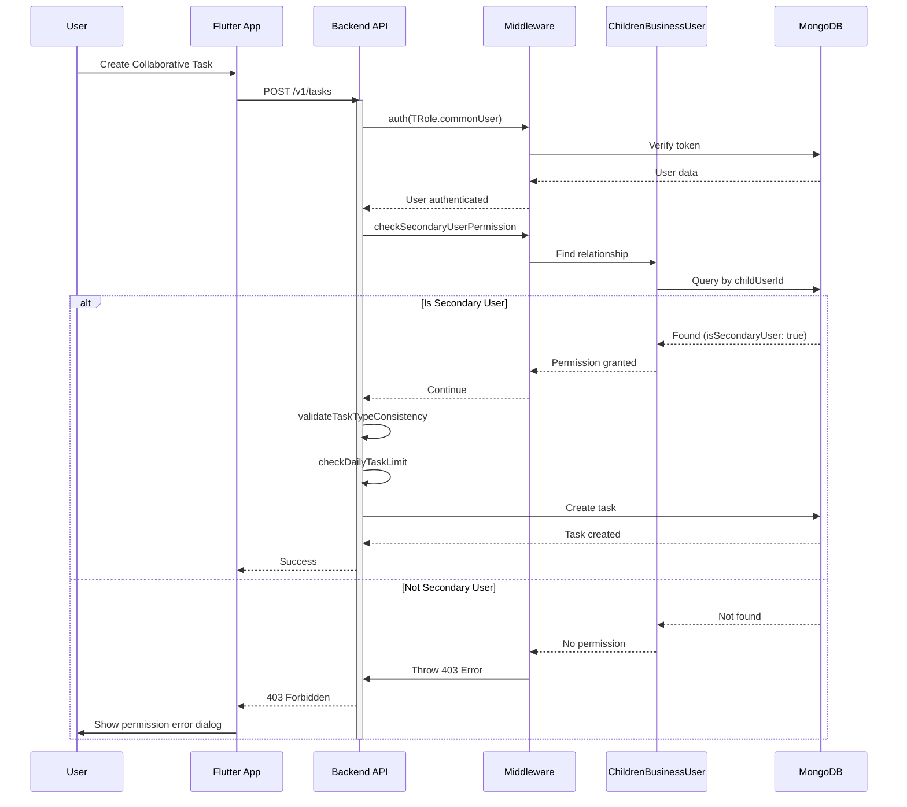

# 📱 API Flow: Child Task Creation with Secondary User Permission (v2.0 - Updated)

**Role:** `child` (Student / Group Member)  
**Figma Reference:** `app-user/group-children-user/add-task-flow-for-permission-account-interface.png`  
**Module:** Task Management - Task Creation  
**Date:** 14-03-26  
**Version:** 2.0 - **Updated with Secondary User Permission Check**

---

## 🔧 What Was Updated (v1.5 → v2.0)

| Item | v1.5 | v2.0 (Current) |
|------|------|----------------|
| **Permission Check** | ❌ Missing | ✅ `checkSecondaryUserPermission` middleware |
| **Task Creation Limit** | ❌ Not documented | ✅ Daily limit (5 personal tasks/day) |
| **Task Type Validation** | ❌ Not documented | ✅ `validateTaskTypeConsistency` |
| **Base Path** | `/api/v1/` | ✅ `/v1/` (corrected) |
| **Permission Logic** | Group-based | ✅ childrenBusinessUser-based |

---

## 🎯 Permission System Overview

### **Who Can Create Tasks?**

| User Role | Task Type | Permission Required |
|-----------|-----------|---------------------|
| **Business** (Parent) | Any type | ✅ Always allowed |
| **Child** (Secondary User) | Any type | ✅ Secondary User status required |
| **Child** (Regular) | Personal only | ❌ Cannot create for others |

### **Secondary User Permission:**

**What is Secondary User?**
- A child user granted permission to create/assign tasks for family members
- Set by business user (parent) via dashboard
- Stored in `ChildrenBusinessUser` model

**How to Check:**
```typescript
// Middleware: checkSecondaryUserPermission
const relationship = await ChildrenBusinessUser.findOne({
  childUserId: userId,
  isSecondaryUser: true,
  isDeleted: false,
  status: 'active',
});

if (!relationship) {
  throw new ApiError(
    StatusCodes.FORBIDDEN,
    'Only Secondary Users can create tasks. Ask your parent to grant permission.'
  );
}
```

---

## 📍 Flow 1: Secondary User Creating Task

### **Screen:** Task Creation Screen → Select Type → Fill Form → Submit

**Figma:** `app-user/group-children-user/add-task-flow-for-permission-account-interface.png`

### **API Calls:**

#### 1.1 Get Preferred Time Suggestion (Optional)
```http
GET /v1/tasks/suggest-preferred-time
Authorization: Bearer {{accessToken}}
```

#### 1.2 Create Task
```http
POST /v1/tasks
Authorization: Bearer {{accessToken}}
Content-Type: application/json
```

**Request:**
```json
{
  "title": "Group Science Project",
  "description": "Work on science fair project together",
  "taskType": "collaborative",
  "assignedUserIds": [
    "507f1f77bcf86cd799439011",
    "507f1f77bcf86cd799439012"
  ],
  "priority": "high",
  "startTime": "2026-03-15T10:00:00.000Z",
  "scheduledTime": "10:00 AM",
  "dueDate": "2026-03-20T23:59:59.000Z"
}
```

**Middleware Flow:**
```
POST /v1/tasks
    ↓
1. auth(TRole.commonUser) → Verify authenticated
    ↓
2. checkSecondaryUserPermission → Check permission ✅
    ↓
3. validateRequest → Validate input
    ↓
4. validateTaskTypeConsistency → Validate task type
    ↓
5. checkDailyTaskLimit → Check daily limit
    ↓
6. controller.create → Create task
```

**Response:**
```json
{
  "success": true,
  "data": {
    "_id": "task123",
    "title": "Group Science Project",
    "taskType": "collaborative",
    "assignedUserIds": ["user1", "user2"],
    "status": "pending",
    "createdAt": "2026-03-14T12:00:00.000Z"
  },
  "message": "Task created successfully"
}
```

---

## 📍 Flow 2: Regular Child Creating Personal Task

### **Screen:** Task Creation Screen → Personal Task → Submit

**Figma:** `app-user/group-children-user/without-permission-task-create-for-only-self-interface.png`

### **API Calls:**

#### 2.1 Create Personal Task
```http
POST /v1/tasks
Authorization: Bearer {{accessToken}}
Content-Type: application/json
```

**Request:**
```json
{
  "title": "My Homework",
  "description": "Complete math exercises",
  "taskType": "personal",
  "priority": "medium",
  "startTime": "2026-03-15T15:00:00.000Z",
  "scheduledTime": "03:00 PM"
}
```

**Note:** Regular child users can ONLY create `personal` tasks for themselves.

---

## 📍 Flow 3: Permission Denied (Not Secondary User)

### **Screen:** Task Creation → Select Collaborative → Error

**Figma:** `app-user/group-children-user/profile-without-permission-interface.png`

### **API Call:**

```http
POST /v1/tasks
Authorization: Bearer {{accessToken}}
Content-Type: application/json
```

**Request:**
```json
{
  "title": "Group Project",
  "taskType": "collaborative",
  "assignedUserIds": ["user1", "user2"]
}
```

**Response (403 Forbidden):**
```json
{
  "success": false,
  "message": "Only Secondary Users can create tasks. Ask your parent to grant permission."
}
```

### **UI Flow:**

```
┌─────────────────────────────────────────────────────────────┐
│  Create Task                                                │
├─────────────────────────────────────────────────────────────┤
│  Task Type: ○ Personal  ● Collaborative                     │
│                                                             │
│  ⚠️  Permission Required                                    │
│  ┌─────────────────────────────────────────────────────┐   │
│  │                                                     │   │
│  │  You need permission to create collaborative tasks │   │
│  │                                                     │   │
│  │  Ask your parent to grant you Secondary User       │   │
│  │  permission in the settings.                        │   │
│  │                                                     │   │
│  │  [ Request Permission ]  [ Create Personal Task ]  │   │
│  │                                                     │   │
│  └─────────────────────────────────────────────────────┘   │
└─────────────────────────────────────────────────────────────┘
```

---

## 📍 Flow 4: Daily Task Limit Reached

### **Screen:** Task Creation → Submit → Limit Error

**Scenario:** User already created 5 personal tasks today

### **API Call:**

```http
POST /v1/tasks
Authorization: Bearer {{accessToken}}
Content-Type: application/json
```

**Request:**
```json
{
  "title": "Extra Task",
  "taskType": "personal",
  "startTime": "2026-03-15T16:00:00.000Z"
}
```

**Response (400 Bad Request):**
```json
{
  "success": false,
  "message": "Daily task limit reached. You already have 5 tasks scheduled for this day (max: 5)"
}
```

### **UI Display:**

```
┌─────────────────────────────────────────────────────────────┐
│  ⚠️  Daily Limit Reached                                    │
├─────────────────────────────────────────────────────────────┤
│                                                             │
│  You've already created 5 tasks for today.                 │
│                                                             │
│  Current tasks for March 15:                               │
│  • 09:00 AM - Morning Exercise                             │
│  • 10:00 AM - Math Homework                                │
│  • 02:00 PM - Science Project                              │
│  • 03:00 PM - Reading Time                                 │
│  • 04:00 PM - Music Practice                               │
│                                                             │
│  [ View Today's Tasks ]  [ Create for Tomorrow ]           │
│                                                             │
└─────────────────────────────────────────────────────────────┘
```

---

## 📍 Flow 5: Task Type Validation Error

### **Screen:** Task Creation → Invalid Type → Error

**Scenario:** User creates collaborative task but assigns only 1 person

### **API Call:**

```http
POST /v1/tasks
Authorization: Bearer {{accessToken}}
Content-Type: application/json
```

**Request:**
```json
{
  "title": "Group Task",
  "taskType": "collaborative",
  "assignedUserIds": ["user1"]  // ❌ Only 1 user (needs 2+)
}
```

**Response (400 Bad Request):**
```json
{
  "success": false,
  "message": "Collaborative tasks must have at least two assigned users"
}
```

### **Validation Rules:**

| Task Type | Assigned Users | Validation |
|-----------|----------------|------------|
| **personal** | 0 | ✅ No assigned users allowed |
| **singleAssignment** | 1 | ✅ Exactly 1 user required |
| **collaborative** | 2+ | ✅ At least 2 users required |

---

## 🔄 Complete Permission Check Flow



---

## 📊 Middleware Order (Important!)

```typescript
router.route('/').post(
  auth(TRole.commonUser),              // 1. Verify authentication
  createTaskLimiter,                   // 2. Rate limiting (30/hour)
  checkSecondaryUserPermission,        // 3. Check Secondary User status ✅
  validateRequest(validationSchema),   // 4. Validate input data
  validateTaskTypeConsistency,         // 5. Validate task type ✅
  checkDailyTaskLimit,                 // 6. Check daily limit ✅
  controller.create                    // 7. Create task
);
```

**Why This Order?**
1. **Auth first** - Don't process unauthenticated requests
2. **Rate limit early** - Prevent spam before expensive operations
3. **Permission check** - Fail fast if no permission
4. **Validation** - Ensure data is correct
5. **Business logic** - Apply domain rules
6. **Create** - Finally, create the task

---

## 🚨 Error Handling

### **Error 1: Not Authenticated (401)**

**Response:**
```json
{
  "success": false,
  "message": "Unauthorized: No token provided"
}
```

**Recovery:**
- Redirect to login screen
- Clear stored tokens

### **Error 2: Permission Denied (403)**

**Response:**
```json
{
  "success": false,
  "message": "Only Secondary Users can create tasks. Ask your parent to grant permission."
}
```

**Recovery:**
- Show permission dialog
- Offer to request permission from parent
- Suggest creating personal task instead

### **Error 3: Validation Error (400)**

**Response:**
```json
{
  "success": false,
  "message": "Collaborative tasks must have at least two assigned users",
  "validationErrors": [
    {
      "field": "assignedUserIds",
      "message": "Minimum 2 users required for collaborative tasks"
    }
  ]
}
```

**Recovery:**
- Highlight invalid field
- Show specific error message
- Allow correction

### **Error 4: Daily Limit Reached (400)**

**Response:**
```json
{
  "success": false,
  "message": "Daily task limit reached. You already have 5 tasks scheduled for this day (max: 5)"
}
```

**Recovery:**
- Show today's tasks
- Suggest creating task for different day
- Allow deletion of existing tasks

### **Error 5: Rate Limit Exceeded (429)**

**Response:**
```json
{
  "success": false,
  "message": "Too many task creation requests, please try again later",
  "retryAfter": 3600
}
```

**Recovery:**
- Disable create button
- Show retry timer
- Auto-enable after cooldown

---

## ✅ Testing Checklist

### **Permission Tests:**

- [ ] Business user creates collaborative task (✅ Allowed)
- [ ] Secondary User child creates collaborative task (✅ Allowed)
- [ ] Regular child creates collaborative task (❌ 403 Forbidden)
- [ ] Regular child creates personal task (✅ Allowed)
- [ ] Child requests permission → Parent grants → Child creates task

### **Validation Tests:**

- [ ] Personal task with 0 assigned users (✅ Valid)
- [ ] Single assignment with 1 assigned user (✅ Valid)
- [ ] Collaborative with 2+ assigned users (✅ Valid)
- [ ] Personal task with assigned users (❌ 400 Invalid)
- [ ] Single assignment with 0 users (❌ 400 Invalid)
- [ ] Collaborative with 1 user (❌ 400 Invalid)

### **Limit Tests:**

- [ ] Create 5 personal tasks in one day (✅ Allowed)
- [ ] Create 6th personal task (❌ 400 Limit reached)
- [ ] Create tasks across multiple days (✅ Allowed)
- [ ] Delete task → Create new same day (✅ Allowed)

### **Integration Tests:**

- [ ] Full flow: Login → Check permission → Create task → View in list
- [ ] Permission denied flow: Create task → Error → Request permission
- [ ] Limit flow: Create 5 tasks → Error → View tasks → Delete → Create

---

## 📱 Flutter Implementation

### **Permission Check Service:**

```dart
class TaskCreationService {
  /// Check if user can create tasks for others
  Future<bool> canCreateTasksForOthers() async {
    final response = await http.get(
      Uri.parse('$baseUrl/children-business-user/my-permissions'),
      headers: {'Authorization': 'Bearer $accessToken'},
    );
    
    if (response.statusCode == 200) {
      final data = jsonDecode(response.body);
      return data['data']['isSecondaryUser'] == true;
    }
    
    return false;
  }
  
  /// Create task with permission handling
  Future<Task> createTask(TaskCreationRequest request) async {
    // Check permission for non-personal tasks
    if (request.taskType != TaskType.personal) {
      final canCreate = await canCreateTasksForOthers();
      if (!canCreate) {
        throw PermissionDeniedException(
          'Only Secondary Users can create tasks for others',
        );
      }
    }
    
    final response = await http.post(
      Uri.parse('$baseUrl/tasks'),
      headers: {
        'Authorization': 'Bearer $accessToken',
        'Content-Type': 'application/json',
      },
      body: jsonEncode(request.toJson()),
    );
    
    if (response.statusCode == 201) {
      final data = jsonDecode(response.body);
      return Task.fromJson(data['data']);
    }
    
    throw ApiException.fromResponse(response);
  }
}
```

### **UI Widget:**

```dart
class TaskCreationForm extends StatefulWidget {
  @override
  _TaskCreationFormState createState() => _TaskCreationFormState();
}

class _TaskCreationFormState extends State<TaskCreationForm> {
  bool _isSecondaryUser = false;
  bool _isLoadingPermission = true;
  
  @override
  void initState() {
    super.initState();
    _checkPermission();
  }
  
  Future<void> _checkPermission() async {
    final service = TaskCreationService();
    final canCreate = await service.canCreateTasksForOthers();
    
    setState(() {
      _isSecondaryUser = canCreate;
      _isLoadingPermission = false;
    });
  }
  
  @override
  Widget build(BuildContext context) {
    if (_isLoadingPermission) {
      return CircularProgressIndicator();
    }
    
    return Column(
      children: [
        TaskTypeSelector(
          onChanged: (type) {
            if (type != TaskType.personal && !_isSecondaryUser) {
              _showPermissionDialog();
              return;
            }
            // Proceed with task type selection
          },
        ),
        // ... rest of form
      ],
    );
  }
  
  void _showPermissionDialog() {
    showDialog(
      context: context,
      builder: (context) => AlertDialog(
        title: Text('Permission Required'),
        content: Text(
          'You need Secondary User permission to create tasks for others. '
          'Ask your parent to grant you permission.',
        ),
        actions: [
          TextButton(
            onPressed: () => Navigator.pop(context),
            child: Text('Create Personal Task'),
          ),
          ElevatedButton(
            onPressed: () => _requestPermission(),
            child: Text('Request Permission'),
          ),
        ],
      ),
    );
  }
}
```

---

## 📝 Related Documentation

### **Postman Collection:**
- `01-User-Common-Part1-v3-COMPLETE.postman_collection.json`
- Section: "02 - Task Management" → "Create Task"

### **Flow Documentation:**
- Flow 01: Child Home (v1.5, v2.0)
- Flow 08: Child Task Creation v2 (this document)
- Flow 09: Task Preferences (Preferred Time)

### **Backend Implementation:**
- `src/modules/task.module/task/task.route.ts` → POST /tasks
- `src/modules/task.module/task/task.middleware.ts` → checkSecondaryUserPermission
- `src/modules/childrenBusinessUser.module/` → Permission management

---

## 📊 Changelog

### v2.0 (14-03-26) - Secondary User Permission Update
- ✅ Added `checkSecondaryUserPermission` middleware documentation
- ✅ Added `validateTaskTypeConsistency` documentation
- ✅ Added `checkDailyTaskLimit` documentation
- ✅ Updated permission flow diagrams
- ✅ Added error handling for permission denied
- ✅ Added Flutter implementation examples
- ✅ Corrected base path: `/api/v1/` → `/v1/`

### v1.5 (12-03-26) - Initial Version
- ✅ Initial task creation flow documentation

---

**Document Version:** 2.0  
**Last Updated:** 14-03-26  
**Status:** ✅ Complete with Secondary User Permission
