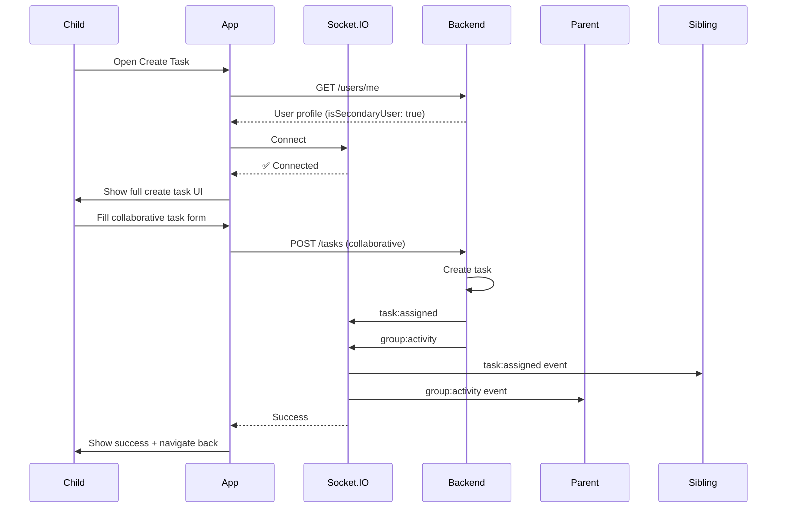

# 📱 API Flow: Child/Student - Task Creation (v2.0 with Permissions + Real-Time)

**Role:** `child` (Student / Group Member)  
**Figma Reference:** `app-user/group-children-user/add-task-flow-for-permission-account-interface.png`  
**Module:** Task Management + Permissions + Socket.IO  
**Date:** 12-03-26  
**Version:** 2.0 - **HTTP + Socket.IO Real-Time**  

**Related Flows**:
- Flow 03 (v1.0): HTTP endpoints only (legacy reference)
- Flow 06 (v2.0): Child home screen with real-time

---

## 🎯 What's New in v2.0

### v1.0 (HTTP Only) vs v2.0 (HTTP + Socket.IO)

| Feature | v1.0 | v2.0 |
|---------|------|------|
| HTTP Endpoints | ✅ Yes | ✅ Yes |
| Permission Checking | ✅ Yes | ✅ Updated (childrenBusinessUser) |
| Socket.IO Connection | ❌ No | ✅ **NEW!** |
| Real-Time Task Assignment | ❌ No | ✅ **NEW!** |
| Family Notifications | ❌ No | ✅ **NEW!** |
| Secondary User Logic | ❌ No | ✅ **NEW!** |

---

## 🔄 Complete User Journey Overview

```
┌─────────────────────────────────────────────────────────────┐
│           TASK CREATION FLOW (v2.0 Real-Time)               │
├─────────────────────────────────────────────────────────────┤
│  1. Check Permissions → HTTP + childrenBusinessUser         │
│  2. Connect Socket.IO → Listen for Assignment Events        │
│  3. Open Create Task → Show Permission-Based UI             │
│  4. Select Task Type → Personal vs Single vs Collaborative  │
│  5. Fill Task Details → Form Validation                     │
│  6. Submit Task → HTTP + Real-Time Notifications            │
│  7. Handle Response → Success + Socket.IO Updates           │
└─────────────────────────────────────────────────────────────┘
```

---

## 📍 Flow 1: Permission Check (Updated for childrenBusinessUser)

### Screen: Before Create Task Screen Opens

**Figma:** `app-user/group-children-user/profile-permission-account-interface.png`

### Step 1: Get User Profile (HTTP - Same as v1.0)

```http
GET /v1/users/me
Authorization: Bearer {{accessToken}}
```

**Response:**
```json
{
  "success": true,
  "data": {
    "_id": "child001",
    "name": "John Student",
    "email": "john@student.com",
    "role": "child",
    "isSecondaryUser": false,  // ⭐ NEW: Secondary user flag
    "parentBusinessUserId": "parent001"  // ⭐ NEW: Parent reference
  }
}
```

---

### Step 2: Check Secondary User Permission ⭐ NEW!

```http
GET /v1/children-business-user/children
Authorization: Bearer {{parentAccessToken}}
```

**Purpose:** Check if child is Secondary User (can create tasks for others)

**Response:**
```json
{
  "success": true,
  "data": {
    "docs": [
      {
        "_id": "rel001",
        "childUserId": "child001",
        "childName": "John Student",
        "isSecondaryUser": true,  // ⭐ Can create tasks for family
        "status": "active"
      },
      {
        "_id": "rel002",
        "childUserId": "child002",
        "childName": "Jane Student",
        "isSecondaryUser": false,  // Can only create personal tasks
        "status": "active"
      }
    ]
  }
}
```

---

### Permission Logic (Updated) ⭐ NEW!

```typescript
// Frontend Permission Check (v2.0)
function canCreateTask(user, taskType) {
  // Personal tasks: Always allowed for child users
  if (taskType === 'personal') {
    return true;
  }
  
  // Check if child is Secondary User
  if (user.isSecondaryUser) {
    // Secondary user can create ALL task types
    return true;
  }
  
  // Non-secondary user: Only personal tasks
  if (taskType === 'singleAssignment' || taskType === 'collaborative') {
    return false;  // Need parent permission
  }
  
  return false;
}

// Check Secondary User Status
async function checkSecondaryUserStatus(childUserId) {
  const response = await fetch('/v1/children-business-user/children', {
    headers: { Authorization: `Bearer ${parentToken}` }
  });
  const data = await response.json();
  
  const childRel = data.data.docs.find(d => d.childUserId === childUserId);
  return childRel?.isSecondaryUser || false;
}
```

---

### Permission UI Flow ⭐ NEW!

```typescript
// Show appropriate UI based on permissions
async function showCreateTaskUI() {
  const user = await getCurrentUser();
  const isSecondary = await checkSecondaryUserStatus(user._id);
  
  if (isSecondary) {
    // Show full create task UI
    showFullCreateTaskUI();
    // Can create: Personal, Single Assignment, Collaborative
  } else {
    // Show limited UI (personal tasks only)
    showLimitedCreateTaskUI();
    // Show message: "Ask parent for permission to create group tasks"
    showPermissionRequestButton();
  }
}
```

---

## 📍 Flow 2: Socket.IO Connection ⭐ NEW!

### Connect After Permission Check

```javascript
// Connect to Socket.IO after permission check
const socket = io('http://localhost:5000', {
  auth: {
    token: accessToken
  }
});

socket.on('connect', () => {
  console.log('✅ Connected to Socket.IO');
  
  // Listen for task assignment events
  socket.on('task:assigned', (data) => {
    // data = {
    //   taskId: 'task123',
    //   taskTitle: 'Math Homework',
    //   assignedBy: { userId: 'parent001', name: 'Parent' },
    //   timestamp: new Date()
    // }
    
    showNotification(`📌 New task assigned: ${data.taskTitle}`);
    refreshTaskList();
  });
  
  // Listen for family activity
  socket.on('group:activity', (activity) => {
    addToActivityFeed(activity);
  });
});
```

---

## 📍 Flow 3: Create Personal Task (Always Allowed)

### Screen: Create Task → Personal Task → Submit

**Figma:** `add-task-flow-for-permission-account-interface.png`

### HTTP API Call (Same as v1.0)

```http
POST /v1/tasks
Authorization: Bearer {{accessToken}}
Content-Type: application/json
```

**Request:**
```json
{
  "title": "My Personal Study",
  "description": "Study for 2 hours",
  "taskType": "personal",
  "priority": "high",
  "scheduledTime": "3:00 PM",
  "startTime": "2026-03-12T15:00:00.000Z",
  "subtasks": [
    { "title": "Math", "duration": "40 min" },
    { "title": "Science", "duration": "40 min" },
    { "title": "English", "duration": "40 min" }
  ]
}
```

**Response:**
```json
{
  "success": true,
  "data": {
    "_id": "task001",
    "title": "My Personal Study",
    "taskType": "personal",
    "status": "pending",
    "ownerUserId": "child001",
    "createdById": "child001",
    "completionPercentage": 0
  }
}
```

---

### Real-Time Family Notification ⭐ NEW!

**What Happens on Backend:**
1. Task created in DB
2. Socket.IO event emitted to family room
3. Parent sees activity in live feed

**Parent Receives:**
```javascript
socket.on('group:activity', (activity) => {
  // activity = {
  //   type: 'task_created',
  //   actor: { userId: 'child001', name: 'John' },
  //   task: { taskId: 'task001', title: 'My Personal Study' },
  //   timestamp: new Date()
  // }
  
  addToActivityFeed(activity);
  showNotification(`📝 ${activity.actor.name} created a task`);
});
```

---

## 📍 Flow 4: Create Single Assignment Task (Secondary User Only)

### Screen: Create Task → Single Assignment → Select Assignee → Submit

**Figma:** `add-task-flow-for-permission-account-interface.png`

### Permission Check ⭐ NEW!

```javascript
async function canCreateSingleAssignment() {
  const user = await getCurrentUser();
  
  if (user.isSecondaryUser) {
    return true;  // Secondary user can create single assignment tasks
  }
  
  // Show permission denied UI
  showPermissionDeniedDialog();
  return false;
}
```

### HTTP API Call (Same as v1.0)

```http
POST /v1/tasks
Authorization: Bearer {{accessToken}}
Content-Type: application/json
```

**Request:**
```json
{
  "title": "Science Project",
  "description": "Build volcano model",
  "taskType": "singleAssignment",
  "assignedUserIds": ["child002"],  // Assign to sibling
  "priority": "high",
  "scheduledTime": "2:00 PM",
  "startTime": "2026-03-13T14:00:00.000Z"
}
```

**Response:**
```json
{
  "success": true,
  "data": {
    "_id": "task002",
    "title": "Science Project",
    "taskType": "singleAssignment",
    "status": "pending",
    "assignedUserIds": ["child002"],
    "createdById": "child001",
    "ownerUserId": "child001"
  }
}
```

---

### Real-Time Notifications ⭐ NEW!

**Assignee Receives:**
```javascript
socket.on('task:assigned', (data) => {
  // data = {
  //   taskId: 'task002',
  //   taskTitle: 'Science Project',
  //   assignedBy: { userId: 'child001', name: 'John' },
  //   timestamp: new Date()
  // }
  
  showNotification(`📌 New task assigned: ${data.taskTitle}`);
  refreshTaskList();
});
```

**Parent Receives:**
```javascript
socket.on('group:activity', (activity) => {
  // activity = {
  //   type: 'task_created',
  //   actor: { userId: 'child001', name: 'John' },
  //   task: { taskId: 'task002', title: 'Science Project' },
  //   assignedTo: { userId: 'child002', name: 'Jane' }
  // }
  
  addToActivityFeed(activity);
  showNotification(`📝 John assigned task to Jane`);
});
```

---

## 📍 Flow 5: Create Collaborative Task (Secondary User Only)

### Screen: Create Task → Collaborative → Select Multiple Assignees → Submit

**Figma:** `add-task-flow-for-permission-account-interface.png`

### Permission Check ⭐ NEW!

```javascript
async function canCreateCollaborative() {
  const user = await getCurrentUser();
  
  if (user.isSecondaryUser) {
    return true;  // Secondary user can create collaborative tasks
  }
  
  // Show permission denied UI
  showPermissionDeniedDialog();
  return false;
}
```

### HTTP API Call (Same as v1.0)

```http
POST /v1/tasks
Authorization: Bearer {{accessToken}}
Content-Type: application/json
```

**Request:**
```json
{
  "title": "Group Science Project",
  "description": "Work together on solar system model",
  "taskType": "collaborative",
  "assignedUserIds": ["child001", "child002", "child003"],
  "priority": "medium",
  "scheduledTime": "3:00 PM",
  "startTime": "2026-03-14T15:00:00.000Z",
  "subtasks": [
    { "title": "Research planets", "duration": "1 hour" },
    { "title": "Build model", "duration": "2 hours" },
    { "title": "Prepare presentation", "duration": "1 hour" }
  ]
}
```

**Response:**
```json
{
  "success": true,
  "data": {
    "_id": "task003",
    "title": "Group Science Project",
    "taskType": "collaborative",
    "status": "pending",
    "assignedUserIds": ["child001", "child002", "child003"],
    "createdById": "child001",
    "ownerUserId": "child001",
    "completionPercentage": 0
  }
}
```

---

### Real-Time Notifications ⭐ NEW!

**All Assignees Receive:**
```javascript
socket.on('task:assigned', (data) => {
  showNotification(`📌 New collaborative task: ${data.taskTitle}`);
  refreshTaskList();
});
```

**Parent Receives:**
```javascript
socket.on('group:activity', (activity) => {
  addToActivityFeed(activity);
  showNotification(`📝 John created collaborative task`);
});
```

---

## 📍 Flow 6: Daily Task Limit Enforcement (Same as v1.0)

### Backend Validation

```http
POST /v1/tasks
```

**Error Response (If limit exceeded):**
```json
{
  "success": false,
  "message": "You can only create 5 tasks per day. You already have 5 tasks scheduled for this day."
}
```

**Frontend Handling:**
```javascript
try {
  const response = await createTask(taskData);
} catch (error) {
  if (error.message.includes('limit')) {
    showDailyLimitDialog();
    // Show existing tasks for today
    showTodayTasks();
    // Suggest creating task for tomorrow
    suggestTomorrowTask();
  }
}
```

---

## 📍 Flow 7: Request Permission (Non-Secondary User) ⭐ NEW!

### Screen: Permission Denied → Request Permission → Parent Reviews

**Figma:** `profile-permission-account-interface.png`

### Step 1: Child Requests Permission

```http
POST /v1/children-business-user/request-secondary-permission
Authorization: Bearer {{childToken}}
Content-Type: application/json
```

**Request:**
```json
{
  "childUserId": "child001",
  "reason": "I want to help manage family tasks"
}
```

---

### Step 2: Parent Reviews Request (HTTP)

```http
GET /v1/children-business-user/permission-requests
Authorization: Bearer {{parentToken}}
```

**Response:**
```json
{
  "success": true,
  "data": {
    "requests": [
      {
        "_id": "req001",
        "childUserId": "child001",
        "childName": "John",
        "reason": "I want to help manage family tasks",
        "requestedAt": "2026-03-12T10:00:00.000Z"
      }
    ]
  }
}
```

---

### Step 3: Parent Grants Permission

```http
PUT /v1/children-business-user/set-secondary-user
Authorization: Bearer {{parentToken}}
Content-Type: application/json
```

**Request:**
```json
{
  "childUserId": "child001",
  "isSecondaryUser": true
}
```

**Response:**
```json
{
  "success": true,
  "data": {
    "childUserId": "child001",
    "isSecondaryUser": true,
    "updatedAt": "2026-03-12T11:00:00.000Z"
  }
}
```

---

### Real-Time Notification to Child ⭐ NEW!

```javascript
socket.on('permission:granted', (data) => {
  // data = {
  //   type: 'secondary_user_granted',
  //   grantedBy: { userId: 'parent001', name: 'Parent' },
  //   timestamp: new Date()
  // }
  
  showCelebration('🎉 You can now create tasks for family!');
  refreshPermissions();
  showFullCreateTaskUI();
});
```

---

## 🔄 Complete Session Flow Diagram



---

## 📊 State Management

### App State After Each Flow:

| Flow | HTTP State | Socket.IO State | Cache Invalidated |
|------|------------|-----------------|-------------------|
| 1. Permission Check | User profile, isSecondaryUser | Connected | User cache set |
| 2. Create Personal | Task created | Family notified | Task list cache |
| 3. Create Single | Task + assignee | Assignee notified | Task list cache |
| 4. Create Collaborative | Task + multiple assignees | All notified | Task list cache |
| 5. Permission Granted | isSecondaryUser: true | Child notified | User cache refreshed |

---

## 🚨 Error Handling

### Permission Denied
```json
{
  "success": false,
  "message": "You don't have permission to create group tasks. Ask your parent for permission."
}
```

**Recovery:**
```javascript
showPermissionDeniedDialog();
showRequestPermissionButton();
```

---

### Daily Limit Exceeded
```json
{
  "success": false,
  "message": "Daily task limit reached. You already have 5 tasks today."
}
```

**Recovery:**
```javascript
showDailyLimitDialog();
showTodayTasks();
suggestTomorrowTask();
```

---

### Socket.IO Disconnection
```javascript
socket.on('disconnect', () => {
  console.log('❌ Disconnected');
  showBanner('Real-time updates paused');
});

socket.on('reconnect', () => {
  console.log('✅ Reconnected');
  hideBanner();
  refreshTaskList();
});
```

---

## 🎯 Performance Optimizations

### Socket.IO Optimizations ⭐ NEW!
```javascript
// 1. Debounced task creation
const createTaskWithDebounce = debounce(async (taskData) => {
  await createTask(taskData);
}, 300);

// 2. Batch notifications
socket.on('task:assigned', (data) => {
  batchUpdates(() => {
    showNotification(data);
    refreshTaskList();
  });
});

// 3. Lazy room joins
// Only join task room when viewing details
function viewTaskDetails(taskId) {
  socket.emit('join-task', { taskId });
}
```

---

## 📱 Flutter Integration Points

### Permission Service ⭐ NEW!
```dart
class PermissionService {
  Future<bool> canCreateTask(String taskType) async {
    final user = await getCurrentUser();
    
    if (taskType == 'personal') {
      return true;
    }
    
    return user.isSecondaryUser ?? false;
  }
  
  Future<void> requestSecondaryPermission(String reason) async {
    await fetch('/children-business-user/request-secondary-permission', {
      method: 'POST',
      body: {'reason': reason},
    });
  }
  
  Future<void> grantSecondaryPermission(String childUserId) async {
    await fetch('/children-business-user/set-secondary-user', {
      method: 'PUT',
      body: {
        'childUserId': childUserId,
        'isSecondaryUser': true,
      },
    });
  }
}
```

---

## ✅ Testing Checklist

### HTTP Endpoints (Same as v1.0)
- [ ] Get user profile with permissions
- [ ] Create personal task
- [ ] Create single assignment task (secondary user)
- [ ] Create collaborative task (secondary user)
- [ ] Daily task limit enforcement
- [ ] Request secondary permission
- [ ] Grant secondary permission

### Socket.IO Integration ⭐ NEW!
- [ ] Connect with valid token
- [ ] Auto-join family room
- [ ] Receive `task:assigned` event
- [ ] Receive `group:activity` event
- [ ] Receive `permission:granted` event
- [ ] Real-time family notifications
- [ ] Reconnection after disconnect

### Permission Logic ⭐ NEW!
- [ ] Personal task (always allowed)
- [ ] Single assignment (secondary user only)
- [ ] Collaborative (secondary user only)
- [ ] Permission denied UI
- [ ] Request permission flow
- [ ] Parent grants permission
- [ ] Child receives real-time update

---

## 📝 Comparison: v1.0 vs v2.0

| Feature | v1.0 (HTTP Only) | v2.0 (HTTP + Socket.IO) |
|---------|------------------|------------------------|
| **Permission Check** | Group-based | childrenBusinessUser |
| **Task Creation** | HTTP only | HTTP + Real-time notify |
| **Secondary User** | ❌ No | ✅ Yes |
| **Permission Request** | ❌ No | ✅ Yes |
| **Real-Time Assign** | ❌ No | ✅ Yes |
| **Family Feed** | ❌ No | ✅ Yes |

---

## 🎯 When to Use Which Version

### Use v1.0 (HTTP Only) When:
- Building MVP quickly
- Group-based permissions sufficient
- Real-time not critical

### Use v2.0 (HTTP + Socket.IO) When:
- Production-ready app
- Secondary user feature needed
- Real-time task assignment important
- Family collaboration required

---

## 📞 Support & Resources

### Related Documentation:
- **Flow 03 (v1.0)**: HTTP endpoints only (legacy reference)
- **Flow 06 (v2.0)**: Child home screen with real-time
- **childrenBusinessUser Module**: `src/modules/childrenBusinessUser.module/`
- **Socket.IO Guide**: `src/helpers/socket/SOCKET_IO_INTEGRATION.md`

### API Endpoints:
- **Postman Collection**: `03-Secondary-User-UPDATED-v2.postman_collection.json`
- **ChildrenBusinessUser**: `01-User-Common-Part2-Charts-Progress.postman_collection.json`

---

**Document Version**: 2.0 - HTTP + Socket.IO Real-Time  
**Last Updated**: 12-03-26  
**Status**: ✅ Complete with Real-Time Integration  
**Backward Compatible**: ✅ Yes (v1.0 endpoints still work)
