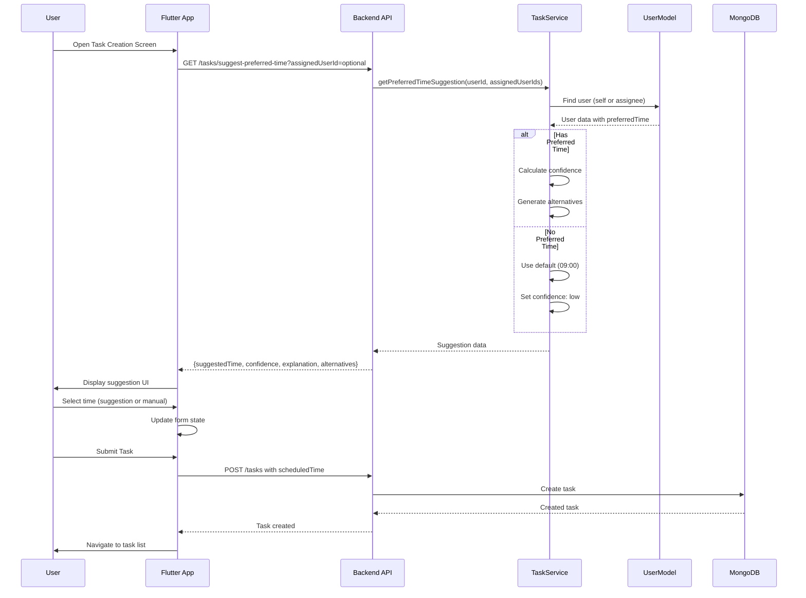

# 📱 API Flow: Task Preferences - Preferred Time Suggestion

**Role:** `child` (Student) | `business` (Parent)  
**Figma Reference:** `teacher-parent-dashboard/task-monitoring/create-task-flow/create-task.png`  
**Module:** Task Management - Preferred Time Suggestion  
**Date:** 14-03-26  
**Version:** 1.0 - Complete Implementation  

---

## 🎯 Feature Overview

**Preferred Time Suggestion** provides AI-powered task scheduling recommendations based on user's historical task completion patterns.

### **What It Does:**
- Analyzes last 10 completed tasks
- Calculates average start time
- Suggests optimal time for new tasks
- Provides confidence level and explanation
- Offers alternative time slots

### **Use Cases:**
1. **Student creating task** → Get personal suggestion
2. **Parent creating for child** → Get child's suggestion
3. **Collaborative task** → Get assignee's suggestion
4. **Scheduling optimization** → Improve task completion rates

---

## 🔧 Technical Implementation

### **Endpoint:**
```http
GET /v1/tasks/suggest-preferred-time
Authorization: Bearer {{accessToken}}
```

### **Query Parameters:**
| Parameter | Type | Required | Description |
|-----------|------|----------|-------------|
| `assignedUserId` | string | ❌ Optional | Get suggestion for assignee (parent creating for child) |

### **Response Structure:**
```json
{
  "success": true,
  "data": {
    "suggestedTime": "09:00",
    "suggestedTime12Hour": "09:00 AM",
    "basedOn": "your_preferred_time",
    "confidence": "high",
    "explanation": "Based on your task history, you usually start tasks at 09:00 AM.",
    "alternativeTimes": ["08:00", "09:00", "10:00"]
  },
  "message": "Preferred time suggestion retrieved successfully"
}
```

---

## 📍 Flow 1: Student Creating Personal Task

### **Screen:** Task Creation Screen → Time Picker → Suggestion Display

**Figma:** `app-user/group-children-user/add-task-flow-for-permission-account-interface.png`

### **API Call:**

```http
GET /v1/tasks/suggest-preferred-time
Authorization: Bearer {{accessToken}}
```

**Request:**
```
No query parameters (uses authenticated user's data)
```

**Response:**
```json
{
  "success": true,
  "data": {
    "suggestedTime": "09:00",
    "suggestedTime12Hour": "09:00 AM",
    "basedOn": "your_preferred_time",
    "confidence": "high",
    "explanation": "Based on your task history, you usually start tasks at 09:00 AM.",
    "alternativeTimes": ["08:00", "09:00", "10:00"]
  }
}
```

### **UI Flow:**

```
┌─────────────────────────────────────────────────────────────┐
│  Create New Task                                            │
├─────────────────────────────────────────────────────────────┤
│  Title: [Math Homework________________]                     │
│  Description: [Complete exercises 1-10__]                   │
│                                                             │
│  ⏰ Scheduled Time:                                         │
│  ┌─────────────────────────────────────────────────────┐   │
│  │ 💡 Suggested: 09:00 AM                              │   │
│  │ Based on your task history                          │   │
│  │ Confidence: High                                    │   │
│  │                                                     │   │
│  │ Alternatives: 08:00 AM | 09:00 AM | 10:00 AM       │   │
│  └─────────────────────────────────────────────────────┘   │
│                                                             │
│  [ Use Suggestion ]  [ Choose Manually ]                    │
│                                                             │
│  [ Create Task ]                                            │
└─────────────────────────────────────────────────────────────┘
```

### **User Actions:**

1. **Tap "Use Suggestion"**
   - Set scheduledTime to "09:00 AM"
   - Update form state
   - Continue with task creation

2. **Tap Alternative Time**
   - Set scheduledTime to selected time
   - Highlight selected alternative
   - Continue with task creation

3. **Tap "Choose Manually"**
   - Open time picker
   - Allow custom time selection
   - Ignore suggestion

---

## 📍 Flow 2: Parent Creating Task for Child

### **Screen:** Parent Dashboard → Create Task → Select Child → Time Suggestion

**Figma:** `teacher-parent-dashboard/task-monitoring/create-task-flow/single-assignment.png`

### **API Call:**

```http
GET /v1/tasks/suggest-preferred-time?assignedUserId=507f1f77bcf86cd799439010
Authorization: Bearer {{accessToken}}
```

**Request:**
```
Query Parameters:
- assignedUserId: 507f1f77bcf86cd799439010 (child's user ID)
```

**Response:**
```json
{
  "success": true,
  "data": {
    "suggestedTime": "15:00",
    "suggestedTime12Hour": "03:00 PM",
    "basedOn": "assignee_preferred_time",
    "confidence": "high",
    "explanation": "John usually starts tasks at 03:00 PM, based on his task history.",
    "alternativeTimes": ["14:00", "15:00", "16:00"]
  }
}
```

### **UI Flow:**

```
┌─────────────────────────────────────────────────────────────┐
│  Create Task for John                                       │
├─────────────────────────────────────────────────────────────┤
│  Title: [Science Project_______________]                    │
│  Assign to: John Doe (Child)                                │
│                                                             │
│  ⏰ Scheduled Time:                                         │
│  ┌─────────────────────────────────────────────────────┐   │
│  │ 💡 Suggested: 03:00 PM                              │   │
│  │ Based on John's task history                        │   │
│  │ Confidence: High                                    │   │
│  │                                                     │   │
│  │ Alternatives: 02:00 PM | 03:00 PM | 04:00 PM       │   │
│  └─────────────────────────────────────────────────────┘   │
│                                                             │
│  [ Use Suggestion ]  [ Choose Manually ]                    │
│                                                             │
│  [ Create Task ]                                            │
└─────────────────────────────────────────────────────────────┘
```

---

## 📍 Flow 3: Insufficient Data (New User)

### **Screen:** Task Creation → No Suggestion Available

**Scenario:** User has fewer than 5 completed tasks

### **API Call:**

```http
GET /v1/tasks/suggest-preferred-time
Authorization: Bearer {{accessToken}}
```

**Response:**
```json
{
  "success": true,
  "data": {
    "suggestedTime": "09:00",
    "suggestedTime12Hour": "09:00 AM",
    "basedOn": "default",
    "confidence": "low",
    "explanation": "You haven't set a preferred time yet. We suggest 9:00 AM as a default.",
    "alternativeTimes": ["09:00", "10:00", "14:00"]
  }
}
```

### **UI Display:**

```
┌─────────────────────────────────────────────────────────────┐
│  ⏰ Scheduled Time:                                         │
│  ┌─────────────────────────────────────────────────────┐   │
│  │ 💡 Suggested: 09:00 AM (Default)                    │   │
│  │ Complete more tasks for personalized suggestions    │   │
│  │ Confidence: Low                                     │   │
│  │                                                     │   │
│  │ Alternatives: 09:00 AM | 10:00 AM | 02:00 PM       │   │
│  └─────────────────────────────────────────────────────┘   │
└─────────────────────────────────────────────────────────────┘
```

---

## 🔄 Complete API Flow Sequence



---

## 📊 Backend Implementation Details

### **Service Logic:**

```typescript
async getPreferredTimeSuggestion(
  userId: Types.ObjectId,
  assignedUserIds?: Types.ObjectId[]
): Promise<{
  suggestedTime: string;
  suggestedTime12Hour: string;
  basedOn: string;
  confidence: 'high' | 'medium' | 'low';
  explanation: string;
  alternativeTimes?: string[];
} | null> {
  // 1. Determine target user (self or assignee)
  let targetUserId = userId;
  let basedOn = 'your_preferred_time';
  
  if (assignedUserIds && assignedUserIds.length > 0) {
    targetUserId = assignedUserIds[0];
    basedOn = 'assignee_preferred_time';
  }
  
  // 2. Get user's preferred time
  const targetUser = await User.findById(targetUserId)
    .select('preferredTime name role')
    .lean();
  
  // 3. No preferred time → return default
  if (!targetUser.preferredTime) {
    return {
      suggestedTime: '09:00',
      suggestedTime12Hour: '09:00 AM',
      basedOn: 'default',
      confidence: 'low',
      explanation: 'You haven\'t set a preferred time yet.',
      alternativeTimes: ['09:00', '10:00', '14:00'],
    };
  }
  
  // 4. Parse preferred time to 12-hour format
  const [hours, minutes] = targetUser.preferredTime.split(':');
  const suggestedTime12Hour = format12Hour(hours, minutes);
  
  // 5. Generate alternatives (±1 hour)
  const alternativeTimes = [
    subtract1Hour(targetUser.preferredTime),
    targetUser.preferredTime,
    add1Hour(targetUser.preferredTime),
  ];
  
  // 6. Return suggestion
  return {
    suggestedTime: targetUser.preferredTime,
    suggestedTime12Hour,
    basedOn,
    confidence: 'high',
    explanation: generateExplanation(targetUser, basedOn),
    alternativeTimes,
  };
}
```

---

## 🎯 Confidence Levels

### **High Confidence:**
- User has `preferredTime` set (auto-calculated or manual)
- Based on 5+ completed tasks
- Consistent task history

**UI Indicator:** 🟢 Green badge

### **Medium Confidence:**
- User has `preferredTime` set
- Based on 3-4 completed tasks
- Some variation in history

**UI Indicator:** 🟡 Yellow badge

### **Low Confidence:**
- No `preferredTime` set
- Default suggestion (09:00)
- New user or insufficient data

**UI Indicator:** 🔵 Gray badge

---

## 🚨 Error Handling

### **Error 1: User Not Found**

**Request:**
```http
GET /v1/tasks/suggest-preferred-time?assignedUserId=invalid123
```

**Response:**
```json
{
  "success": false,
  "message": "User not found for preferred time suggestion"
}
```

**Recovery:**
- Show error toast
- Allow manual time selection
- Don't block task creation

### **Error 2: Calculation Failed**

**Response:**
```json
{
  "success": false,
  "message": "Unable to calculate preferred time suggestion"
}
```

**Recovery:**
- Use default time (09:00 AM)
- Show message: "Using default suggestion"
- Log error for debugging

---

## 📱 Flutter Integration

### **Required Services:**

```dart
// Task Preference Service
class TaskPreferenceService {
  /// Get preferred time suggestion
  Future<PreferredTimeSuggestion> getSuggestion({
    String? assignedUserId,
  }) async {
    final response = await http.get(
      Uri.parse('$baseUrl/tasks/suggest-preferred-time')
        .replace(queryParameters: {
          if (assignedUserId != null) 'assignedUserId': assignedUserId,
        }),
      headers: {'Authorization': 'Bearer $accessToken'},
    );
    
    if (response.statusCode == 200) {
      final data = jsonDecode(response.body);
      return PreferredTimeSuggestion.fromJson(data['data']);
    }
    
    throw Exception('Failed to get suggestion');
  }
}

// Model
class PreferredTimeSuggestion {
  final String suggestedTime;
  final String suggestedTime12Hour;
  final String basedOn;
  final String confidence;
  final String explanation;
  final List<String> alternativeTimes;
  
  factory PreferredTimeSuggestion.fromJson(Map<String, dynamic> json) {
    return PreferredTimeSuggestion(
      suggestedTime: json['suggestedTime'],
      suggestedTime12Hour: json['suggestedTime12Hour'],
      basedOn: json['basedOn'],
      confidence: json['confidence'],
      explanation: json['explanation'],
      alternativeTimes: List<String>.from(json['alternativeTimes']),
    );
  }
}
```

### **UI Widget:**

```dart
class PreferredTimeSuggestionWidget extends StatelessWidget {
  final PreferredTimeSuggestion suggestion;
  final Function(String) onTimeSelected;
  
  @override
  Widget build(BuildContext context) {
    return Card(
      child: Column(
        children: [
          Row(
            children: [
              Icon(Icons.lightbulb_outline, color: Colors.amber),
              SizedBox(width: 8),
              Text('Suggested: ${suggestion.suggestedTime12Hour}'),
              ConfidenceBadge(suggestion.confidence),
            ],
          ),
          Text(suggestion.explanation),
          SizedBox(height: 8),
          Row(
            children: suggestion.alternativeTimes
                .map((time) => AlternativeTimeChip(
                      time: time,
                      onTap: () => onTimeSelected(time),
                    ))
                .toList(),
          ),
        ],
      ),
    );
  }
}
```

---

## ✅ Testing Checklist

### **Functional Tests:**

- [ ] Get suggestion for self
- [ ] Get suggestion for assignee
- [ ] Get suggestion with insufficient data
- [ ] Get suggestion with no data (default)
- [ ] Select suggested time
- [ ] Select alternative time
- [ ] Choose manual time
- [ ] Create task with suggested time
- [ ] Handle API error gracefully

### **Edge Cases:**

- [ ] User with exactly 5 completed tasks
- [ ] User with 4 completed tasks (boundary)
- [ ] User with 0 completed tasks
- [ ] Invalid assignedUserId
- [ ] Multiple assignees (uses first)
- [ ] Time zone differences

### **Performance Tests:**

- [ ] Response time < 200ms
- [ ] No blocking on suggestion fetch
- [ ] Parallel API calls (suggestion + other data)
- [ ] Caching for repeated requests

---

## 📊 Analytics & Monitoring

### **Track:**

1. **Suggestion Usage Rate**
   - How often users accept suggestions
   - How often users choose alternatives
   - How often users choose manual

2. **Confidence Accuracy**
   - Do high-confidence suggestions lead to better completion?
   - Correlation between suggestion and actual start time

3. **Task Completion Impact**
   - Do tasks with suggested times complete more often?
   - Average completion time improvement

### **Metrics:**

```typescript
// Example analytics events
analytics.track('preferred_time_suggestion_shown', {
  confidence: 'high',
  basedOn: 'your_preferred_time',
  taskId: 'task123',
});

analytics.track('preferred_time_accepted', {
  suggestionTime: '09:00',
  taskId: 'task123',
});

analytics.track('preferred_time_rejected', {
  suggestionTime: '09:00',
  selectedTime: '14:00',
  taskId: 'task123',
});
```

---

## 🔗 Related Documentation

### **Postman Collection:**
- `01-User-Common-Part1-v3-COMPLETE.postman_collection.json`
- Section: "02 - Task Management" → "Get Preferred Time Suggestion"

### **Flow Documentation:**
- Flow 03: Child Task Creation
- Flow 08: Child Task Creation v2 (with permissions)

### **Backend Implementation:**
- `src/modules/task.module/task/task.service.ts` → `getPreferredTimeSuggestion()`
- `src/modules/task.module/task/task.route.ts` → `/suggest-preferred-time`

---

## 📝 Changelog

### v1.0 (14-03-26) - Initial Implementation
- ✅ Complete API flow documentation
- ✅ UI mockups and user journey
- ✅ Error handling scenarios
- ✅ Flutter integration guide
- ✅ Testing checklist

---

**Document Version:** 1.0  
**Last Updated:** 14-03-26  
**Status:** ✅ Complete & Aligned with Implementation
