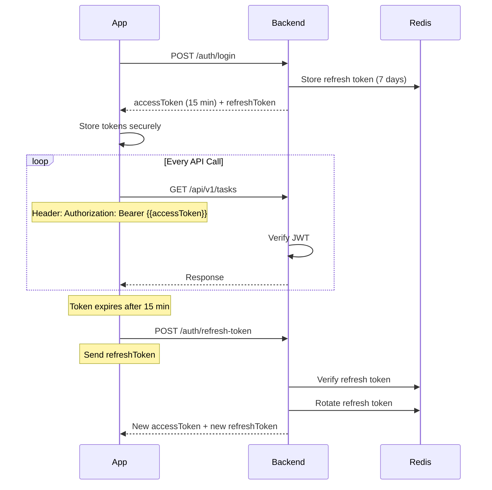

# 🔄 API Flow Documentation Index

**Project:** Task Management Backend  
**Purpose:** Map Figma screens to actual API endpoints  
**Last Updated:** 10-03-26

---

## 📚 How to Use This Documentation

Each flow document maps a **specific user journey** from Figma screenshots to **actual API endpoints**.

### Structure:
```
flow/
├── README.md (this file)
├── 01-child-student-home-flow.md
├── 02-business-parent-dashboard-flow.md
├── 03-admin-task-management-flow.md (TODO)
└── ...
```

### Each Flow Document Contains:
1. **Role** - Which user role (child, business, admin)
2. **Figma Reference** - Exact screenshot file
3. **User Journey** - Step-by-step screen flow
4. **API Calls** - Actual endpoints with requests/responses
5. **Error Handling** - Common errors and recovery
6. **State Management** - Cache invalidation strategy

---

## 📋 Available Flow Documents

### 🔹 Flow 01: Child/Student - Home Screen
**File:** `01-child-student-home-flow.md`  
**Role:** `child`  
**Figma:** `app-user/group-children-user/home-flow.png`  
**Status:** ✅ Complete

**Covers:**
- ✅ Login & authentication
- ✅ Load home screen (tasks + statistics)
- ✅ Pull to refresh
- ✅ View task details
- ✅ Complete task
- ✅ Update subtask progress
- ✅ Filter tasks (status, priority)
- ✅ Paginated task list

**Key Endpoints:**
```
POST   /api/v1/auth/login
GET    /api/v1/tasks/daily-progress
GET    /api/v1/tasks/statistics
GET    /api/v1/tasks
GET    /api/v1/tasks/:id
PUT    /api/v1/tasks/:id/status
PUT    /api/v1/tasks/:id/subtasks/progress
GET    /api/v1/notifications/unread-count
```

---

### 🔹 Flow 02: Business/Parent - Dashboard
**File:** `02-business-parent-dashboard-flow.md`  
**Role:** `business`  
**Figma:** `teacher-parent-dashboard/dashboard/`  
**Status:** ✅ Complete

**Covers:**
- ✅ Dashboard initial load
- ✅ View all tasks with filters
- ✅ Create task for child (single assignment)
- ✅ Create collaborative task (multiple children)
- ✅ Update child's task
- ✅ Monitor task completion
- ✅ Delete task
- ✅ Weekly/monthly progress reports
- ✅ Permission management

**Key Endpoints:**
```
GET    /api/v1/tasks/statistics
GET    /api/v1/tasks/paginate
GET    /api/v1/users/paginate/for-student
POST   /api/v1/tasks (singleAssignment)
POST   /api/v1/tasks (collaborative)
PUT    /api/v1/tasks/:id
DELETE /api/v1/tasks/:id
GET    /api/v1/subtasks/task/:taskId
GET    /api/v1/tasks/daily-progress?from&to
GET    /api/v1/groups/:groupId/members
PUT    /api/v1/groups/:groupId/members/:memberId/permissions
```

---

### 🔹 Flow 03: Child/Student - Task Creation (Permission-Based)
**File:** `03-child-task-creation-flow.md`  
**Role:** `child`  
**Figma:** `app-user/group-children-user/add-task-flow-for-permission-account-interface.png`  
**Status:** ✅ Complete

**Covers:**
- ✅ Permission checking logic
- ✅ Personal task creation (always allowed)
- ✅ Single assignment task (needs permission)
- ✅ Collaborative task (needs permission)
- ✅ Permission-denied UI flow
- ✅ Task type validation
- ✅ Daily task limit enforcement
- ✅ Group-based permissions

**Key Endpoints:**
```
GET    /api/v1/users/me (check permissions)
GET    /api/v1/groups/my-groups
GET    /api/v1/groups/:groupId/members
POST   /api/v1/tasks (personal)
POST   /api/v1/tasks (singleAssignment)
POST   /api/v1/tasks (collaborative)
```

---

## 🗂️ Flow Documents by Role

### Child/Student Role
| # | Flow | File | Figma | Status |
|---|------|------|-------|--------|
| 01 | Home Screen | `01-child-student-home-flow.md` | `app-user/group-children-user/home-flow.png` | ✅ Complete |
| 02 | Task Creation | `03-child-task-creation-flow.md` | `app-user/group-children-user/add-task-flow-for-permission-account-interface.png` | ✅ Complete |
| TODO | Task Edit | `04-child-task-edit-flow.md` | `app-user/group-children-user/edit-update-task-flow.png` | 🟡 TODO |
| TODO | Profile/Permissions | `05-child-profile-flow.md` | `app-user/group-children-user/profile-permission-account-interface.png` | 🟡 TODO |

### Business/Parent Role
| # | Flow | File | Figma | Status |
|---|------|------|-------|--------|
| 01 | Dashboard | `02-business-parent-dashboard-flow.md` | `teacher-parent-dashboard/dashboard/` | ✅ Complete |
| TODO | Team Members | `06-business-team-flow.md` | `teacher-parent-dashboard/team-members/` | 🟡 TODO |
| TODO | Task Monitoring | `07-business-monitoring-flow.md` | `teacher-parent-dashboard/task-monitoring/` | 🟡 TODO |
| TODO | Settings/Permissions | `08-business-settings-flow.md` | `teacher-parent-dashboard/settings-permission-section/` | 🟡 TODO |

### Admin Role
| # | Flow | File | Figma |
|---|------|------|-------|
| TODO | Admin Dashboard | `09-admin-dashboard-flow.md` | `main-admin-dashboard/` |
| TODO | User Management | `10-admin-user-management-flow.md` | `main-admin-dashboard/` |
| TODO | Task Oversight | `11-admin-task-oversight-flow.md` | `main-admin-dashboard/` |

---

## 🎯 Common API Patterns

### Pattern 1: List + Detail
```
GET /api/v1/tasks              → List all tasks
GET /api/v1/tasks/:id          → Get single task
```

### Pattern 2: Create + Read + Update + Delete
```
POST   /api/v1/tasks          → Create task
GET    /api/v1/tasks/:id      → Read task
PUT    /api/v1/tasks/:id      → Update task
DELETE /api/v1/tasks/:id      → Delete task
```

### Pattern 3: Status Update
```
PUT /api/v1/tasks/:id/status  → Update status only
```

### Pattern 4: Progress Tracking
```
PUT /api/v1/tasks/:id/subtasks/progress  → Update all subtasks
```

### Pattern 5: Paginated List
```
GET /api/v1/tasks/paginate?page=1&limit=20  → Paginated tasks
```

### Pattern 6: Statistics
```
GET /api/v1/tasks/statistics  → Get counts + rates
```

### Pattern 7: Daily Progress
```
GET /api/v1/tasks/daily-progress?date=2026-03-10  → Today's progress
```

---

## 🔐 Authentication Flow

### Login + Token Management


---

## 📊 Rate Limiting

| Endpoint Type | Limit | Window | Key |
|---------------|-------|--------|-----|
| Auth (Login) | 5 | 15 min | IP |
| Auth (Register) | 10 | 1 hour | IP |
| Task Create | 20 | 1 hour | userId |
| Task Read | 100 | 1 min | userId |
| Task Update | 100 | 1 min | userId |
| Admin Endpoints | 200 | 1 min | userId |

**Headers Returned:**
```
X-RateLimit-Limit: 100
X-RateLimit-Remaining: 95
X-RateLimit-Reset: 1646910000
```

---

## 🚀 Caching Strategy

### Redis Cache Keys

```
# Task Module
task:list:{userId}:{filters}     → 2 minutes TTL
task:detail:{taskId}             → 5 minutes TTL
task:stats:{userId}              → 5 minutes TTL
task:daily:{userId}:{date}       → 2 minutes TTL

# SubTask Module
subtask:list:{taskId}            → 2 minutes TTL
subtask:detail:{subtaskId}       → 5 minutes TTL
subtask:stats:{userId}           → 5 minutes TTL

# User Module
user:profile:{userId}            → 15 minutes TTL
user:list:{filters}              → 5 minutes TTL

# Notification Module
notification:unread:{userId}     → 1 minute TTL
notification:list:{userId}       → 2 minutes TTL
```

### Cache Invalidation

| Action | Cache to Invalidate |
|--------|---------------------|
| Create Task | `task:list:*`, `task:stats:*` |
| Update Task | `task:detail:{id}`, `task:list:*` |
| Delete Task | `task:detail:{id}`, `task:list:*`, `task:stats:*` |
| Complete Task | `task:detail:{id}`, `task:list:*`, `task:stats:*` |
| Update Subtask | `subtask:detail:{id}`, `task:detail:{parentId}` |

---

## 📝 Figma Reference Guide

### App User (Child/Student)
```
figma-asset/app-user/group-children-user/
├── home-flow.png                    → Home screen with task list
├── task-details-with-subTasks.png   → Task details with subtasks
├── edit-update-task-flow.png        → Edit task screen
├── add-task-flow-for-permission-account-interface.png → Create task
├── profile-permission-account-interface.png → Profile with permissions
├── status-section-flow-01.png       → Status filter section
└── response-based-on-mode.png       → Mode-based responses
```

### Teacher/Parent Dashboard
```
figma-asset/teacher-parent-dashboard/
├── dashboard/
│   └── dashboard-flow-01.png        → Main dashboard
├── task-monitoring/                 → Task monitoring screens
├── team-members/                    → Team/group members view
├── settings-permission-section/     → Permission settings
└── subscription/                    → Subscription management
```

### Main Admin Dashboard
```
figma-asset/main-admin-dashboard/
└── (Admin dashboard screens)        → Admin oversight tools
```

---

## 🎓 How to Add New Flow Documents

1. **Identify Figma Screen**
   - Locate screenshot in `figma-asset/` folder
   - Note the user role (child, business, admin)

2. **Map API Endpoints**
   - List all API calls needed for this screen
   - Include request/response examples

3. **Document User Journey**
   - Start → End screen flow
   - Include error states

4. **Add to Index**
   - Update this README with new flow
   - Add to role-based table

5. **Version Control**
   - Date format: DD-MM-YY
   - Update "Last Updated" in both files

---

## 🔍 Quick Reference: All Endpoints

### Task Endpoints
```
POST   /api/v1/tasks                      → Create task
GET    /api/v1/tasks                      → Get my tasks
GET    /api/v1/tasks/paginate             → Get tasks with pagination
GET    /api/v1/tasks/statistics           → Get statistics
GET    /api/v1/tasks/daily-progress       → Get daily progress
GET    /api/v1/tasks/:id                  → Get task by ID
PUT    /api/v1/tasks/:id                  → Update task
PUT    /api/v1/tasks/:id/status           → Update status
PUT    /api/v1/tasks/:id/subtasks/progress → Update subtask progress
DELETE /api/v1/tasks/:id                  → Soft delete task
DELETE /api/v1/tasks/:id/permanent        → Permanent delete (admin)
```

### SubTask Endpoints
```
POST   /api/v1/subtasks                   → Create subtask
GET    /api/v1/subtasks/task/:taskId      → Get subtasks for task
GET    /api/v1/subtasks/task/:taskId/paginate → Paginated subtasks
GET    /api/v1/subtasks/statistics        → Get subtask statistics
GET    /api/v1/subtasks/:id               → Get subtask by ID
PUT    /api/v1/subtasks/:id               → Update subtask
PUT    /api/v1/subtasks/:id/toggle-status → Toggle status
DELETE /api/v1/subtasks/:id               → Delete subtask
```

### User Endpoints
```
GET    /api/v1/users/paginate             → Get all users
GET    /api/v1/users/paginate/for-student → Get students
GET    /api/v1/users/paginate/for-mentor  → Get mentors
```

### Notification Endpoints
```
GET    /api/v1/notifications/my           → Get my notifications
GET    /api/v1/notifications/unread-count → Get unread count
POST   /api/v1/notifications/:id/read     → Mark as read
POST   /api/v1/notifications/read-all     → Mark all as read
DELETE /api/v1/notifications/:id          → Delete notification
```

### Auth Endpoints
```
POST   /api/v1/auth/register              → Register user
POST   /api/v1/auth/login                 → Login
POST   /api/v1/auth/google-login          → Google OAuth
POST   /api/v1/auth/apple-login           → Apple OAuth
POST   /api/v1/auth/refresh-token         → Refresh access token
POST   /api/v1/auth/logout                → Logout
```

---

## 📞 Support

For questions about API flows:
1. Check the specific flow document first
2. Review error handling section
3. Check Postman collection for actual requests
4. Contact backend team

---

**Last Updated:** 10-03-26  
**Maintained By:** Backend Engineering Team  
**Status:** 🟡 In Progress (3/20 flows documented)
