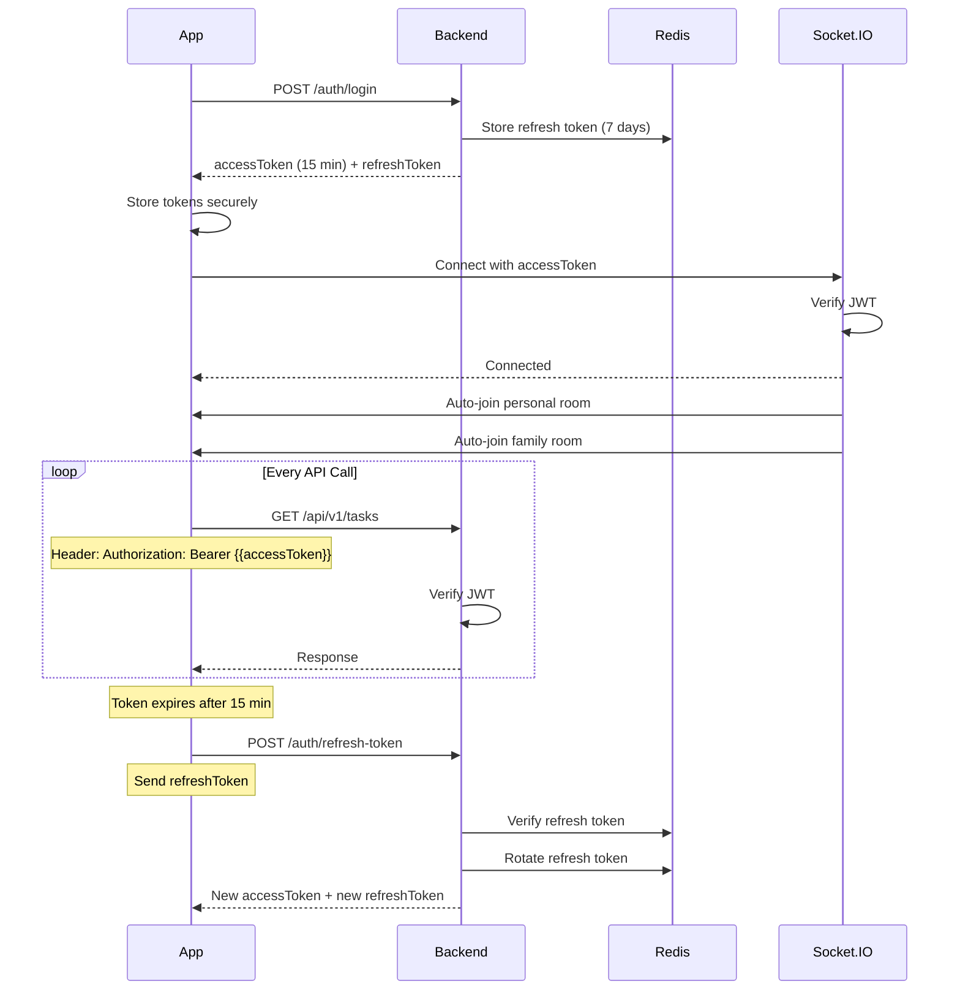

# 🔄 API Flow Documentation Index

**Project:** Task Management Backend
**Purpose:** Map Figma screens to actual API endpoints
**Last Updated:** 12-03-26
**Version:** 2.0 - **NEW: Real-Time Socket.IO Flows**

---

## 📚 How to Use This Documentation

Each flow document maps a **specific user journey** from Figma screenshots to **actual API endpoints**.

### Structure:
```
flow/
├── README.md (this file)
├── 01-child-student-home-flow.md
├── 02-business-parent-dashboard-flow.md
├── 03-child-task-creation-flow.md
├── 04-parent-dashboard-realtime-monitoring-flow.md  ← NEW!
└── 05-child-task-progress-realtime-flow.md          ← NEW!
```

### Each Flow Document Contains:
1. **Role** - Which user role (child, business, admin)
2. **Figma Reference** - Exact screenshot file
3. **User Journey** - Step-by-step screen flow
4. **API Calls** - Actual endpoints with requests/responses
5. **Socket.IO Events** - Real-time events (NEW!)
6. **Error Handling** - Common errors and recovery
7. **State Management** - Cache invalidation strategy

---

## 📋 Available Flow Documents

### 🔹 Flow 01: Child/Student - Home Screen
**File:** `01-child-student-home-flow.md`
**Role:** `child`
**Figma:** `app-user/group-children-user/home-flow.png`
**Status:** ✅ Complete

**Covers:**
- ✅ Login & authentication
- ✅ Load home screen (tasks + statistics)
- ✅ Pull to refresh
- ✅ View task details
- ✅ Complete task
- ✅ Update subtask progress
- ✅ Filter tasks (status, priority)
- ✅ Paginated task list

**Key Endpoints:**
```
POST   /auth/login
GET    /tasks/daily-progress
GET    /tasks/statistics
GET    /tasks
GET    /tasks/:id
PUT    /tasks/:id/status
PUT    /tasks/:id/subtasks/progress
GET    /notifications/unread-count
```

---

### 🔹 Flow 02: Business/Parent - Dashboard
**File:** `02-business-parent-dashboard-flow.md`
**Role:** `business`
**Figma:** `teacher-parent-dashboard/dashboard/`
**Status:** ✅ Complete

**Covers:**
- ✅ Dashboard initial load
- ✅ View all tasks with filters
- ✅ Create task for child (single assignment)
- ✅ Create collaborative task (multiple children)
- ✅ Update child's task
- ✅ Monitor task completion
- ✅ Delete task
- ✅ Weekly/monthly progress reports
- ✅ Permission management

**Key Endpoints:**
```
GET    /tasks/statistics
GET    /tasks/paginate
GET    /users/paginate/for-student
POST   /tasks (singleAssignment)
POST   /tasks (collaborative)
PUT    /tasks/:id
DELETE /tasks/:id
GET    /subtasks/task/:taskId
GET    /tasks/daily-progress?from&to
```

---

### 🔹 Flow 03: Child/Student - Task Creation (Permission-Based)
**File:** `03-child-task-creation-flow.md`
**Role:** `child`
**Figma:** `app-user/group-children-user/add-task-flow-for-permission-account-interface.png`
**Status:** ✅ Complete

**Covers:**
- ✅ Permission checking logic
- ✅ Personal task creation (always allowed)
- ✅ Single assignment task (needs permission)
- ✅ Collaborative task (needs permission)
- ✅ Permission-denied UI flow
- ✅ Task type validation
- ✅ Daily task limit enforcement
- ✅ Group-based permissions

**Key Endpoints:**
```
GET    /users/me (check permissions)
GET    /groups/my-groups
GET    /groups/:groupId/members
POST   /tasks (personal)
POST   /tasks (singleAssignment)
POST   /tasks (collaborative)
```

---

### 🔹 Flow 04: Parent Dashboard - Real-Time Monitoring ⭐ NEW!
**File:** `04-parent-dashboard-realtime-monitoring-flow.md`
**Role:** `business`
**Figma:** `teacher-parent-dashboard/dashboard/dashboard-flow-01.png`
**Status:** ✅ **NEW! Complete with Socket.IO**

**Covers:**
- ✅ Login + Socket.IO connection
- ✅ Auto-join family room
- ✅ Load dashboard charts (10 chart endpoints)
- ✅ Real-time task progress updates
- ✅ Live activity feed
- ✅ Child progress comparison
- ✅ Activity heatmap
- ✅ Collaborative task monitoring

**Key Endpoints (HTTP):**
```
GET    /analytics/charts/user-growth
GET    /analytics/charts/task-status
GET    /analytics/charts/family-activity/:businessUserId
GET    /analytics/charts/child-progress/:businessUserId
GET    /analytics/charts/status-by-child/:businessUserId
GET    /analytics/charts/completion-trend/:userId
GET    /analytics/charts/activity-heatmap/:userId
GET    /analytics/charts/collaborative-progress/:taskId
```

**Socket.IO Events:**
```javascript
// Parent listens for:
socket.on('task-progress:started', (data) => {})
socket.on('task-progress:subtask-completed', (data) => {})
socket.on('task-progress:completed', (data) => {})
socket.on('group:activity', (activity) => {})
```

---

### 🔹 Flow 05: Child Task Progress - Real-Time Updates ⭐ NEW!
**File:** `05-child-task-progress-realtime-flow.md`
**Role:** `child`
**Figma:** `app-user/group-children-user/` (Task Progress)
**Status:** ✅ **NEW! Complete with Socket.IO**

**Covers:**
- ✅ Login + Socket.IO connection
- ✅ Load my tasks
- ✅ Start task → Parent notified (real-time)
- ✅ Complete subtask → Parent notified (real-time)
- ✅ Complete task → Parent celebration (real-time)
- ✅ View progress charts
- ✅ Activity heatmap
- ✅ Support mode integration

**Key Endpoints (HTTP):**
```
GET    /tasks
GET    /tasks/daily-progress
GET    /tasks/statistics
PUT    /task-progress/:taskId/status
PUT    /task-progress/:taskId/subtasks/:index/complete
GET    /analytics/charts/completion-trend/:userId
GET    /analytics/charts/activity-heatmap/:userId
```

**Socket.IO Events:**
```javascript
// Child connects and joins:
socket.emit('join-task', { taskId })
socket.on('task:assigned', (data) => {})

// Parent receives when child acts:
socket.on('task-progress:started', (data) => {})
socket.on('task-progress:subtask-completed', (data) => {})
socket.on('task-progress:completed', (data) => {})
```

---

## 🗂️ Flow Documents by Role

### Child/Student Role
| # | Flow | File | Figma | Socket.IO | Status |
|---|------|------|-------|-----------|--------|
| 01 | Home Screen | `01-child-student-home-flow.md` | `home-flow.png` | ❌ No | ✅ Complete |
| 02 | Task Creation | `03-child-task-creation-flow.md` | `add-task-flow.png` | ❌ No | ✅ Complete |
| 03 | Task Progress | `05-child-task-progress-realtime-flow.md` | Task Progress | ✅ **YES** | ✅ **NEW!** |
| TODO | Task Edit | `04-child-task-edit-flow.md` | `edit-update-task-flow.png` | ❌ No | 🟡 TODO |
| TODO | Profile/Permissions | `05-child-profile-flow.md` | `profile-permission.png` | ❌ No | 🟡 TODO |

### Business/Parent Role
| # | Flow | File | Figma | Socket.IO | Status |
|---|------|------|-------|-----------|--------|
| 01 | Dashboard | `02-business-parent-dashboard-flow.md` | `dashboard/` | ❌ No | ✅ Complete |
| 02 | Real-Time Monitoring | `04-parent-dashboard-realtime-monitoring-flow.md` | `dashboard-flow-01.png` | ✅ **YES** | ✅ **NEW!** |
| TODO | Team Members | `06-business-team-flow.md` | `team-members/` | ❌ No | 🟡 TODO |
| TODO | Task Monitoring | `07-business-monitoring-flow.md` | `task-monitoring/` | ❌ No | 🟡 TODO |
| TODO | Settings/Permissions | `08-business-settings-flow.md` | `settings-permission/` | ❌ No | 🟡 TODO |

### Admin Role
| # | Flow | File | Figma | Socket.IO | Status |
|---|------|------|-------|-----------|--------|
| TODO | Admin Dashboard | `09-admin-dashboard-flow.md` | `main-admin-dashboard/` | ❌ No | 🟡 TODO |
| TODO | User Management | `10-admin-user-management-flow.md` | `user-list-flow.png` | ❌ No | 🟡 TODO |
| TODO | Task Oversight | `11-admin-task-oversight-flow.md` | `dashboard-section-flow.png` | ❌ No | 🟡 TODO |

---

## 🆕 What's New in Version 2.0

### Real-Time Socket.IO Integration

**New Features:**
1. ✅ **10 Chart Aggregation Endpoints**
   - Admin charts: user-growth, task-status, monthly-income, user-ratio
   - Parent charts: family-activity, child-progress, status-by-child
   - Monitoring charts: completion-trend, activity-heatmap, collaborative-progress

2. ✅ **6 TaskProgress Endpoints**
   - Real-time parent monitoring
   - Per-child progress tracking
   - Subtask completion tracking

3. ✅ **5 ChildrenBusinessUser Endpoints**
   - Family management
   - Secondary user permissions
   - Child account creation

4. ✅ **Socket.IO Real-Time Events**
   - `task-progress:started`
   - `task-progress:subtask-completed`
   - `task-progress:completed`
   - `group:activity` (broadcast to family)

### Updated Documentation

| Document | Version | Changes |
|----------|---------|---------|
| `04-parent-dashboard-realtime-monitoring-flow.md` | 2.0 | Complete rewrite with Socket.IO |
| `05-child-task-progress-realtime-flow.md` | 2.0 | Complete rewrite with Socket.IO |
| `README.md` (this file) | 2.0 | Added real-time flows section |

---

## 🎯 Common API Patterns

### Pattern 1: List + Detail
```
GET /api/v1/tasks              → List all tasks
GET /api/v1/tasks/:id          → Get single task
```

### Pattern 2: Create + Read + Update + Delete
```
POST   /api/v1/tasks          → Create task
GET    /api/v1/tasks/:id      → Read task
PUT    /api/v1/tasks/:id      → Update task
DELETE /api/v1/tasks/:id      → Delete task
```

### Pattern 3: Status Update (Real-Time)
```
PUT /api/v1/task-progress/:id/status  → Update status + notify parent via Socket.IO
```

### Pattern 4: Progress Tracking (Real-Time)
```
PUT /api/v1/task-progress/:id/subtasks/:index/complete  → Complete subtask + real-time update
```

### Pattern 5: Paginated List
```
GET /api/v1/tasks/paginate?page=1&limit=20  → Paginated tasks
```

### Pattern 6: Statistics + Charts
```
GET /api/v1/tasks/statistics                → Get counts + rates
GET /api/v1/analytics/charts/*              → Chart-specific aggregation (NEW!)
```

### Pattern 7: Daily Progress
```
GET /api/v1/tasks/daily-progress?date=2026-03-10  → Today's progress
```

### Pattern 8: Socket.IO Events (NEW!)
```javascript
// Connect
socket = io({ auth: { token } })

// Join room
socket.emit('join-task', { taskId })

// Listen for events
socket.on('task-progress:started', callback)
socket.on('group:activity', callback)
```

---

## 🔐 Authentication Flow

### Login + Token Management + Socket.IO


---

## 📊 Rate Limiting

| Endpoint Type | Limit | Window | Key |
|---------------|-------|--------|-----|
| Auth (Login) | 5 | 15 min | IP |
| Auth (Register) | 10 | 1 hour | IP |
| Task Create | 20 | 1 hour | userId |
| Task Read | 100 | 1 min | userId |
| Task Update | 100 | 1 min | userId |
| Chart Endpoints | 30 | 1 min | userId |
| Admin Endpoints | 200 | 1 min | userId |

**Headers Returned:**
```
X-RateLimit-Limit: 100
X-RateLimit-Remaining: 95
X-RateLimit-Reset: 1646910000
```

---

## 🚀 Caching Strategy

### Redis Cache Keys

```
# Task Module
task:list:{userId}:{filters}     → 2 minutes TTL
task:detail:{taskId}             → 5 minutes TTL
task:stats:{userId}              → 5 minutes TTL
task:daily:{userId}:{date}       → 2 minutes TTL

# Chart Aggregation (NEW!)
analytics:charts:user-growth-30          → 5 minutes TTL
analytics:charts:task-status-global      → 5 minutes TTL
analytics:charts:family-activity-{userId}-7  → 5 minutes TTL
analytics:charts:child-progress-{userId} → 5 minutes TTL

# TaskProgress (NEW!)
taskprogress:detail:{taskId}:{userId}    → 5 minutes TTL
taskprogress:children:{taskId}           → 5 minutes TTL
taskprogress:tasks:{userId}              → 5 minutes TTL

# User Module
user:profile:{userId}            → 15 minutes TTL
user:list:{filters}              → 5 minutes TTL

# Notification Module
notification:unread:{userId}     → 1 minute TTL
notification:list:{userId}       → 2 minutes TTL
```

### Cache Invalidation

| Action | Cache to Invalidate |
|--------|---------------------|
| Create Task | `task:list:*`, `task:stats:*` |
| Update Task | `task:detail:{id}`, `task:list:*` |
| Delete Task | `task:detail:{id}`, `task:list:*`, `task:stats:*` |
| Complete Task | `task:detail:{id}`, `task:list:*`, `task:stats:*` |
| Update Subtask | `subtask:detail:{id}`, `task:detail:{parentId}` |
| Update Progress | `taskprogress:detail:{taskId}:{userId}`, `taskprogress:children:{taskId}` |

---

## 📝 Figma Reference Guide

### App User (Child/Student)
```
figma-asset/app-user/group-children-user/
├── home-flow.png                    → Home screen with task list
├── task-details-with-subTasks.png   → Task details with subtasks
├── edit-update-task-flow.png        → Edit task screen
├── add-task-flow-for-permission-account-interface.png → Create task
├── profile-permission-account-interface.png → Profile with permissions
├── profile-without-permission-interface.png → Profile without permissions
├── status-section-flow-01.png       → Status filter section
└── response-based-on-mode.png       → Mode-based responses
```

### Teacher/Parent Dashboard
```
figma-asset/teacher-parent-dashboard/
├── dashboard/
│   ├── dashboard-flow-01.png        → Main dashboard (Live Activity)
│   ├── dashboard-flow-02.png        → Child comparison
│   └── dashboard-flow-03.png        → Task summary
├── task-monitoring/                 → Task monitoring screens
│   └── task-monitoring-flow-01.png  → Monitoring overview
├── team-members/                    → Team/group members view
│   ├── team-member-flow-01.png      → Member list
│   ├── create-child-flow.png        → Create child
│   └── edit-child-flow.png          → Edit child
├── settings-permission-section/     → Permission settings
│   ├── permission-flow.png          → Permission management
│   └── permission-flow-02.png       → Advanced permissions
└── subscription/                    → Subscription management
    └── subscription-flow.png        → Subscription view
```

### Main Admin Dashboard
```
figma-asset/main-admin-dashboard/
├── dashboard-section-flow.png       → Admin dashboard
├── get-user-details-flow.png        → User details
├── user-list-flow.png               → User list
└── subscription-flow.png            → Subscription plans
```

---

## 🎓 How to Add New Flow Documents

1. **Identify Figma Screen**
   - Locate screenshot in `figma-asset/` folder
   - Note the user role (child, business, admin)

2. **Map API Endpoints**
   - List all API calls needed for this screen
   - Include request/response examples
   - **NEW:** Include Socket.IO events if real-time

3. **Document User Journey**
   - Start → End screen flow
   - Include error states
   - **NEW:** Include real-time event flow

4. **Add to Index**
   - Update this README with new flow
   - Add to role-based table
   - Mark if Socket.IO enabled

5. **Version Control**
   - Date format: DD-MM-YY
   - Update "Last Updated" in both files
   - Version: 1.0 (HTTP only), 2.0 (with Socket.IO)

---

## 🔍 Quick Reference: All Endpoints

### Task Endpoints
```
POST   /api/v1/tasks                      → Create task
GET    /api/v1/tasks                      → Get my tasks
GET    /api/v1/tasks/paginate             → Get tasks with pagination
GET    /api/v1/tasks/statistics           → Get statistics
GET    /api/v1/tasks/daily-progress       → Get daily progress
GET    /api/v1/tasks/:id                  → Get task by ID
PUT    /api/v1/tasks/:id                  → Update task
PUT    /api/v1/tasks/:id/status           → Update status
PUT    /api/v1/tasks/:id/subtasks/progress → Update subtask progress
DELETE /api/v1/tasks/:id                  → Soft delete task
```

### TaskProgress Endpoints (NEW!)
```
GET    /api/v1/task-progress/:taskId/user/:userId      → Get my progress
GET    /api/v1/task-progress/:taskId/children          → Get all children's progress
GET    /api/v1/task-progress/child/:childId/tasks      → Get child's all tasks
PUT    /api/v1/task-progress/:taskId/status            → Update progress status
PUT    /api/v1/task-progress/:taskId/subtasks/:index/complete → Complete subtask
POST   /api/v1/task-progress/:taskId                   → Create progress record
```

### Chart Aggregation Endpoints (NEW!)
```
# Admin Dashboard Charts
GET    /api/v1/analytics/charts/user-growth?days=30
GET    /api/v1/analytics/charts/task-status
GET    /api/v1/analytics/charts/monthly-income?months=12
GET    /api/v1/analytics/charts/user-ratio

# Parent Dashboard Charts
GET    /api/v1/analytics/charts/family-activity/:businessUserId?days=7
GET    /api/v1/analytics/charts/child-progress/:businessUserId
GET    /api/v1/analytics/charts/status-by-child/:businessUserId

# Task Monitoring Charts
GET    /api/v1/analytics/charts/completion-trend/:userId?days=30
GET    /api/v1/analytics/charts/activity-heatmap/:userId?days=30
GET    /api/v1/analytics/charts/collaborative-progress/:taskId
```

### ChildrenBusinessUser Endpoints (NEW!)
```
GET    /api/v1/children-business-user/children         → Get my children
POST   /api/v1/children-business-user/create-child     → Create child account
PUT    /api/v1/children-business-user/set-secondary-user → Set permission
PUT    /api/v1/children-business-user/:id              → Update child
DELETE /api/v1/children-business-user/:id              → Remove child
```

### SubTask Endpoints
```
POST   /api/v1/subtasks                   → Create subtask
GET    /api/v1/subtasks/task/:taskId      → Get subtasks for task
GET    /api/v1/subtasks/task/:taskId/paginate → Paginated subtasks
GET    /api/v1/subtasks/statistics        → Get subtask statistics
GET    /api/v1/subtasks/:id               → Get subtask by ID
PUT    /api/v1/subtasks/:id               → Update subtask
PUT    /api/v1/subtasks/:id/toggle-status → Toggle status
DELETE /api/v1/subtasks/:id               → Delete subtask
```

### User Endpoints
```
GET    /api/v1/users/paginate             → Get all users
GET    /api/v1/users/paginate/for-student → Get students
GET    /api/v1/users/paginate/for-mentor  → Get mentors
GET    /api/v1/users/profile              → Get my profile
PUT    /api/v1/users/profile-info         → Update profile
GET    /api/v1/users/support-mode         → Get support mode
PUT    /api/v1/users/support-mode         → Update support mode
```

### Notification Endpoints
```
GET    /api/v1/notifications/my           → Get my notifications
GET    /api/v1/notifications/unread-count → Get unread count
POST   /api/v1/notifications/:id/read     → Mark as read
POST   /api/v1/notifications/read-all     → Mark all as read
DELETE /api/v1/notifications/:id          → Delete notification
```

### Auth Endpoints
```
POST   /api/v1/auth/register              → Register user
POST   /api/v1/auth/login                 → Login
POST   /api/v1/auth/google-login          → Google OAuth
POST   /api/v1/auth/apple-login           → Apple OAuth
POST   /api/v1/auth/refresh-token         → Refresh access token
POST   /api/v1/auth/logout                → Logout
```

### Socket.IO Events (NEW!)
```javascript
// Client → Server
socket.emit('join-task', { taskId })
socket.emit('leave-task', { taskId })
socket.emit('join-group', { groupId })  // Auto-joined now
socket.emit('get-family-activity-feed', { businessUserId, limit })

// Server → Client (Real-Time)
socket.on('task-progress:started', callback)
socket.on('task-progress:subtask-completed', callback)
socket.on('task-progress:completed', callback)
socket.on('group:activity', callback)
socket.on('task:assigned', callback)
```

---

## 📞 Support

For questions about API flows:
1. Check the specific flow document first
2. Review error handling section
3. Check Postman collection for actual requests
4. Contact backend team

---

**Last Updated:** 12-03-26  
**Version:** 2.0 - Real-Time Edition  
**Maintained By:** Backend Engineering Team  
**Status:** ✅ 5 Flows Documented (2 with Socket.IO Real-Time)
