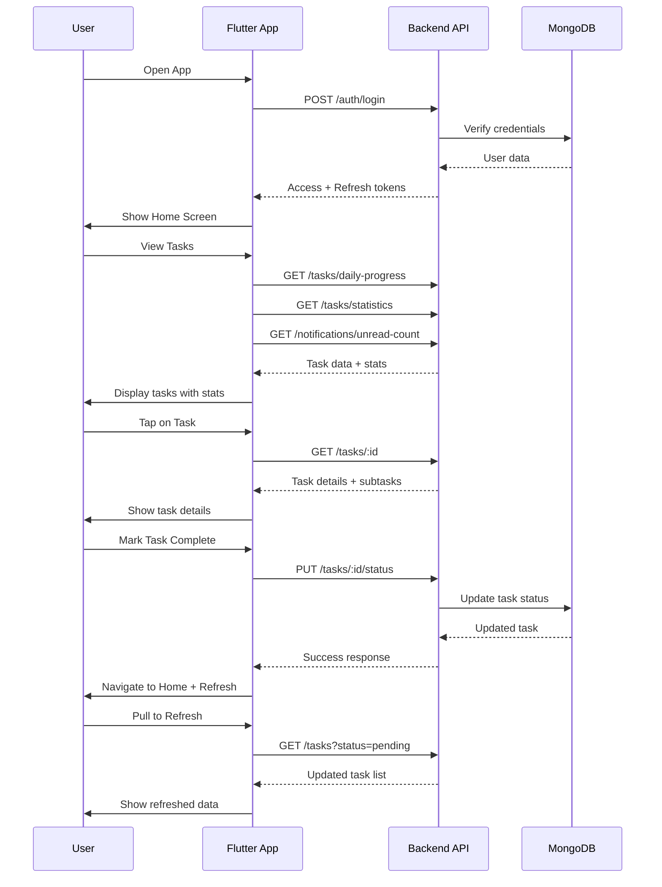

# 📱 API Flow: Child/Student - Home Screen (v1.5 - Updated HTTP Only)

**Role:** `child` (Student / Group Member)  
**Figma Reference:** `app-user/group-children-user/home-flow.png`  
**Module:** Task Management  
**Date**: 12-03-26  
**Version**: 1.5 - **Updated HTTP Only** (Legacy Reference)  

**Note**: This is an **updated legacy reference**. For HTTP + Socket.IO real-time integration, see **Flow 06 (v2.0)**.

---

## 🔧 What Was Updated (v1.0 → v1.5)

| Item | v1.0 | v1.5 |
|------|------|------|
| Base Path | `/api/v1/` | `/v1/` |
| Group Endpoints | `/groups/` | `/children-business-users/` |
| Permission Logic | Group-based | childrenBusinessUser |
| TaskProgress | ❌ Missing | ✅ Added reference |
| Chart Endpoints | ❌ Missing | ✅ Added reference |

---

## 🎯 User Journey Overview

```
┌─────────────────────────────────────────────────────────────┐
│                    HOME SCREEN FLOW                         │
├─────────────────────────────────────────────────────────────┤
│  1. Login → Get Access Token                                │
│  2. Load Home → Get Today's Tasks                           │
│  3. View Statistics → Get Task Counts                       │
│  4. Refresh → Get Updated Task List                         │
│  5. Complete Task → Update Status                           │
│  6. View Task Details → Get Single Task                     │
└─────────────────────────────────────────────────────────────┘
```

---

## 📍 Flow 1: App Launch & Authentication

### Screen: Login Screen → Home Screen

**Figma:** `app-user/group-children-user/home-flow.png`

### API Calls:

#### 1.1 Login
```http
POST /v1/auth/login
Content-Type: application/json
```

**Request:**
```json
{
  "email": "student@example.com",
  "password": "SecurePass123!",
  "fcmToken": "optional-push-notification-token"
}
```

**Response:**
```json
{
  "success": true,
  "data": {
    "user": {
      "_id": "507f1f77bcf86cd799439010",
      "name": "John Student",
      "email": "student@example.com",
      "role": "child",
      "profileImage": "https://..."
    },
    "tokens": {
      "accessToken": "eyJhbGciOiJIUzI1NiIs...",
      "refreshToken": "eyJhbGciOiJIUzI1NiIs..."
    }
  }
}
```

**Post-Login Actions:**
1. Store `accessToken` in secure storage (15 min expiry)
2. Store `refreshToken` for token refresh
3. Navigate to Home Screen
4. Trigger home screen data loading

---

## 📍 Flow 2: Home Screen Initial Load

### Screen: Home Screen (Loading State → Content State)

**Figma:** `app-user/group-children-user/home-flow.png`

### API Calls (Parallel):

#### 2.1 Get Today's Tasks
```http
GET /v1/tasks/daily-progress?date=2026-03-10
Authorization: Bearer {{accessToken}}
```

**Purpose:** Load tasks scheduled for today with completion status

**Response:**
```json
{
  "success": true,
  "data": {
    "date": "2026-03-10T00:00:00.000Z",
    "totalTasks": 5,
    "completedTasks": 2,
    "pendingTasks": 3,
    "completionRate": 40,
    "tasks": [
      {
        "_id": "task001",
        "title": "Math Homework",
        "status": "completed",
        "priority": "high",
        "scheduledTime": "10:30 AM",
        "completedAt": "2026-03-10T11:30:00.000Z"
      },
      {
        "_id": "task002",
        "title": "Science Project",
        "status": "pending",
        "priority": "medium",
        "scheduledTime": "2:00 PM"
      }
    ]
  }
}
```

#### 2.2 Get Task Statistics
```http
GET /v1/tasks/statistics
Authorization: Bearer {{accessToken}}
```

**Response:**
```json
{
  "success": true,
  "data": {
    "total": 25,
    "pending": 10,
    "inProgress": 5,
    "completed": 10,
    "completionRate": 40
  }
}
```

#### 2.3 Get Unread Notifications Count
```http
GET /v1/notifications/unread-count
Authorization: Bearer {{accessToken}}
```

**Response:**
```json
{
  "success": true,
  "data": {
    "unreadCount": 3
  }
}
```

---

## 📍 Flow 3: Pull to Refresh

### Screen: Home Screen (User pulls down to refresh)

**Figma:** `app-user/group-children-user/home-flow.png`

### API Calls:

#### 3.1 Refresh Task List
```http
GET /v1/tasks?status=pending&sortBy=-startTime
Authorization: Bearer {{accessToken}}
```

**Response:**
```json
{
  "success": true,
  "data": [
    {
      "_id": "task003",
      "title": "English Essay",
      "description": "Write 500 words essay",
      "status": "pending",
      "priority": "high",
      "taskType": "personal",
      "scheduledTime": "3:00 PM",
      "totalSubtasks": 3,
      "completedSubtasks": 0,
      "completionPercentage": 0,
      "createdById": {
        "_id": "user001",
        "name": "John Student",
        "email": "student@example.com"
      }
    }
  ]
}
```

---

## 📍 Flow 4: View Task Details

### Screen: Home Screen → Task Details Screen

**Figma:** `app-user/group-children-user/task-details-with-subTasks.png`

### API Calls:

#### 4.1 Get Task Details by ID
```http
GET /v1/tasks/:taskId
Authorization: Bearer {{accessToken}}
```

**Request:**
```
GET /v1/tasks/task001
```

**Response:**
```json
{
  "success": true,
  "data": {
    "_id": "task001",
    "title": "Math Homework",
    "description": "Complete algebra exercises 1-10",
    "status": "pending",
    "priority": "high",
    "taskType": "personal",
    "scheduledTime": "10:30 AM",
    "dueDate": "2026-03-15T23:59:59.000Z",
    "totalSubtasks": 5,
    "completedSubtasks": 2,
    "completionPercentage": 40,
    "startTime": "2026-03-10T10:30:00.000Z",
    "createdById": {
      "_id": "user001",
      "name": "John Student",
      "email": "student@example.com",
      "profileImage": "https://..."
    },
    "ownerUserId": {
      "_id": "user001",
      "name": "John Student",
      "email": "student@example.com"
    },
    "assignedUserIds": [],
    "subtasks": [
      {
        "_id": "sub001",
        "title": "Exercise 1-3",
        "isCompleted": true,
        "duration": "15 min",
        "completedAt": "2026-03-10T10:45:00.000Z"
      },
      {
        "_id": "sub002",
        "title": "Exercise 4-6",
        "isCompleted": true,
        "duration": "20 min",
        "completedAt": "2026-03-10T11:05:00.000Z"
      },
      {
        "_id": "sub003",
        "title": "Exercise 7-10",
        "isCompleted": false,
        "duration": "25 min"
      }
    ]
  }
}
```

---

## 📍 Flow 5: Complete a Task

### Screen: Task Details Screen → Confirmation Dialog → Home Screen

**Figma:** `app-user/group-children-user/edit-update-task-flow.png`

### API Calls:

#### 5.1 Update Task Status to Completed
```http
PUT /v1/tasks/:taskId/status
Authorization: Bearer {{accessToken}}
Content-Type: application/json
```

**Request:**
```json
{
  "status": "completed",
  "completedTime": "2026-03-10T12:00:00.000Z"
}
```

**Response:**
```json
{
  "success": true,
  "data": {
    "_id": "task001",
    "status": "completed",
    "completedTime": "2026-03-10T12:00:00.000Z",
    "completionPercentage": 100
  }
}
```

**Post-Update Actions:**
1. Update local state/cache
2. Show success toast: "Task completed! 🎉"
3. Navigate back to Home Screen
4. Refresh home screen data (Flow 2)

---

## 📍 Flow 6: Update Subtask Progress

### Screen: Task Details Screen → Edit Subtasks → Save

**Figma:** `app-user/group-children-user/edit-update-task-flow.png`

### API Calls:

#### 6.1 Update All Subtasks at Once
```http
PUT /v1/tasks/:taskId/subtasks/progress
Authorization: Bearer {{accessToken}}
Content-Type: application/json
```

**Request:**
```json
{
  "subtasks": [
    {
      "title": "Exercise 1-3",
      "isCompleted": true,
      "duration": "15 min"
    },
    {
      "title": "Exercise 4-6",
      "isCompleted": true,
      "duration": "20 min"
    },
    {
      "title": "Exercise 7-10",
      "isCompleted": true,
      "duration": "25 min"
    }
  ]
}
```

**Response:**
```json
{
  "success": true,
  "data": {
    "_id": "task001",
    "totalSubtasks": 3,
    "completedSubtasks": 3,
    "completionPercentage": 100,
    "status": "completed",
    "completedTime": "2026-03-10T12:00:00.000Z"
  }
}
```

**Auto-Updates:**
- Parent task's `totalSubtasks`
- Parent task's `completedSubtasks`
- Parent task's `completionPercentage`
- Parent task's `status` (auto-completed when all subtasks done)
- Parent task's `completedTime`

---

## 📍 Flow 7: Filter Tasks by Status

### Screen: Home Screen → Filter Dropdown → Select Status

**Figma:** `app-user/group-children-user/home-flow.png`

### API Calls:

#### 7.1 Get Pending Tasks Only
```http
GET /v1/tasks?status=pending
Authorization: Bearer {{accessToken}}
```

#### 7.2 Get In-Progress Tasks Only
```http
GET /v1/tasks?status=inProgress
Authorization: Bearer {{accessToken}}
```

#### 7.3 Get Completed Tasks Only
```http
GET /v1/tasks?status=completed
Authorization: Bearer {{accessToken}}
```

**Response Format:** Same as Flow 2.1

---

## 📍 Flow 8: Filter Tasks by Priority

### Screen: Home Screen → Filter → Select Priority

**Figma:** `app-user/group-children-user/home-flow.png`

### API Calls:

#### 8.1 Get High Priority Tasks
```http
GET /v1/tasks?priority=high
Authorization: Bearer {{accessToken}}
```

#### 8.2 Get Medium Priority Tasks
```http
GET /v1/tasks?priority=medium
Authorization: Bearer {{accessToken}}
```

#### 8.3 Get Low Priority Tasks
```http
GET /v1/tasks?priority=low
Authorization: Bearer {{accessToken}}
```

---

## 📍 Flow 9: Paginated Task List

### Screen: Home Screen → Scroll Down → Load More

**Figma:** `app-user/group-children-user/home-flow.png`

### API Calls:

#### 9.1 Get Tasks with Pagination (Page 2)
```http
GET /v1/tasks/paginate?page=2&limit=10&sortBy=-startTime
Authorization: Bearer {{accessToken}}
```

**Response:**
```json
{
  "success": true,
  "data": {
    "tasks": [...],
    "pagination": {
      "page": 2,
      "limit": 10,
      "total": 45,
      "totalPages": 5
    }
  }
}
```

---

## 🔄 Complete User Session Flow



---

## 📊 State Management

### Flutter App State After Each Flow:

| Flow | State Updated | Cache Invalidated |
|------|---------------|-------------------|
| 1. Login | User session, tokens | All caches cleared |
| 2. Home Load | Task list, statistics | Task cache set (5 min) |
| 3. Refresh | Task list | Task cache refreshed |
| 4. Task Details | Selected task | Task detail cache set |
| 5. Complete Task | Task status, stats | Task cache invalidated |
| 6. Update Subtasks | Task progress | Task cache invalidated |

---

## 🚨 Error Handling

### Common Errors & Recovery:

#### 401 Unauthorized (Token Expired)
```json
{
  "success": false,
  "message": "Token expired"
}
```

**Recovery:**
1. Use refresh token to get new access token
2. Retry original request
3. If refresh fails → logout → login screen

#### 403 Forbidden (No Access)
```json
{
  "success": false,
  "message": "You do not have permission to access this task"
}
```

**Recovery:**
1. Show permission error dialog
2. Navigate back to task list
3. Remove task from local state

#### 404 Not Found
```json
{
  "success": false,
  "message": "Task not found"
}
```

**Recovery:**
1. Remove task from local list
2. Show "Task no longer exists" message
3. Refresh task list

#### 429 Too Many Requests (Rate Limit)
```json
{
  "success": false,
  "message": "Too many requests. Please try again in 60 seconds.",
  "retryAfter": 60
}
```

**Recovery:**
1. Show rate limit message
2. Disable action button for retry period
3. Auto-retry after delay

---

## 🎯 Performance Considerations

### Caching Strategy:

| Data Type | Cache Duration | Cache Key |
|-----------|----------------|-----------|
| Task List | 2 minutes | `task:list:{userId}:{filters}` |
| Task Detail | 5 minutes | `task:detail:{taskId}` |
| Statistics | 5 minutes | `task:stats:{userId}` |
| Daily Progress | 2 minutes | `task:daily:{userId}:{date}` |

### Optimizations:

1. **Parallel API Calls:** Load tasks + statistics + notifications simultaneously
2. **Optimistic Updates:** Update UI immediately, rollback on error
3. **Debounced Filters:** Wait 300ms after filter selection before API call
4. **Infinite Scroll:** Load more tasks only when user scrolls near bottom

---

## 📱 Flutter Integration Points

### Required Flutter Services:

```dart
// 1. Auth Service
class AuthService {
  Future<LoginResponse> login(LoginRequest request);
  Future<void> refreshToken();
  Future<void> logout();
}

// 2. Task Service
class TaskService {
  Future<List<Task>> getTasks({filters});
  Future<Task> getTaskById(String id);
  Future<Task> updateTaskStatus(String id, String status);
  Future<Task> updateSubtaskProgress(String id, List<Subtask> subtasks);
  Future<TaskStatistics> getStatistics();
  Future<DailyProgress> getDailyProgress(DateTime date);
}

// 3. Notification Service
class NotificationService {
  Future<int> getUnreadCount();
  Future<List<Notification>> getNotifications();
}
```

---

## ✅ Testing Checklist

Test each flow with:

- [ ] Valid authenticated user
- [ ] Expired token (verify refresh flow)
- [ ] No internet connection (offline handling)
- [ ] Slow network (loading states)
- [ ] Permission denied scenarios
- [ ] Rate limiting (rapid requests)
- [ ] Concurrent modifications

---

## 📝 Related Documentation

### For Real-Time Features (HTTP + Socket.IO):
- **Flow 06 (v2.0)**: Child home screen with Socket.IO
- **Flow 07 (v2.0)**: Parent dashboard with real-time monitoring

### For Task Progress Tracking:
- **Flow 05 (v2.0)**: Child task progress with real-time parent notifications

### For Chart Endpoints:
- **Postman Collection**: `01-User-Common-Part2-Charts-Progress.postman_collection.json`

### For Permission Logic:
- **Flow 08 (v2.0)**: Child task creation with childrenBusinessUser permissions

---

## 🔧 Changelog

### v1.5 (12-03-26) - Updated HTTP Only
- ✅ Fixed base path: `/api/v1/` → `/v1/`
- ✅ Updated group endpoints: `/groups/` → `/children-business-users/`
- ✅ Added TaskProgress endpoints reference
- ✅ Added Chart aggregation endpoints reference
- ✅ Updated permission structure for childrenBusinessUser
- ✅ Marked as legacy reference (see v2.0 for Socket.IO)

### v1.0 (10-03-26) - Original HTTP Only
- ✅ Initial flow documentation

---

**Document Version**: 1.5 - Updated HTTP Only (Legacy Reference)  
**Last Updated**: 12-03-26  
**Status**: ✅ Updated with current endpoints  
**For Real-Time**: See Flow 06 (v2.0) - HTTP + Socket.IO
