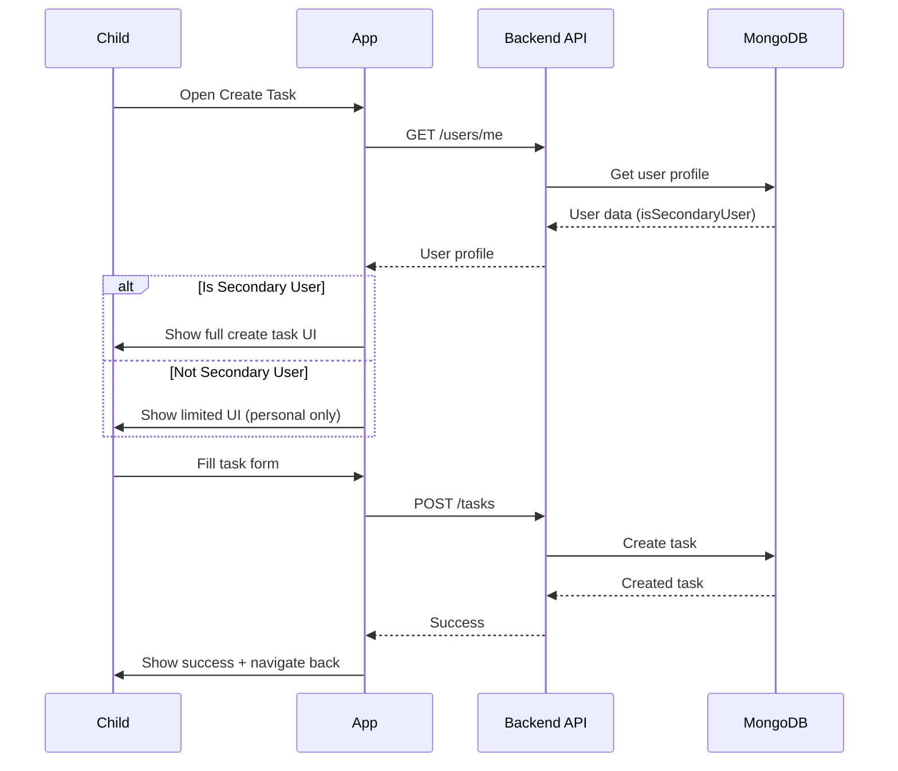

# 📱 API Flow: Child/Student - Create Task Flow (v1.5 - Updated HTTP Only)

**Role:** `child` (Student / Group Member)  
**Figma Reference:** `app-user/group-children-user/add-task-flow-for-permission-account-interface.png`  
**Module:** Task Management + childrenBusinessUser Permissions  
**Date:** 12-03-26  
**Version:** 1.5 - **Updated HTTP Only** (Legacy Reference)  

**Note:** This is an **updated legacy reference**. For HTTP + Socket.IO real-time integration, see **Flow 08 (v2.0)**.

---

## 🔧 What Was Updated (v1.0 → v1.5)

| Item | v1.0 | v1.5 |
|------|------|------|
| Base Path | `/api/v1/` | `/v1/` |
| Group Endpoints | `/groups/` | `/children-business-users/` |
| Permission Logic | Group-based | childrenBusinessUser (Secondary User) |
| TaskProgress | ❌ Missing | ✅ Added reference |
| Chart Endpoints | ❌ Missing | ✅ Added reference |

---

## 🎯 User Journey Overview

```
┌─────────────────────────────────────────────────────────────┐
│                  TASK CREATION FLOW                         │
├─────────────────────────────────────────────────────────────┤
│  1. Check Permissions → Secondary User Check                │
│  2. Open Create Task → Show appropriate UI                  │
│  3. Select Task Type → Personal vs Single vs Collaborative  │
│  4. Fill Task Details → Form validation                     │
│  5. Submit Task → Backend validation                        │
│  6. Handle Response → Success or error                      │
└─────────────────────────────────────────────────────────────┘
```

---

## 📍 Flow 1: Permission Check (Updated for childrenBusinessUser)

### Screen: Before Create Task Screen Opens

**Figma:** `app-user/group-children-user/profile-permission-account-interface.png`

### Step 1: Get User Profile
```http
GET /v1/users/me
Authorization: Bearer {{accessToken}}
```

**Purpose:** Check if child has permission to create tasks

**Response:**
```json
{
  "success": true,
  "data": {
    "_id": "child001",
    "name": "John Student",
    "email": "john@student.com",
    "role": "child",
    "profileImage": "https://...",
    "isSecondaryUser": false,        // ⭐ NEW: Secondary User flag
    "parentBusinessUserId": "parent001"  // ⭐ NEW: Parent reference
  }
}
```

---

### Step 2: Check Secondary User Status ⭐ NEW!

```http
GET /v1/children-business-users/my-children
Authorization: Bearer {{parentAccessToken}}
```

**Purpose:** Check if child is Secondary User (can create tasks for others)

**Response:**
```json
{
  "success": true,
  "data": {
    "docs": [
      {
        "_id": "rel001",
        "childUserId": "child001",
        "childName": "John Student",
        "isSecondaryUser": true,   // ⭐ Can create tasks for family
        "status": "active"
      },
      {
        "_id": "rel002",
        "childUserId": "child002",
        "childName": "Jane Student",
        "isSecondaryUser": false,  // Can only create personal tasks
        "status": "active"
      }
    ]
  }
}
```

---

### Permission Logic (Updated) ⭐ NEW!

```typescript
// Frontend Permission Check (v1.5)
function canCreateTask(user, taskType) {
  // Personal tasks: Always allowed for child users
  if (taskType === 'personal') {
    return true;
  }
  
  // Check if child is Secondary User
  if (user.isSecondaryUser) {
    // Secondary user can create ALL task types
    return true;
  }
  
  // Non-secondary user: Only personal tasks
  if (taskType === 'singleAssignment' || taskType === 'collaborative') {
    return false;  // Need parent permission
  }
  
  return false;
}

// Check Secondary User Status
async function checkSecondaryUserStatus(childUserId) {
  const response = await fetch('/v1/children-business-users/my-children', {
    headers: { Authorization: `Bearer ${parentToken}` }
  });
  const data = await response.json();
  
  const childRel = data.data.docs.find(d => d.childUserId === childUserId);
  return childRel?.isSecondaryUser || false;
}
```

---

### Permission UI Flow ⭐ NEW!

```typescript
// Show appropriate UI based on permissions
async function showCreateTaskUI() {
  const user = await getCurrentUser();
  const isSecondary = await checkSecondaryUserStatus(user._id);
  
  if (isSecondary) {
    // Show full create task UI
    showFullCreateTaskUI();
    // Can create: Personal, Single Assignment, Collaborative
  } else {
    // Show limited UI (personal tasks only)
    showLimitedCreateTaskUI();
    // Show message: "Ask parent for permission to create group tasks"
    showPermissionRequestButton();
  }
}
```

---

## 📍 Flow 2: Create Personal Task (Always Allowed)

### Screen: Create Task → Personal Task → Submit

**Figma:** `app-user/group-children-user/add-task-flow-for-permission-account-interface.png`

### API Calls:

#### 2.1 Create Personal Task
```http
POST /v1/tasks
Authorization: Bearer {{accessToken}}
Content-Type: application/json
```

**Request:**
```json
{
  "title": "My Personal Study",
  "description": "Study for 2 hours",
  "taskType": "personal",
  "priority": "high",
  "scheduledTime": "3:00 PM",
  "startTime": "2026-03-12T15:00:00.000Z",
  "subtasks": [
    { "title": "Math", "duration": "40 min" },
    { "title": "Science", "duration": "40 min" },
    { "title": "English", "duration": "40 min" }
  ]
}
```

**Response:**
```json
{
  "success": true,
  "data": {
    "_id": "task001",
    "title": "My Personal Study",
    "taskType": "personal",
    "status": "pending",
    "ownerUserId": "child001",
    "createdById": "child001",
    "completionPercentage": 0
  }
}
```

**Post-Create Actions:**
1. Show success toast: "Task created!"
2. Navigate back to task list
3. Refresh task list
4. Optional: Join task room for updates

---

## 📍 Flow 3: Create Single Assignment Task (Secondary User Only)

### Screen: Create Task → Single Assignment → Select Assignee → Submit

**Figma:** `app-user/group-children-user/add-task-flow-for-permission-account-interface.png`

### Permission Check ⭐ NEW!

```javascript
async function canCreateSingleAssignment() {
  const user = await getCurrentUser();
  
  if (user.isSecondaryUser) {
    return true;  // Secondary user can create single assignment tasks
  }
  
  // Show permission denied UI
  showPermissionDeniedDialog();
  return false;
}
```

### API Calls:

#### 3.1 Create Single Assignment Task
```http
POST /v1/tasks
Authorization: Bearer {{accessToken}}
Content-Type: application/json
```

**Request:**
```json
{
  "title": "Science Project",
  "description": "Build volcano model",
  "taskType": "singleAssignment",
  "assignedUserIds": ["child002"],  // Assign to sibling
  "priority": "high",
  "scheduledTime": "2:00 PM",
  "startTime": "2026-03-13T14:00:00.000Z"
}
```

**Response:**
```json
{
  "success": true,
  "data": {
    "_id": "task002",
    "title": "Science Project",
    "taskType": "singleAssignment",
    "status": "pending",
    "assignedUserIds": ["child002"],
    "createdById": "child001",
    "ownerUserId": "child001"
  }
}
```

**Validation:**
- `taskType: singleAssignment` requires exactly 1 assigned user
- User must be Secondary User to create

---

## 📍 Flow 4: Create Collaborative Task (Secondary User Only)

### Screen: Create Task → Collaborative → Select Multiple Assignees → Submit

**Figma:** `app-user/group-children-user/add-task-flow-for-permission-account-interface.png`

### Permission Check ⭐ NEW!

```javascript
async function canCreateCollaborative() {
  const user = await getCurrentUser();
  
  if (user.isSecondaryUser) {
    return true;  // Secondary user can create collaborative tasks
  }
  
  // Show permission denied UI
  showPermissionDeniedDialog();
  return false;
}
```

### API Calls:

#### 4.1 Create Collaborative Task
```http
POST /v1/tasks
Authorization: Bearer {{accessToken}}
Content-Type: application/json
```

**Request:**
```json
{
  "title": "Group Science Project",
  "description": "Work together on solar system model",
  "taskType": "collaborative",
  "assignedUserIds": ["child001", "child002", "child003"],
  "priority": "medium",
  "scheduledTime": "3:00 PM",
  "startTime": "2026-03-14T15:00:00.000Z",
  "subtasks": [
    { "title": "Research planets", "duration": "1 hour" },
    { "title": "Build model", "duration": "2 hours" },
    { "title": "Prepare presentation", "duration": "1 hour" }
  ]
}
```

**Response:**
```json
{
  "success": true,
  "data": {
    "_id": "task003",
    "title": "Group Science Project",
    "taskType": "collaborative",
    "status": "pending",
    "assignedUserIds": ["child001", "child002", "child003"],
    "createdById": "child001",
    "ownerUserId": "child001",
    "completionPercentage": 0
  }
}
```

**Validation:**
- `taskType: collaborative` requires 2+ assigned users
- User must be Secondary User to create

---

## 📍 Flow 5: Daily Task Limit Enforcement

### Backend Validation

```http
POST /v1/tasks
```

**Error Response (If limit exceeded):**
```json
{
  "success": false,
  "message": "You can only create 5 tasks per day. You already have 5 tasks scheduled for this day."
}
```

**Frontend Handling:**
```javascript
try {
  const response = await createTask(taskData);
} catch (error) {
  if (error.message.includes('limit')) {
    showDailyLimitDialog();
    // Show existing tasks for today
    showTodayTasks();
    // Suggest creating task for tomorrow
    suggestTomorrowTask();
  }
}
```

---

## 📍 Flow 6: Request Permission (Non-Secondary User) ⭐ NEW!

### Screen: Permission Denied → Request Permission → Parent Reviews

**Figma:** `app-user/group-children-user/profile-permission-account-interface.png`

### Step 1: Child Requests Permission
```http
POST /v1/children-business-users/request-secondary-permission
Authorization: Bearer {{childToken}}
Content-Type: application/json
```

**Request:**
```json
{
  "childUserId": "child001",
  "reason": "I want to help manage family tasks"
}
```

---

### Step 2: Parent Reviews Request
```http
GET /v1/children-business-users/permission-requests
Authorization: Bearer {{parentToken}}
```

**Response:**
```json
{
  "success": true,
  "data": {
    "requests": [
      {
        "_id": "req001",
        "childUserId": "child001",
        "childName": "John",
        "reason": "I want to help manage family tasks",
        "requestedAt": "2026-03-12T10:00:00.000Z"
      }
    ]
  }
}
```

---

### Step 3: Parent Grants Permission
```http
PUT /v1/children-business-users/children/:childId/secondary-user
Authorization: Bearer {{parentToken}}
Content-Type: application/json
```

**Request:**
```json
{
  "childUserId": "child001",
  "isSecondaryUser": true
}
```

**Response:**
```json
{
  "success": true,
  "data": {
    "childUserId": "child001",
    "isSecondaryUser": true,
    "updatedAt": "2026-03-12T11:00:00.000Z"
  }
}
```

---

## 📍 Flow 7: Task Progress Tracking (Reference) ⭐ NEW!

### For Granular Progress Tracking

**Note:** For detailed progress tracking with parent notifications, use TaskProgress endpoints:

```http
# Get child's progress on task
GET /v1/task-progress/:taskId/user/:userId

# Get all children's progress on collaborative task
GET /v1/task-progress/:taskId/children

# Update progress status
PUT /v1/task-progress/:taskId/status

# Complete specific subtask
PUT /v1/task-progress/:taskId/subtasks/:index/complete
```

**See Flow 05 (v2.0)** for complete TaskProgress documentation with real-time parent notifications.

---

## 📍 Flow 8: Analytics & Charts (Reference) ⭐ NEW!

### For Task Analytics

**Note:** For chart data and analytics, use these endpoints:

```http
# Get completion trend
GET /v1/analytics/charts/completion-trend/:userId?days=30

# Get activity heatmap
GET /v1/analytics/charts/activity-heatmap/:userId?days=30

# Get collaborative task progress
GET /v1/analytics/charts/collaborative-progress/:taskId
```

**See Flow 07 (v2.0)** for complete analytics documentation with 10 chart endpoints.

---

## 🔄 Complete Task Creation Session Flow



---

## 📊 State Management

### App State After Each Flow:

| Flow | State Updated | Cache Invalidated |
|------|---------------|-------------------|
| 1. Permission Check | User profile, isSecondaryUser | User cache set |
| 2. Create Personal | Task created | Task list cache |
| 3. Create Single | Task + assignee | Task list cache |
| 4. Create Collaborative | Task + multiple assignees | Task list cache |
| 5. Daily Limit | Error state | None |
| 6. Request Permission | Permission request sent | User cache |

---

## 🚨 Error Handling

### Common Errors & Recovery:

#### 400 - Permission Denied
```json
{
  "success": false,
  "message": "You do not have permission to create group tasks. Ask your parent for permission."
}
```

**Recovery:**
1. Show permission denied dialog
2. Show "Request Permission" button
3. Navigate to permission request screen

#### 400 - Daily Task Limit Exceeded
```json
{
  "success": false,
  "message": "Daily task limit reached. You already have 5 tasks today."
}
```

**Recovery:**
1. Show daily limit dialog
2. Show existing tasks for today
3. Suggest creating task for tomorrow

#### 400 - Validation Error
```json
{
  "success": false,
  "message": "Collaborative task requires at least 2 assigned users"
}
```

**Recovery:**
1. Show validation error
2. Highlight assignee selection
3. Require minimum 2 users for collaborative

#### 404 - User Not Found
```json
{
  "success": false,
  "message": "Assigned user not found"
}
```

**Recovery:**
1. Refresh assignee list
2. Remove invalid assignees
3. Show error message

---

## 🎯 Performance Considerations

### Caching Strategy:

| Data Type | Cache Duration | Cache Key |
|-----------|----------------|-----------|
| User Profile | 15 minutes | `user:profile:{userId}` |
| Children List | 10 minutes | `children:list:{parentId}` |
| Task List | 2 minutes | `task:list:{userId}:{filters}` |
| Task Detail | 5 minutes | `task:detail:{taskId}` |

### Optimizations:

1. **Cache User Profile:** Don't fetch on every screen open
2. **Prefetch Assignees:** Load potential assignees in background
3. **Debounced Form Validation:** Wait 300ms before API validation
4. **Optimistic UI:** Show success immediately, rollback on error

---

## 📱 Flutter Integration Points

### Required Flutter Services:

```dart
// 1. Permission Service ⭐ NEW!
class PermissionService {
  Future<bool> canCreateTask(String taskType) async {
    final user = await getCurrentUser();
    
    if (taskType == 'personal') {
      return true;
    }
    
    return user.isSecondaryUser ?? false;
  }
  
  Future<void> requestSecondaryPermission(String reason) async {
    await fetch('/children-business-users/request-secondary-permission', {
      method: 'POST',
      body: {'reason': reason},
    });
  }
  
  Future<void> grantSecondaryPermission(String childUserId) async {
    await fetch('/children-business-users/children/:childId/secondary-user', {
      method: 'PUT',
      body: {
        'childUserId': childUserId,
        'isSecondaryUser': true,
      },
    });
  }
}

// 2. Task Service
class TaskService {
  Future<Task> createTask(CreateTaskRequest request);
  Future<List<Task>> getTasks({filters});
  Future<Task> updateTask(String id, UpdateTaskRequest request);
  Future<void> deleteTask(String id);
}

// 3. TaskProgress Service ⭐ NEW!
class TaskProgressService {
  Future<ChildProgress> getProgress(String taskId, String childId);
  Future<ChildrenProgress> getChildrenProgress(String taskId);
  Future<void> updateProgress(String taskId, String childId, String status);
  Future<void> completeSubtask(String taskId, int index, String childId);
}
```

---

## ✅ Testing Checklist

Test each flow with:

### Permission Testing
- [ ] Personal task (always allowed)
- [ ] Single assignment (secondary user only)
- [ ] Collaborative (secondary user only)
- [ ] Permission denied UI
- [ ] Request permission flow
- [ ] Parent grants permission
- [ ] Child receives permission update

### Task Creation Testing
- [ ] Create personal task with subtasks
- [ ] Create single assignment task
- [ ] Create collaborative task (2+ assignees)
- [ ] Daily task limit enforcement
- [ ] Validation errors (empty title, etc.)
- [ ] Network failures during create
- [ ] Concurrent modifications

### childrenBusinessUser Testing
- [ ] Get children list
- [ ] Check Secondary User status
- [ ] Request Secondary User permission
- [ ] Parent grants permission
- [ ] Update child information
- [ ] Remove child from family

### TaskProgress Testing
- [ ] Get child's progress on task
- [ ] Get all children's progress
- [ ] Update progress status
- [ ] Complete subtask
- [ ] Progress percentage calculation

---

## 📝 Related Documentation

### For Real-Time Features (HTTP + Socket.IO):
- **Flow 08 (v2.0)**: Child task creation with Socket.IO integration
- **Flow 06 (v2.0)**: Child home screen with real-time updates

### For Task Progress:
- **Flow 05 (v2.0)**: Child task progress with real-time parent notifications

### For Analytics:
- **Flow 07 (v2.0)**: Parent dashboard with 10 chart endpoints
- **Chart Guide**: `src/modules/analytics.module/chartAggregation/CHART_AGGREGATION_ENDPOINTS.md`

### For childrenBusinessUser:
- **Module Docs**: `src/modules/childrenBusinessUser.module/`
- **Postman Collection**: `01-User-Common-Part2-Charts-Progress.postman_collection.json`

---

## 🔧 Changelog

### v1.5 (12-03-26) - Updated HTTP Only
- ✅ Fixed base path: `/api/v1/` → `/v1/`
- ✅ Replaced `/groups/` → `/children-business-users/`
- ✅ Updated permission logic for Secondary User
- ✅ Added Secondary User permission flow
- ✅ Added TaskProgress endpoints reference
- ✅ Added Chart aggregation endpoints reference
- ✅ Added childrenBusinessUser management reference
- ✅ Marked as legacy (see v2.0 for Socket.IO)

### v1.0 (10-03-26) - Original HTTP Only
- ✅ Initial flow documentation

---

**Document Version**: 1.5 - Updated HTTP Only (Legacy Reference)  
**Last Updated**: 12-03-26  
**Status**: ✅ Updated with current endpoints  
**For Real-Time**: See Flow 08 (v2.0) - HTTP + Socket.IO
