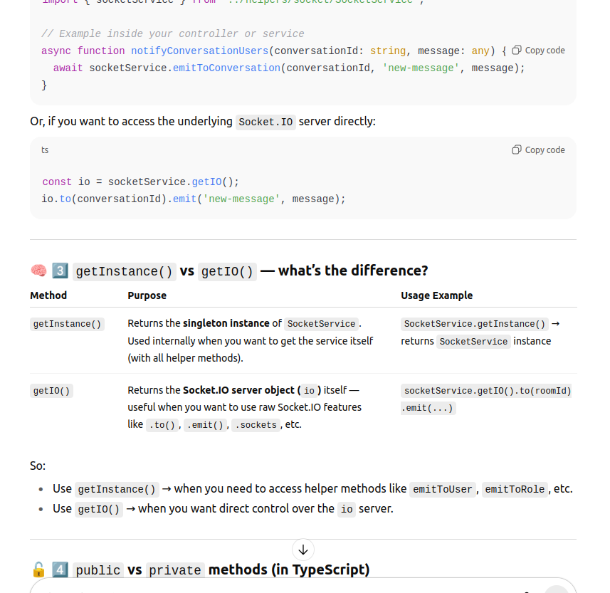
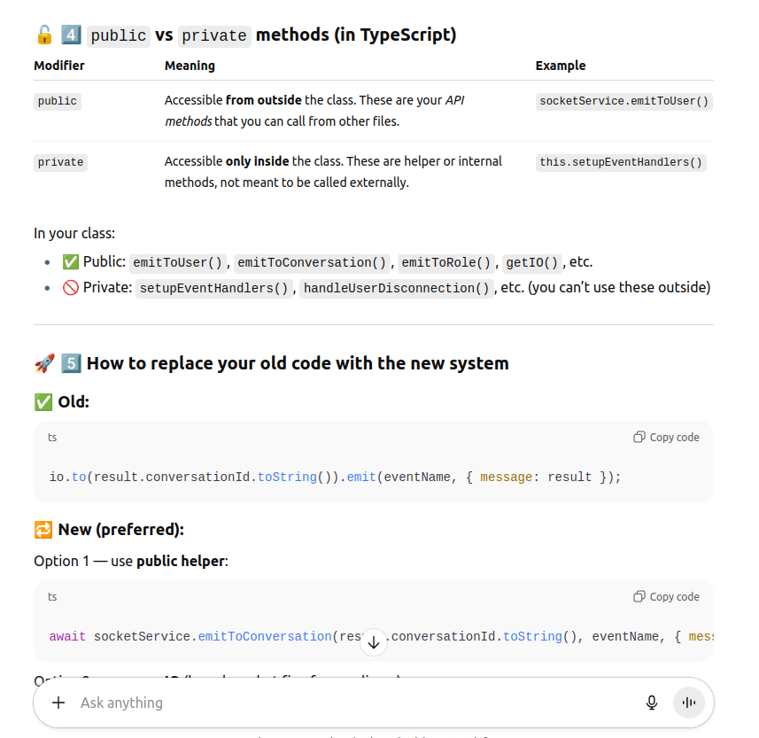
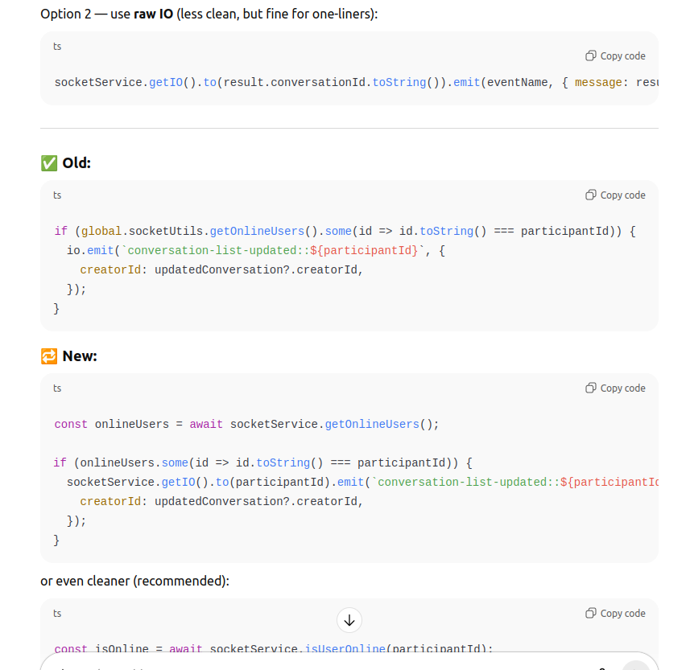

🔁 New (preferred):
Option 1 — use public helper:

await socketService.emitToConversation(result.conversationId.toString(), eventName, { message: result });

Option 2 — use raw IO (less clean, but fine for one-liners):

socketService.getIO().to(result.conversationId.toString()).emit(eventName, { message: result });

------------------------------

✅ Old:
```ts
if (global.socketUtils.getOnlineUsers().some(id => id.toString() === participantId)) {
  io.emit(`conversation-list-updated::${participantId}`, {
    creatorId: updatedConversation?.creatorId,
  });
}
```
🔁 New:

```ts
const onlineUsers = await socketService.getOnlineUsers();

if (onlineUsers.some(id => id.toString() === participantId)) {
  socketService.getIO().to(participantId).emit(`conversation-list-updated::${participantId}`, {
    creatorId: updatedConversation?.creatorId,
  });
}
```
or even cleaner (recommended):
```ts
const isOnline = await socketService.isUserOnline(participantId);
if (isOnline) {
  await socketService.emitToUser(participantId, `conversation-list-updated::${participantId}`, {
    creatorId: updatedConversation?.creatorId,
  });
}

```
