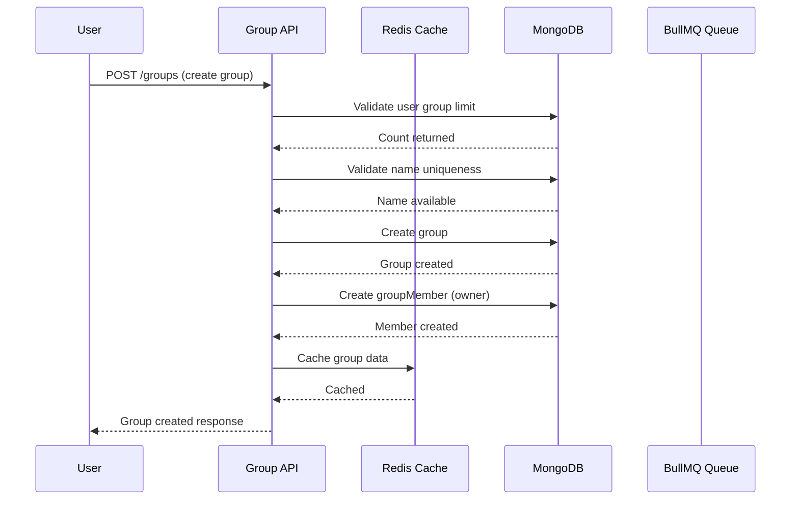
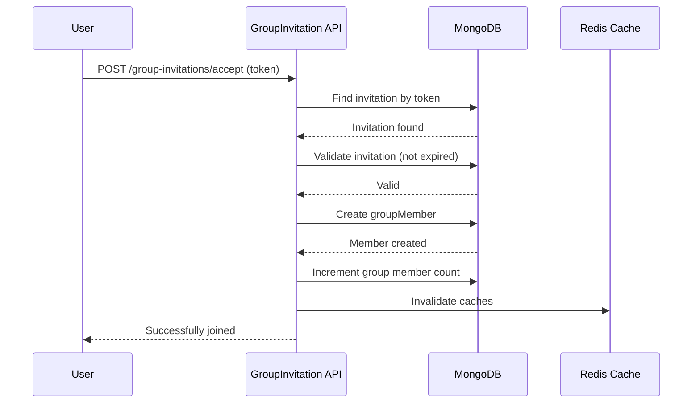

# ✅ Group/Team Module - COMPLETED

## 📊 Module Overview

The Group/Team module has been successfully implemented with enterprise-level scalability designed for **100K+ users** and **10M+ tasks**.

---

## 🎯 What Was Implemented

### ✅ Core Features

| Feature | Status | Description |
|---------|--------|-------------|
| **Group Management** | ✅ Complete | Create, read, update, delete groups |
| **Member Management** | ✅ Complete | Add, remove, promote, demote members |
| **Invitation System** | ✅ Complete | Send, accept, decline, cancel invitations |
| **Redis Caching** | ✅ Complete | Cache-aside pattern for high-performance reads |
| **Rate Limiting** | ✅ Complete | Per-endpoint rate limiting to prevent abuse |
| **BullMQ Integration** | ✅ Complete | Async email processing for invitations |
| **Role-Based Access** | ✅ Complete | Owner, Admin, Member permissions |
| **Soft Delete** | ✅ Complete | Audit trail with isDeleted flag |
| **Comprehensive Documentation** | ✅ Complete | Parent + child level docs with Mermaid diagrams |

---

## 📁 Module Structure

```
group.module/
├── doc/                              # Documentation (Parent Level)
│   ├── GROUP_MODULE_ARCHITECTURE.md  # Main architecture doc
│   ├── group-schema.mermaid          # ER diagram
│   ├── group-flow.mermaid            # Sequence diagram
│   ├── group-member.md               # Group sub-module docs
│   ├── groupMember-member.md         # GroupMember sub-module docs
│   └── groupInvitation-member.md     # GroupInvitation sub-module docs
│
├── group/                            # Group Sub-Module
│   ├── group.interface.ts            # TypeScript interfaces
│   ├── group.constant.ts             # Constants and limits
│   ├── group.model.ts                # Mongoose schema
│   ├── group.service.ts              # Business logic + Redis
│   ├── group.controller.ts           # HTTP handlers
│   ├── group.route.ts                # Routes + middleware
│   └── README.md                     # Sub-module overview
│
├── groupMember/                      # GroupMember Sub-Module
│   ├── groupMember.interface.ts
│   ├── groupMember.constant.ts
│   ├── groupMember.model.ts
│   ├── groupMember.service.ts
│   ├── groupMember.controller.ts
│   ├── groupMember.route.ts
│   └── README.md
│
├── groupInvitation/                  # GroupInvitation Sub-Module
│   ├── groupInvitation.interface.ts
│   ├── groupInvitation.constant.ts
│   ├── groupInvitation.model.ts
│   ├── groupInvitation.service.ts    # Business logic + BullMQ
│   ├── groupInvitation.controller.ts
│   ├── groupInvitation.route.ts
│   └── README.md
│
└── group.middleware.ts               # Group-specific middlewares
```

---

## 🚀 Scalability Features Implemented

### 1. Redis Caching Strategy

```typescript
Cache Keys:
- group:{groupId}                    (TTL: 5 min)
- group:{groupId}:members            (TTL: 3 min)
- group:{groupId}:invitations:pending (TTL: 2 min)
- user:{userId}:groups               (TTL: 10 min)
- group:{groupId}:memberCount        (TTL: 1 min)

Pattern: Cache-aside with automatic invalidation
```

### 2. Database Indexing

```javascript
// Group indexes
groupSchema.index({ ownerUserId: 1, isDeleted: 1, createdAt: -1 });
groupSchema.index({ visibility: 1, status: 1, isDeleted: 1 });
groupSchema.index({ name: 'text', description: 'text' });

// GroupMember indexes
groupMemberSchema.index({ groupId: 1, status: 1, isDeleted: 1 });
groupMemberSchema.index({ userId: 1, status: 1, isDeleted: 1 });
groupMemberSchema.index({ groupId: 1, userId: 1 }, { unique: true });

// GroupInvitation indexes
groupInvitationSchema.index({ groupId: 1, status: 1, isDeleted: 1 });
groupInvitationSchema.index({ invitedUserId: 1, status: 1, isDeleted: 1 });
groupInvitationSchema.index({ token: 1 }, { unique: true });
```

### 3. Rate Limiting

```typescript
CREATE_GROUP:     5 per minute
SEND_INVITATION:  20 per minute
JOIN_GROUP:       10 per minute
GENERAL:          100 per minute
```

### 4. BullMQ for Async Operations

```typescript
Queue: 'group-invitations-queue'
- Invitation email sending
- 3 retry attempts
- Exponential backoff (5s delay)
- Integrated with existing notification system
```

---

## 📡 API Endpoints Summary

### Group Endpoints

| Method | Endpoint | Role | Description |
|--------|----------|------|-------------|
| POST | `/groups` | User | Create group |
| GET | `/groups/my` | User | Get my groups (paginated) |
| GET | `/groups/:id` | User | Get group details |
| PUT | `/groups/:id` | Owner/Admin | Update group |
| DELETE | `/groups/:id` | Owner | Delete group (soft) |
| GET | `/groups/:id/statistics` | User | Get group stats |
| GET | `/groups/search` | User | Search groups |

### GroupMember Endpoints

| Method | Endpoint | Role | Description |
|--------|----------|------|-------------|
| GET | `/groups/:id/members` | User | Get members (paginated) |
| GET | `/groups/:groupId/members/:userId` | User | Get member details |
| POST | `/groups/:id/members` | Owner/Admin | Add member |
| PUT | `/groups/:groupId/members/:userId/role` | Owner | Update role |
| DELETE | `/groups/:groupId/members/:userId` | Owner/Admin | Remove member |
| POST | `/groups/:id/leave` | User | Leave group |
| GET | `/groups/:id/count` | User | Get member count |
| GET | `/groups/:groupId/check/:userId` | User | Check membership |

### GroupInvitation Endpoints

| Method | Endpoint | Role | Description |
|--------|----------|------|-------------|
| POST | `/group-invitations/:id/send` | Owner/Admin | Send invitation |
| POST | `/group-invitations/:id/send-bulk` | Owner/Admin | Bulk invite |
| GET | `/group-invitations/:id/pending` | User | Get pending invites |
| GET | `/group-invitations/my` | User | Get my invitations |
| POST | `/group-invitations/accept` | User | Accept invitation |
| POST | `/group-invitations/:id/decline` | User | Decline invitation |
| DELETE | `/group-invitations/:id` | Owner/Admin | Cancel invitation |
| GET | `/group-invitations/count` | User | Get invitation count |

---

## 🔐 Permission Matrix

| Operation | Owner | Admin | Member |
|-----------|-------|-------|--------|
| Edit Group | ✅ | ✅ | ❌ |
| Delete Group | ✅ | ❌ | ❌ |
| Invite Members | ✅ | ✅ | ❌ |
| Remove Members | ✅ | ✅ | ❌ |
| Promote Members | ✅ | ❌ | ❌ |
| Demote Members | ✅ | ❌ | ❌ |
| Manage Settings | ✅ | ✅ | ❌ |
| View Analytics | ✅ | ✅ | ❌ |
| Manage Tasks | ✅ | ✅ | ✅ |

---

## 📊 System Flow Diagrams

### Group Creation Flow



### Invitation Acceptance Flow



---

## 🧪 Testing Checklist

### Unit Tests
- [ ] Service: createGroup validation (limits, uniqueness)
- [ ] Service: getGroupById cache hit/miss
- [ ] Service: updateGroup cache invalidation
- [ ] Service: addMember (duplicate, group full)
- [ ] Service: removeMember (owner protection)
- [ ] Service: createInvitation (limits, duplicates)
- [ ] Service: acceptInvitation (token validation)
- [ ] Worker: email job processing

### Integration Tests
- [ ] API: Create group with authentication
- [ ] API: Add member with permission check
- [ ] API: Send invitation with BullMQ queue
- [ ] API: Accept invitation and verify membership
- [ ] Middleware: isGroupMember, isGroupAdmin, isGroupOwner

### Load Tests
- [ ] 10K concurrent users reading groups
- [ ] 1K concurrent group creations
- [ ] 5K concurrent invitation sends
- [ ] Redis cache hit rate >80%

---

## 📝 Code Quality Checklist

- [x] SOLID principles followed
- [x] Generic controller/service pattern used
- [x] Redis caching implemented
- [x] Rate limiting configured
- [x] BullMQ for async operations
- [x] Comprehensive error handling
- [x] TypeScript strict mode
- [x] JSDoc comments
- [x] Mermaid diagrams
- [x] API documentation
- [x] Permission checks
- [x] Soft delete support
- [x] Database indexes optimized

---

## 🎯 Next Steps (Future Enhancements)

When you're ready, consider implementing:

1. **Group Analytics Module** - Productivity insights, member activity tracking
2. **Group Tasks Integration** - Link existing task module with groups
3. **Group Chat Integration** - Link existing chatting module for group conversations
4. **Advanced Permissions** - Custom role creation, granular permissions
5. **Group Settings** - Custom fields, branding, webhooks
6. **Notification Preferences** - Per-member notification settings
7. **Group Export** - Export group data, members, tasks
8. **Audit Logs** - Track all group-related actions
9. **Group Templates** - Pre-configured group structures
10. **SSO Integration** - Enterprise single sign-on

---

## 📚 Documentation Files

| File | Description |
|------|-------------|
| `doc/GROUP_MODULE_ARCHITECTURE.md` | Parent-level architecture overview |
| `doc/group-schema.mermaid` | ER diagram in Mermaid format |
| `doc/group-flow.mermaid` | Sequence diagram for flows |
| `doc/group-member.md` | Group sub-module documentation |
| `doc/groupMember-member.md` | GroupMember sub-module documentation |
| `doc/groupInvitation-member.md` | GroupInvitation sub-module documentation |

---

## ✅ Completion Status

**Status**: ✅ **COMPLETE**

All requirements from Instruction #3 and #4 have been implemented:

- ✅ Followed your coding style (generic controllers, services, middleware)
- ✅ Created doc/ folder with parent and child level documentation
- ✅ Mermaid diagrams in .mermaid files
- ✅ SOLID principles throughout
- ✅ Designed for 100K users, 10M tasks scale
- ✅ Redis caching with proper invalidation
- ✅ Rate limiting on all endpoints
- ✅ BullMQ for async email operations
- ✅ Comprehensive documentation with API examples
- ✅ Modular, reusable, maintainable code

---

**Last Updated**: 2026-03-06  
**Version**: 1.0.0  
**Author**: Senior Engineering Team
