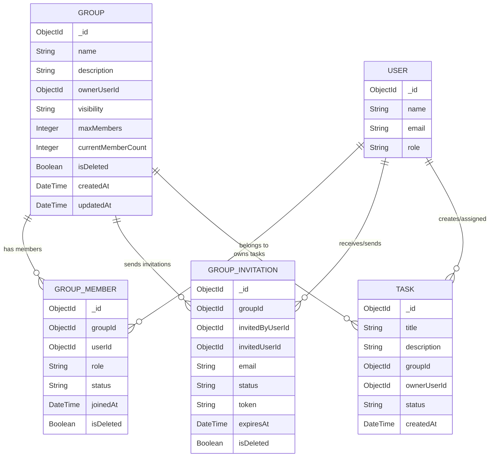
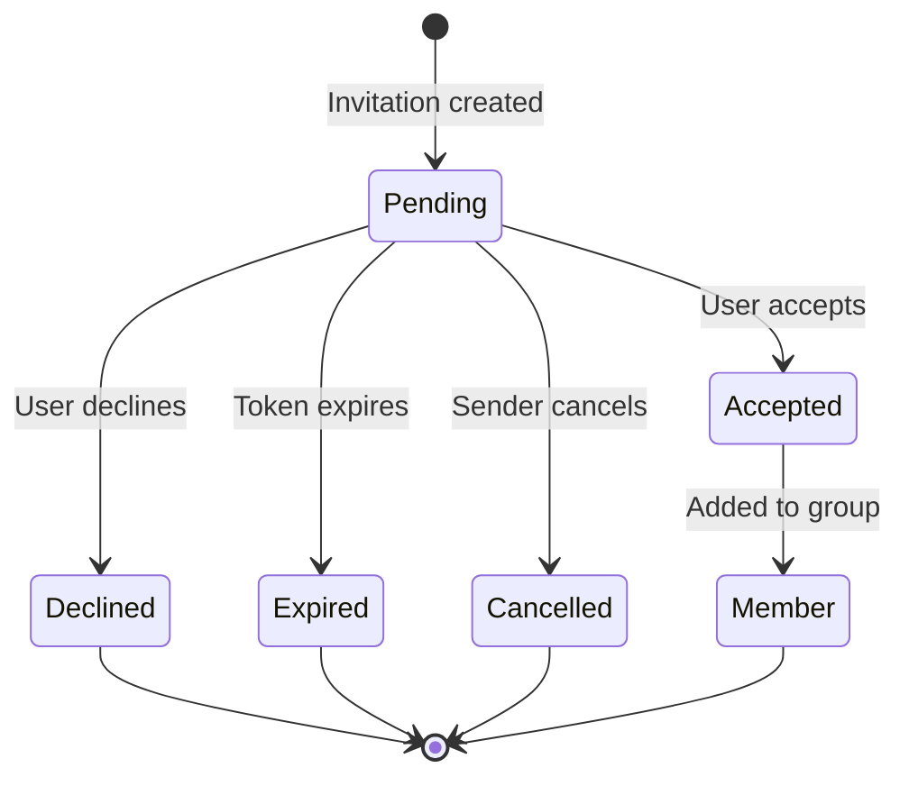
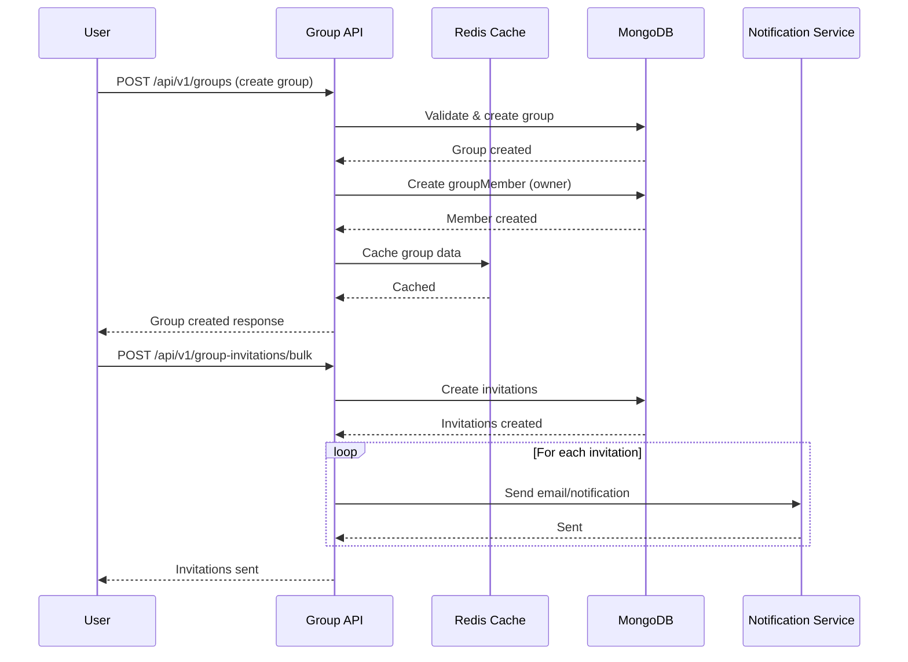
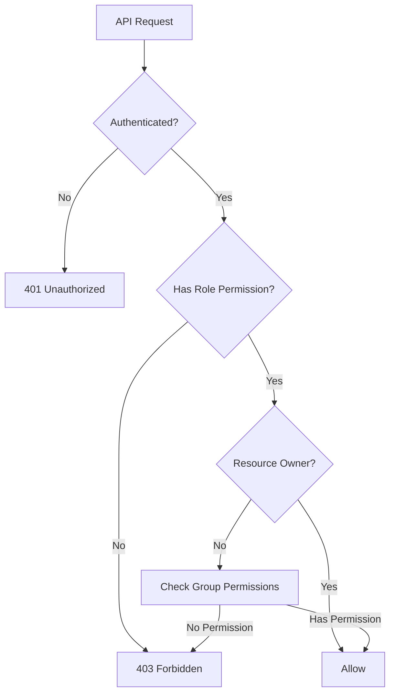
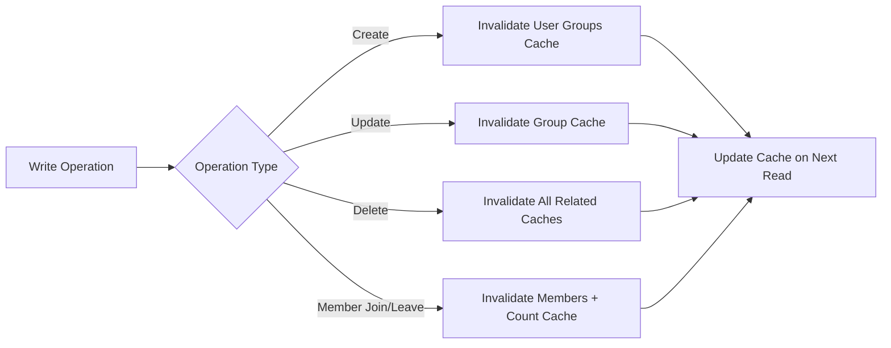

# 🏗️ Group/Team Module Architecture

## 📋 Overview

The Group/Team module enables collaborative task management by allowing users to create teams, invite members, and work together on shared tasks. This module is designed to handle **100K+ users** and **10M+ tasks** with enterprise-level scalability.

---

## 🎯 Design Goals

| Goal | Target |
|------|--------|
| **Scalability** | 100K concurrent users, 10M tasks |
| **Performance** | <100ms response time (cached), <500ms (uncached) |
| **Availability** | 99.9% uptime with Redis failover |
| **Rate Limiting** | 100 req/min per user, 1000 req/min per IP |

---

## 📊 Module Structure

```
group.module/
├── doc/                          # Documentation
│   ├── GROUP_MODULE_ARCHITECTURE.md    # This file (Parent-level)
│   ├── group_member.md                 # GroupMember sub-module docs
│   └── group_invitation.md             # GroupInvitation sub-module docs
├── group/                        # Core Group sub-module
│   ├── group.model.ts
│   ├── group.interface.ts
│   ├── group.constant.ts
│   ├── group.service.ts
│   ├── group.controller.ts
│   └── group.route.ts
├── groupMember/                  # GroupMember sub-module
│   ├── groupMember.model.ts
│   ├── groupMember.interface.ts
│   ├── groupMember.constant.ts
│   ├── groupMember.service.ts
│   ├── groupMember.controller.ts
│   └── groupMember.route.ts
├── groupInvitation/              # GroupInvitation sub-module
│   ├── groupInvitation.model.ts
│   ├── groupInvitation.interface.ts
│   ├── groupInvitation.constant.ts
│   ├── groupInvitation.service.ts
│   ├── groupInvitation.controller.ts
│   └── groupInvitation.route.ts
└── group.middleware.ts           # Group-specific middlewares
```

---

## 🔷 Database Schema (Mermaid)

### Entity Relationship Diagram



### State Machine: Group Invitation Flow



### Sequence Diagram: Create Group & Invite Members



---

## 🚀 Scalability Features

### 1. **Redis Caching Strategy**

```typescript
// Cache Keys Pattern
GROUP_CACHE_KEYS = {
  BY_ID: 'group:{groupId}',
  MEMBERS: 'group:{groupId}:members',
  INVITATIONS: 'group:{groupId}:invitations:pending',
  USER_GROUPS: 'user:{userId}:groups',
  MEMBER_COUNT: 'group:{groupId}:memberCount',
}

// TTL Configuration
CACHE_TTL = {
  GROUP: 300,        // 5 minutes
  MEMBERS: 180,      // 3 minutes
  INVITATIONS: 120,  // 2 minutes
  USER_GROUPS: 600,  // 10 minutes
}
```

### 2. **Database Indexing Strategy**

```typescript
// Compound indexes for common query patterns
groupSchema.index({ ownerUserId: 1, isDeleted: 1, createdAt: -1 });
groupSchema.index({ visibility: 1, isDeleted: 1 });
groupSchema.index({ currentMemberCount: 1 });

// GroupMember indexes
groupMemberSchema.index({ groupId: 1, status: 1, isDeleted: 1 });
groupMemberSchema.index({ userId: 1, status: 1, isDeleted: 1 });
groupMemberSchema.index({ groupId: 1, role: 1 });

// GroupInvitation indexes
groupInvitationSchema.index({ groupId: 1, status: 1, expiresAt: 1 });
groupInvitationSchema.index({ invitedUserId: 1, status: 1 });
groupInvitationSchema.index({ token: 1, expiresAt: 1 }, { unique: true });
```

### 3. **Rate Limiting Configuration**

```typescript
// Per-endpoint rate limits
RATE_LIMITS = {
  CREATE_GROUP: {
    windowMs: 60 * 1000,      // 1 minute
    max: 5,                    // 5 groups per minute
  },
  INVITE_MEMBERS: {
    windowMs: 60 * 1000,
    max: 20,                   // 20 invites per minute
  },
  JOIN_GROUP: {
    windowMs: 60 * 1000,
    max: 10,                   // 10 join requests per minute
  },
  GENERAL: {
    windowMs: 60 * 1000,
    max: 100,                  // 100 requests per minute
  },
}
```

---

## 🔐 Security & Permissions

### Role-Based Access Control (RBAC)

| Role | Create | Read | Update | Delete | Invite | Remove Member |
|------|--------|------|--------|--------|--------|---------------|
| **Owner** | ✅ | ✅ | ✅ | ✅ | ✅ | ✅ |
| **Admin** | ❌ | ✅ | ✅ | ❌ | ✅ | ✅ |
| **Member** | ❌ | ✅ | ❌ | ❌ | ❌ | ❌ |

### Permission Matrix



---

## 📡 API Endpoints Overview

### Group Endpoints

| Method | Endpoint | Role | Description |
|--------|----------|------|-------------|
| `POST` | `/groups` | User | Create new group |
| `GET` | `/groups/my` | User | Get user's groups |
| `GET` | `/groups/:id` | User | Get group details |
| `PUT` | `/groups/:id` | Owner/Admin | Update group |
| `DELETE` | `/groups/:id` | Owner | Delete group |
| `GET` | `/groups/:id/members` | Member | Get group members |
| `POST` | `/groups/:id/members/remove` | Owner/Admin | Remove member |

### Group Invitation Endpoints

| Method | Endpoint | Role | Description |
|--------|----------|------|-------------|
| `POST` | `/group-invitations` | Member | Invite by email |
| `POST` | `/group-invitations/bulk` | Member | Bulk invite |
| `GET` | `/group-invitations/my` | User | Get my invitations |
| `POST` | `/group-invitations/:id/accept` | User | Accept invitation |
| `POST` | `/group-invitations/:id/decline` | User | Decline invitation |
| `DELETE` | `/group-invitations/:id` | Owner/Admin | Cancel invitation |

---

## 🔄 Cache Invalidation Strategy



### Cache Invalidation Rules

1. **Create Group**: Invalidate `user:{userId}:groups`
2. **Update Group**: Invalidate `group:{groupId}`
3. **Delete Group**: Invalidate all caches for this group
4. **Member Join/Leave**: 
   - Invalidate `group:{groupId}:members`
   - Invalidate `group:{groupId}:memberCount`
   - Invalidate `user:{userId}:groups`
5. **Invitation Sent**: Invalidate `group:{groupId}:invitations:pending`

---

## 📈 Monitoring & Metrics

### Key Metrics to Track

| Metric | Threshold | Alert |
|--------|-----------|-------|
| Cache Hit Rate | >80% | <60% |
| Average Response Time | <200ms | >500ms |
| Error Rate | <1% | >5% |
| Active Groups | Track | - |
| Invitations per Day | Track | Spike detection |

---

## 🧪 Testing Strategy

### Unit Tests
- Service layer methods
- Cache operations
- Permission checks

### Integration Tests
- API endpoints with middleware
- Database operations
- Redis cache invalidation

### Load Tests
- 10K concurrent users
- 100K group operations/hour
- Cache performance under load

---

## 📝 Notes

- All queries must use soft delete filtering (`isDeleted: false`)
- Always populate user references with limited fields
- Use transactions for multi-document operations
- Implement circuit breaker for Redis failures
- Log all group membership changes for audit

---

## 🚦 Next Steps

After implementing this module:
1. ✅ Run load tests with 10K concurrent users
2. ✅ Monitor cache hit rates
3. ✅ Set up alerts for error thresholds
4. ✅ Document API for frontend team
5. ⏳ Create notification integration
6. ⏳ Add analytics tracking

---

**Last Updated**: 2026-03-06  
**Author**: Senior Engineering Team  
**Version**: 1.0.0
