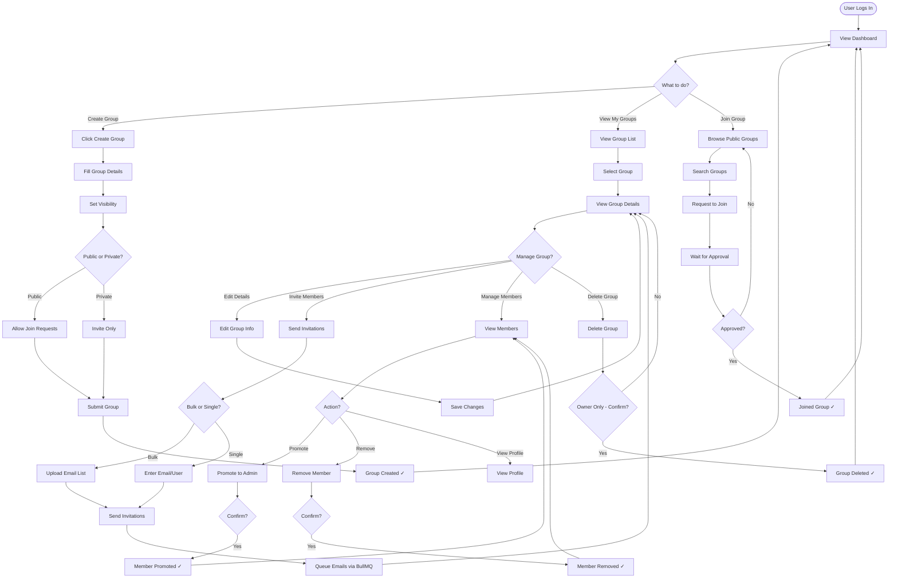
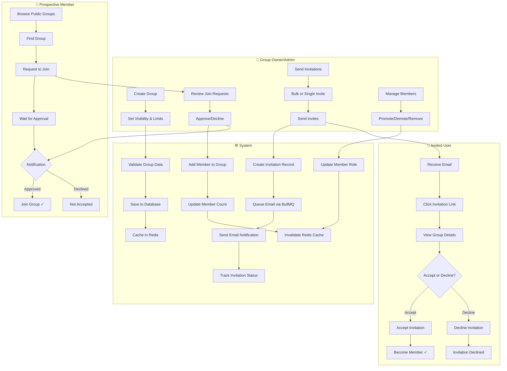
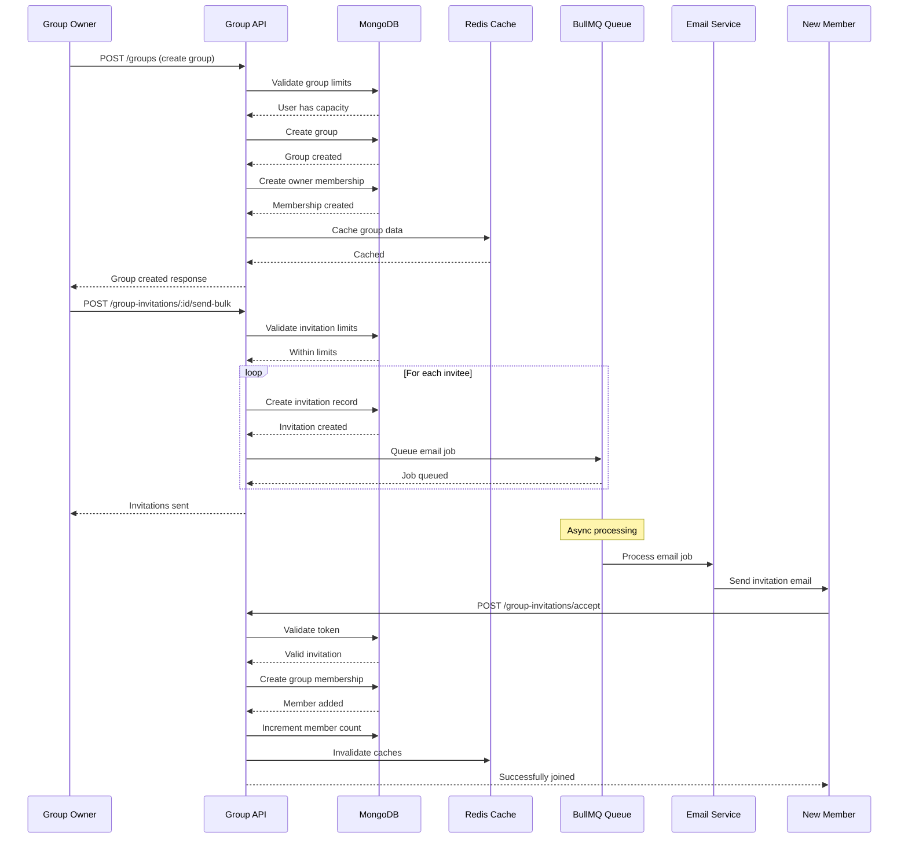
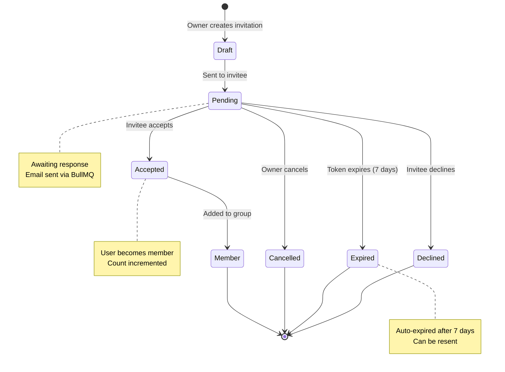
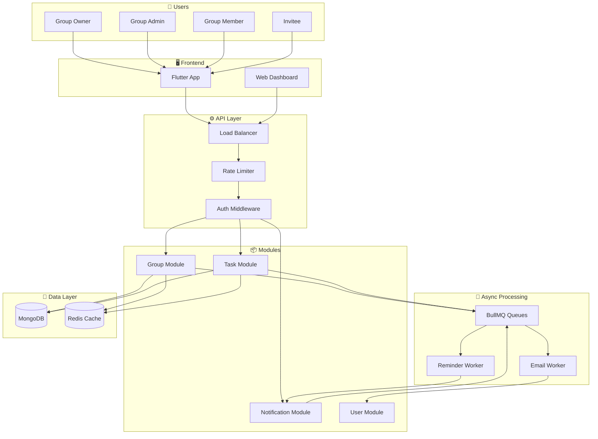
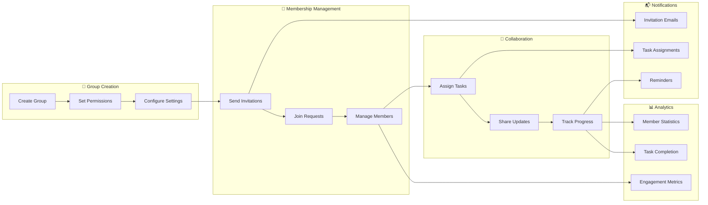
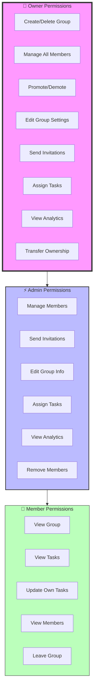
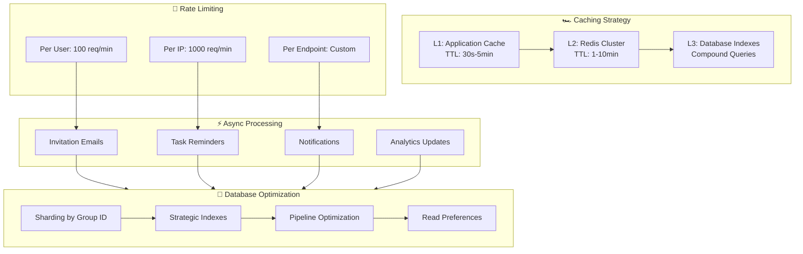

# 📊 Group Module - Comprehensive Diagrams

## Module Level Diagrams

---

## 1. User Journey Map: Group Creation to Collaboration

```
┌─────────────────────────────────────────────────────────────────────────────────────────────────────────┐
│                                  USER JOURNEY: GROUP LIFECYCLE                                         │
├──────────────┬──────────────┬──────────────┬──────────────┬──────────────┬──────────────┬─────────────┤
│   PHASE      │   AWARENESS  │   CREATION   │  INVITATION  │  COLLABORATE │  MANAGEMENT  │   GROWTH    │
├──────────────┼──────────────┼──────────────┼──────────────┼──────────────┼──────────────┼─────────────┤
│              │              │              │              │              │              │             │
│  User        │  Identifies  │  Creates     │  Invites     │  Assigns     │  Monitors    │  Scales     │
│  Actions     │  need for    │  group with  │  team        │  tasks to    │  progress    │  team or    │
│              │  team        │  details     │  members     │  group       │  manages     │  archives   │
│              │              │              │              │              │  members     │             │
│              │              │              │              │              │              │             │
│  Touchpoints │  Dashboard   │  Group       │  Invitation  │  Task        │  Member      │  Analytics  │
│              │  Search      │  Creation    │  Interface   │  Assignment  │  Management  │  Dashboard  │
│              │              │  Form        │              │  Page        │  Panel       │              │
│              │              │              │              │              │              │             │
│  Emotions    │  🤔          │  😊          │  🤞          │  🤝          │  😌          │  😁         │
│              │  Thinking    │  Excited     │  Hopeful     │  Collaborative│  Satisfied  │  Proud      │
│              │              │              │              │              │              │              │
│  Pain Points │  Can't find  │  Complex     │  Members     │  Confusion   │  Too many    │  Losing     │
│  & Solutions │  right people│  setup       │  don't join  │  over roles  │  requests    │  history    │
│              │  Search      │  Templates   │  Auto-       │  Clear       │  Bulk        │  Export     │
│              │  & Discover  │  & Guides    │  reminders   │  permissions │  operations  │  & Archive  │
│              │              │              │              │              │              │              │
│  System      │  Group       │  Validation  │  Email       │  Role-based  │  Analytics   │  Data       │
│  Support     │  Discovery   │  & Limits    │  Invites     │  Access      │  Dashboard   │  Retention  │
│              │              │              │  BullMQ      │  Control     │  Reports     │  Policies   │
└──────────────┴──────────────┴──────────────┴──────────────┴──────────────┴──────────────┴─────────────┘
```

---

## 2. User Flow Diagram: Group Management



---

## 3. Swimlane Diagram: Group Invitation & Membership Flow



---

## 4. Sequence Diagram: Group Creation with Member Invitation



---

## 5. State Machine: Group Invitation Flow



---

## Parent Module Level (group.module)

---

## 6. Component Architecture: Group Module

```mermaid
graph TB
    subgraph group_module["📦 group.module"]
        subgraph group["Group Sub-Module"]
            GroupModel[Group Model]
            GroupService[Group Service]
            GroupController[Group Controller]
            GroupRoutes[Group Routes]
        end
        
        subgraph groupMember["GroupMember Sub-Module"]
            MemberModel[Member Model]
            MemberService[Member Service]
            MemberController[Member Controller]
            MemberRoutes[Member Routes]
        end
        
        subgraph groupInvitation["GroupInvitation Sub-Module"]
            InvitationModel[Invitation Model]
            InvitationService[Invitation Service]
            InvitationController[Invitation Controller]
            InvitationRoutes[Invitation Routes]
        end
        
        subgraph middlewares["Middlewares"]
            IsGroupMember[isGroupMember]
            IsGroupAdmin[isGroupAdmin]
            IsGroupOwner[isGroupOwner]
            HasPermission[hasPermission]
        end
        
        subgraph doc["Documentation"]
            GroupDocs[Group Docs]
            GroupDiagrams[Group Diagrams]
        end
    end
    
    subgraph external["External Dependencies"]
        Auth[Auth Module]
        User[User Module]
        Notification[Notification Module]
        Task[Task Module]
    end
    
    GroupController --> GroupService
    GroupService --> GroupModel
    MemberController --> MemberService
    MemberService --> MemberModel
    InvitationController --> InvitationService
    InvitationService --> InvitationModel
    
    GroupService --> Auth
    GroupService --> User
    GroupService --> Notification
    
    InvitationService --> Notification
    InvitationService --> BullMQ[BullMQ Queue]
    
    GroupRoutes --> IsGroupMember
    GroupRoutes --> IsGroupAdmin
    GroupRoutes --> IsGroupOwner
    GroupRoutes --> HasPermission
    
    MemberService --> Task
```



---

## Project Level Diagrams

---

## 7. System Architecture: Group & Task Management Integration



---

## 8. Data Flow: Group Collaboration Workflow



---

## 9. Permission Matrix: Group Roles & Capabilities



---

## 10. Scalability Architecture: 100K Users Design



---

**Last Updated**: 2026-03-06  
**Version**: 1.0.0
