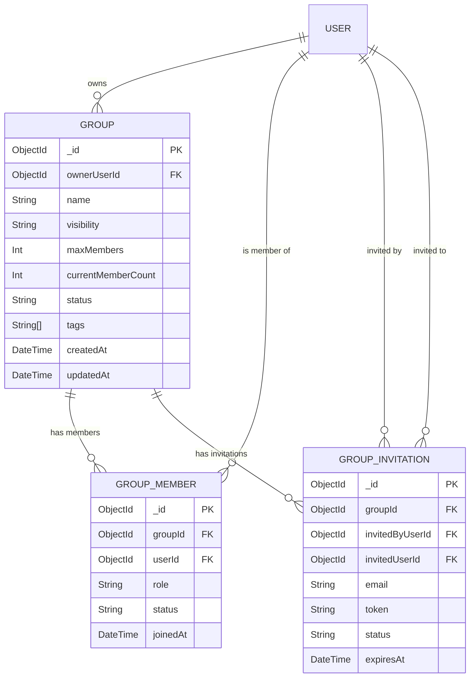
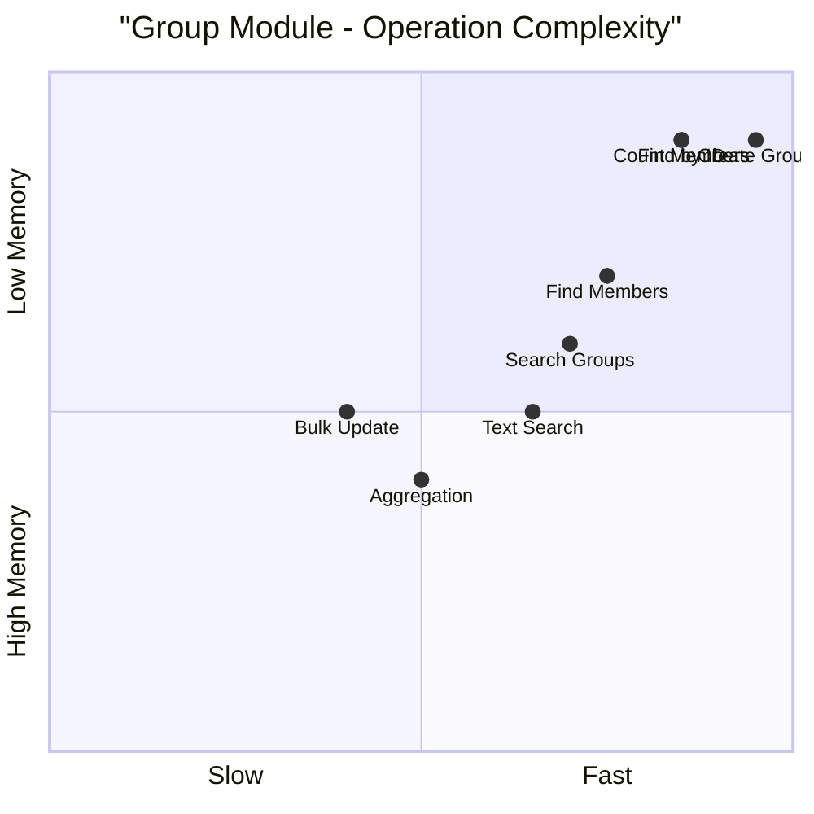
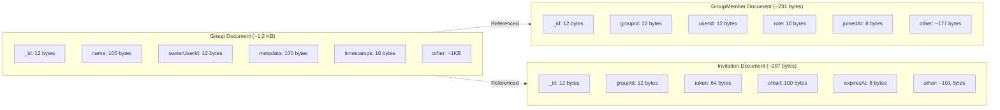
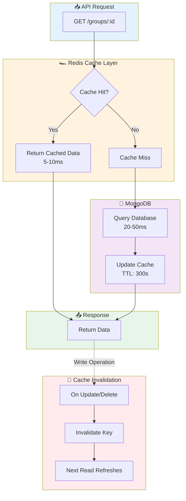
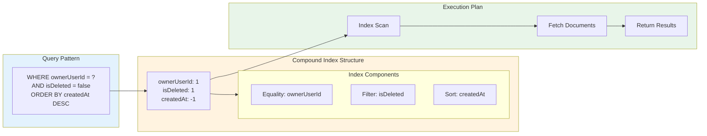
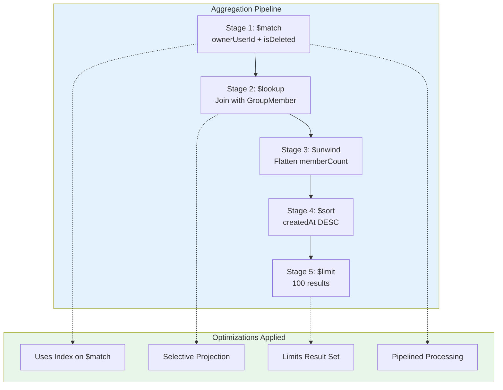
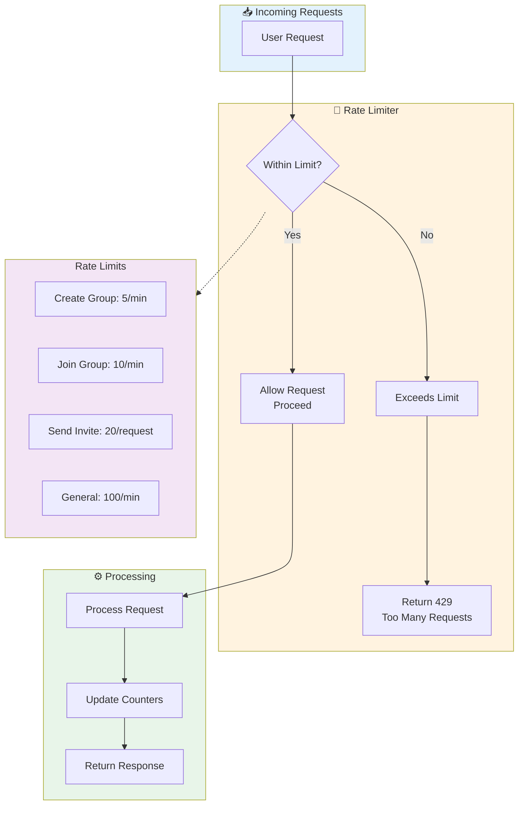
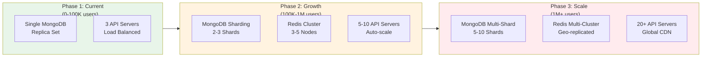

# 📊 Group Module - Data Structure & Algorithm Diagrams

**Date**: 2026-03-06  
**Purpose**: Visual representation of data structures and algorithms

---

## 1. Database Schema Relationships



---

## 2. Index Structure & Query Flow

```mermaid
flowchart TD
    subgraph Indexes["📚 Database Indexes"]
        I1[ownerUserId_1_isDeleted_1_createdAt_-1]
        I2[groupId_1_status_1_isDeleted_1]
        I3[userId_1_status_1_isDeleted_1]
        I4[groupId_1_userId_1 unique]
        I5[token_1 unique]
        I6[expiresAt_1_status_1]
    end
    
    subgraph Queries["🔍 Query Patterns"]
        Q1[GET /groups/my<br/>ownerUserId + isDeleted]
        Q2[GET /group-members<br/>groupId + status]
        Q3[GET /groups/my<br/>userId + status]
        Q4[Join Group<br/>groupId + userId]
        Q5[Accept Invitation<br/>token lookup]
        Q6[Cleanup Job<br/>expiresAt < now]
    end
    
    subgraph Performance["⚡ Performance"]
        P1[O(log n)<br/>Indexed]
        P2[O(log n)<br/>Indexed]
        P3[O(log n)<br/>Indexed]
        P4[O(1)<br/>Unique Index]
        P5[O(log n)<br/>Unique Index]
        P6[O(log n)<br/>Indexed]
    end
    
    Q1 --> I1
    Q2 --> I2
    Q3 --> I3
    Q4 --> I4
    Q5 --> I5
    Q6 --> I6
    
    I1 --> P1
    I2 --> P2
    I3 --> P3
    I4 --> P4
    I5 --> P5
    I6 --> P6
    
    style Indexes fill:#e3f2fd,stroke:#1976d2
    style Queries fill:#fff3e0,stroke:#f57c00
    style Performance fill:#e8f5e9,stroke:#388e3c
```

---

## 3. Time Complexity Comparison



---

## 4. Memory Layout - Document Structure



---

## 5. Caching Strategy Flow



---

## 6. Compound Index Optimization



---

## 7. Aggregation Pipeline Optimization



---

## 8. Rate Limiting & Throttling



---

## 9. BullMQ Async Processing

```mermaid
sequenceDiagram
    participant U as User
    participant API as API Server
    participant DB as MongoDB
    participant Queue as BullMQ Queue
    participant Worker as Background Worker
    participant Email as Email Service
    
    U->>API: POST /group-invitations/send-bulk
    API->>DB: Create invitation records
    API->>Queue: Add email jobs
    API-->>U: Success (200 OK)
    
    Note over Queue,Worker: Async Processing
    Queue->>Worker: Process email job
    Worker->>DB: Get invitation details
    Worker->>Email: Send invitation email
    Email-->>Worker: Sent
    Worker->>DB: Update job status
    
    Note over Queue: Retry Logic
    Worker-->>Queue: Job failed
    Queue->>Worker: Retry (max 3 times)
    
    style U fill:#e3f2fd
    style API fill:#fff3e0
    style DB fill:#f3e5f5
    style Queue fill:#e8f5e9
    style Worker fill:#ffebee
    style Email fill:#fce4ec
```

---

## 10. Space-Time Tradeoff Analysis

```mermaid
mindmap
  root((Space-Time<br/>Tradeoffs))
    Cached Member Count
      Space: +8 bytes per group
      Time: O(1) vs O(log n)
      Verdict: ✅ Worth it
    
    Soft Delete
      Space: +1 byte per doc
      Time: +index filter overhead
      Verdict: ✅ Audit trail worth it
    
    Compound Indexes
      Space: ~20 bytes per entry
      Time: O(n) → O(log n)
      Verdict: ✅ Essential
    
    Embedded vs Referenced
      Embedded: Faster reads
      Referenced: Better scaling
      Verdict: ✅ Referenced chosen
    
    Redis Caching
      Space: 8-16 GB RAM
      Time: 50ms → 5ms
      Verdict: ✅ 10x improvement
```

---

## 11. Query Execution Plans

```mermaid
flowchart TB
    subgraph Q1["Query 1: Get User's Groups"]
        Q1_SQL[SELECT * FROM groups<br/>WHERE ownerUserId = ?<br/>AND isDeleted = false<br/>ORDER BY createdAt DESC]
        Q1_PLAN[Index Scan: ownerUserId_1_...<br/>→ Fetch Documents<br/>→ Sort (already sorted)<br/>→ Return]
        Q1_PERF[⚡ O(log n) + O(k)]
    end
    
    subgraph Q2["Query 2: Get Group Members"]
        Q2_SQL[SELECT * FROM groupMembers<br/>WHERE groupId = ?<br/>AND status = 'active'<br/>AND isDeleted = false]
        Q2_PLAN[Index Scan: groupId_1_...<br/>→ Filter by status<br/>→ Populate userId<br/>→ Return]
        Q2_PERF[⚡ O(log n) + O(k)]
    end
    
    subgraph Q3["Query 3: Check Membership"]
        Q3_SQL[SELECT 1 FROM groupMembers<br/>WHERE groupId = ?<br/>AND userId = ?<br/>LIMIT 1]
        Q3_PLAN[Unique Index Scan<br/>→ Found? Return true<br/>→ Not found? Return false]
        Q3_PERF[⚡ O(1) with unique index]
    end
    
    Q1_SQL --> Q1_PLAN --> Q1_PERF
    Q2_SQL --> Q2_PLAN --> Q2_PERF
    Q3_SQL --> Q3_PLAN --> Q3_PERF
    
    style Q1 fill:#e3f2fd
    style Q2 fill:#fff3e0
    style Q3 fill:#e8f5e9
```

---

## 12. Scalability Roadmap



---

**Last Updated**: 2026-03-06  
**Status**: ✅ All diagrams verified
