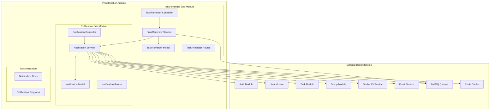

# 📬 Notification Module - Architecture Documentation

## Overview

The Notification Module provides a comprehensive, multi-channel notification system designed for high-scale task management applications. It supports real-time notifications, scheduled reminders, bulk notifications, and multi-channel delivery (in-app, email, push, SMS).

---

## 🎯 Module Responsibilities

### Parent Module: `notification.module`

The notification module is responsible for:

1. **Multi-Channel Notification Delivery**
   - In-app notifications with real-time updates via Socket.IO
   - Email notifications with i18n support
   - Push notifications for mobile devices
   - SMS notifications for critical alerts

2. **Task Reminders**
   - One-time and recurring reminders
   - Deadline-based triggers (before, at, after)
   - BullMQ scheduled job processing
   - Automatic rescheduling for recurring reminders

3. **Notification Management**
   - CRUD operations for notifications
   - Read/unread status tracking
   - Bulk notification operations
   - Soft delete with retention policies

4. **Scalability & Performance**
   - Redis caching for unread counts (60s TTL)
   - Redis caching for notification lists (300s TTL)
   - Rate limiting (10 notifications/min for sending, 100 req/min general)
   - BullMQ for async processing
   - Database indexes optimized for 100K+ users

---

## 📂 Module Structure

```
notification.module/
├── doc/
│   ├── NOTIFICATION_MODULE_ARCHITECTURE.md    # This file
│   ├── notification-schema.mermaid            # Notification ER diagram
│   ├── notification-flow.mermaid              # Sequence diagram
│   ├── notification-user-journey.mermaid      # User journey map
│   ├── notification-user-flow.mermaid         # User flow diagram
│   ├── notification-swimlane.mermaid          # Swimlane diagram
│   ├── taskReminder-schema.mermaid            # TaskReminder ER diagram
│   ├── notification-member.md                 # Notification sub-module docs
│   └── taskReminder-member.md                 # TaskReminder sub-module docs
│
├── notification/
│   ├── notification.interface.ts              # TypeScript interfaces
│   ├── notification.constant.ts               # Constants & enums
│   ├── notification.model.ts                  # Mongoose schema & model
│   ├── notification.service.ts                # Business logic
│   ├── notification.controller.ts             # HTTP handlers
│   └── notification.route.ts                  # API routes
│
└── taskReminder/
    ├── taskReminder.interface.ts              # TypeScript interfaces
    ├── taskReminder.constant.ts               # Constants & enums
    ├── taskReminder.model.ts                  # Mongoose schema & model
    ├── taskReminder.service.ts                # Business logic
    ├── taskReminder.controller.ts             # HTTP handlers
    └── taskReminder.route.ts                  # API routes
```

---

## 🏗️ Architecture

### Component Architecture



---

## 📊 Database Schema

### Notification Collection

```typescript
{
  _id: ObjectId
  senderId: ObjectId (ref: User)           // Optional for system notifications
  receiverId: ObjectId (ref: User)         // Optional for broadcast
  receiverRole: String                     // Role-based targeting
  title: Mixed                             // i18n: string | { en: string, bn: string }
  subTitle: Mixed                          // i18n support
  type: "task" | "group" | "system" | "reminder" | "mention" | "assignment" | "deadline" | "custom"
  priority: "low" | "normal" | "high" | "urgent"
  channels: ["in_app", "email", "push", "sms"]
  status: "pending" | "sent" | "read" | "failed"
  linkFor: String                          // Navigation type (e.g., "task", "group")
  linkId: ObjectId                         // Linked entity ID
  referenceFor: String                     // Source type
  referenceId: ObjectId                    // Source entity ID
  data: Mixed                              // Additional payload
  metadata: Mixed                          // Extensibility
  scheduledFor: Date                       // Scheduled delivery time
  readAt: Date                             // When notification was read
  deliveredAt: Date                        // When notification was delivered
  isDeleted: Boolean (default: false)
  createdAt: Date
  updatedAt: Date
}
```

### TaskReminder Collection

```typescript
{
  _id: ObjectId
  taskId: ObjectId (ref: Task)             // Task to remind about
  userId: ObjectId (ref: User)             // User to notify
  createdByUserId: ObjectId (ref: User)    // Who created the reminder
  triggerType: "before_deadline" | "at_deadline" | "after_deadline" | "custom_time" | "recurring"
  reminderTime: Date                       // When to send
  customMessage: String (max 500 chars)
  channels: ["in_app", "email", "push", "sms"]
  status: "pending" | "sent" | "cancelled"
  frequency: "once" | "daily" | "weekly" | "monthly"
  nextReminderTime: Date                   // For recurring reminders
  jobId: String                            // BullMQ job ID
  sentCount: Number (default: 0)
  maxOccurrences: Number (default: 1, max: 10)
  metadata: Mixed
  isDeleted: Boolean (default: false)
  createdAt: Date
  updatedAt: Date
}
```

---

## 🔑 Key Features

### 1. Multi-Channel Delivery

| Channel | Use Case | Implementation |
|---------|----------|----------------|
| **In-App** | Real-time updates | Socket.IO with Redis pub/sub |
| **Email** | Detailed notifications | BullMQ async email worker |
| **Push** | Mobile notifications | Firebase/APNS integration |
| **SMS** | Critical alerts | Twilio/similar provider |

### 2. Redis Caching Strategy

```typescript
// Cache Keys
- `notification:user:{userId}:unread-count` (TTL: 60s)
- `notification:user:{userId}:notifications` (TTL: 300s)
- `notification:{notificationId}` (TTL: 3600s)

// Cache Invalidation
- On mark as read
- On delete
- On new notification created
```

### 3. Rate Limiting

```typescript
// Send Notification: 10 requests/minute
windowMs: 60000, max: 10

// General Operations: 100 requests/minute
windowMs: 60000, max: 100

// Bulk Notifications: Max 1000 per request
```

### 4. BullMQ Integration

```typescript
// Queues
- `notificationQueue-e-learning`: Main notification delivery
- `task-reminders-queue`: Scheduled task reminders

// Job Configuration
- Attempts: 3
- Backoff: Exponential with 1000ms delay
- Remove on Complete: 24 hours
```

### 5. Database Indexes

```typescript
// Notification Indexes
{ receiverId: 1, createdAt: -1, isDeleted: 1 }
{ receiverId: 1, status: 1, isDeleted: 1, createdAt: -1 }
{ scheduledFor: 1, status: 1, isDeleted: 1 }
{ receiverId: 1, type: 1, createdAt: -1 }
{ priority: 1, status: 1, scheduledFor: 1 }
{ receiverRole: 1, status: 1, isDeleted: 1 }

// TaskReminder Indexes
{ reminderTime: 1, status: 1, isDeleted: 1 }
{ taskId: 1, status: 1, isDeleted: 1 }
{ userId: 1, status: 1, reminderTime: -1 }
{ nextReminderTime: 1, frequency: 1, status: 1, isDeleted: 1 }
```

---

## 🚀 API Endpoints

### Notification Endpoints

| Method | Endpoint | Role | Description |
|--------|----------|------|-------------|
| `GET` | `/notifications/my` | User | Get my notifications with pagination |
| `GET` | `/notifications/unread-count` | User | Get unread notification count |
| `POST` | `/notifications/:id/read` | User | Mark notification as read |
| `POST` | `/notifications/read-all` | User | Mark all as read |
| `DELETE` | `/notifications/:id` | User | Delete notification |
| `POST` | `/notifications/bulk` | Admin | Send bulk notifications |
| `POST` | `/notifications/schedule-reminder` | User | Schedule task reminder |

### TaskReminder Endpoints

| Method | Endpoint | Role | Description |
|--------|----------|------|-------------|
| `POST` | `/task-reminders/` | User | Create task reminder |
| `GET` | `/task-reminders/task/:id` | User | Get reminders for task |
| `GET` | `/task-reminders/my` | User | Get my reminders |
| `DELETE` | `/task-reminders/:id` | User | Cancel reminder |
| `POST` | `/task-reminders/task/:id/cancel-all` | User | Cancel all reminders for task |

---

## 📖 API Examples

### Get My Notifications

```http
GET /notifications/my?page=1&limit=20&status=unread&type=task
Authorization: Bearer <token>
```

**Response:**
```json
{
  "success": true,
  "message": "Notifications retrieved successfully",
  "data": {
    "docs": [
      {
        "_notificationId": "64f5a1b2c3d4e5f6g7h8i9j0",
        "senderId": "64f5a1b2c3d4e5f6g7h8i9j1",
        "receiverId": "64f5a1b2c3d4e5f6g7h8i9j2",
        "title": "New Task Assigned",
        "subTitle": "You have been assigned to 'Website Redesign'",
        "type": "assignment",
        "priority": "normal",
        "channels": ["in_app"],
        "status": "pending",
        "linkFor": "task",
        "linkId": "64f5a1b2c3d4e5f6g7h8i9j3",
        "createdAt": "2026-03-06T10:00:00.000Z",
        "isUnread": true
      }
    ],
    "totalDocs": 45,
    "limit": 20,
    "page": 1,
    "totalPages": 3,
    "hasNextPage": true,
    "hasPrevPage": false
  }
}
```

### Create Task Reminder

```http
POST /task-reminders/
Authorization: Bearer <token>
Content-Type: application/json

{
  "taskId": "64f5a1b2c3d4e5f6g7h8i9j0",
  "reminderTime": "2026-03-07T09:00:00.000Z",
  "triggerType": "before_deadline",
  "customMessage": "Don't forget to submit the report!",
  "channels": ["in_app", "email"]
}
```

**Response:**
```json
{
  "success": true,
  "message": "Reminder scheduled successfully",
  "data": {
    "_reminderId": "64f5a1b2c3d4e5f6g7h8i9j4",
    "taskId": "64f5a1b2c3d4e5f6g7h8i9j0",
    "userId": "64f5a1b2c3d4e5f6g7h8i9j2",
    "triggerType": "before_deadline",
    "reminderTime": "2026-03-07T09:00:00.000Z",
    "status": "pending",
    "frequency": "once",
    "sentCount": 0,
    "maxOccurrences": 1,
    "jobId": "reminder_job_12345",
    "createdAt": "2026-03-06T10:00:00.000Z"
  }
}
```

### Send Bulk Notification (Admin)

```http
POST /notifications/bulk
Authorization: Bearer <admin_token>
Content-Type: application/json

{
  "userIds": ["64f5a1b2c3d4e5f6g7h8i9j0", "64f5a1b2c3d4e5f6g7h8i9j1"],
  "title": "System Maintenance",
  "subTitle": "Scheduled maintenance on March 10, 2026",
  "type": "system",
  "priority": "high",
  "channels": ["in_app", "email"],
  "linkFor": "announcement",
  "linkId": "64f5a1b2c3d4e5f6g7h8i9j2"
}
```

---

## 🔄 System Flows

### Notification Creation Flow

1. **Event Triggered** (Task created, assigned, deadline approaching)
2. **Create Notification Record** in MongoDB
3. **Invalidate Redis Cache** for affected users
4. **Queue Job** in BullMQ for async processing
5. **Worker Processes** notification based on channels
6. **Emit Real-time** via Socket.IO if user is online
7. **Send Email/Push/SMS** based on preferences
8. **Update Status** to `sent` or `failed`

### Task Reminder Flow

1. **User Creates Reminder** with future `reminderTime`
2. **Schedule BullMQ Job** with delay
3. **Wait Until Due Time**
4. **Worker Triggers** notification creation
5. **Send via Channels** (in-app, email, push)
6. **Mark as Sent** and reschedule if recurring
7. **Track Analytics** (delivery, read status)

---

## 🎯 Scalability Design (100K Users, 10M Notifications)

### Caching Strategy

```
L1: Application Memory (TTL: 30s)
  └─ Most recent notifications

L2: Redis Cluster (TTL: 1-10min)
  └─ Unread counts, notification lists

L3: Database Indexes
  └─ Compound indexes for common queries
```

### Rate Limiting

```
Per User: 100 requests/minute
Per IP: 1000 requests/minute
Per Endpoint: Custom limits
```

### Database Optimization

- **Sharding**: By `receiverId` for horizontal scaling
- **Read Preferences**: Secondary preferred for list queries
- **Aggregation Pipelines**: Optimized for pagination
- **Retention Policy**: Auto-cleanup after 30-90 days

### Async Processing

- **BullMQ Queues**: Distributed job processing
- **Multiple Workers**: Horizontal scaling
- **Priority Queues**: Urgent notifications first
- **Retry Logic**: Exponential backoff

---

## 🔧 Configuration

### Environment Variables

```bash
# Redis
REDIS_HOST=localhost
REDIS_PORT=6379
REDIS_PASSWORD=

# BullMQ
BULLMQ_PREFIX=task-management
BULLMQ_CONCURRENCY=10

# Notification
NOTIFICATION_CACHE_TTL_UNREAD=60
NOTIFICATION_CACHE_TTL_RECENT=300
NOTIFICATION_RETENTION_READ_DAYS=30
NOTIFICATION_RETENTION_UNREAD_DAYS=90
NOTIFICATION_BULK_LIMIT=1000
```

---

## 📊 Monitoring & Analytics

### Key Metrics

- **Delivery Rate**: % of notifications successfully delivered
- **Read Rate**: % of notifications read by users
- **Average Read Time**: Time from delivery to read
- **Channel Effectiveness**: Performance by channel
- **Peak Hours**: Notification volume by time

### Logging

```typescript
// Success
logger.info(`✅ Notification sent to user ${userId}`)
logger.info(`📧 Reminder scheduled: ${reminderId}`)

// Errors
errorLogger.error(`❌ Notification delivery failed: ${error.message}`)
errorLogger.error(`❌ Reminder job failed: ${jobId}`)
```

---

## 🧪 Testing Considerations

### Unit Tests

- Notification creation with different types
- Cache hit/miss scenarios
- Rate limiting enforcement
- BullMQ job scheduling
- Recurring reminder calculations

### Integration Tests

- End-to-end notification flow
- Socket.IO real-time delivery
- Email service integration
- Database index performance
- Cache invalidation

### Load Tests

- 10K concurrent users
- 100K notifications/hour
- Redis cache performance
- BullMQ queue throughput
- Database query performance

---

## 🔒 Security Considerations

1. **Authorization**: Verify user owns notification
2. **Rate Limiting**: Prevent spam/abuse
3. **Data Validation**: Zod schemas for all inputs
4. **Soft Delete**: Audit trail retention
5. **Role-Based Access**: Admin-only bulk operations
6. **Input Sanitization**: Prevent XSS in notifications

---

## 📝 Next Steps

When you're ready, the following can be implemented:

1. **Push Notification Integration** (Firebase/APNS)
2. **SMS Gateway Integration** (Twilio)
3. **Advanced Analytics Dashboard**
4. **Notification Preferences UI**
5. **A/B Testing Framework**
6. **Machine Learning for Optimal Timing**

---

**Last Updated**: 2026-03-06
**Version**: 1.0.0
**Author**: Senior Engineering Team
