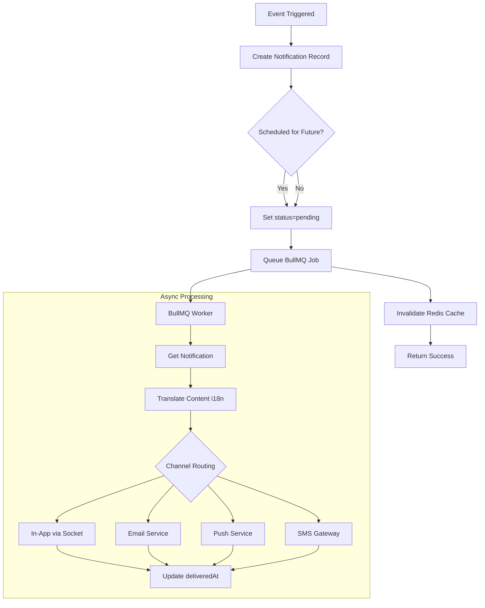

# 📬 Notification Sub-Module Documentation

## Overview

The Notification sub-module handles the creation, delivery, and management of notifications across multiple channels (in-app, email, push, SMS). It serves as the core notification engine for the task management system.

---

## 📂 File Structure

```
notification/
├── notification.interface.ts         # TypeScript type definitions
├── notification.constant.ts          # Enums and constants
├── notification.model.ts             # Mongoose schema and model
├── notification.service.ts           # Business logic layer
├── notification.controller.ts        # HTTP request handlers
└── notification.route.ts             # API route definitions
```

---

## 🎯 Responsibilities

1. **Notification Creation**: Create notifications for various events (task assignment, deadline, mentions, etc.)
2. **Multi-Channel Delivery**: Route notifications through appropriate channels based on user preferences
3. **Status Tracking**: Track delivery and read status for analytics
4. **Cache Management**: Redis caching for unread counts and recent notifications
5. **Bulk Operations**: Support for admin broadcast notifications
6. **Scheduled Delivery**: Support for future-dated notifications (reminders)

---

## 📊 Schema Design

### Notification Interface

```typescript
interface INotification {
  // Sender & Receiver
  senderId?: Types.ObjectId          // Optional for system notifications
  receiverId?: Types.ObjectId        // Optional for broadcast
  receiverRole?: string              // Role-based targeting

  // Content (i18n support)
  title: string | { [lang: string]: string }
  subTitle?: string | { [lang: string]: string }

  // Classification
  type: 'task' | 'group' | 'system' | 'reminder' | 'mention' | 'assignment' | 'deadline' | 'custom'
  priority: 'low' | 'normal' | 'high' | 'urgent'
  channels: ('in_app' | 'email' | 'push' | 'sms')[]

  // Status
  status: 'pending' | 'sent' | 'read' | 'failed'

  // Navigation
  linkFor?: string                   // e.g., 'task', 'group'
  linkId?: Types.ObjectId            // Entity ID to navigate to

  // References
  referenceFor?: string              // Source type
  referenceId?: Types.ObjectId       // Source entity ID

  // Additional Data
  data?: Record<string, any>
  metadata?: Record<string, any>

  // Timestamps
  scheduledFor?: Date                // Scheduled delivery time
  readAt?: Date                      // When marked as read
  deliveredAt?: Date                 // When delivered

  // System
  isDeleted?: boolean                // Soft delete flag
}
```

### Constants & Enums

```typescript
// Notification Types
export const NOTIFICATION_TYPE = {
  TASK: 'task',
  GROUP: 'group',
  SYSTEM: 'system',
  REMINDER: 'reminder',
  MENTION: 'mention',
  ASSIGNMENT: 'assignment',
  DEADLINE: 'deadline',
  CUSTOM: 'custom',
} as const;

// Priority Levels
export const NOTIFICATION_PRIORITY = {
  LOW: 'low',
  NORMAL: 'normal',
  HIGH: 'high',
  URGENT: 'urgent',
} as const;

// Delivery Channels
export const NOTIFICATION_CHANNEL = {
  IN_APP: 'in_app',
  EMAIL: 'email',
  PUSH: 'push',
  SMS: 'sms',
} as const;

// Status Values
export const NOTIFICATION_STATUS = {
  PENDING: 'pending',
  SENT: 'sent',
  READ: 'read',
  FAILED: 'failed',
} as const;

// Cache Configuration
export const NOTIFICATION_CACHE_CONFIG = {
  PREFIX: 'notification',
  UNREAD_COUNT_TTL: 60,        // 1 minute
  RECENT_NOTIFICATIONS_TTL: 300, // 5 minutes
} as const;
```

---

## 🔧 Service Methods

### Core Methods

#### `createNotification(data, scheduledFor?)`

Creates a single notification and queues it for async processing.

```typescript
async createNotification(
  data: Partial<INotification>,
  scheduledFor?: Date
): Promise<INotificationDocument>

// Example
await notificationService.createNotification({
  receiverId: userId,
  title: 'New Task Assigned',
  subTitle: 'You have been assigned to "Website Redesign"',
  type: 'assignment',
  priority: 'normal',
  channels: ['in_app', 'email'],
  linkFor: 'task',
  linkId: taskId,
});
```

#### `sendBulkNotification(payload)`

Sends notifications to multiple users or a role.

```typescript
async sendBulkNotification(
  payload: IBulkNotificationPayload
): Promise<INotificationDocument[]>

// Example
await notificationService.sendBulkNotification({
  userIds: ['user1', 'user2', 'user3'],
  title: 'System Maintenance',
  subTitle: 'Scheduled downtime on March 10',
  type: 'system',
  priority: 'high',
  channels: ['in_app', 'email'],
});
```

#### `getUserNotifications(userId, options)`

Retrieves paginated notifications for a user with caching.

```typescript
async getUserNotifications(
  userId: string,
  options: INotificationQueryOptions
): Promise<any>

// Options
{
  page: number;      // Default: 1
  limit: number;     // Default: 20, Max: 100
  status?: string;   // Filter by status
  type?: string;     // Filter by type
  priority?: string; // Filter by priority
}
```

#### `getUnreadCount(userId)`

Gets unread notification count with Redis caching.

```typescript
async getUnreadCount(userId: string): Promise<number>

// Cached for 60 seconds
```

#### `markAsRead(notificationId, userId)`

Marks a single notification as read.

```typescript
async markAsRead(
  notificationId: string,
  userId: string
): Promise<INotificationDocument | null>
```

#### `markAllAsRead(userId)`

Marks all notifications as read for a user.

```typescript
async markAllAsRead(userId: string): Promise<number>
// Returns count of notifications marked as read
```

#### `deleteNotification(notificationId, userId)`

Soft deletes a notification.

```typescript
async deleteNotification(
  notificationId: string,
  userId: string
): Promise<INotificationDocument | null>
```

---

## 🌐 API Routes

### Route Registration

```typescript
// In server.ts or app.ts
import { NotificationRoute } from './modules/notification.module/notification/notification.route';

app.use('/notifications', NotificationRoute);
```

### Endpoint Details

#### GET `/notifications/my`

Get authenticated user's notifications with pagination.

```http
GET /notifications/my?page=1&limit=20&status=pending&type=task
Authorization: Bearer <token>
```

**Query Parameters:**
- `page` (optional): Page number (default: 1)
- `limit` (optional): Items per page (default: 20, max: 100)
- `status` (optional): Filter by status (`pending`, `read`, etc.)
- `type` (optional): Filter by type (`task`, `group`, etc.)
- `priority` (optional): Filter by priority

**Response:**
```json
{
  "success": true,
  "message": "Notifications retrieved successfully",
  "data": {
    "docs": [...],
    "totalDocs": 45,
    "limit": 20,
    "page": 1,
    "totalPages": 3
  }
}
```

#### GET `/notifications/unread-count`

Get count of unread notifications.

```http
GET /notifications/unread-count
Authorization: Bearer <token>
```

**Response:**
```json
{
  "success": true,
  "data": { "count": 5 }
}
```

#### POST `/notifications/:id/read`

Mark a notification as read.

```http
POST /notifications/64f5a1b2c3d4e5f6g7h8i9j0/read
Authorization: Bearer <token>
```

**Response:**
```json
{
  "success": true,
  "message": "Notification marked as read",
  "data": { ...notification }
}
```

#### POST `/notifications/read-all`

Mark all notifications as read.

```http
POST /notifications/read-all
Authorization: Bearer <token>
```

**Response:**
```json
{
  "success": true,
  "data": { "count": 15 },
  "message": "All 15 notifications marked as read"
}
```

#### DELETE `/notifications/:id`

Delete a notification (soft delete).

```http
DELETE /notifications/64f5a1b2c3d4e5f6g7h8i9j0
Authorization: Bearer <token>
```

**Response:**
```json
{
  "success": true,
  "message": "Notification deleted successfully",
  "data": { ...notification }
}
```

#### POST `/notifications/bulk` (Admin Only)

Send bulk notifications.

```http
POST /notifications/bulk
Authorization: Bearer <admin_token>
Content-Type: application/json

{
  "userIds": ["user1", "user2"],
  "title": "Announcement",
  "subTitle": "Important update",
  "type": "system",
  "priority": "high",
  "channels": ["in_app", "email"]
}
```

**Response:**
```json
{
  "success": true,
  "message": "2 notifications sent successfully",
  "data": [...]
}
```

#### POST `/notifications/schedule-reminder`

Schedule a task reminder notification.

```http
POST /notifications/schedule-reminder
Authorization: Bearer <token>
Content-Type: application/json

{
  "taskId": "64f5a1b2c3d4e5f6g7h8i9j0",
  "reminderTime": "2026-03-07T09:00:00.000Z",
  "reminderType": "before_deadline",
  "message": "Don't forget!"
}
```

**Response:**
```json
{
  "success": true,
  "message": "Reminder scheduled successfully",
  "data": { ...notification }
}
```

---

## 🔄 Business Logic Flow

### Notification Creation Flow



### Cache Invalidation Strategy

```typescript
// When to Invalidate
1. New notification created → Invalidate user's notification list + unread count
2. Notification marked as read → Invalidate unread count + notification list
3. Notification deleted → Invalidate notification list + unread count
4. All marked as read → Invalidate all caches for user

// Cache Keys
const cacheKeys = {
  unread: `notification:user:${userId}:unread-count`,
  list: `notification:user:${userId}:notifications`,
  item: `notification:${notificationId}`,
};
```

---

## 🎯 Notification Types & Use Cases

| Type | Trigger Event | Priority | Channels | Example |
|------|---------------|----------|----------|---------|
| `assignment` | Task assigned to user | normal | in_app | "You've been assigned to 'Project X'" |
| `deadline` | Task deadline approaching | high | in_app, email | "Task due in 24 hours" |
| `reminder` | Scheduled reminder | high | in_app, email, push | "Meeting in 15 minutes" |
| `mention` | User mentioned in comment | normal | in_app | "@username mentioned you" |
| `task` | Task status change | low | in_app | "Task completed by team" |
| `group` | Group activity | low | in_app | "New member joined group" |
| `system` | System announcements | variable | in_app, email | "Maintenance scheduled" |

---

## 📊 Database Indexes

### Primary Indexes

```typescript
// Get user's notifications sorted by date
notificationSchema.index({ 
  receiverId: 1, 
  createdAt: -1, 
  isDeleted: 1 
});

// Get unread notifications for a user
notificationSchema.index({ 
  receiverId: 1, 
  status: 1, 
  isDeleted: 1, 
  createdAt: -1 
});

// Get scheduled notifications pending delivery
notificationSchema.index({ 
  scheduledFor: 1, 
  status: 1, 
  isDeleted: 1 
});
```

### Secondary Indexes

```typescript
// Get notifications by type for a user
notificationSchema.index({ 
  receiverId: 1, 
  type: 1, 
  createdAt: -1 
});

// Get notifications by priority
notificationSchema.index({ 
  priority: 1, 
  status: 1, 
  scheduledFor: 1 
});

// Broadcast to role
notificationSchema.index({ 
  receiverRole: 1, 
  status: 1, 
  isDeleted: 1 
});

// Cleanup: Find old notifications
notificationSchema.index({ 
  readAt: 1, 
  isDeleted: 1 
});
notificationSchema.index({ 
  createdAt: -1, 
  isDeleted: 1 
});
```

---

## 🔒 Security & Validation

### Authorization

- **User Routes**: Require authentication, verify ownership
- **Admin Routes**: Require admin/superAdmin role
- **Bulk Operations**: Limited to 1000 notifications per request

### Validation

```typescript
// Zod Schema Example
const sendBulkNotificationSchema = z.object({
  userIds: z.array(z.string()).optional(),
  receiverRole: z.string().optional(),
  title: z.union([z.string(), z.record(z.string())]),
  subTitle: z.union([z.string(), z.record(z.string())]).optional(),
  type: z.enum(['task', 'group', 'system', 'reminder', 'mention', 'assignment', 'deadline', 'custom']),
  priority: z.enum(['low', 'normal', 'high', 'urgent']).optional(),
  channels: z.array(z.enum(['in_app', 'email', 'push', 'sms'])).optional(),
  linkFor: z.string().optional(),
  linkId: z.string().optional(),
  data: z.record(z.any()).optional(),
}).refine(data => data.userIds || data.receiverRole, {
  message: 'UserIds or receiverRole is required',
});
```

---

## 🧪 Testing Examples

### Unit Test Example

```typescript
describe('NotificationService', () => {
  let service: NotificationService;

  beforeEach(() => {
    service = new NotificationService();
  });

  it('should create a notification', async () => {
    const notification = await service.createNotification({
      receiverId: new Types.ObjectId(),
      title: 'Test Notification',
      type: 'system',
      priority: 'normal',
      channels: ['in_app'],
    });

    expect(notification).toBeDefined();
    expect(notification.status).toBe('pending');
  });

  it('should get unread count from cache', async () => {
    const userId = new Types.ObjectId().toString();
    
    // First call - DB
    await service.getUnreadCount(userId);
    
    // Second call - Cache
    const count = await service.getUnreadCount(userId);
    
    expect(count).toBeDefined();
  });
});
```

---

## 📈 Performance Optimization

### Caching

- **Unread Count**: 60s TTL (frequently accessed)
- **Notification List**: 300s TTL (paginated, only cache first page)
- **Individual Notification**: 3600s TTL (rarely changes)

### Query Optimization

```typescript
// Use projection to limit fields
const notifications = await Notification.find(
  { receiverId: userId, isDeleted: false },
  'title type priority status createdAt linkFor linkId' // Only needed fields
)
.limit(20)
.sort({ createdAt: -1 });
```

### Rate Limiting

```typescript
// Per-endpoint rate limiting
const sendNotificationLimiter = rateLimit({
  windowMs: 60 * 1000,  // 1 minute
  max: 10,              // 10 requests per minute
});

const notificationLimiter = rateLimit({
  windowMs: 60 * 1000,
  max: 100,
});
```

---

## 🔧 Troubleshooting

### Common Issues

| Issue | Cause | Solution |
|-------|-------|----------|
| Notifications not appearing | Cache stale | Manually invalidate cache |
| Duplicate notifications | Job retry | Check BullMQ job deduplication |
| Slow unread count | Cache miss | Increase TTL or pre-warm cache |
| Rate limit errors | Too many requests | Implement exponential backoff |

---

## 📝 Related Documentation

- [Parent Module Architecture](./NOTIFICATION_MODULE_ARCHITECTURE.md)
- [TaskReminder Sub-Module](./taskReminder-member.md)
- [ER Diagram](./notification-schema.mermaid)
- [Flow Diagram](./notification-flow.mermaid)

---

**Last Updated**: 2026-03-06
**Version**: 1.0.0
