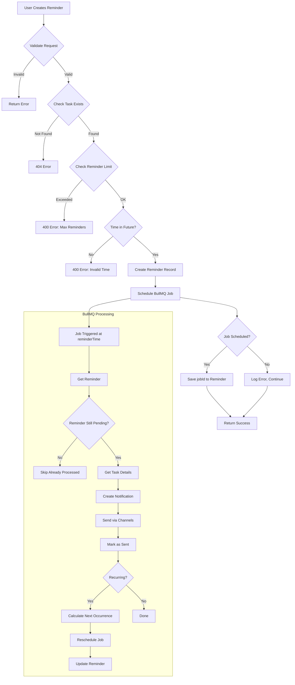

# ⏰ TaskReminder Sub-Module Documentation

## Overview

The TaskReminder sub-module provides a sophisticated reminder system for tasks, supporting one-time and recurring reminders with BullMQ scheduled job processing. It integrates with the Notification module to deliver reminders via multiple channels at the appropriate time.

---

## 📂 File Structure

```
taskReminder/
├── taskReminder.interface.ts         # TypeScript type definitions
├── taskReminder.constant.ts          # Enums and constants
├── taskReminder.model.ts             # Mongoose schema and model
├── taskReminder.service.ts           # Business logic layer
├── taskReminder.controller.ts        # HTTP request handlers
└── taskReminder.route.ts             # API route definitions
```

---

## 🎯 Responsibilities

1. **Reminder Creation**: Create one-time or recurring reminders for tasks
2. **Scheduled Processing**: Use BullMQ to trigger reminders at the right time
3. **Recurring Reminders**: Automatically reschedule based on frequency (daily, weekly, monthly)
4. **Channel Management**: Deliver reminders via user's preferred channels
5. **Limit Enforcement**: Enforce maximum reminders per task (default: 5)
6. **Reminder Cancellation**: Allow users to cancel pending reminders

---

## 📊 Schema Design

### TaskReminder Interface

```typescript
interface ITaskReminder {
  // References
  taskId: Types.ObjectId              // Task to remind about
  userId: Types.ObjectId              // User who will receive reminder
  createdByUserId: Types.ObjectId     // User who created the reminder

  // Reminder Configuration
  triggerType: 'before_deadline' | 'at_deadline' | 'after_deadline' | 'custom_time' | 'recurring'
  reminderTime: Date                  // When to send the reminder
  customMessage?: string              // Optional custom message (max 500 chars)
  channels: ('in_app' | 'email' | 'push' | 'sms')[]

  // Status & Tracking
  status: 'pending' | 'sent' | 'cancelled'
  frequency: 'once' | 'daily' | 'weekly' | 'monthly'
  nextReminderTime?: Date             // Next occurrence for recurring
  jobId?: string                      // BullMQ job ID
  sentCount: number                   // Times this reminder has been sent
  maxOccurrences: number              // Max times to send (1-10)

  // Metadata
  metadata?: Record<string, any>

  // System
  isDeleted?: boolean
  createdAt?: Date
  updatedAt?: Date
}
```

### Constants & Enums

```typescript
// Trigger Types
export const TASK_REMINDER_TRIGGER = {
  BEFORE_DEADLINE: 'before_deadline',
  AT_DEADLINE: 'at_deadline',
  AFTER_DEADLINE: 'after_deadline',
  CUSTOM_TIME: 'custom_time',
  RECURRING: 'recurring',
} as const;

// Status Values
export const TASK_REMINDER_STATUS = {
  PENDING: 'pending',
  SENT: 'sent',
  CANCELLED: 'cancelled',
} as const;

// Frequency Options
export const TASK_REMINDER_FREQUENCY = {
  ONCE: 'once',
  DAILY: 'daily',
  WEEKLY: 'weekly',
  MONTHLY: 'monthly',
} as const;

// Limits
export const TASK_REMINDER_LIMITS = {
  MAX_REMINDERS_PER_TASK: 5,
  MAX_RECURRING_OCCURRENCES: 10,
  MAX_CUSTOM_MESSAGE_LENGTH: 500,
} as const;

// Default Channels by Trigger Type
export const DEFAULT_CHANNELS_BY_TRIGGER = {
  before_deadline: ['in_app', 'email'],
  at_deadline: ['in_app', 'email', 'push'],
  after_deadline: ['in_app', 'email', 'push'],
  custom_time: ['in_app'],
  recurring: ['in_app'],
} as const;

// Queue Configuration
export const REMINDER_QUEUE_CONFIG = {
  JOB_ATTEMPTS: 3,
  BACKOFF_DELAY: 1000,
  REMOVE_ON_COMPLETE: 86400, // 24 hours
} as const;
```

---

## 🔧 Service Methods

### Core Methods

#### `createReminder(data)`

Creates a task reminder and schedules it in BullMQ.

```typescript
async createReminder(data: Partial<ITaskReminder>): Promise<ITaskReminderDocument>

// Example
const reminder = await taskReminderService.createReminder({
  taskId: '64f5a1b2c3d4e5f6g7h8i9j0',
  userId: '64f5a1b2c3d4e5f6g7h8i9j1',
  createdByUserId: '64f5a1b2c3d4e5f6g7h8i9j1',
  reminderTime: new Date('2026-03-07T09:00:00.000Z'),
  triggerType: 'before_deadline',
  customMessage: 'Don\'t forget to submit the report!',
  channels: ['in_app', 'email'],
  frequency: 'once',
});

// Returns reminder with jobId
console.log(reminder.jobId); // "reminder_job_12345"
```

**Validation:**
- Task must exist
- Reminder time must be in the future
- Max 5 reminders per task
- Max 10 occurrences for recurring

#### `getRemindersForTask(taskId, options?)`

Gets all reminders for a specific task.

```typescript
async getRemindersForTask(
  taskId: string,
  options?: { limit?: number }
): Promise<ITaskReminderDocument[]>

// Example
const reminders = await taskReminderService.getRemindersForTask(taskId, { limit: 10 });
```

#### `getRemindersForUser(userId, options?)`

Gets all reminders for a user with task details populated.

```typescript
async getRemindersForUser(
  userId: string,
  options?: { limit?: number }
): Promise<ITaskReminderDocument[]>

// Example
const myReminders = await taskReminderService.getRemindersForUser(userId);
```

#### `cancelReminder(reminderId, userId)`

Cancels a pending reminder.

```typescript
async cancelReminder(
  reminderId: string,
  userId: string
): Promise<ITaskReminderDocument | null>

// Throws error if reminder already sent
```

#### `cancelAllRemindersForTask(taskId, userId)`

Cancels all pending reminders for a task.

```typescript
async cancelAllRemindersForTask(
  taskId: string,
  userId: string
): Promise<number>

// Returns count of cancelled reminders
```

#### `processReminder(reminderId)` (Internal)

Processes a due reminder (called by BullMQ worker).

```typescript
async processReminder(reminderId: string): Promise<ITaskReminderDocument | null>

// Internal method - called by BullMQ worker
// 1. Gets reminder with task + user populated
// 2. Creates notification via NotificationService
// 3. Marks reminder as sent
// 4. Reschedules if recurring
```

---

## 🌐 API Routes

### Route Registration

```typescript
// In server.ts or app.ts
import { TaskReminderRoute } from './modules/notification.module/taskReminder/taskReminder.route';

app.use('/task-reminders', TaskReminderRoute);
```

### Endpoint Details

#### POST `/task-reminders/`

Create a new task reminder.

```http
POST /task-reminders/
Authorization: Bearer <token>
Content-Type: application/json

{
  "taskId": "64f5a1b2c3d4e5f6g7h8i9j0",
  "reminderTime": "2026-03-07T09:00:00.000Z",
  "triggerType": "before_deadline",
  "customMessage": "Don't forget to submit!",
  "channels": ["in_app", "email"],
  "frequency": "once"
}
```

**Request Body:**
- `taskId` (required): ID of the task
- `reminderTime` (required): ISO date string when to send
- `triggerType` (optional): Type of trigger (default: 'before_deadline')
- `customMessage` (optional): Custom message (max 500 chars)
- `channels` (optional): Delivery channels (default: ['in_app'])
- `frequency` (optional): For recurring (default: 'once')

**Response:**
```json
{
  "success": true,
  "message": "Reminder created successfully",
  "data": {
    "_reminderId": "64f5a1b2c3d4e5f6g7h8i9j2",
    "taskId": "64f5a1b2c3d4e5f6g7h8i9j0",
    "userId": "64f5a1b2c3d4e5f6g7h8i9j1",
    "triggerType": "before_deadline",
    "reminderTime": "2026-03-07T09:00:00.000Z",
    "status": "pending",
    "frequency": "once",
    "sentCount": 0,
    "maxOccurrences": 1,
    "jobId": "reminder_job_12345",
    "createdAt": "2026-03-06T10:00:00.000Z"
  }
}
```

#### GET `/task-reminders/task/:id`

Get all reminders for a specific task.

```http
GET /task-reminders/task/64f5a1b2c3d4e5f6g7h8i9j0?page=1&limit=10
Authorization: Bearer <token>
```

**Response:**
```json
{
  "success": true,
  "data": [
    {
      "_reminderId": "64f5a1b2c3d4e5f6g7h8i9j2",
      "triggerType": "before_deadline",
      "reminderTime": "2026-03-07T09:00:00.000Z",
      "status": "pending",
      "frequency": "once",
      "channels": ["in_app", "email"]
    }
  ]
}
```

#### GET `/task-reminders/my`

Get my reminders with task details.

```http
GET /task-reminders/my?status=pending&frequency=once
Authorization: Bearer <token>
```

**Query Parameters:**
- `status` (optional): Filter by status
- `frequency` (optional): Filter by frequency

**Response:**
```json
{
  "success": true,
  "data": [
    {
      "_reminderId": "64f5a1b2c3d4e5f6g7h8i9j2",
      "taskId": {
        "_id": "64f5a1b2c3d4e5f6g7h8i9j0",
        "title": "Website Redesign",
        "description": "Redesign company website",
        "dueDate": "2026-03-10T00:00:00.000Z"
      },
      "triggerType": "before_deadline",
      "reminderTime": "2026-03-07T09:00:00.000Z",
      "customMessage": "Don't forget!",
      "status": "pending",
      "frequency": "once"
    }
  ]
}
```

#### DELETE `/task-reminders/:id`

Cancel a pending reminder.

```http
DELETE /task-reminders/64f5a1b2c3d4e5f6g7h8i9j2
Authorization: Bearer <token>
```

**Response:**
```json
{
  "success": true,
  "message": "Reminder cancelled successfully",
  "data": {
    "_reminderId": "64f5a1b2c3d4e5f6g7h8i9j2",
    "status": "cancelled",
    ...
  }
}
```

**Note:** Cannot cancel reminders that have already been sent.

#### POST `/task-reminders/task/:id/cancel-all`

Cancel all pending reminders for a task.

```http
POST /task-reminders/task/64f5a1b2c3d4e5f6g7h8i9j0/cancel-all
Authorization: Bearer <token>
```

**Response:**
```json
{
  "success": true,
  "message": "3 reminders cancelled successfully",
  "data": {
    "cancelledCount": 3
  }
}
```

---

## 🔄 Business Logic Flow

### Reminder Creation & Scheduling Flow



### Recurring Reminder Logic

```typescript
// Calculate next occurrence based on frequency
calculateNextOccurrence(frequency: string, currentDate: Date): Date {
  const nextDate = new Date(currentDate);
  
  switch (frequency) {
    case 'daily':
      nextDate.setDate(nextDate.getDate() + 1);
      break;
    case 'weekly':
      nextDate.setDate(nextDate.getDate() + 7);
      break;
    case 'monthly':
      nextDate.setMonth(nextDate.getMonth() + 1);
      break;
  }
  
  return nextDate;
}

// Example: Daily reminder
// Day 1: reminderTime = March 7, 2026 09:00
// Day 2: nextReminderTime = March 8, 2026 09:00
// Day 3: nextReminderTime = March 9, 2026 09:00
// ... until maxOccurrences reached
```

---

## 📊 Trigger Types

| Trigger Type | Description | Use Case | Default Channels |
|--------------|-------------|----------|------------------|
| `before_deadline` | Reminder before task due date | Early warning | in_app, email |
| `at_deadline` | Reminder exactly at due date/time | Final notice | in_app, email, push |
| `after_deadline` | Reminder after deadline passed | Overdue alert | in_app, email, push |
| `custom_time` | User-specified time | Custom reminders | in_app |
| `recurring` | Repeats at intervals | Daily standups, weekly reviews | in_app |

---

## 🎯 Recurring Reminder Examples

### Daily Standup Reminder

```typescript
// Create daily recurring reminder for standup
await taskReminderService.createReminder({
  taskId: standupTaskId,
  userId: userId,
  reminderTime: new Date('2026-03-07T09:00:00.000Z'),
  triggerType: 'recurring',
  frequency: 'daily',
  maxOccurrences: 10,
  customMessage: 'Time for daily standup!',
  channels: ['in_app'],
});

// Will send at 9:00 AM daily for 10 days
```

### Weekly Review Reminder

```typescript
// Create weekly recurring reminder
await taskReminderService.createReminder({
  taskId: weeklyReviewTaskId,
  userId: userId,
  reminderTime: new Date('2026-03-07T17:00:00.000Z'),
  triggerType: 'recurring',
  frequency: 'weekly',
  maxOccurrences: 4,
  customMessage: 'Weekly review time!',
  channels: ['in_app', 'email'],
});

// Will send every Friday at 5:00 PM for 4 weeks
```

---

## 📊 Database Indexes

### Primary Indexes

```typescript
// Find pending reminders due before a date
taskReminderSchema.index({ 
  reminderTime: 1, 
  status: 1, 
  isDeleted: 1 
});

// Find reminders for a task
taskReminderSchema.index({ 
  taskId: 1, 
  status: 1, 
  isDeleted: 1 
});

// Find reminders for a user
taskReminderSchema.index({ 
  userId: 1, 
  status: 1, 
  reminderTime: -1 
});
```

### Secondary Indexes

```typescript
// Find recurring reminders needing rescheduling
taskReminderSchema.index({ 
  nextReminderTime: 1, 
  frequency: 1, 
  status: 1, 
  isDeleted: 1 
});
```

---

## 🔧 BullMQ Integration

### Queue Configuration

```typescript
// Queue definition in bullmq.ts
export const taskRemindersQueue = new Queue(
  'task-reminders-queue',
  { connection: redisPubClient.options }
);

// Worker definition
export const startTaskRemindersWorker = () => {
  const worker = new Worker<ITaskReminderJobData>(
    'task-reminders-queue',
    async (job) => {
      const { reminderId, taskId, userId, reminderTime, triggerType, channels, customMessage } = job.data;
      
      const taskReminderService = new TaskReminderService();
      await taskReminderService.processReminder(reminderId);
    },
    { 
      connection: redisPubClient.options,
      concurrency: 10, // Process 10 reminders in parallel
    }
  );
};
```

### Job Scheduling

```typescript
// Schedule with delay
await taskRemindersQueue.add(
  'processTaskReminder',
  {
    reminderId: reminder._id.toString(),
    taskId: reminder.taskId.toString(),
    userId: reminder.userId.toString(),
    reminderTime: reminder.reminderTime,
    triggerType: reminder.triggerType,
    channels: reminder.channels,
    customMessage: reminder.customMessage,
  },
  {
    delay: reminder.reminderTime.getTime() - Date.now(),
    attempts: 3,
    backoff: {
      type: 'exponential',
      delay: 1000,
    },
    removeOnComplete: {
      age: 86400, // Remove after 24 hours
    },
  }
);
```

---

## 🔒 Security & Validation

### Authorization

- Users can only create reminders for tasks they have access to
- Users can only view/cancel their own reminders
- Task must exist before creating reminder

### Validation

```typescript
// Zod Schema
const createReminderSchema = z.object({
  taskId: z.string().min(1, 'Task ID is required'),
  reminderTime: z.string().min(1, 'Reminder time is required'),
  triggerType: z.enum(['before_deadline', 'at_deadline', 'after_deadline', 'custom_time', 'recurring']).optional(),
  frequency: z.enum(['once', 'daily', 'weekly', 'monthly']).optional(),
  customMessage: z.string().max(500).optional(),
  channels: z.array(z.enum(['in_app', 'email', 'push', 'sms'])).optional(),
});
```

### Rate Limiting

```typescript
const createReminderLimiter = rateLimit({
  windowMs: 60 * 1000,  // 1 minute
  max: 10,              // 10 reminders per minute
});

const reminderLimiter = rateLimit({
  windowMs: 60 * 1000,
  max: 100,
});
```

---

## 🧪 Testing Examples

### Unit Test Example

```typescript
describe('TaskReminderService', () => {
  let service: TaskReminderService;

  beforeEach(() => {
    service = new TaskReminderService();
  });

  it('should create a reminder', async () => {
    const reminder = await service.createReminder({
      taskId: new Types.ObjectId(),
      userId: new Types.ObjectId(),
      createdByUserId: new Types.ObjectId(),
      reminderTime: new Date(Date.now() + 86400000), // Tomorrow
      triggerType: 'before_deadline',
      frequency: 'once',
    });

    expect(reminder).toBeDefined();
    expect(reminder.status).toBe('pending');
    expect(reminder.jobId).toBeDefined();
  });

  it('should enforce max reminders per task', async () => {
    // Create 5 reminders
    for (let i = 0; i < 5; i++) {
      await service.createReminder({
        taskId: testTaskId,
        userId: testUserId,
        createdByUserId: testUserId,
        reminderTime: new Date(Date.now() + 86400000 * (i + 1)),
        triggerType: 'before_deadline',
      });
    }

    // 6th should fail
    await expect(service.createReminder({
      taskId: testTaskId,
      userId: testUserId,
      createdByUserId: testUserId,
      reminderTime: new Date(Date.now() + 86400000 * 6),
      triggerType: 'before_deadline',
    })).rejects.toThrow('Maximum 5 reminders allowed per task');
  });

  it('should cancel a pending reminder', async () => {
    const reminder = await service.createReminder({ /* ... */ });
    const cancelled = await service.cancelReminder(reminder._id.toString(), userId);
    
    expect(cancelled?.status).toBe('cancelled');
  });

  it('should not cancel an already sent reminder', async () => {
    const reminder = await TaskReminder.findOneAndUpdate(
      { _id: reminderId },
      { status: TASK_REMINDER_STATUS.SENT }
    );

    await expect(service.cancelReminder(reminderId, userId))
      .rejects.toThrow('Cannot cancel a reminder that has already been sent');
  });
});
```

---

## 📈 Performance Optimization

### Query Optimization

```typescript
// Populate only necessary fields
const reminders = await TaskReminder.find({
  userId: userId,
  isDeleted: false,
})
.populate('taskId', 'title description dueDate') // Only needed fields
.sort({ reminderTime: -1 })
.limit(20);
```

### Index Usage

```typescript
// This query uses the userId_1_status_1_reminderTime_-1 index
const pendingReminders = await TaskReminder.find({
  userId: userId,
  status: TASK_REMINDER_STATUS.PENDING,
  isDeleted: false,
}).sort({ reminderTime: -1 });
```

---

## 🔧 Troubleshooting

### Common Issues

| Issue | Cause | Solution |
|-------|-------|----------|
| Reminder not sent | BullMQ job failed | Check worker logs, verify Redis connection |
| Duplicate reminders | Job retry | Implement idempotency check in processReminder |
| Recurring not rescheduling | maxOccurrences reached | Check sentCount < maxOccurrences |
| Reminder time in past | Invalid input | Validate reminderTime > Date.now() |

---

## 📝 Related Documentation

- [Parent Module Architecture](./NOTIFICATION_MODULE_ARCHITECTURE.md)
- [Notification Sub-Module](./notification-member.md)
- [ER Diagram](./taskReminder-schema.mermaid)
- [BullMQ Setup](../../../helpers/bullmq/bullmq.ts)

---

**Last Updated**: 2026-03-06
**Version**: 1.0.0
