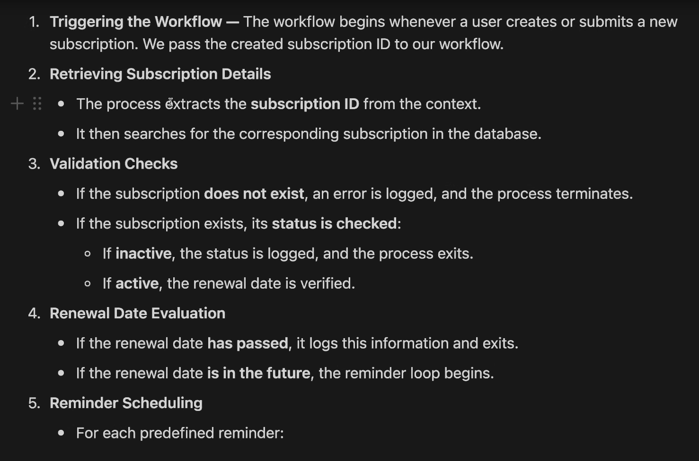
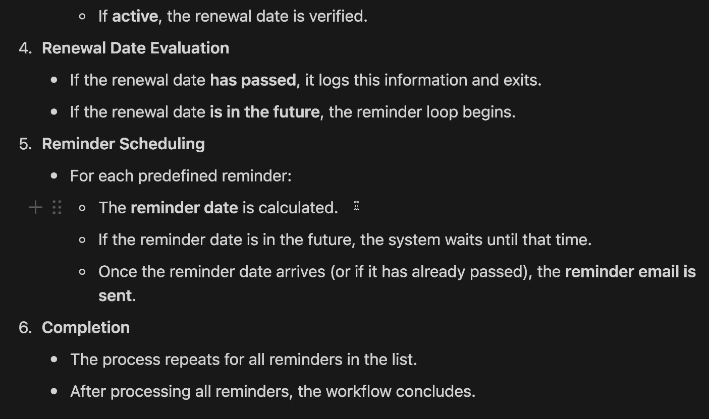

//################################################################################### 
RequestForViseSubscriptionToAdmin.. You find this module in personRelationships.module
//###################################################################################

Vise Subscription is actually not related to typical recurrent subscription plan ..
it has no exact price ..

Flow is .. user create a request for vise subscription to admin ..
if admin approve that .. users subscription type will be vise .. 

admin can remove a persons vise subscription any time ..

use cases .. lets say a person is in recurrent standard subscription .. 
what should be the flow of getting vise subsciption for that user .. 

======================================>

Here’s a clear and logical flow for handling a user who is currently on a **recurrent standard subscription** and wants to request a **Vise subscription**:

---

### **Flow for Converting from Recurrent Standard → Vise Subscription**

1. **User Initiates Request**  
   - The user submits a request (e.g., via a form or button in the app/dashboard) to apply for a **Vise subscription**.
   - System records this as a **pending admin approval** status.

2. **System Notes Current Subscription**  
   - The system logs that the user is currently on a **recurrent standard subscription**.
   - Optionally, it may pause or flag the next billing cycle to avoid conflicts once Vise is approved.

3. **Admin Review & Approval**  
   - Admin receives the request notification.
   - Admin reviews and either:
     - **Approves**: Proceeds to step 4.
     - **Rejects**: Notifies the user; their current subscription remains unchanged.

4. **On Approval: Transition to Vise Subscription**
   - System **cancels or suspends** the user’s recurrent standard subscription **without charging further**.
     - If the standard plan was prepaid, decide based on policy: refund unused portion or let it expire naturally.
   - User’s subscription type is updated to **“Vise”**.
   - Set subscription status to **active (Vise)** with no fixed price or recurrence.
   - Record metadata: `approved_by`, `approved_at`, `previous_subscription_type`.

5. **Admin Can Revoke Anytime**
   - At any point, if the admin **removes** the Vise subscription:
     - System reverts the user to their previous state (e.g., no subscription, or optionally back to standard if desired).
     - Notify the user of the change.

6. **User Notification**
   - User is notified at each key stage:
     - Request received
     - Approved → now on Vise subscription
     - Revoked (if applicable)

---

### **Key Considerations**
- **No overlap**: A user should not be charged for standard while on Vise.
- **Audit trail**: Maintain logs of all transitions for accountability.
- **Graceful downgrade**: If Vise is revoked, define what happens next (e.g., free tier vs. re-enroll in standard).

This flow ensures flexibility for admin control while protecting the user from unintended billing.

From JS Mastery .. not related to this project  
https://www.youtube.com/watch?v=rOpEN1JDaD0&t=4722s

