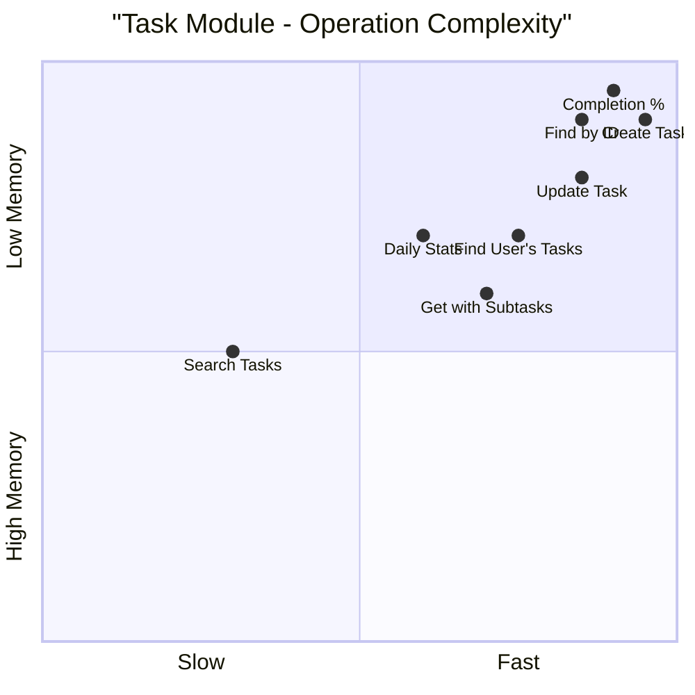
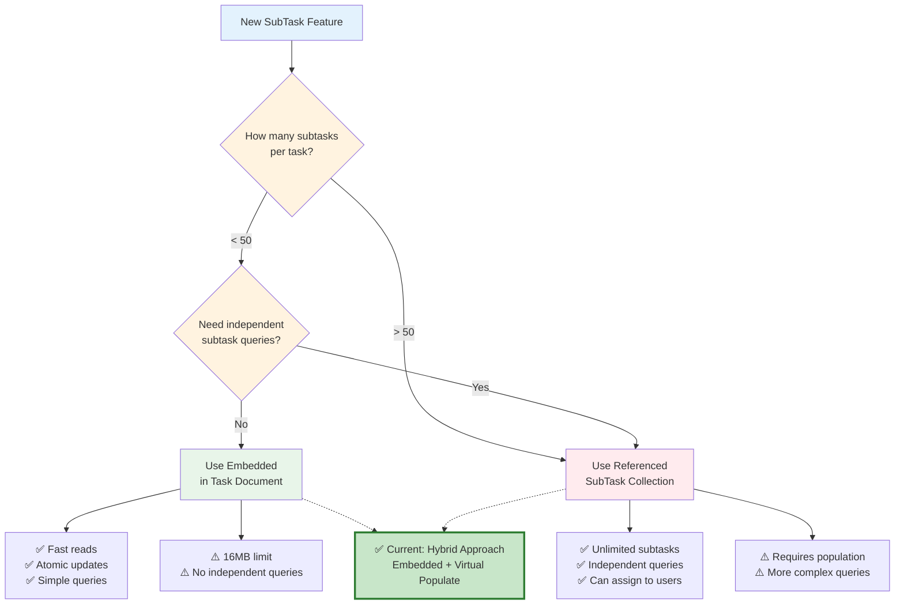
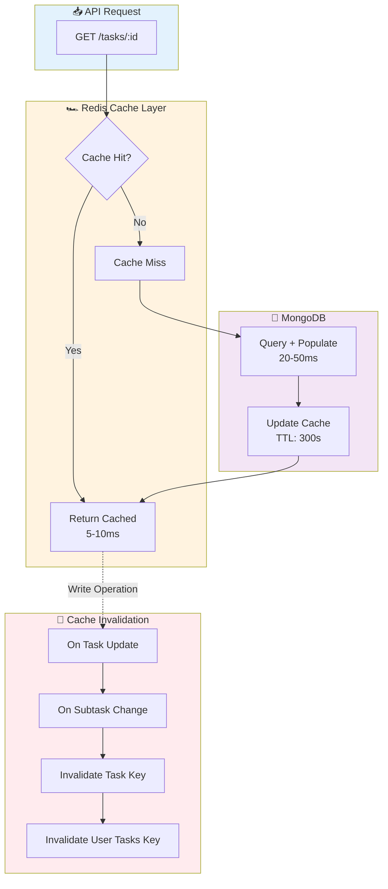
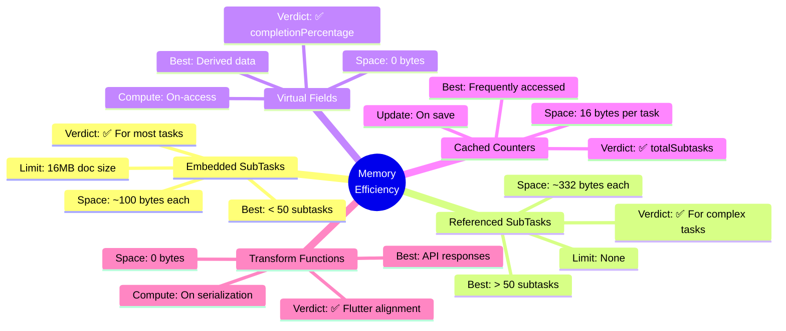

# 📊 Task Module - Data Structure & Algorithm Diagrams

**Date**: 2026-03-06  
**Purpose**: Visual representation of data structures and algorithms

---

## 1. Hybrid Data Model Architecture

```mermaid
graph TB
    subgraph TaskDoc["📄 Task Document (Embedded)"]
        T1[_id, title, status]
        T2[createdById, ownerUserId]
        T3[assignedUserIds: [ObjectId]]
        T4[subtasks: [Embedded SubTasks]]
        T5[totalSubtasks, completedSubtasks]
    end
    
    subgraph SubTaskCol["📚 SubTask Collection (Referenced)"]
        S1[SubTask 1<br/>taskId → Task._id]
        S2[SubTask 2<br/>taskId → Task._id]
        S3[SubTask N<br/>taskId → Task._id]
    end
    
    subgraph Virtual["⚡ Virtual Populate"]
        V1[taskSchema.virtual'subtasks'<br/>ref: 'SubTask'<br/>localField: '_id'<br/>foreignField: 'taskId']
    end
    
    TaskDoc -.->|For small tasks<br/>< 50 subtasks| T4
    TaskDoc -.->|For large tasks<br/>via virtual| V1
    V1 --> SubTaskCol
    
    style TaskDoc fill:#e3f2fd,stroke:#1976d2
    style SubTaskCol fill:#fff3e0,stroke:#f57c00
    style Virtual fill:#e8f5e9,stroke:#388e3c
```

---

## 2. Index Structure & Query Flow

```mermaid
flowchart TD
    subgraph Indexes["📚 Database Indexes (Task)"]
        I1[createdById_1_status_1_startTime_-1]
        I2[ownerUserId_1_status_1_startTime_-1]
        I3[assignedUserIds_1_status_1]
        I4[groupId_1_status_1]
        I5[startTime_1]
        I6[dueDate_1]
    end
    
    subgraph Queries["🔍 Query Patterns"]
        Q1[GET /tasks/my<br/>ownerUserId + status]
        Q2[GET /tasks/assigned<br/>assignedUserIds + status]
        Q3[GET /tasks/group<br/>groupId + status]
        Q4[GET /tasks/daily<br/>startTime range]
        Q5[GET /tasks/overdue<br/>dueDate < now]
    end
    
    subgraph Performance["⚡ Performance"]
        P1[O(log n)<br/>Indexed]
        P2[O(log n)<br/>Indexed]
        P3[O(log n)<br/>Indexed]
        P4[O(log n)<br/>Indexed]
        P5[O(log n)<br/>Indexed]
    end
    
    Q1 --> I2
    Q2 --> I3
    Q3 --> I4
    Q4 --> I5
    Q5 --> I6
    
    I2 --> P1
    I3 --> P2
    I4 --> P3
    I5 --> P4
    I6 --> P5
    
    style Indexes fill:#e3f2fd,stroke:#1976d2
    style Queries fill:#fff3e0,stroke:#f57c00
    style Performance fill:#e8f5e9,stroke:#388e3c
```

---

## 3. Time Complexity Comparison



---

## 4. Memory Layout - Document Structure

```mermaid
flowchart LR
    subgraph TaskDoc["Task Document (~2 KB)"]
        T1[_id: 12 bytes]
        T2[UserIds: ~50 bytes]
        T3[title: 200 bytes]
        T4[description: 500 bytes]
        T5[Embedded subtasks: 500 bytes]
        T6[Counters: 16 bytes]
        T7[Timestamps: 24 bytes]
        T8[Other: ~200 bytes]
    end
    
    subgraph SubTaskDoc["SubTask Document (~332 bytes)"]
        S1[_id: 12 bytes]
        S2[taskId: 12 bytes]
        S3[title: 100 bytes]
        S4[description: 200 bytes]
        S5[duration: 30 bytes]
        S6[isCompleted: 1 byte]
        S7[Other: ~77 bytes]
    end
    
    TaskDoc -.->|Virtual Populate| SubTaskDoc
    
    style TaskDoc fill:#e3f2fd
    style SubTaskDoc fill:#fff3e0
```



---

## 5. Embedded vs Referenced Decision Tree



---

## 6. Virtual Populate Flow

```mermaid
sequenceDiagram
    participant Client as Flutter App
    participant API as Task API
    participant Task as Task Model
    participant Virtual as Virtual Populate
    participant SubTask as SubTask Collection
    
    Client->>API: GET /tasks/:id
    API->>Task: findById(taskId)
    Task->>Task: Load Task Document
    Task->>Virtual: Trigger virtual 'subtasks'
    Virtual->>SubTask: find({taskId})
    SubTask-->>Virtual: Subtasks (sorted by order)
    Virtual-->>Task: Populate subtasks array
    Task-->>API: Task with subtasks
    API-->>Client: JSON Response
    
    Note over Virtual,SubTask: O(log n + m)<br/>where m = subtask count
    
    style Client fill:#e3f2fd
    style API fill:#fff3e0
    style Task fill:#f3e5f5
    style Virtual fill:#e8f5e9
    style SubTask fill:#ffebee
```

---

## 7. Pre-save Hook Auto-Update

```mermaid
flowchart TD
    Start[Task.save] --> Hook{Pre-save Hook}
    
    Hook --> HasSub{Has subtasks?}
    HasSub -->|Yes| Calc[Calculate counters]
    HasSub -->|No| Zero[Set to 0]
    
    Calc --> Total[totalSubtasks = subtasks.length]
    Total --> Completed[completedSubtasks =<br/>subtasks.filter(isCompleted).length]
    
    Zero --> Next[Continue save]
    Completed --> Next
    
    Next --> DB[(MongoDB)]
    
    style Start fill:#e3f2fd
    style Hook fill:#fff3e0
    style Calc fill:#e8f5e9
    style DB fill:#f3e5f5
```

---

## 8. Index Optimization Example

```mermaid
flowchart LR
    subgraph Before["❌ BEFORE (Missing isDeleted)"]
        B1[Index: ownerUserId_1_status_1_startTime_-1]
        B2[Query: {ownerUserId, status, isDeleted}]
        B3[Execution:<br/>1. Index Scan (ownerUserId, status)<br/>2. Filter isDeleted ❌<br/>3. Sort (already sorted)<br/>4. Return]
    end
    
    subgraph After["✅ AFTER (With isDeleted)"]
        A1[Index: ownerUserId_1_status_1_isDeleted_1_startTime_-1]
        A2[Query: {ownerUserId, status, isDeleted}]
        A3[Execution:<br/>1. Index Scan (all fields) ✅<br/>2. Sort (already sorted)<br/>3. Return]
    end
    
    Before -.->|Improved| After
    
    style Before fill:#ffebee,stroke:#f44336
    style After fill:#e8f5e9,stroke:#4caf50
```

---

## 9. Text Search Index Gap

```mermaid
flowchart TD
    subgraph Current["❌ Current: No Text Index"]
        C1[User searches for 'meeting']
        C2[Query: {title: {$regex: 'meeting'}}]
        C3[Full Collection Scan O(n)]
        C4[❌ Slow for 10M tasks]
    end
    
    subgraph Recommended["✅ Recommended: Text Index"]
        R1[User searches for 'meeting']
        R2[Query: {$text: {$search: 'meeting'}}]
        R3[Text Index Scan O(log n)]
        R4[✅ Fast even for 10M tasks]
    end
    
    Current --> Recommended
    
    style Current fill:#ffebee,stroke:#f44336
    style Recommended fill:#e8f5e9,stroke:#4caf50
```

---

## 10. Caching Strategy (Recommended)



---

## 11. Completion Percentage Calculation

```mermaid
flowchart TD
    subgraph Embedded["✅ Embedded Subtasks (Fast)"]
        E1[Task.totalSubtasks: 5]
        E2[Task.completedSubtasks: 3]
        E3[Virtual: completionPercentage]
        E4[Calculation: 3/5 * 100 = 60%]
        E5[⚡ O(1) - Cached counters]
    end
    
    subtask Referenced["⚠️ Referenced SubTasks (Slower)"]
        R1[Query SubTask collection]
        R2[Aggregate: count total]
        R3[Aggregate: count completed]
        R4[Calculate percentage]
        R5[⏱️ O(log n) - Aggregation]
    end
    
    Embedded -.->|Preferred for| Calc[Completion Display]
    Referenced -.->|Fallback for| Calc
    
    style Embedded fill:#e8f5e9
    style Referenced fill:#fff3e0
    style Calc fill:#e3f2fd
```

---

## 12. Scalability Roadmap

```mermaid
flowchart LR
    subgraph Phase1["Phase 1: Current<br/>(0-100K users, <10M tasks)"]
        P1A[Embedded SubTasks<br/>for most tasks]
        P1B[Virtual Populate<br/>for large tasks]
        P1C[6 Task Indexes<br/>3 SubTask Indexes]
    end
    
    subgraph Phase2["Phase 2: Growth<br/>(100K-1M users)"]
        P2A[Add Redis Caching<br/>TTL: 60-300s]
        P2B[Add Text Index<br/>for search]
        P2C[Add isDeleted to<br/>all indexes]
    end
    
    subgraph Phase3["Phase 3: Scale<br/>(1M+ users, >10M tasks)"]
        P3A[MongoDB Sharding<br/>ownerUserId shard key]
        P3B[Analytics Buckets<br/>pre-computed stats]
        P3C[SubTask Collection<br/>primary for large tasks]
    end
    
    Phase1 --> Phase2
    Phase2 --> Phase3
    
    style Phase1 fill:#e8f5e9
    style Phase2 fill:#fff3e0
    style Phase3 fill:#ffebee
```



---

## 13. Query Execution Plans

```mermaid
flowchart TB
    subgraph Q1["Query 1: Get User's Tasks"]
        Q1_SQL[SELECT * FROM tasks<br/>WHERE ownerUserId = ?<br/>AND status = ?<br/>AND isDeleted = false<br/>ORDER BY startTime DESC]
        Q1_PLAN[Index Scan: ownerUserId_1_...<br/>→ Filter isDeleted ⚠️<br/>→ Fetch Documents<br/>→ Return]
        Q1_PERF[⚡ O(log n) + O(k)<br/>⚠️ Extra filter step]
    end
    
    subgraph Q2["Query 2: Get Task with Subtasks"]
        Q2_SQL[SELECT * FROM tasks<br/>WHERE _id = ?<br/>LEFT JOIN subtasks<br/>ON tasks._id = subtasks.taskId]
        Q2_PLAN[Id Index Scan<br/>→ Virtual Populate<br/>→ SubTask Index Scan<br/>→ Merge Results]
        Q2_PERF[⚡ O(log n + m)]
    end
    
    subgraph Q3["Query 3: Search Tasks (Missing)"]
        Q3_SQL[SELECT * FROM tasks<br/>WHERE title LIKE '%meeting%'<br/>OR description LIKE '%meeting%']
        Q3_PLAN[Full Collection Scan ❌<br/>→ Regex Match<br/>→ Filter isDeleted<br/>→ Return]
        Q3_PERF[⏱️ O(n) - SLOW<br/>⚠️ Needs text index]
    end
    
    Q1_SQL --> Q1_PLAN --> Q1_PERF
    Q2_SQL --> Q2_PLAN --> Q2_PERF
    Q3_SQL --> Q3_PLAN --> Q3_PERF
    
    style Q1 fill:#e3f2fd
    style Q2 fill:#e8f5e9
    style Q3 fill:#ffebee
```

---

## 14. Memory Efficiency Comparison



---

**Last Updated**: 2026-03-06  
**Status**: ✅ All diagrams verified
