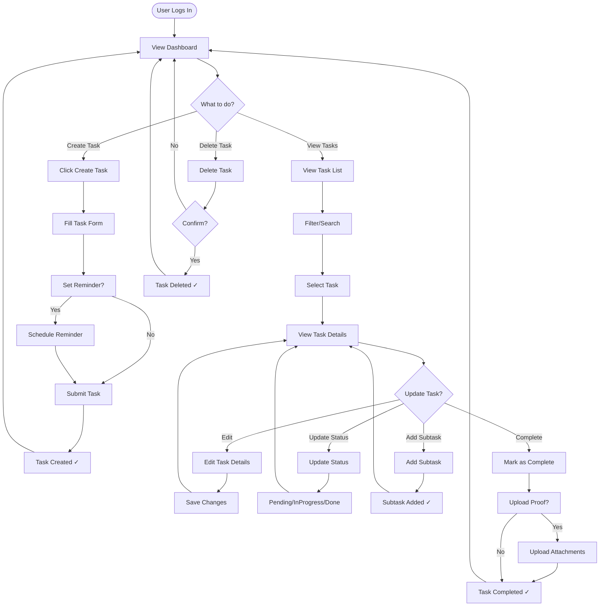
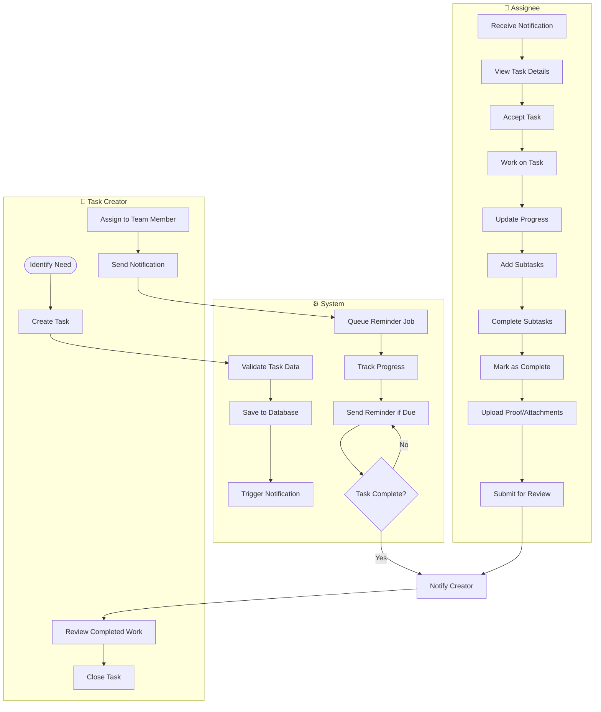
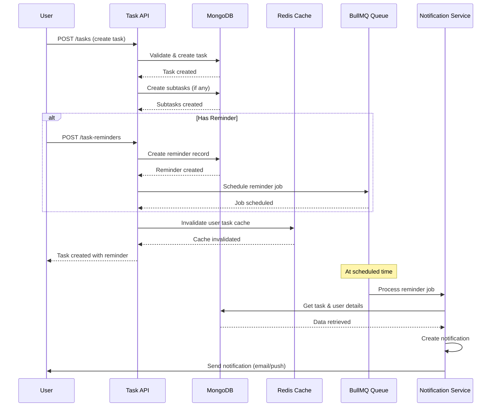
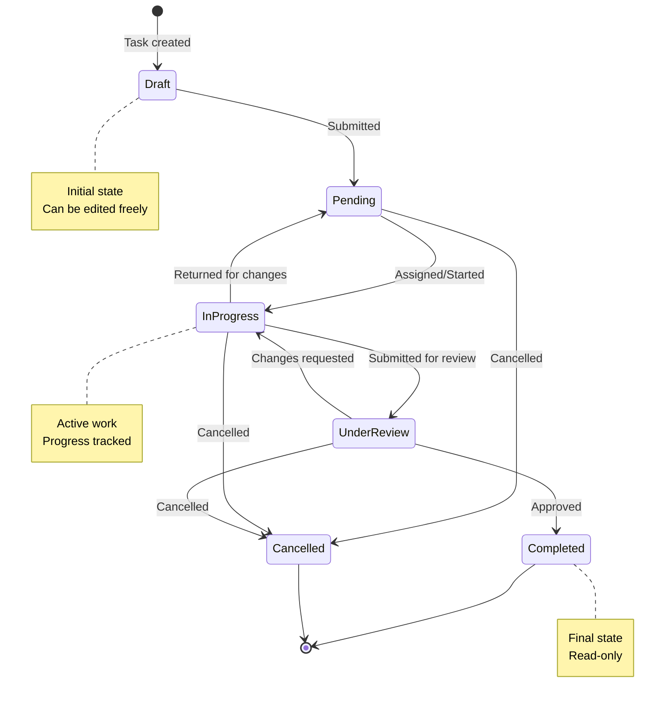
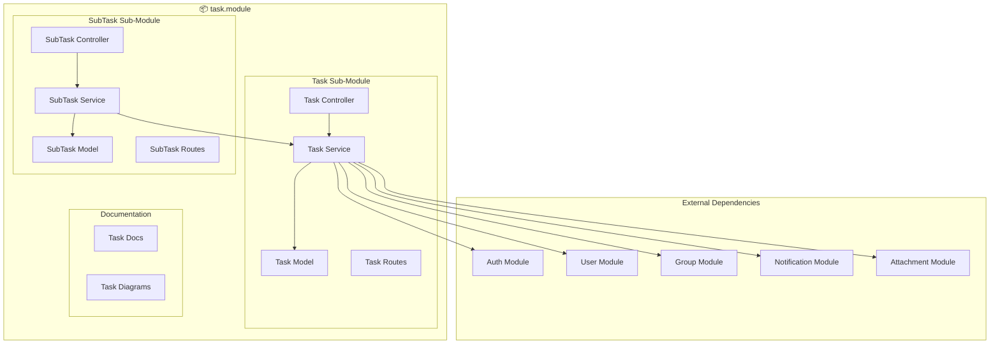
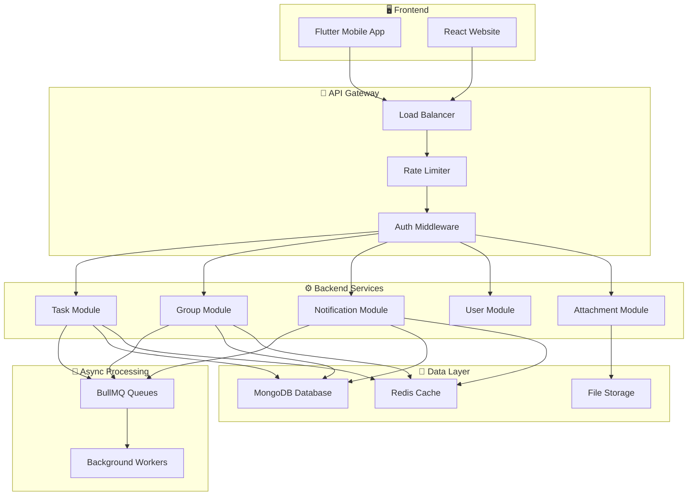
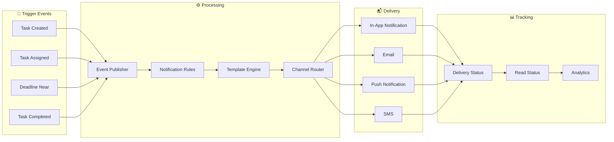
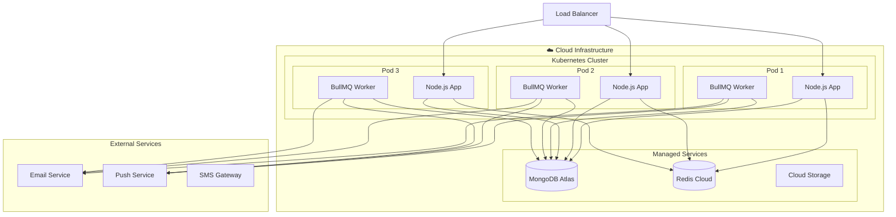

# 📊 Task Module - Comprehensive Diagrams

## Module Level Diagrams

---

## 1. User Journey Map: Task Creation to Completion

```
┌─────────────────────────────────────────────────────────────────────────────────────────────────────────┐
│                                    USER JOURNEY: TASK LIFECYCLE                                        │
├──────────────┬──────────────┬──────────────┬──────────────┬──────────────┬──────────────┬─────────────┤
│   PHASE      │   AWARENESS  │   CREATION   │  ASSIGNMENT  │   PROGRESS   │  COMPLETION  │   REVIEW    │
├──────────────┼──────────────┼──────────────┼──────────────┼──────────────┼──────────────┼─────────────┤
│              │              │              │              │              │              │             │
│  User        │  Realizes    │  Opens app   │  Assigns     │  Works on    │  Marks as    │  Views      │
│  Actions     │  need for    │  creates     │  task to     │  task        │  done        │  completion │
│              │  task        │  task        │  team member │  updates     │  uploads     │  stats      │
│              │              │              │              │  progress    │  attachments │             │
│              │              │              │              │              │              │             │
│  Touchpoints │  Dashboard   │  Task        │  Assignment  │  Task        │  Completion │  Analytics  │
│              │  Notification│  Creation    │  Modal       │  Detail      │  Modal       │  Dashboard  │
│              │              │  Form        │              │  Page        │              │              │
│              │              │              │              │              │              │             │
│  Emotions    │  😐          │  😊          │  🤔          │  😅          │  😃          │  😁         │
│              │  Neutral     │  Satisfied   │  Thinking    │  Effort      │  Relief      │  Happy      │
│              │              │              │              │              │              │              │
│  Pain Points │  Forgets     │  Complex     │  Wrong       │  Loses       │  Forgets to  │  No         │
│              │  tasks       │  form        │  assignee    │  track       │  complete    │  insights   │
│              │              │              │              │              │              │              │
│  System      │  Reminder    │  Auto-save   │  Validation  │  Progress    │  Auto-       │  Stats      │
│  Support     │  Setup       │  Drafts      │  & Confirm   │  Tracking    │  notify      │  Generation │
│              │              │              │              │              │              │              │
└──────────────┴──────────────┴──────────────┴──────────────┴──────────────┴──────────────┴─────────────┘
```

---

## 2. User Flow Diagram: Task Management



---

## 3. Swimlane Diagram: Task Assignment & Collaboration



---

## 4. Sequence Diagram: Task Creation with Reminder



---

## 5. State Machine: Task Status Flow



---

## Parent Module Level (task.module)

---

## 6. Component Architecture: Task Module



---

## Project Level Diagrams

---

## 7. System Architecture: Task Management Ecosystem



---

## 8. Data Flow: End-to-End Task Notification



---

## 9. Deployment Architecture



---

**Last Updated**: 2026-03-06  
**Version**: 1.0.0
