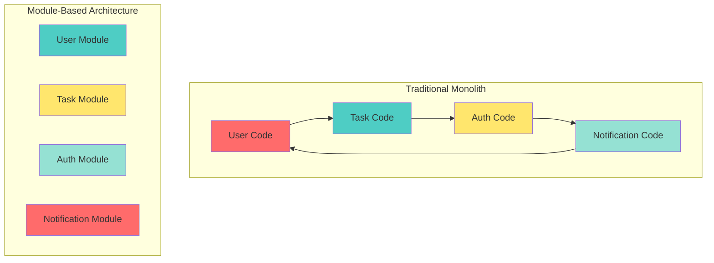
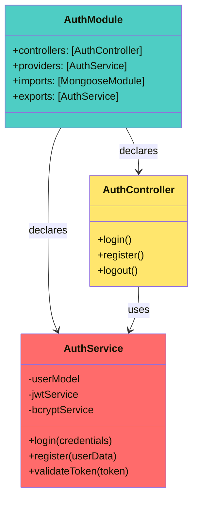
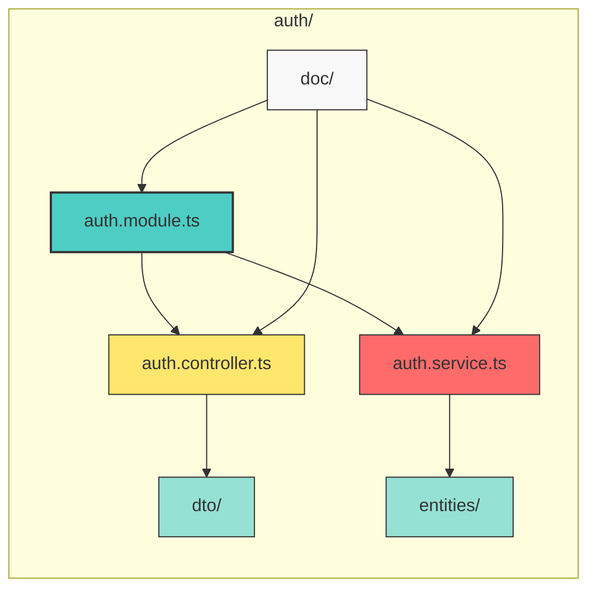
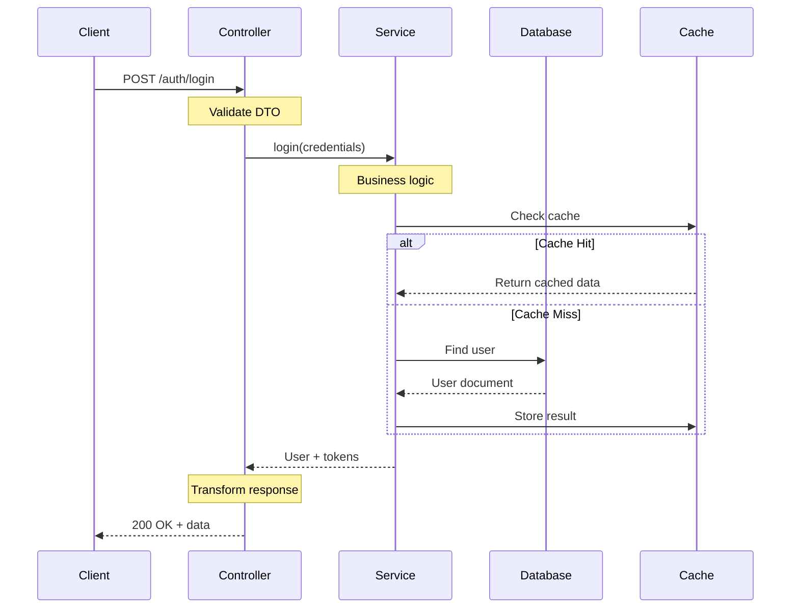
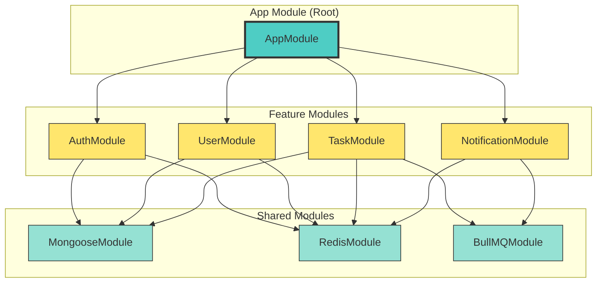
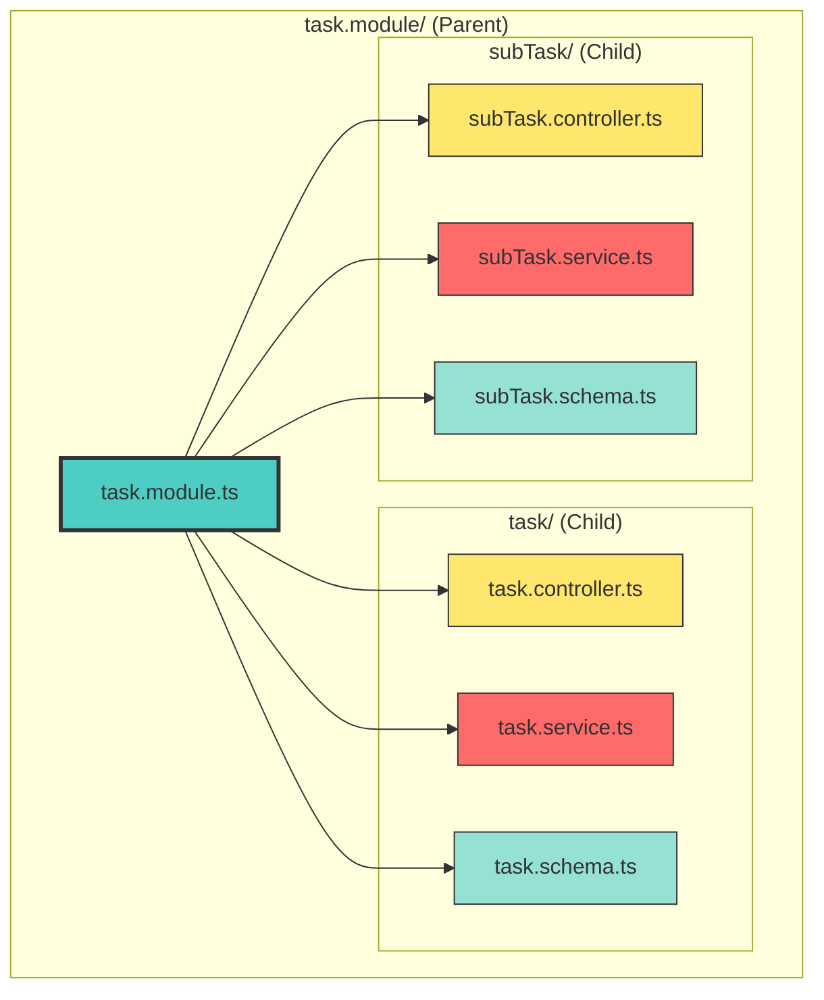
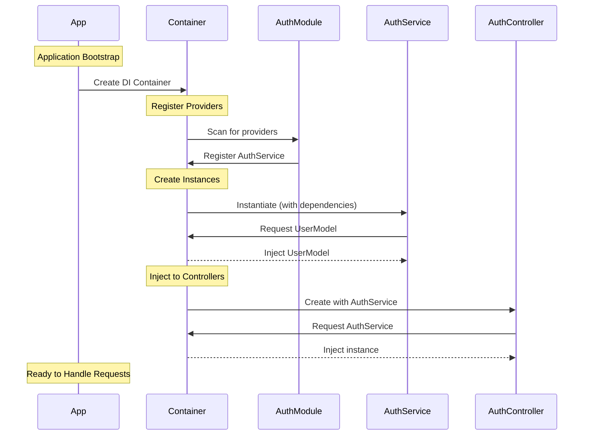
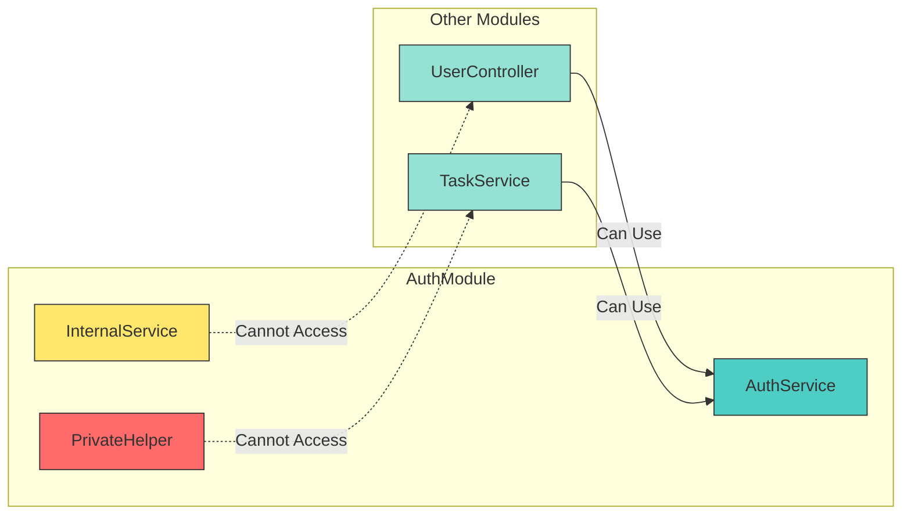

# 📘 **NESTJS MASTERY - Lesson 1: Module Architecture**

**Date**: 18-03-26  
**Level**: 🟢 Beginner → 🔴 Senior Engineer  
**Series**: NestJS Fundamentals  
**Time**: 15 minutes  

---

## 🎯 **LEARNING OBJECTIVES**

After completing this lesson, you will:
1. ✅ Understand NestJS module architecture at a deep level
2. ✅ Know how to structure modules for 1000x scalability
3. ✅ Master the art of grouping related modules
4. ✅ Apply dependency injection correctly in production

---

## 🧠 **MENTAL MODEL: THE MICROSERVICES BOX**

### **Think of Modules as Microservices**



**Key Insight**: Modules are **bounded contexts** - they define clear ownership and responsibility boundaries.

---

## 📐 **MODULE ANATOMY: THE 3-2-1 RULE**

### **Every Module Has 3 Core Files**



**The 3-2-1 Rule**:
- **3 Files**: module.ts, controller.ts, service.ts
- **2 Roles**: Controller (handles HTTP), Service (business logic)
- **1 Purpose**: Single responsibility principle

---

## 🏗️ **MODULE STRUCTURE: PRODUCTION READY**

### **Standard Module Layout**



### **File Responsibilities**

| File | Purpose | Lines of Code |
|------|---------|---------------|
| `auth.module.ts` | Module configuration, imports, exports | 20-30 |
| `auth.controller.ts` | HTTP handlers, request/response | 50-100 |
| `auth.service.ts` | Business logic, database operations | 100-200 |
| `dto/` | Input validation schemas | 20-50 |
| `entities/` | Database schema definitions | 50-100 |
| `doc/` | API documentation, diagrams | As needed |

---

## 🎯 **CONTROLLER VS SERVICE: THE DIVISION**

### **Request Flow Architecture**



### **Responsibility Matrix**

| Responsibility | Controller | Service |
|----------------|------------|---------|
| HTTP Status Codes | ✅ | ❌ |
| Request Validation | ✅ (DTO) | ❌ |
| Response Transformation | ✅ | ❌ |
| Business Logic | ❌ | ✅ |
| Database Queries | ❌ | ✅ |
| Cache Management | ❌ | ✅ |
| External API Calls | ❌ | ✅ |
| Error Handling | ✅ (HTTP) | ✅ (Business) |

---

## 🔗 **MODULE RELATIONSHIPS: IMPORTS & EXPORTS**

### **Module Dependency Graph**



### **Import vs Export Rules**

```typescript
// ✅ GOOD: Clear imports and exports
@Module({
  imports: [
    MongooseModule.forFeature([{ name: 'User', schema: UserSchema }]),
    RedisModule,
    JwtModule,
  ],
  controllers: [AuthController],
  providers: [AuthService],
  exports: [AuthService],  // ← Other modules can use this
})
export class AuthModule {}

// ❌ BAD: Circular dependency
// AuthModule imports UserModule
// UserModule imports AuthModule
// → Application will crash!
```

---

## 📦 **PARENT-CHILD MODULE PATTERN**

### **Task Module with SubTask (Real Example)**



### **Parent Module Configuration**

```typescript
@Module({
  imports: [
    // Register BOTH Task and SubTask schemas
    MongooseModule.forFeature([
      { name: Task.name, schema: TaskSchema },
      { name: SubTask.name, schema: SubTaskSchema },
    ]),
    
    // Shared dependencies
    RedisModule,
    SocketModule,
  ],
  controllers: [
    TaskController,      // Task endpoints
    SubTaskController,   // SubTask endpoints
  ],
  providers: [
    TaskService,         // Task business logic
    SubTaskService,      // SubTask business logic
  ],
  exports: [
    // Export both services for other modules
    TaskService,
    SubTaskService,
    MongooseModule.forFeature([
      { name: Task.name, schema: TaskSchema },
      { name: SubTask.name, schema: SubTaskSchema },
    ]),
  ],
})
export class TaskModule {}
```

**Why This Pattern?**
- ✅ Related modules grouped together
- ✅ Shared documentation at parent level
- ✅ Single import for both Task + SubTask
- ✅ Clear relationship visibility

---

## 🎯 **DEPENDENCY INJECTION: UNDER THE HOOD**

### **How NestJS Creates and Injects Services**



### **Injection Scopes**

```typescript
// ✅ DEFAULT: Singleton (one instance for entire app)
@Injectable()
export class AuthService {
  // Same instance used everywhere
}

// ✅ REQUEST-SCOPED: New instance per request
@Injectable({ scope: Scope.REQUEST })
export class RequestLoggerService {
  // New instance for each HTTP request
}

// ✅ TRANSIENT: New instance every time injected
@Injectable({ scope: Scope.TRANSIENT })
export class EmailSenderService {
  // New instance for each controller/service that uses it
}
```

**Scope Selection Guide**:

| Scope | Use Case | Performance | Memory |
|-------|----------|-------------|--------|
| **DEFAULT** (Singleton) | Services, repositories, utils | ⚡ Fastest | 💾 Lowest |
| **REQUEST** | Request-specific data, user context | 🐌 Slower | 💾 Medium |
| **TRANSIENT** | Stateful services, unique instances | 🐌 Slowest | 💾 Highest |

---

## 🔐 **MODULE ENCAPSULATION**

### **Public vs Private API**



```typescript
@Module({
  imports: [MongooseModule.forFeature([UserSchema])],
  controllers: [AuthController],
  providers: [
    AuthService,           // ← Exported (public API)
    InternalService,       // ← Not exported (private)
    PrivateHelper,         // ← Not exported (private)
  ],
  exports: [AuthService],  // ← Only this is visible to other modules
})
export class AuthModule {}
```

**Encapsulation Rules**:
- ✅ Export only what other modules NEED
- ✅ Keep internal logic private
- ✅ Use exports array as public API boundary

---

## ✅ **MODULE CHECKLIST**

Before committing a module:

```
Module Structure
[ ] Module file created (name.module.ts)
[ ] Controller file created (name.controller.ts)
[ ] Service file created (name.service.ts)
[ ] DTO folder created (dto/)
[ ] Entities folder created (entities/)
[ ] Documentation folder created (doc/)

Module Configuration
[ ] @Module decorator configured
[ ] Controllers array populated
[ ] Providers array populated
[ ] Imports array configured
[ ] Exports array configured (if needed)

Dependency Injection
[ ] Services marked with @Injectable()
[ ] Constructor injection used
[ ] No manual `new Service()` calls
[ ] Circular dependencies checked

Documentation
[ ] README.md created in doc/
[ ] Module diagram created (Mermaid)
[ ] API endpoints documented
[ ] Performance considerations noted
```

---

## 🎯 **KNOWLEDGE CHECK**

### **Question 1: Module Responsibility**

What should be in a controller vs service?

<details>
<summary>💡 Click to reveal answer</summary>

**Controller**: HTTP handling, status codes, request/response transformation, DTO validation

**Service**: Business logic, database queries, cache management, external API calls

**Rule**: Controllers should be THIN (minimal logic), Services should be FAT (all business logic)
</details>

---

### **Question 2: Module Exports**

If UserModule needs to use AuthService, what must AuthModule do?

<details>
<summary>💡 Click to reveal answer</summary>

```typescript
@Module({
  providers: [AuthService],
  exports: [AuthService],  // ← Must export!
})
export class AuthModule {}
```

**Without exports**, AuthService is private to AuthModule only.
</details>

---

### **Question 3: Parent-Child Pattern**

When should you use parent-child module structure?

<details>
<summary>💡 Click to reveal answer</summary>

**When modules are closely related**, like:
- Task + SubTask
- Payment + Subscription
- User + UserProfile + UserRole

**Benefits**: Clear relationship, shared docs, single import
</details>

---

## 📚 **ADDITIONAL RESOURCES**

- **NestJS Official Docs**: [Modules](https://docs.nestjs.com/modules)
- **Dependency Injection**: [Providers](https://docs.nestjs.com/providers)
- **Module Architecture**: [FAQ](https://docs.nestjs.com/faq/common-questions)

---

## 🎓 **HOMEWORK**

1. ✅ Create a new module `CatModule` with controller and service
2. ✅ Register it in `AppModule`
3. ✅ Create 2 endpoints: `GET /cats` and `POST /cats`
4. ✅ Add a Mermaid diagram showing the module structure
5. ✅ Export the service and use it in another module

---

**Next Lesson**: Decorators Deep Dive & Advanced Dependency Injection  
**Date**: 18-03-26  
**Status**: ✅ Complete

---
-18-03-26
