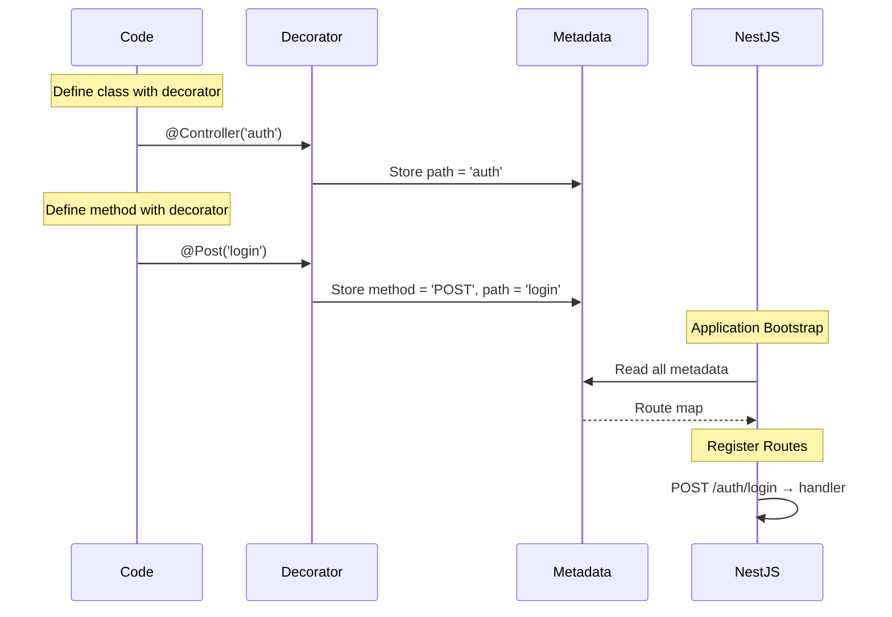
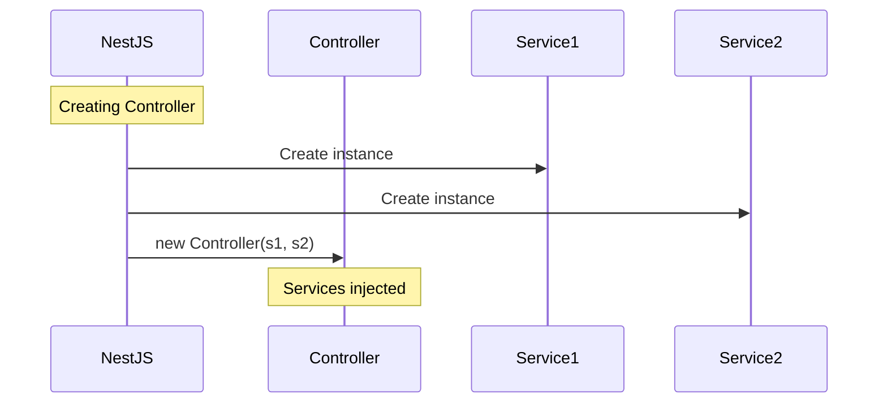
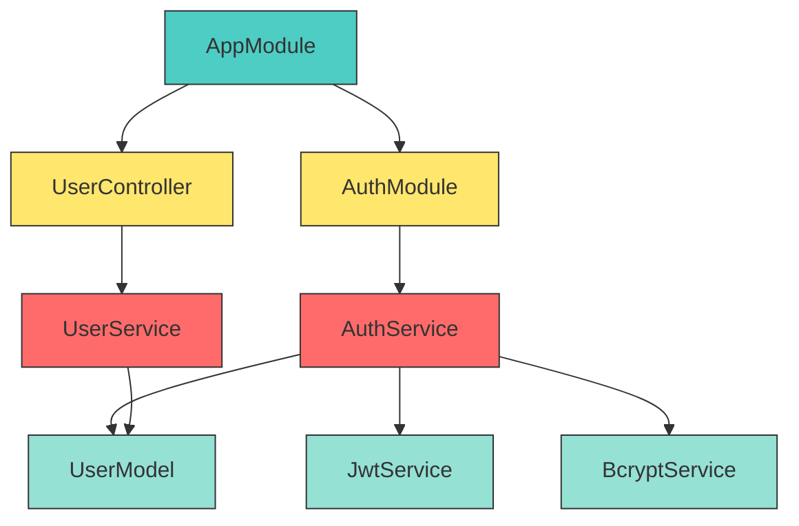
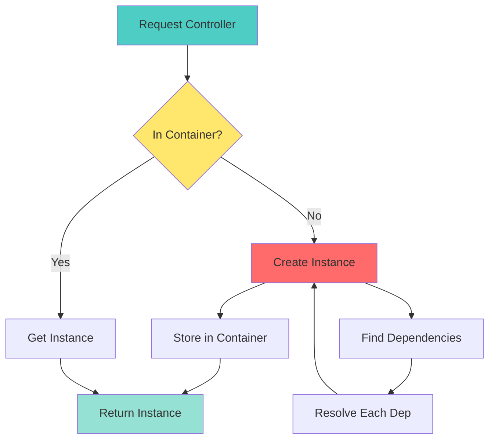
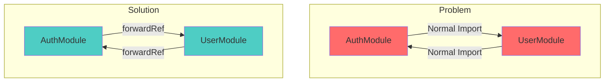

# 📘 **NESTJS MASTERY - Lesson 2: Decorators & Dependency Injection**

**Date**: 18-03-26  
**Level**: 🟢 Beginner → 🔴 Senior Engineer  
**Series**: NestJS Fundamentals  
**Time**: 20 minutes  

---

## 🎯 **LEARNING OBJECTIVES**

After completing this lesson, you will:
1. ✅ Understand how decorators work at the metadata level
2. ✅ Master all common NestJS decorators
3. ✅ Implement dependency injection like a senior engineer
4. ✅ Know when to use different injection patterns

---

## 🎨 **DECORATORS: THE METADATA SYSTEM**

### **What Decorators Really Are**

```mermaid
graph TB
    subgraph "Without Decorators"
        A[Function] --> B[Just Code]
        style A fill:#ff6b6b
        style B fill:#4ecdc4
    end
    
    subgraph "With Decorators"
        C[@Decorator] --> D[Function]
        D --> E[Code + Metadata]
        style C fill:#ffe66d
        style D fill:#ff6b6b
        style E fill:#95e1d3
    end
    
    subgraph "Metadata"
        F[Route Path]
        G[HTTP Method]
        H[Guards]
        I[Interceptors]
        J[Validation Rules]
    end
    
    E --> F
    E --> G
    E --> H
    E --> I
    E --> J
```

**Technical Definition**: Decorators are **functions that add metadata** to classes, methods, properties, or parameters.

---

## 🔬 **DECORATOR ANATOMY**

### **How Decorators Work Internally**



### **Decorator Types**

```mermaid
graph TB
    A[Decorators] --> B[Class Decorators]
    A --> C[Method Decorators]
    A --> D[Property Decorators]
    A --> E[Parameter Decorators]
    
    B --> B1[@Controller]
    B --> B2[@Injectable]
    B --> B3[@Catch]
    
    C --> C1[@Get/@Post/@Put]
    C --> C2[@UseGuards]
    C --> C3[@UseInterceptors]
    
    D --> D1[@Prop]
    
    E --> E1[@Body]
    E --> E2[@Param]
    E --> E3[@Query]
    E --> E4[@Headers]
    
    style A fill:#4ecdc4,stroke:#333,stroke-width:3px
    style B fill:#ffe66d,stroke:#333
    style C fill:#ffe66d,stroke:#333
    style D fill:#ffe66d,stroke:#333
    style E fill:#ffe66d,stroke:#333
```

---

## 🎯 **COMMON DECORATORS DEEP DIVE**

### **1. @Controller() - Route Registration**

```typescript
@Controller('auth')  // Base path: /auth
export class AuthController {
  
  @Post('login')     // POST /auth/login
  async login() {}
  
  @Get('profile')    // GET /auth/profile
  async getProfile() {}
  
  @Delete('logout')  // DELETE /auth/logout
  async logout() {}
}
```

**Route Mapping**:
```mermaid
graph LR
    A[@Controller<br/>'auth'] --> B[/auth/*]
    B --> C[@Post 'login'<br/>/auth/login]
    B --> D[@Get 'profile'<br/>/auth/profile]
    B --> E[@Delete 'logout'<br/>/auth/logout]
    
    style A fill:#4ecdc4,stroke:#333,stroke-width:3px
    style C fill:#ffe66d,stroke:#333
    style D fill:#ffe66d,stroke:#333
    style E fill:#ffe66d,stroke:#333
```

---

### **2. HTTP Method Decorators**

```typescript
@Controller('users')
export class UserController {
  
  @Get()                    // GET /users
  findAll() {}
  
  @Get(':id')               // GET /users/:id
  findOne(@Param('id') id: string) {}
  
  @Post()                   // POST /users
  create(@Body() data: any) {}
  
  @Put(':id')               // PUT /users/:id
  update(@Param('id') id: string, @Body() data: any) {}
  
  @Patch(':id')             // PATCH /users/:id
  updatePartial(@Param('id') id: string, @Body() data: any) {}
  
  @Delete(':id')            // DELETE /users/:id
  delete(@Param('id') id: string) {}
}
```

**HTTP Method Matrix**:

| Decorator | HTTP Method | Use Case | Idempotent |
|-----------|-------------|----------|------------|
| `@Get()` | GET | Retrieve data | ✅ Yes |
| `@Post()` | POST | Create resource | ❌ No |
| `@Put()` | PUT | Replace resource | ✅ Yes |
| `@Patch()` | PATCH | Partial update | ❌ No |
| `@Delete()` | DELETE | Remove resource | ✅ Yes |

---

### **3. Parameter Decorators**

```typescript
@Get('users/:userId/posts/:postId')
async getPost(
  @Param('userId') userId: string,      // From URL: /users/123/...
  @Param('postId') postId: string,      // From URL: /.../posts/456
  @Query('fields') fields?: string,     // From query: ?fields=title,content
  @Query('page') page?: number,         // From query: ?page=2
  @Body() body: CreatePostDto,          // From request body
  @Headers('authorization') auth: string, // From headers
  @Request() req: Request,              // Full request object
) {
  // userId = "123"
  // postId = "456"
  // fields = "title,content"
  // page = 2
}
```

**Parameter Extraction Flow**:
```mermaid
graph TB
    A[HTTP Request] --> B[URL: /users/123/posts/456?fields=title&page=2]
    A --> C[Body: {title, content}]
    A --> D[Headers: {authorization}]
    
    B --> E[@Param 'userId'<br/>→ "123"]
    B --> F[@Param 'postId'<br/>→ "456"]
    B --> G[@Query 'fields'<br/>→ "title,content"]
    B --> H[@Query 'page'<br/>→ 2]
    
    C --> I[@Body<br/>→ {title, content}]
    D --> J[@Headers<br/>→ "Bearer token"]
    
    style A fill:#4ecdc4,stroke:#333
    style E fill:#ffe66d,stroke:#333
    style F fill:#ffe66d,stroke:#333
    style G fill:#ffe66d,stroke:#333
    style H fill:#ffe66d,stroke:#333
    style I fill:#ff6b6b,stroke:#333
    style J fill:#95e1d3,stroke:#333
```

---

### **4. @Injectable() - The DI Marker**

```typescript
// ✅ CORRECT: Marked as injectable
@Injectable()
export class AuthService {
  constructor(
    @InjectModel('User') private userModel: Model<any>,
    private jwtService: JwtService,
  ) {}
}

// ❌ WRONG: Not marked, cannot be injected
export class EmailService {
  // NestJS cannot inject this!
}
```

**How @Injectable() Works**:
```mermaid
graph TB
    subgraph "Without @Injectable()"
        A[EmailService] --> B[Cannot be injected]
        B --> C[Runtime Error]
        style A fill:#ff6b6b
        style B fill:#ffe66d
        style C fill:#ff6b6b
    end
    
    subgraph "With @Injectable()"
        D[@Injectable()] --> E[EmailService]
        E --> F[Can be injected]
        F --> G[NestJS creates instance]
        style D fill:#4ecdc4
        style E fill:#4ecdc4
        style F fill:#95e1d3
        style G fill:#95e1d3
    end
```

---

## 💉 **DEPENDENCY INJECTION PATTERNS**

### **Pattern 1: Constructor Injection (Recommended)**

```typescript
@Controller('auth')
export class AuthController {
  constructor(
    private authService: AuthService,      // Private property
    private jwtService: JwtService,        // Private property
  ) {}
  
  @Post('login')
  async login(@Body() credentials: any) {
    // Can access via this.authService
    return this.authService.login(credentials);
  }
}
```

**Flow**:


---

### **Pattern 2: Property Injection (Not Recommended)**

```typescript
@Controller('auth')
export class AuthController {
  @Inject(AuthService)
  authService: AuthService;  // Property injection
  
  @Post('login')
  async login() {
    return this.authService.login();
  }
}
```

**Why Not Recommended**:
- ❌ Harder to test
- ❌ Less explicit
- ❌ TypeScript cannot infer types properly

---

### **Pattern 3: Method Injection (Rare)**

```typescript
@Controller('auth')
export class AuthController {
  @Post('login')
  async login(
    @Body() body: any,
    @Inject('LOGGER') logger: LoggerService,  // Inject per-method
  ) {
    logger.log('Login attempt');
    return this.authService.login(body);
  }
}
```

**Use Case**: When you need different implementations per call.

---

## 🎯 **ADVANCED DI: INJECTION TOKENS**

### **Named Injections**

```typescript
// Register named provider
@Module({
  providers: [
    {
      provide: 'CONNECTION',  // ← Custom token
      useValue: databaseConnection,
    },
  ],
})
export class DatabaseModule {}

// Inject by name
@Injectable()
export class UserService {
  constructor(
    @Inject('CONNECTION') private connection: any,  // ← Inject by token
  ) {}
}
```

**When to Use**:
- ✅ Third-party libraries without decorators
- ✅ Multiple instances of same class
- ✅ Configuration objects
- ✅ Database connections

---

## 🔄 **DI CONTAINER: BEHIND THE SCENES**

### **NestJS Dependency Resolution**



### **Resolution Algorithm**



---

## 🎯 **CIRCULAR DEPENDENCY SOLUTION**

### **The Circular Dependency Problem**

```typescript
// ❌ WRONG: Circular dependency
// AuthModule imports UserModule
@Module({
  imports: [UserModule],
  providers: [AuthService],
  exports: [AuthService],
})
export class AuthModule {}

// UserModule imports AuthModule
@Module({
  imports: [AuthModule],
  providers: [UserService],
  exports: [UserService],
})
export class UserModule {}

// → Runtime Error: Circular dependency detected!
```

### **Solution: forwardRef()**

```typescript
// ✅ CORRECT: Use forwardRef()
@Module({
  imports: [forwardRef(() => UserModule)],  // ← Defer resolution
  providers: [AuthService],
  exports: [AuthService],
})
export class AuthModule {}

@Module({
  imports: [forwardRef(() => AuthModule)],  // ← Defer resolution
  providers: [UserService],
  exports: [UserService],
})
export class UserModule {}
```

**How forwardRef() Works**:


---

## ✅ **DECORATOR & DI CHECKLIST**

```
Decorators
[ ] @Controller() on all controller classes
[ ] @Injectable() on all service classes
[ ] HTTP method decorators (@Get, @Post, etc.)
[ ] Parameter decorators (@Body, @Param, @Query)
[ ] Validation decorators on DTOs (@IsEmail, @MinLength)

Dependency Injection
[ ] All services marked with @Injectable()
[ ] Constructor injection used (not property)
[ ] No manual `new Service()` calls
[ ] Circular dependencies resolved with forwardRef()
[ ] Custom tokens used for non-class providers

Testing
[ ] Services can be mocked easily
[ ] No hard dependencies on external services
[ ] DI container works in test environment
```

---

## 🎯 **KNOWLEDGE CHECK**

### **Question 1: Decorator Order**

What's the correct order of decorators?

```typescript
// Option A
@Get('users')
@UseGuards(AuthGuard)
async getUsers() {}

// Option B
@UseGuards(AuthGuard)
@Get('users')
async getUsers() {}
```

<details>
<summary>💡 Click to reveal answer</summary>

**Option B is correct!** Decorators execute bottom-to-top.

```typescript
@UseGuards(AuthGuard)  // ← Runs first
@Get('users')          // ← Runs second
async getUsers() {}
```

The route must be registered BEFORE guards are applied.
</details>

---

### **Question 2: Circular Dependency**

When should you use `forwardRef()`?

<details>
<summary>💡 Click to reveal answer</summary>

**When two modules import each other:**

```
AuthModule → UserModule → AuthModule
         ↖_______________↙
```

**Solution**:
```typescript
imports: [forwardRef(() => UserModule)]
```

This defers the resolution until runtime.
</details>

---

### **Question 3: Injection Token**

When do you need `@Inject('TOKEN')`?

<details>
<summary>💡 Click to reveal answer</summary>

**When injecting:**
- Non-class providers (objects, functions, strings)
- Named instances
- Third-party classes without decorators
- Configuration values

**Example**:
```typescript
constructor(
  @Inject('DATABASE_CONNECTION') private db: any,
  @Inject('API_KEY') private apiKey: string,
) {}
```
</details>

---

## 📚 **ADDITIONAL RESOURCES**

- **Decorators**: [NestJS Custom Decorators](https://docs.nestjs.com/custom-decorators)
- **Providers**: [Provider Scopes](https://docs.nestjs.com/fundamentals/injection-scopes)
- **Circular Dependencies**: [Forward Reference](https://docs.nestjs.com/fundamentals/circular-dependency)

---

## 🎓 **HOMEWORK**

1. ✅ Create a custom decorator `@Public()` that bypasses auth guard
2. ✅ Implement constructor injection in 3 different services
3. ✅ Create a circular dependency and solve it with `forwardRef()`
4. ✅ Use `@Inject('TOKEN')` to inject a configuration object
5. ✅ Draw a Mermaid diagram showing your DI graph

---

**Next Lesson**: Guards, Interceptors & Exception Filters  
**Date**: 18-03-26  
**Status**: ✅ Complete

---
-18-03-26
