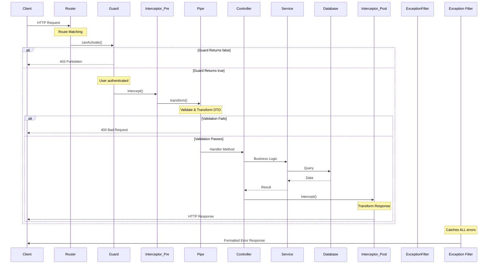
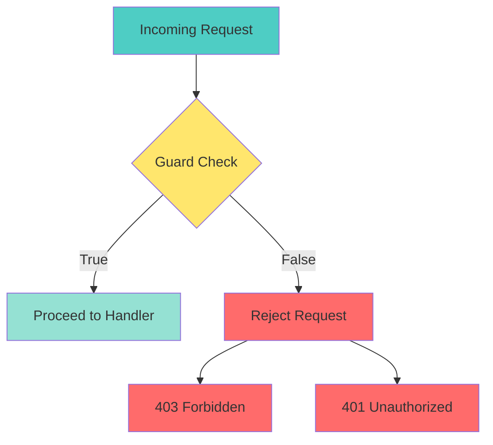
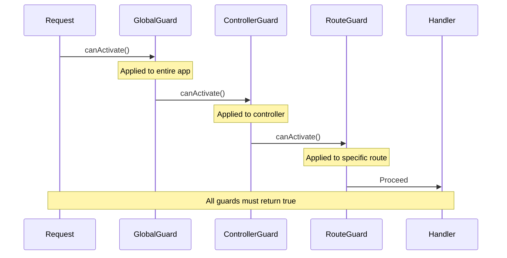
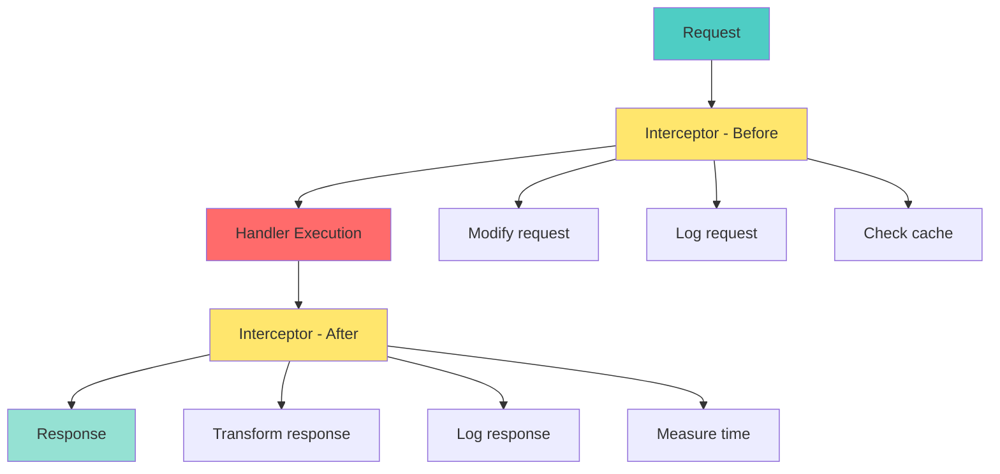
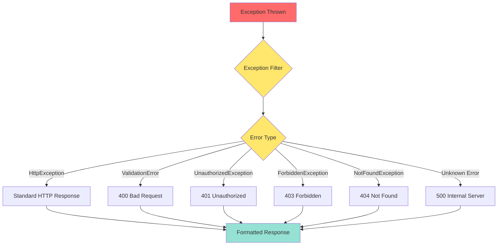
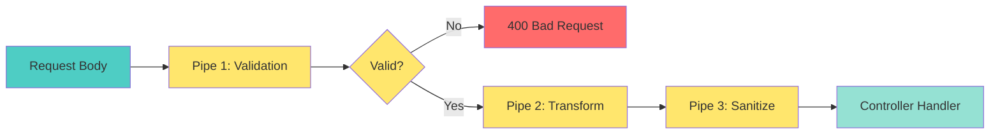
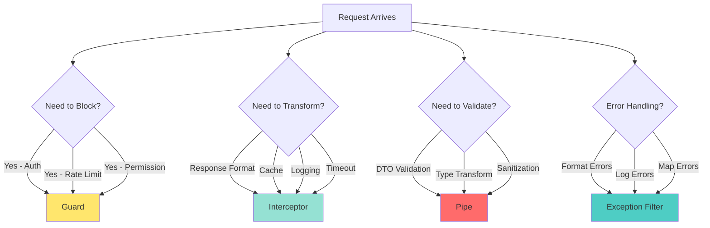

# 📘 **NESTJS MASTERY - Lesson 3: Guards, Interceptors & Exception Filters**

**Date**: 18-03-26  
**Level**: 🟢 Beginner → 🔴 Senior Engineer  
**Series**: NestJS Fundamentals  
**Time**: 45 minutes  
**Prerequisites**: Lesson 1 (Modules), Lesson 2 (Decorators & DI)  

---

## 🎯 **LEARNING OBJECTIVES**

After completing this **comprehensive** lesson, you will:

1. ✅ **Understand the Request Lifecycle** in NestJS at a deep level
2. ✅ **Master Guards** - Authentication, Authorization, Role-based access
3. ✅ **Master Interceptors** - Response transformation, caching, logging, timing
4. ✅ **Master Exception Filters** - Custom error handling, error codes, error formatting
5. ✅ **Master Pipes** - Validation, transformation, custom validators
6. ✅ **Know When to Use What** - Decision matrix for each component
7. ✅ **Production Patterns** - Real-world implementations from enterprise apps

---

## 🔄 **THE NESTJS REQUEST LIFECYCLE**

### **Complete Request Flow Diagram**



**Key Phases**:

| Phase | Component | Purpose | Can Short-Circuit? |
|-------|-----------|---------|-------------------|
| **1. Route Matching** | Router | Find correct handler | ✅ Yes (404) |
| **2. Authentication** | Guards | Check permissions | ✅ Yes (403) |
| **3. Pre-Processing** | Interceptors | Logging, caching | ✅ Yes |
| **4. Validation** | Pipes | Validate input | ✅ Yes (400) |
| **5. Business Logic** | Controller/Service | Process request | ❌ No |
| **6. Post-Processing** | Interceptors | Transform response | ❌ No |
| **7. Error Handling** | Exception Filters | Format errors | ✅ Yes |

---

## 🛡️ **PART 1: GUARDS - THE GATEKEEPERS**

### **What Guards Really Do**

Guards answer **ONE question**: 
> "Should this request be allowed to proceed?"



---

### **Guard Execution Context**

```typescript
@Injectable()
export class AuthGuard implements CanActivate {
  canActivate(
    context: ExecutionContext,  // ← Rich context object
  ): boolean | Promise<boolean> | Observable<boolean> {
    
    // 1. Get request object
    const request = context.switchToHttp().getRequest();
    
    // 2. Get route handler info
    const handler = context.getHandler();
    const classRef = context.getClass();
    
    // 3. Get metadata (from decorators)
    const roles = this.reflector.get<string[]>('roles', handler);
    
    // 4. Make decision
    return this.validate(request, roles);
  }
}
```

**ExecutionContext Properties**:

```mermaid
graph LR
    A[ExecutionContext] --> B[getRequest()]
    A --> C[getResponse()]
    A --> D[getHandler()]
    A --> E[getClass()]
    A --> F[getType()]
    A --> G[getArgs()]
    
    style A fill:#4ecdc4,stroke:#333,stroke-width:3px
    style B fill:#ffe66d,stroke:#333
    style C fill:#ffe66d,stroke:#333
    style D fill:#ffe66d,stroke:#333
    style E fill:#ffe66d,stroke:#333
    style F fill:#ffe66d,stroke:#333
    style G fill:#ffe66d,stroke:#333
```

---

### **Guard Type 1: Authentication Guard**

```typescript
import {
  Injectable,
  CanActivate,
  ExecutionContext,
  UnauthorizedException,
} from '@nestjs/common';
import { JwtService } from '@nestjs/jwt';
import { Observable } from 'rxjs';

@Injectable()
export class AuthGuard implements CanActivate {
  constructor(private jwtService: JwtService) {}

  async canActivate(
    context: ExecutionContext,
  ): Promise<boolean> {
    
    // ─────────────────────────────────────────────
    // Step 1: Extract Request
    // ─────────────────────────────────────────────
    const request = context.switchToHttp().getRequest();
    const token = this.extractTokenFromHeader(request);
    
    // ─────────────────────────────────────────────
    // Step 2: Check if token exists
    // ─────────────────────────────────────────────
    if (!token) {
      throw new UnauthorizedException(
        'Access token not found. Please login first.',
      );
    }
    
    // ─────────────────────────────────────────────
    // Step 3: Verify token
    // ─────────────────────────────────────────────
    try {
      const payload = await this.jwtService.verifyAsync(token, {
        secret: process.env.JWT_SECRET,
      });
      
      // ─────────────────────────────────────────────
      // Step 4: Attach user to request
      // ─────────────────────────────────────────────
      request['user'] = payload;
      request['userId'] = payload.sub;
      
    } catch (error) {
      throw new UnauthorizedException(
        'Invalid or expired token. Please login again.',
      );
    }
    
    // ─────────────────────────────────────────────
    // Step 5: Allow request to proceed
    // ─────────────────────────────────────────────
    return true;
  }

  // ─────────────────────────────────────────────
  // Helper: Extract token from Authorization header
  // ─────────────────────────────────────────────
  private extractTokenFromHeader(request: any): string | undefined {
    const [type, token] = request.headers.authorization?.split(' ') ?? [];
    return type === 'Bearer' ? token : undefined;
  }
}
```

**Usage in Controller**:

```typescript
@Controller('tasks')
@UseGuards(AuthGuard)  // ← Apply to entire controller
export class TaskController {
  
  // All routes require authentication
  @Get()
  findAll(@Request() req) {
    // req.user is available (set by guard)
    return this.taskService.findAll(req.user.userId);
  }
  
  @Get(':id')
  findOne(@Param('id') id: string) {
    return this.taskService.findById(id);
  }
}
```

**Apply to Single Route**:

```typescript
@Controller('auth')
export class AuthController {
  
  // Public route (no guard)
  @Post('login')
  async login(@Body() credentials: any) {
    return this.authService.login(credentials);
  }
  
  // Protected route (guard applied)
  @Post('logout')
  @UseGuards(AuthGuard)  // ← Apply to single route
  async logout(@Request() req) {
    return this.authService.logout(req.user.userId);
  }
}
```

---

### **Guard Type 2: Role-Based Authorization Guard**

```typescript
import {
  Injectable,
  CanActivate,
  ExecutionContext,
  ForbiddenException,
} from '@nestjs/common';
import { Reflector } from '@nestjs/core';
import { Observable } from 'rxjs';

// ─────────────────────────────────────────────
// Custom Decorator: Set required roles
// ─────────────────────────────────────────────
export const Roles = (...roles: string[]) => {
  return SetMetadata('roles', roles);
};

@Injectable()
export class RolesGuard implements CanActivate {
  constructor(private reflector: Reflector) {}

  canActivate(
    context: ExecutionContext,
  ): boolean {
    
    // ─────────────────────────────────────────────
    // Step 1: Get required roles from decorator
    // ─────────────────────────────────────────────
    const requiredRoles = this.reflector.getAllAndOverride<string[]>('roles', [
      context.getHandler(),
      context.getClass(),
    ]);
    
    // ─────────────────────────────────────────────
    // Step 2: If no roles required, allow access
    // ─────────────────────────────────────────────
    if (!requiredRoles || requiredRoles.length === 0) {
      return true;
    }
    
    // ─────────────────────────────────────────────
    // Step 3: Get user from request (set by AuthGuard)
    // ─────────────────────────────────────────────
    const request = context.switchToHttp().getRequest();
    const user = request.user;
    
    if (!user) {
      throw new ForbiddenException('User not authenticated');
    }
    
    // ─────────────────────────────────────────────
    // Step 4: Check if user has required role
    // ─────────────────────────────────────────────
    const hasRole = requiredRoles.some((role) => user.role === role);
    
    if (!hasRole) {
      throw new ForbiddenException(
        `Access denied. Required roles: ${requiredRoles.join(', ')}. ` +
        `Your role: ${user.role}`,
      );
    }
    
    return true;
  }
}
```

**Usage with Decorator**:

```typescript
@Controller('admin')
@UseGuards(AuthGuard, RolesGuard)  // ← Multiple guards
export class AdminController {
  
  // Only admin users can access
  @Get('users')
  @Roles('admin')  // ← Custom decorator
  async getAllUsers() {
    return this.userService.findAll();
  }
  
  // Admin OR moderator can access
  @Post('users')
  @Roles('admin', 'moderator')
  async createUser(@Body() userData: any) {
    return this.userService.create(userData);
  }
  
  // Any authenticated user can access
  @Get('profile')
  @Roles('user', 'admin', 'moderator')
  async getProfile(@Request() req) {
    return req.user;
  }
}
```

---

### **Guard Type 3: Ownership Guard**

```typescript
@Injectable()
export class OwnershipGuard implements CanActivate {
  constructor(
    @InjectModel('Task') private taskModel: Model<any>,
  ) {}

  async canActivate(context: ExecutionContext): Promise<boolean> {
    const request = context.switchToHttp().getRequest();
    const userId = request.user.userId;
    const taskId = request.params.id;
    
    // Check if user owns this task
    const task = await this.taskModel.findById(taskId);
    
    if (!task) {
      throw new NotFoundException('Task not found');
    }
    
    // Check ownership
    const isOwner = task.ownerUserId.toString() === userId;
    
    if (!isOwner) {
      throw new ForbiddenException(
        'You do not have permission to access this resource',
      );
    }
    
    return true;
  }
}
```

**Usage**:

```typescript
@Controller('tasks')
@UseGuards(AuthGuard)
export class TaskController {
  
  @Get(':id')
  @UseGuards(OwnershipGuard)  // ← Check ownership
  async getTask(@Param('id') id: string) {
    return this.taskService.findById(id);
  }
  
  @Put(':id')
  @UseGuards(OwnershipGuard)  // ← Check ownership
  async updateTask(
    @Param('id') id: string,
    @Body() updateData: any,
  ) {
    return this.taskService.update(id, updateData);
  }
}
```

---

### **Guard Type 4: Rate Limiting Guard**

```typescript
@Injectable()
export class RateLimitGuard implements CanActivate {
  constructor(private redisService: RedisService) {}

  async canActivate(context: ExecutionContext): Promise<boolean> {
    const request = context.switchToHttp().getRequest();
    const userId = request.user?.userId || request.ip;
    const route = request.route.path;
    
    // Create unique key
    const key = `ratelimit:${userId}:${route}`;
    
    // Get current count
    const count = await this.redisService.get(key);
    
    if (count && parseInt(count) >= 100) {
      throw new TooManyRequestsException(
        'Rate limit exceeded. Please try again later.',
      );
    }
    
    // Increment counter
    await this.redisService.set(key, (count || 0) + 1, 'EX', 60);
    
    return true;
  }
}
```

---

### **Guard Execution Order**



**Apply Guards at Different Levels**:

```typescript
// ─────────────────────────────────────────────
// Level 1: Global (main.ts)
// ─────────────────────────────────────────────
const app = await NestFactory.create(AppModule);
app.useGlobalGuards(new AuthGuard());  // ← All routes protected

// ─────────────────────────────────────────────
// Level 2: Controller
// ─────────────────────────────────────────────
@Controller('tasks')
@UseGuards(AuthGuard, RolesGuard)  // ← All routes in this controller
export class TaskController {}

// ─────────────────────────────────────────────
// Level 3: Route
// ─────────────────────────────────────────────
@Get(':id')
@UseGuards(OwnershipGuard)  // ← This route only
async getTask() {}
```

---

## 🎯 **PART 2: INTERCEPTORS - THE TRANSFORMERS**

### **What Interceptors Really Do**

Interceptors can:
1. ✅ **Transform** response data before sending
2. ✅ **Transform** request data before handler
3. ✅ **Cache** responses
4. ✅ **Log** requests and responses
5. ✅ **Measure** execution time
6. ✅ **Modify** HTTP status codes
7. ✅ **Handle** errors



---

### **Interceptor Anatomy**

```typescript
import {
  Injectable,
  NestInterceptor,
  ExecutionContext,
  CallHandler,
} from '@nestjs/common';
import { Observable } from 'rxjs';
import { map } from 'rxjs/operators';

@Injectable()
export class TransformInterceptor implements NestInterceptor {
  intercept(
    context: ExecutionContext,
    next: CallHandler,  // ← Call next handler
  ): Observable<any> {
    
    // ─────────────────────────────────────────────
    // BEFORE Handler Execution
    // ─────────────────────────────────────────────
    const request = context.switchToHttp().getRequest();
    console.log('Before request:', request.method, request.url);
    
    // ─────────────────────────────────────────────
    // Call Handler & Get Response Stream
    // ─────────────────────────────────────────────
    return next.handle().pipe(
      // ─────────────────────────────────────────────
      // AFTER Handler Execution
      // ─────────────────────────────────────────────
      map((data) => {
        console.log('After response:', data);
        
        // Transform response
        return {
          success: true,
          data: data,
          timestamp: new Date().toISOString(),
        };
      }),
    );
  }
}
```

---

### **Interceptor Type 1: Response Transformation**

```typescript
import {
  Injectable,
  NestInterceptor,
  ExecutionContext,
  CallHandler,
} from '@nestjs/common';
import { Observable } from 'rxjs';
import { map } from 'rxjs/operators';

export interface Response<T> {
  success: boolean;
  data: T;
  message?: string;
  timestamp: string;
  path?: string;
}

@Injectable()
export class TransformResponseInterceptor<T>
  implements NestInterceptor<T, Response<T>>
{
  intercept(
    context: ExecutionContext,
    next: CallHandler,
  ): Observable<Response<T>> {
    
    const request = context.switchToHttp().getRequest();
    const response = context.switchToHttp().getResponse();
    
    return next.handle().pipe(
      map((data) => {
        // ─────────────────────────────────────────────
        // Standard Response Format
        // ─────────────────────────────────────────────
        return {
          success: true,
          data: data,
          message: this.getMessageByStatus(response.statusCode),
          timestamp: new Date().toISOString(),
          path: request.url,
        };
      }),
    );
  }

  // ─────────────────────────────────────────────
  // Helper: Get message by HTTP status code
  // ─────────────────────────────────────────────
  private getMessageByStatus(statusCode: number): string {
    const messages: Record<number, string> = {
      200: 'Request successful',
      201: 'Resource created successfully',
      204: 'Resource deleted successfully',
    };
    return messages[statusCode] || 'OK';
  }
}
```

**Response Transformation Example**:

```typescript
// Without Interceptor
{
  "_id": "123",
  "name": "John",
  "email": "john@example.com"
}

// With TransformResponseInterceptor
{
  "success": true,
  "data": {
    "_id": "123",
    "name": "John",
    "email": "john@example.com"
  },
  "message": "Request successful",
  "timestamp": "2026-03-18T10:30:00.000Z",
  "path": "/users/123"
}
```

---

### **Interceptor Type 2: Logging Interceptor**

```typescript
import {
  Injectable,
  NestInterceptor,
  ExecutionContext,
  CallHandler,
  Logger,
} from '@nestjs/common';
import { Observable } from 'rxjs';
import { tap } from 'rxjs/operators';

@Injectable()
export class LoggingInterceptor implements NestInterceptor {
  private readonly logger = new Logger('HTTP');

  intercept(
    context: ExecutionContext,
    next: CallHandler,
  ): Observable<any> {
    const request = context.switchToHttp().getRequest();
    const response = context.switchToHttp().getResponse();
    const { method, url, body, headers, user } = request;
    
    // ─────────────────────────────────────────────
    // BEFORE Request
    // ─────────────────────────────────────────────
    const startTime = Date.now();
    this.logger.log(
      `\n${'='.repeat(50)}\n` +
      `📥 Incoming Request\n` +
      `${'='.repeat(50)}\n` +
      `Method: ${method}\n` +
      `URL: ${url}\n` +
      `User: ${user?.email || 'Anonymous'}\n` +
      `Body: ${JSON.stringify(body, null, 2)}\n` +
      `${'='.repeat(50)}`,
    );
    
    // ─────────────────────────────────────────────
    // AFTER Response
    // ─────────────────────────────────────────────
    return next.handle().pipe(
      tap((data) => {
        const duration = Date.now() - startTime;
        const statusCode = response.statusCode;
        
        this.logger.log(
          `\n${'='.repeat(50)}\n` +
          `📤 Outgoing Response\n` +
          `${'='.repeat(50)}\n` +
          `Status: ${statusCode}\n` +
          `Duration: ${duration}ms\n` +
          `Response: ${JSON.stringify(data, null, 2)}\n` +
          `${'='.repeat(50)}\n`,
        );
        
        // Log slow requests
        if (duration > 1000) {
          this.logger.warn(
            `⚠️ Slow request detected: ${method} ${url} (${duration}ms)`,
          );
        }
      }),
    );
  }
}
```

**Sample Log Output**:
```
==================================================
📥 Incoming Request
==================================================
Method: POST
URL: /auth/login
User: Anonymous
Body: {
  "email": "user@example.com",
  "password": "***"
}
==================================================

==================================================
📤 Outgoing Response
==================================================
Status: 200
Duration: 45ms
Response: {
  "success": true,
  "data": { "user": {...}, "token": "..." }
}
==================================================
```

---

### **Interceptor Type 3: Caching Interceptor**

```typescript
import {
  Injectable,
  NestInterceptor,
  ExecutionContext,
  CallHandler,
} from '@nestjs/common';
import { Observable, of } from 'rxjs';
import { delay } from 'rxjs/operators';

@Injectable()
export class CacheInterceptor implements NestInterceptor {
  private cache = new Map<string, { data: any; timestamp: number }>();
  private readonly TTL = 300000; // 5 minutes

  intercept(
    context: ExecutionContext,
    next: CallHandler,
  ): Observable<any> {
    const request = context.switchToHttp().getRequest();
    const response = context.switchToHttp().getResponse();
    
    // Only cache GET requests
    if (request.method !== 'GET') {
      return next.handle();
    }
    
    // Generate cache key
    const key = this.generateCacheKey(request);
    
    // Check cache
    const cachedItem = this.cache.get(key);
    
    if (cachedItem && !this.isExpired(cachedItem.timestamp)) {
      // Cache hit
      response.header('X-Cache', 'HIT');
      response.header('X-Cache-Age', Math.floor((Date.now() - cachedItem.timestamp) / 1000));
      return of(cachedItem.data);
    }
    
    // Cache miss - execute handler
    response.header('X-Cache', 'MISS');
    
    return next.handle().pipe(
      delay(0), // Simulate async operation
      tap((data) => {
        // Store in cache
        this.cache.set(key, {
          data,
          timestamp: Date.now(),
        });
      }),
    );
  }

  // ─────────────────────────────────────────────
  // Helper: Generate cache key from request
  // ─────────────────────────────────────────────
  private generateCacheKey(request: any): string {
    const { url, query } = request;
    const queryString = JSON.stringify(query);
    return `cache:${url}:${queryString}`;
  }

  // ─────────────────────────────────────────────
  // Helper: Check if cache entry is expired
  // ─────────────────────────────────────────────
  private isExpired(timestamp: number): boolean {
    return Date.now() - timestamp > this.TTL;
  }
}
```

---

### **Interceptor Type 4: Timeout Interceptor**

```typescript
import {
  Injectable,
  NestInterceptor,
  ExecutionContext,
  CallHandler,
  RequestTimeoutException,
} from '@nestjs/common';
import { Observable, throwError, TimeoutError } from 'rxjs';
import { timeout, catchError } from 'rxjs/operators';

@Injectable()
export class TimeoutInterceptor implements NestInterceptor {
  intercept(
    context: ExecutionContext,
    next: CallHandler,
  ): Observable<any> {
    return next.handle().pipe(
      timeout(5000), // 5 second timeout
      catchError((err) => {
        if (err instanceof TimeoutError) {
          return throwError(() => new RequestTimeoutException(
            'Request timeout. The server took too long to respond.',
          ));
        }
        return throwError(() => err);
      }),
    );
  }
}
```

---

### **Interceptor Type 5: Error Mapping Interceptor**

```typescript
import {
  Injectable,
  NestInterceptor,
  ExecutionContext,
  CallHandler,
  BadGatewayException,
} from '@nestjs/common';
import { Observable, throwError } from 'rxjs';
import { catchError } from 'rxjs/operators';

@Injectable()
export class ErrorsInterceptor implements NestInterceptor {
  intercept(
    context: ExecutionContext,
    next: CallHandler,
  ): Observable<any> {
    return next.handle().pipe(
      catchError((error) => {
        // Map database errors
        if (error.code === 'ECONNREFUSED') {
          return throwError(() => new BadGatewayException(
            'Database connection failed. Please try again later.',
          ));
        }
        
        // Map validation errors
        if (error.name === 'ValidationError') {
          return throwError(() => new BadGatewayException(
            `Validation failed: ${error.message}`,
          ));
        }
        
        // Re-throw original error
        return throwError(() => error);
      }),
    );
  }
}
```

---

## 🎯 **PART 3: EXCEPTION FILTERS - THE ERROR HANDLERS**

### **What Exception Filters Really Do**

Exception filters:
1. ✅ **Catch** all unhandled exceptions
2. ✅ **Format** error responses consistently
3. ✅ **Log** errors for debugging
4. ✅ **Transform** technical errors to user-friendly messages
5. ✅ **Handle** specific error types differently



---

### **Exception Filter Anatomy**

```typescript
import {
  ExceptionFilter,
  Catch,
  ArgumentsHost,
  HttpException,
  HttpStatus,
  Logger,
} from '@nestjs/common';
import { Request, Response } from 'express';

@Catch()  // ← Catch ALL exceptions
export class AllExceptionsFilter implements ExceptionFilter {
  private readonly logger = new Logger('Exceptions');

  catch(exception: unknown, host: ArgumentsHost) {
    const ctx = host.switchToHttp();
    const response = ctx.getResponse<Response>();
    const request = ctx.getRequest<Request>();
    
    // ─────────────────────────────────────────────
    // Determine Status Code
    // ─────────────────────────────────────────────
    const status =
      exception instanceof HttpException
        ? exception.getStatus()
        : HttpStatus.INTERNAL_SERVER_ERROR;
    
    // ─────────────────────────────────────────────
    // Determine Error Message
    // ─────────────────────────────────────────────
    const message =
      exception instanceof HttpException
        ? exception.message
        : 'Internal server error';
    
    // ─────────────────────────────────────────────
    // Log Error
    // ─────────────────────────────────────────────
    this.logger.error(
      `${request.method} ${request.url}`,
      exception instanceof Error ? exception.stack : '',
    );
    
    // ─────────────────────────────────────────────
    // Send Formatted Response
    // ─────────────────────────────────────────────
    response.status(status).json({
      success: false,
      statusCode: status,
      message: message,
      timestamp: new Date().toISOString(),
      path: request.url,
    });
  }
}
```

---

### **Advanced Exception Filter with Error Codes**

```typescript
import {
  ExceptionFilter,
  Catch,
  ArgumentsHost,
  HttpException,
  HttpStatus,
  Logger,
} from '@nestjs/common';
import { Request, Response } from 'express';

// ─────────────────────────────────────────────
// Error Code Enum
// ─────────────────────────────────────────────
export enum ErrorCode {
  // Authentication Errors (1000-1999)
  INVALID_TOKEN = 'AUTH_1001',
  TOKEN_EXPIRED = 'AUTH_1002',
  INVALID_CREDENTIALS = 'AUTH_1003',
  
  // Authorization Errors (2000-2999)
  ACCESS_DENIED = 'AUTH_2001',
  INSUFFICIENT_PERMISSIONS = 'AUTH_2002',
  
  // Validation Errors (3000-3999)
  VALIDATION_FAILED = 'VAL_3001',
  INVALID_INPUT = 'VAL_3002',
  
  // Not Found Errors (4000-4999)
  RESOURCE_NOT_FOUND = 'NOT_FOUND_4001',
  USER_NOT_FOUND = 'NOT_FOUND_4002',
  
  // Database Errors (5000-5999)
  DATABASE_ERROR = 'DB_5001',
  DUPLICATE_ENTRY = 'DB_5002',
  
  // System Errors (9000-9999)
  INTERNAL_ERROR = 'SYS_9001',
  SERVICE_UNAVAILABLE = 'SYS_9002',
}

@Catch()
export class CustomExceptionFilter implements ExceptionFilter {
  private readonly logger = new Logger('Exceptions');

  catch(exception: unknown, host: ArgumentsHost) {
    const ctx = host.switchToHttp();
    const response = ctx.getResponse<Response>();
    const request = ctx.getRequest<Request>();
    
    // ─────────────────────────────────────────────
    // Get Status Code
    // ─────────────────────────────────────────────
    const status =
      exception instanceof HttpException
        ? exception.getStatus()
        : HttpStatus.INTERNAL_SERVER_ERROR;
    
    // ─────────────────────────────────────────────
    // Get Error Code & Message
    // ─────────────────────────────────────────────
    const errorResponse = this.getErrorResponse(exception, status);
    
    // ─────────────────────────────────────────────
    // Log Error with Stack Trace
    // ─────────────────────────────────────────────
    this.logger.error(
      `[${errorResponse.errorCode}] ${request.method} ${request.url}`,
      exception instanceof Error ? exception.stack : '',
    );
    
    // ─────────────────────────────────────────────
    // Send Formatted Response
    // ─────────────────────────────────────────────
    response.status(status).json({
      success: false,
      error: {
        code: errorResponse.errorCode,
        message: errorResponse.message,
        details: errorResponse.details,
      },
      meta: {
        timestamp: new Date().toISOString(),
        path: request.url,
        method: request.method,
      },
    });
  }

  // ─────────────────────────────────────────────
  // Helper: Map Exception to Error Code
  // ─────────────────────────────────────────────
  private getErrorResponse(
    exception: unknown,
    status: number,
  ): { errorCode: ErrorCode; message: string; details?: any } {
    
    if (exception instanceof HttpException) {
      const response = exception.getResponse();
      
      // Check if it's a custom response with error code
      if (typeof response === 'object' && 'errorCode' in response) {
        return {
          errorCode: (response as any).errorCode,
          message: (response as any).message,
          details: (response as any).details,
        };
      }
      
      // Map status codes to error codes
      return {
        errorCode: this.mapStatusToErrorCode(status),
        message: exception.message,
      };
    }
    
    // Unknown error
    return {
      errorCode: ErrorCode.INTERNAL_ERROR,
      message: 'An unexpected error occurred',
    };
  }

  // ─────────────────────────────────────────────
  // Helper: Map HTTP Status to Error Code
  // ─────────────────────────────────────────────
  private mapStatusToErrorCode(status: number): ErrorCode {
    const errorCodes: Record<number, ErrorCode> = {
      400: ErrorCode.VALIDATION_FAILED,
      401: ErrorCode.INVALID_TOKEN,
      403: ErrorCode.ACCESS_DENIED,
      404: ErrorCode.RESOURCE_NOT_FOUND,
      500: ErrorCode.INTERNAL_ERROR,
      503: ErrorCode.SERVICE_UNAVAILABLE,
    };
    
    return errorCodes[status] || ErrorCode.INTERNAL_ERROR;
  }
}
```

**Sample Error Response**:
```json
{
  "success": false,
  "error": {
    "code": "AUTH_1001",
    "message": "Invalid or expired token",
    "details": {
      "reason": "Token signature verification failed"
    }
  },
  "meta": {
    "timestamp": "2026-03-18T10:30:00.000Z",
    "path": "/api/v1/tasks",
    "method": "GET"
  }
}
```

---

### **Specific Exception Filter**

```typescript
// Catch only ValidationErrors
@Catch(ValidationError)
export class ValidationExceptionFilter implements ExceptionFilter {
  catch(exception: ValidationError, host: ArgumentsHost) {
    const ctx = host.switchToHttp();
    const response = ctx.getResponse<Response>();
    
    response.status(400).json({
      success: false,
      error: {
        code: ErrorCode.VALIDATION_FAILED,
        message: 'Validation failed',
        details: exception.errors.map((err) => ({
          field: err.property,
          constraints: err.constraints,
        })),
      },
    });
  }
}

// Catch only TypeORM errors
@Catch(TypeORMError)
export class DatabaseExceptionFilter implements ExceptionFilter {
  catch(exception: TypeORMError, host: ArgumentsHost) {
    const ctx = host.switchToHttp();
    const response = ctx.getResponse<Response>();
    
    // Handle duplicate key errors
    if (exception.code === '23505') {
      response.status(409).json({
        success: false,
        error: {
          code: ErrorCode.DUPLICATE_ENTRY,
          message: 'A record with this value already exists',
        },
      });
      return;
    }
    
    // Generic database error
    response.status(500).json({
      success: false,
      error: {
        code: ErrorCode.DATABASE_ERROR,
        message: 'Database operation failed',
      },
    });
  }
}
```

---

## 🎯 **PART 4: PIPES - THE VALIDATORS**

### **What Pipes Really Do**

Pipes:
1. ✅ **Validate** input data
2. ✅ **Transform** data (string → number, etc.)
3. ✅ **Sanitize** input (remove XSS)
4. ✅ **Parse** JSON, dates, etc.



---

### **Built-in Pipes**

```typescript
@Get(':id')
async findOne(
  @Param('id', ParseIntPipe) id: number,  // ← Transform to number
) {
  return this.userService.findById(id);
}

@Get()
async findAll(
  @Query('page', new DefaultValuePipe(1), ParseIntPipe) page: number,
  @Query('limit', new DefaultValuePipe(10), ParseIntPipe) limit: number,
) {
  return this.userService.findAll({ page, limit });
}

@Post()
async create(
  @Body(new ValidationPipe({ transform: true })) createUserDto: CreateUserDto,
) {
  return this.userService.create(createUserDto);
}
```

---

### **Custom Validation Pipe**

```typescript
import {
  PipeTransform,
  Injectable,
  ArgumentMetadata,
  BadRequestException,
} from '@nestjs/common';
import { validate } from 'class-validator';
import { plainToClass } from 'class-transformer';

@Injectable()
export class CustomValidationPipe implements PipeTransform<any> {
  async transform(value: any, metadata: ArgumentMetadata) {
    // ─────────────────────────────────────────────
    // Skip if not an object
    // ─────────────────────────────────────────────
    if (!value || typeof value !== 'object') {
      return value;
    }
    
    // ─────────────────────────────────────────────
    // Skip if no metadata type
    // ─────────────────────────────────────────────
    if (!metadata.metatype) {
      return value;
    }
    
    // ─────────────────────────────────────────────
    // Transform plain object to class instance
    // ─────────────────────────────────────────────
    const object = plainToClass(metadata.metatype, value);
    
    // ─────────────────────────────────────────────
    // Validate
    // ─────────────────────────────────────────────
    const errors = await validate(object);
    
    if (errors.length > 0) {
      throw new BadRequestException({
        success: false,
        error: {
          code: ErrorCode.VALIDATION_FAILED,
          message: 'Validation failed',
          details: errors.map((err) => ({
            field: err.property,
            constraints: err.constraints,
          })),
        },
      });
    }
    
    return object;
  }
}
```

---

## 🎯 **PART 5: DECISION MATRIX**

### **When to Use What**



### **Component Comparison**

| Feature | Guard | Interceptor | Pipe | Exception Filter |
|---------|-------|-------------|------|------------------|
| **Before Handler** | ✅ | ✅ | ✅ | ❌ |
| **After Handler** | ❌ | ✅ | ❌ | ❌ |
| **Can Block** | ✅ | ✅ | ✅ | ❌ |
| **Transform Data** | ❌ | ✅ | ✅ | ❌ |
| **Catch Errors** | ❌ | ❌ | ❌ | ✅ |
| **Use Case** | Auth, Permissions | Caching, Logging | Validation | Error Formatting |

---

## ✅ **PRODUCTION CHECKLIST**

```
Guards
[ ] AuthGuard implemented with JWT
[ ] RolesGuard for role-based access
[ ] OwnershipGuard for resource access
[ ] RateLimitGuard for API protection
[ ] Guards applied at correct level (global/controller/route)

Interceptors
[ ] TransformResponseInterceptor for consistent format
[ ] LoggingInterceptor for request/response logging
[ ] CacheInterceptor for GET endpoints
[ ] TimeoutInterceptor for long operations
[ ] Error mapping interceptor for external services

Exception Filters
[ ] Global exception filter registered
[ ] Custom error codes implemented
[ ] Validation errors formatted properly
[ ] Database errors handled
[ ] Stack traces logged (not sent to client)
[ ] Error monitoring integrated (Sentry, etc.)

Pipes
[ ] ValidationPipe registered globally
[ ] DTOs created for all endpoints
[ ] Custom pipes for special validation
[ ] Transform enabled for DTOs
```

---

## 🎯 **KNOWLEDGE CHECK**

### **Question 1: Guard vs Interceptor**

When should you use a Guard vs an Interceptor?

<details>
<summary>💡 Click to reveal answer</summary>

**Use Guard when**:
- You need to **block** the request (authentication, authorization)
- You need to check **permissions**
- You need to verify **ownership**

**Use Interceptor when**:
- You need to **transform** data (before or after)
- You need to **cache** responses
- You need to **log** requests/responses
- You need to **measure** execution time

**Key Difference**: Guards are for **security decisions**, Interceptors are for **data transformation**.
</details>

---

### **Question 2: Pipe vs Interceptor**

When should you use a Pipe vs an Interceptor for validation?

<details>
<summary>💡 Click to reveal answer</summary>

**Use Pipe when**:
- You need to **validate input** (DTO validation)
- You need to **transform types** (string → number)
- You need to **sanitize** input

**Use Interceptor when**:
- You need to validate **across multiple endpoints**
- You need to validate **response data**
- You need to **cache** validation results

**Key Difference**: Pipes are for **per-parameter** validation, Interceptors are for **cross-cutting** concerns.
</details>

---

### **Question 3: Exception Filter Order**

If you have multiple exception filters, which one runs first?

<details>
<summary>💡 Click to reveal answer</summary>

**Specific filters run BEFORE general filters**:

```typescript
@Catch(ValidationError)  // ← Runs first (specific)
export class ValidationExceptionFilter {}

@Catch()  // ← Runs second (catches everything else)
export class AllExceptionsFilter {}
```

**Order**:
1. Specific exception filters (by type)
2. General exception filters (@Catch())
3. Default NestJS exception handler
</details>

---

## 📚 **ADDITIONAL RESOURCES**

- **Guards**: [NestJS Guards](https://docs.nestjs.com/guards)
- **Interceptors**: [NestJS Interceptors](https://docs.nestjs.com/interceptors)
- **Exception Filters**: [Exception Filters](https://docs.nestjs.com/exception-filters)
- **Pipes**: [Pipes](https://docs.nestjs.com/pipes)
- **Custom Decorators**: [Custom Decorators](https://docs.nestjs.com/custom-decorators)

---

## 🎓 **HOMEWORK**

1. ✅ Create an AuthGuard that validates JWT tokens
2. ✅ Create a RolesGuard with custom @Roles() decorator
3. ✅ Create a TransformInterceptor that wraps all responses
4. ✅ Create a LoggingInterceptor with execution time
5. ✅ Create a CustomExceptionFilter with error codes
6. ✅ Create a ValidationPipe using class-validator
7. ✅ Apply all components to a real controller
8. ✅ Test with Postman and verify all responses
9. ✅ Draw a Mermaid diagram showing the request lifecycle
10. ✅ Write unit tests for each component

---

**Next Lesson**: Advanced DTO Patterns & Validation Strategies  
**Date**: 18-03-26  
**Status**: ✅ Complete

---
-18-03-26
