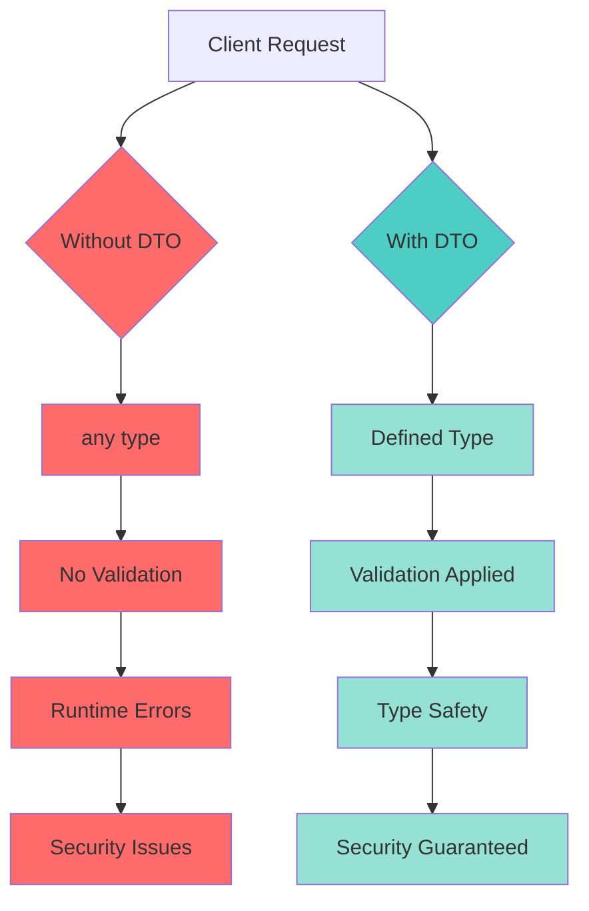
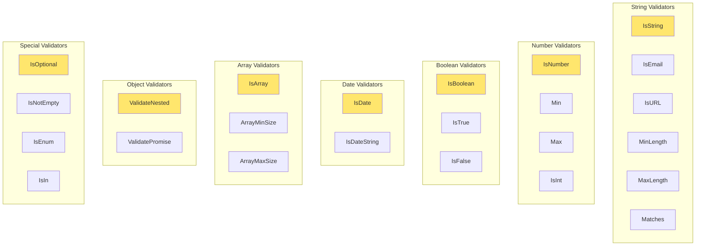
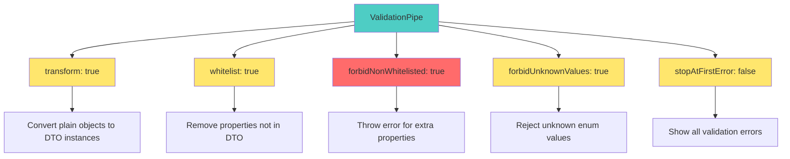

# 📘 **NESTJS MASTERY - Lesson 4: Advanced DTO Patterns & Validation**

**Date**: 18-03-26  
**Level**: 🟢 Beginner → 🔴 Senior Engineer  
**Series**: NestJS Fundamentals  
**Time**: 50 minutes  
**Prerequisites**: Lesson 1 (Modules), Lesson 2 (Decorators & DI), Lesson 3 (Guards/Interceptors/Filters)  

---

## 🎯 **LEARNING OBJECTIVES**

After completing this **comprehensive** lesson, you will:

1. ✅ **Master DTO Fundamentals** - What, why, when, and how
2. ✅ **Understand class-validator Deeply** - All decorators, custom validators
3. ✅ **Master class-transformer** - Automatic type conversion, serialization
4. ✅ **Learn Advanced Validation Patterns** - Conditional validation, nested validation, arrays
5. ✅ **Create Reusable Validation Rules** - Custom decorators, validation utilities
6. ✅ **Implement DTO Inheritance** - Base DTOs, partial DTOs, pick/omit patterns
7. ✅ **Production-Ready Validation** - Real-world examples from enterprise apps

---

## 📦 **PART 1: DTO FUNDAMENTALS**

### **What is a DTO and Why You MUST Use It**

**DTO** = **Data Transfer Object**



**Without DTO (❌ DANGEROUS)**:
```typescript
@Post()
async create(@Body() body: any) {  // ← ANY TYPE!
  // No validation!
  // Could be anything: string, number, null, undefined
  const email = body.email;  // Might not exist
  const age = body.age;      // Might be string "25" instead of number
  return this.service.create(body);
}
```

**With DTO (✅ SAFE)**:
```typescript
@Post()
async create(@Body(new ValidationPipe()) body: CreateUserDto) {
  // Fully validated!
  // email: must be valid email format
  // age: must be number, min 18, max 100
  // All properties typed correctly
  return this.service.create(body);
}
```

---

### **DTO Anatomy: Complete Example**

```typescript
import {
  IsEmail,
  IsString,
  IsNumber,
  MinLength,
  MaxLength,
  IsOptional,
  IsEnum,
  Min,
  Max,
  IsBoolean,
  IsDateString,
} from 'class-validator';

// ─────────────────────────────────────────────
// Enum for Type Safety
// ─────────────────────────────────────────────
export enum UserRole {
  USER = 'user',
  ADMIN = 'admin',
  MODERATOR = 'moderator',
}

// ─────────────────────────────────────────────
// DTO Class
// ─────────────────────────────────────────────
export class CreateUserDto {
  
  // ─────────────────────────────────────────────
  // Required Email Field
  // ─────────────────────────────────────────────
  @ApiProperty({
    description: 'User email address',
    example: 'user@example.com',
    required: true,
  })
  @IsEmail({}, { message: 'Please provide a valid email address' })
  @IsString()
  @MaxLength(255, { message: 'Email must not exceed 255 characters' })
  email: string;
  
  // ─────────────────────────────────────────────
  // Required Password Field with Constraints
  // ─────────────────────────────────────────────
  @ApiProperty({
    description: 'User password (min 8 chars, 1 uppercase, 1 number)',
    example: 'Password123!',
    required: true,
    minLength: 8,
    maxLength: 50,
  })
  @IsString()
  @MinLength(8, { message: 'Password must be at least 8 characters long' })
  @MaxLength(50, { message: 'Password must not exceed 50 characters' })
  @Matches(/^(?=.*[a-z])(?=.*[A-Z])(?=.*\d)/, {
    message: 'Password must contain at least one uppercase letter, one lowercase letter, and one number',
  })
  password: string;
  
  // ─────────────────────────────────────────────
  // Required Name Field
  // ─────────────────────────────────────────────
  @ApiProperty({
    description: 'User full name',
    example: 'John Doe',
    required: true,
    minLength: 2,
    maxLength: 100,
  })
  @IsString()
  @MinLength(2, { message: 'Name must be at least 2 characters' })
  @MaxLength(100, { message: 'Name must not exceed 100 characters' })
  @Matches(/^[a-zA-Z\s]+$/, {
    message: 'Name can only contain letters and spaces',
  })
  name: string;
  
  // ─────────────────────────────────────────────
  // Optional Age Field with Range
  // ─────────────────────────────────────────────
  @ApiPropertyOptional({
    description: 'User age',
    example: 25,
    minimum: 18,
    maximum: 120,
  })
  @IsOptional()  // ← Field is optional
  @IsNumber({}, { message: 'Age must be a number' })
  @Min(18, { message: 'You must be at least 18 years old' })
  @Max(120, { message: 'Age cannot exceed 120 years' })
  age?: number;
  
  // ─────────────────────────────────────────────
  // Optional Role Field with Enum
  // ─────────────────────────────────────────────
  @ApiPropertyOptional({
    description: 'User role',
    enum: UserRole,
    default: UserRole.USER,
  })
  @IsOptional()
  @IsEnum(UserRole, { message: 'Invalid role. Must be one of: user, admin, moderator' })
  role?: UserRole;
  
  // ─────────────────────────────────────────────
  // Optional Boolean Field
  // ─────────────────────────────────────────────
  @ApiPropertyOptional({
    description: 'Whether user agrees to terms',
    example: true,
    default: true,
  })
  @IsOptional()
  @IsBoolean({ message: 'agreeToTerms must be a boolean' })
  agreeToTerms?: boolean;
  
  // ─────────────────────────────────────────────
  // Optional Date Field
  // ─────────────────────────────────────────────
  @ApiPropertyOptional({
    description: 'User date of birth',
    example: '1990-01-15',
  })
  @IsOptional()
  @IsDateString({}, { message: 'Date of birth must be a valid ISO 8601 date' })
  dateOfBirth?: string;
}
```

---

### **Validation Error Response Format**

**Invalid Request**:
```json
POST /users
{
  "email": "invalid-email",
  "password": "123",
  "name": "J",
  "age": "not-a-number",
  "role": "super-admin"
}
```

**Validation Error Response**:
```json
{
  "success": false,
  "error": {
    "code": "VAL_3001",
    "message": "Validation failed",
    "details": [
      {
        "field": "email",
        "constraints": {
          "isEmail": "Please provide a valid email address"
        }
      },
      {
        "field": "password",
        "constraints": {
          "minLength": "Password must be at least 8 characters long"
        }
      },
      {
        "field": "name",
        "constraints": {
          "minLength": "Name must be at least 2 characters"
        }
      },
      {
        "field": "age",
        "constraints": {
          "isNumber": "Age must be a number"
        }
      },
      {
        "field": "role",
        "constraints": {
          "isEnum": "Invalid role. Must be one of: user, admin, moderator"
        }
      }
    ]
  },
  "meta": {
    "timestamp": "2026-03-18T10:30:00.000Z",
    "path": "/users",
    "method": "POST"
  }
}
```

---

## 🎯 **PART 2: CLASS-VALIDATOR DECORATORS**

### **Complete Decorator Reference**



---

### **String Validators Deep Dive**

```typescript
export class ProductDto {
  
  // ─────────────────────────────────────────────
  // Basic String Validation
  // ─────────────────────────────────────────────
  @IsString({ message: 'Title must be a string' })
  @IsNotEmpty({ message: 'Title is required' })
  title: string;
  
  // ─────────────────────────────────────────────
  // Length Constraints
  // ─────────────────────────────────────────────
  @MinLength(3, { message: 'Title must be at least 3 characters' })
  @MaxLength(100, { message: 'Title must not exceed 100 characters' })
  title: string;
  
  // ─────────────────────────────────────────────
  // Email Validation
  // ─────────────────────────────────────────────
  @IsEmail(
    { allow_display_name: true, require_tld: true },
    { message: 'Please provide a valid email address' }
  )
  email: string;
  
  // ─────────────────────────────────────────────
  // URL Validation
  // ─────────────────────────────────────────────
  @IsURL(
    { require_protocol: true, require_tld: true },
    { message: 'Please provide a valid URL with protocol (http/https)' }
  )
  website: string;
  
  // ─────────────────────────────────────────────
  // Regex Pattern Matching
  // ─────────────────────────────────────────────
  @Matches(/^[a-zA-Z0-9_-]+$/, {
    message: 'Username can only contain letters, numbers, underscores, and hyphens',
  })
  username: string;
  
  // ─────────────────────────────────────────────
  // Complex Password Validation
  // ─────────────────────────────────────────────
  @Matches(/^(?=.*[a-z])(?=.*[A-Z])(?=.*\d)(?=.*[@$!%*?&])[A-Za-z\d@$!%*?&]{8,}$/, {
    message: 'Password must contain: 8+ chars, uppercase, lowercase, number, special char',
  })
  password: string;
  
  // ─────────────────────────────────────────────
  // Phone Number Validation
  // ─────────────────────────────────────────────
  @Matches(/^\+?[\d\s-()]+$/, {
    message: 'Please provide a valid phone number',
  })
  phoneNumber: string;
}
```

---

### **Number Validators Deep Dive**

```typescript
export class CreateOrderDto {
  
  // ─────────────────────────────────────────────
  // Basic Number Validation
  // ─────────────────────────────────────────────
  @IsNumber({}, { message: 'Price must be a number' })
  price: number;
  
  // ─────────────────────────────────────────────
  // Range Validation
  // ─────────────────────────────────────────────
  @Min(0, { message: 'Price cannot be negative' })
  @Max(999999.99, { message: 'Price cannot exceed $999,999.99' })
  price: number;
  
  // ─────────────────────────────────────────────
  // Decimal Places
  // ─────────────────────────────────────────────
  @IsNumber({ maxDecimalPlaces: 2 }, { message: 'Price can have max 2 decimal places' })
  price: number;
  
  // ─────────────────────────────────────────────
  // Integer Validation
  // ─────────────────────────────────────────────
  @IsInt({ message: 'Quantity must be an integer' })
  @Min(1, { message: 'Quantity must be at least 1' })
  @Max(10000, { message: 'Quantity cannot exceed 10,000' })
  quantity: number;
  
  // ─────────────────────────────────────────────
  // Positive/Negative Numbers
  // ─────────────────────────────────────────────
  @IsPositive({ message: 'Amount must be positive' })
  amount: number;
  
  @IsNegative({ message: 'Adjustment must be negative' })
  adjustment: number;
}
```

---

### **Array Validators Deep Dive**

```typescript
export class CreateCourseDto {
  
  // ─────────────────────────────────────────────
  // Basic Array Validation
  // ─────────────────────────────────────────────
  @IsArray({ message: 'Tags must be an array' })
  @IsString({ each: true, message: 'Each tag must be a string' })
  tags: string[];
  
  // ─────────────────────────────────────────────
  // Array Size Constraints
  // ─────────────────────────────────────────────
  @ArrayMinSize(1, { message: 'Course must have at least 1 module' })
  @ArrayMaxSize(50, { message: 'Course cannot exceed 50 modules' })
  modules: string[];
  
  // ─────────────────────────────────────────────
  // Array of Objects with Nested Validation
  // ─────────────────────────────────────────────
  @ValidateNested({ each: true })
  @Type(() => LessonDto)
  lessons: LessonDto[];
}

export class LessonDto {
  @IsString()
  @IsNotEmpty()
  title: string;
  
  @IsNumber()
  @Min(1)
  duration: number;
}
```

---

## 🎯 **PART 3: ADVANCED VALIDATION PATTERNS**

### **Pattern 1: Conditional Validation**

```typescript
import {
  IsString,
  IsOptional,
  IsNotEmpty,
  ValidateIf,
  MinLength,
} from 'class-validator';

export class UpdateUserDto {
  
  // ─────────────────────────────────────────────
  // Validate only if 'email' is provided
  // ─────────────────────────────────────────────
  @ValidateIf((object, value) => value !== undefined)
  @IsEmail({}, { message: 'Invalid email format' })
  email?: string;
  
  // ─────────────────────────────────────────────
  // Validate password only if changing password
  // ─────────────────────────────────────────────
  @ValidateIf((object, value) => object.changePassword === true)
  @IsString()
  @MinLength(8, { message: 'Password must be at least 8 characters' })
  newPassword?: string;
  
  // Flag to trigger password validation
  changePassword?: boolean;
  
  // ─────────────────────────────────────────────
  // Validate company only for business users
  // ─────────────────────────────────────────────
  @ValidateIf((object) => object.userType === 'business')
  @IsString()
  @IsNotEmpty()
  company?: string;
  
  userType: 'personal' | 'business';
}
```

**Usage**:
```typescript
// ✅ Valid: Not providing optional field
PATCH /users/123
{
  "name": "John"
}

// ✅ Valid: Providing email (will be validated)
PATCH /users/123
{
  "email": "john@example.com"
}

// ✅ Valid: Changing password with flag
PATCH /users/123
{
  "changePassword": true,
  "newPassword": "NewPassword123!"
}

// ❌ Invalid: changePassword=true but no newPassword
PATCH /users/123
{
  "changePassword": true
}
// Error: newPassword must be at least 8 characters

// ✅ Valid: Business user with company
PATCH /users/123
{
  "userType": "business",
  "company": "Acme Corp"
}

// ❌ Invalid: Business user without company
PATCH /users/123
{
  "userType": "business"
}
// Error: company is required for business users
```

---

### **Pattern 2: Nested DTO Validation**

```typescript
import {
  ValidateNested,
  ValidateIf,
  IsString,
  IsEmail,
  IsNumber,
  Min,
  Max,
} from 'class-validator';
import { Type } from 'class-transformer';

// ─────────────────────────────────────────────
// Address DTO (Nested)
// ─────────────────────────────────────────────
export class AddressDto {
  @IsString()
  @IsNotEmpty()
  street: string;
  
  @IsString()
  @IsNotEmpty()
  city: string;
  
  @IsString()
  @Length(2, 2, { message: 'State must be 2 characters' })
  state: string;
  
  @IsString()
  @Matches(/^\d{5}(-\d{4})?$/, {
    message: 'ZIP code must be 5 digits (or 5+4 format)',
  })
  zipCode: string;
}

// ─────────────────────────────────────────────
// Shipping Info DTO (Nested)
// ─────────────────────────────────────────────
export class ShippingInfoDto {
  @IsString()
  @IsNotEmpty()
  carrier: string;
  
  @ValidateNested()
  @Type(() => AddressDto)
  address: AddressDto;
  
  @IsNumber()
  @Min(0)
  @Max(100)
  insuranceValue: number;
}

// ─────────────────────────────────────────────
// Main Order DTO
// ─────────────────────────────────────────────
export class CreateOrderDto {
  @IsString()
  @IsNotEmpty()
  productId: string;
  
  @IsNumber()
  @Min(1)
  quantity: number;
  
  // ─────────────────────────────────────────────
  // Validate nested AddressDto
  // ─────────────────────────────────────────────
  @ValidateNested()
  @Type(() => AddressDto)
  billingAddress: AddressDto;
  
  // ─────────────────────────────────────────────
  // Conditionally validate shipping (only for physical products)
  // ─────────────────────────────────────────────
  @ValidateIf((object) => object.productType === 'physical')
  @ValidateNested()
  @Type(() => ShippingInfoDto)
  shippingInfo?: ShippingInfoDto;
  
  productType: 'digital' | 'physical';
}
```

**Valid Request**:
```json
{
  "productId": "prod_123",
  "quantity": 2,
  "productType": "physical",
  "billingAddress": {
    "street": "123 Main St",
    "city": "New York",
    "state": "NY",
    "zipCode": "10001"
  },
  "shippingInfo": {
    "carrier": "FedEx",
    "address": {
      "street": "456 Oak Ave",
      "city": "Los Angeles",
      "state": "CA",
      "zipCode": "90001"
    },
    "insuranceValue": 500
  }
}
```

**Invalid Request** (nested validation error):
```json
{
  "productId": "prod_123",
  "quantity": 2,
  "productType": "physical",
  "billingAddress": {
    "street": "123 Main St",
    "city": "New York",
    "state": "N",  // ❌ Must be 2 characters
    "zipCode": "1000"  // ❌ Must be 5 digits
  }
}
```

**Validation Errors**:
```json
{
  "success": false,
  "error": {
    "code": "VAL_3001",
    "message": "Validation failed",
    "details": [
      {
        "field": "billingAddress.state",
        "constraints": {
          "length": "State must be 2 characters"
        }
      },
      {
        "field": "billingAddress.zipCode",
        "constraints": {
          "matches": "ZIP code must be 5 digits (or 5+4 format)"
        }
      }
    ]
  }
}
```

---

### **Pattern 3: DTO Inheritance & Composition**

```typescript
// ─────────────────────────────────────────────
// Base DTO with common fields
// ─────────────────────────────────────────────
export class BaseDto {
  @ApiProperty({ description: 'Record ID', example: 'rec_123' })
  @IsString()
  @IsNotEmpty()
  id: string;
  
  @ApiProperty({ description: 'Created timestamp' })
  @IsDateString()
  createdAt: string;
  
  @ApiProperty({ description: 'Updated timestamp' })
  @IsDateString()
  updatedAt: string;
}

// ─────────────────────────────────────────────
// Create DTO (fields for creation)
// ─────────────────────────────────────────────
export class CreateUserDto {
  @IsEmail()
  email: string;
  
  @IsString()
  @MinLength(8)
  password: string;
  
  @IsString()
  @MinLength(2)
  name: string;
}

// ─────────────────────────────────────────────
// Update DTO (all fields optional)
// ─────────────────────────────────────────────
export class UpdateUserDto {
  @IsOptional()
  @IsEmail()
  email?: string;
  
  @IsOptional()
  @IsString()
  @MinLength(8)
  password?: string;
  
  @IsOptional()
  @IsString()
  @MinLength(2)
  name?: string;
}

// ─────────────────────────────────────────────
// Response DTO (includes all fields + metadata)
// ─────────────────────────────────────────────
export class UserResponseDto extends BaseDto {
  @ApiProperty({ example: 'user@example.com' })
  email: string;
  
  @ApiProperty({ example: 'John Doe' })
  name: string;
  
  @ApiProperty({ example: 'user' })
  role: string;
  
  @ApiProperty({ example: true })
  isActive: boolean;
  
  // Note: password is intentionally excluded
}

// ─────────────────────────────────────────────
// Paginated Response DTO
// ─────────────────────────────────────────────
export class PaginatedUsersDto {
  @ApiProperty({ type: [UserResponseDto] })
  data: UserResponseDto[];
  
  @ApiProperty({ example: 100 })
  total: number;
  
  @ApiProperty({ example: 1 })
  page: number;
  
  @ApiProperty({ example: 10 })
  limit: number;
  
  @ApiProperty({ example: 10 })
  totalPages: number;
}
```

---

### **Pattern 4: Pick/Omit Pattern**

```typescript
import { OmitType, PartialType, PickType } from '@nestjs/swagger';

// ─────────────────────────────────────────────
// Original DTO
// ─────────────────────────────────────────────
export class CreateUserDto {
  @IsEmail()
  email: string;
  
  @IsString()
  @MinLength(8)
  password: string;
  
  @IsString()
  @MinLength(2)
  name: string;
  
  @IsString()
  @IsOptional()
  phone?: string;
  
  @IsString()
  @IsOptional()
  address?: string;
}

// ─────────────────────────────────────────────
// Pick: Select specific fields
// ─────────────────────────────────────────────
export class RegisterDto extends PickType(CreateUserDto, ['email', 'password', 'name']) {
  // Only email, password, and name (phone and address excluded)
}

// ─────────────────────────────────────────────
// Omit: Exclude specific fields
// ─────────────────────────────────────────────
export class UpdateProfileDto extends OmitType(CreateUserDto, ['email', 'password']) {
  // All fields except email and password
}

// ─────────────────────────────────────────────
// Partial: Make all fields optional
// ─────────────────────────────────────────────
export class PartialUpdateUserDto extends PartialType(CreateUserDto) {
  // All fields optional, useful for PATCH requests
}
```

---

## 🎯 **PART 4: CUSTOM VALIDATORS**

### **Creating Custom Validation Decorators**

```typescript
import {
  registerDecorator,
  ValidationOptions,
  ValidatorConstraint,
  ValidatorConstraintInterface,
  ValidationArguments,
} from 'class-validator';

// ─────────────────────────────────────────────
// Method 1: Simple Custom Validator
// ─────────────────────────────────────────────
export function IsPasswordValid(validationOptions?: ValidationOptions) {
  return function (object: Object, propertyName: string) {
    registerDecorator({
      name: 'isPasswordValid',
      target: object.constructor,
      propertyName: propertyName,
      options: validationOptions,
      validator: {
        validate(value: any) {
          // Password must have:
          // - At least 8 characters
          // - 1 uppercase letter
          // - 1 lowercase letter
          // - 1 number
          // - 1 special character
          const passwordRegex = /^(?=.*[a-z])(?=.*[A-Z])(?=.*\d)(?=.*[@$!%*?&])[A-Za-z\d@$!%*?&]{8,}$/;
          return typeof value === 'string' && passwordRegex.test(value);
        },
        defaultMessage() {
          return 'Password must contain at least 8 characters, 1 uppercase, 1 lowercase, 1 number, and 1 special character';
        },
      },
    });
  };
}

// Usage
export class CreateUserDto {
  @IsPasswordValid({ message: 'Weak password' })
  password: string;
}

// ─────────────────────────────────────────────
// Method 2: Custom Validator with Constraints
// ─────────────────────────────────────────────
export function IsAgeRange(
  minAge: number,
  maxAge: number,
  validationOptions?: ValidationOptions,
) {
  return function (object: Object, propertyName: string) {
    registerDecorator({
      name: 'isAgeRange',
      target: object.constructor,
      propertyName: propertyName,
      constraints: [minAge, maxAge],
      options: validationOptions,
      validator: {
        validate(value: any, args: ValidationArguments) {
          const [minAge, maxAge] = args.constraints;
          if (typeof value !== 'number') return false;
          return value >= minAge && value <= maxAge;
        },
        defaultMessage(args: ValidationArguments) {
          const [minAge, maxAge] = args.constraints;
          return `Age must be between ${minAge} and ${maxAge}`;
        },
      },
    });
  };
}

// Usage
export class CreateUserDto {
  @IsAgeRange(18, 120, { message: 'Invalid age range' })
  age: number;
}

// ─────────────────────────────────────────────
// Method 3: Class-Based Custom Validator
// ─────────────────────────────────────────────
@ValidatorConstraint({ name: 'customText', async: false })
export class CustomTextConstraint implements ValidatorConstraintInterface {
  
  validate(text: string, args: ValidationArguments) {
    // Custom validation logic
    if (!text || typeof text !== 'string') {
      return false;
    }
    
    // Text cannot contain profanity (simplified example)
    const profanityList = ['badword1', 'badword2'];
    const hasProfanity = profanityList.some(word => 
      text.toLowerCase().includes(word)
    );
    
    return !hasProfanity;
  }

  defaultMessage(args: ValidationArguments) {
    return 'Text contains inappropriate language';
  }
}

// Usage
export class CreateCommentDto {
  @Validate(CustomTextConstraint, {
    message: 'Comment contains inappropriate language',
  })
  content: string;
}

// ─────────────────────────────────────────────
// Method 4: Async Custom Validator (Database Check)
// ─────────────────────────────────────────────
@ValidatorConstraint({ name: 'isEmailUnique', async: true })
@Injectable()
export class IsEmailUniqueConstraint implements ValidatorConstraintInterface {
  constructor(
    @InjectModel('User') private userModel: Model<any>,
  ) {}

  async validate(email: string, args: ValidationArguments) {
    // Check if email already exists in database
    const existingUser = await this.userModel.findOne({ email });
    return !existingUser;
  }

  defaultMessage(args: ValidationArguments) {
    return 'Email already exists. Please use a different email.';
  }
}

// Usage
export class CreateUserDto {
  @Validate(IsEmailUniqueConstraint, {
    message: 'This email is already registered',
  })
  @IsEmail()
  email: string;
}
```

---

## 🎯 **PART 5: VALIDATION PIPE CONFIGURATION**

### **Global Validation Pipe Setup**

```typescript
// main.ts
async function bootstrap() {
  const app = await NestFactory.create(AppModule);
  
  // ─────────────────────────────────────────────
  // Global Validation Pipe
  // ─────────────────────────────────────────────
  app.useGlobalPipes(
    new ValidationPipe({
      // Transform payloads to DTO class instances
      transform: true,
      
      // Whitelist: Remove properties not in DTO
      whitelist: true,
      
      // Forbid extra properties (throw error)
      forbidNonWhitelisted: true,
      
      // Forbid unknown values in enums
      forbidUnknownValues: true,
      
      // Enable detailed validation errors
      disableErrorMessages: false,
      
      // Transform arrays of objects
      transformRequestObjects: true,
      
      // Validation options
      validatorOptions: {
        // Stop validation on first error
        stopAtFirstError: false,
        
        // Enable debug mode
        validationError: {
          target: false,  // Don't include target object
          value: true,    // Include invalid value
        },
      },
    }),
  );
  
  await app.listen(3000);
}
bootstrap();
```

---

### **Validation Pipe Options Explained**



**Example: whitelist vs forbidNonWhitelisted**

```typescript
// DTO
export class CreateUserDto {
  @IsEmail()
  email: string;
  
  @IsString()
  name: string;
}

// Request
POST /users
{
  "email": "user@example.com",
  "name": "John",
  "role": "admin",  // ← Not in DTO
  "age": 25         // ← Not in DTO
}

// With whitelist: true (default)
// → Extra properties removed silently
{
  "email": "user@example.com",
  "name": "John"
}

// With forbidNonWhitelisted: true
// → Validation error thrown
{
  "success": false,
  "error": {
    "details": [
      {
        "field": "role",
        "constraints": {
          "whitelistValidation": "Property role should not exist"
        }
      },
      {
        "field": "age",
        "constraints": {
          "whitelistValidation": "Property age should not exist"
        }
      }
    ]
  }
}
```

---

## ✅ **PRODUCTION CHECKLIST**

```
DTO Structure
[ ] All request bodies have corresponding DTOs
[ ] All response bodies have corresponding DTOs
[ ] DTOs use proper TypeScript types (no 'any')
[ ] Enums used for fixed sets of values
[ ] Nested DTOs for complex objects

Validation
[ ] All fields have appropriate validators
[ ] Custom validators for business rules
[ ] Conditional validation where needed
[ ] Nested validation for complex objects
[ ] Array validation with size limits

Security
[ ] whitelist: true enabled
[ ] forbidNonWhitelisted: true for strict validation
[ ] forbidUnknownValues: true for enums
[ ] No sensitive data in DTOs (passwords, tokens)
[ ] Input sanitization for XSS prevention

Documentation
[ ] @ApiProperty decorators on all fields
[ ] Examples provided for all fields
[ ] Required/optional clearly marked
[ ] Validation rules documented
[ ] Error response examples provided
```

---

## 🎯 **KNOWLEDGE CHECK**

### **Question 1: DTO vs Interface**

What's the difference between a DTO class and a TypeScript interface?

<details>
<summary>💡 Click to reveal answer</summary>

**DTO Class**:
```typescript
export class CreateUserDto {
  @IsEmail()
  email: string;
}
```
- ✅ Exists at runtime
- ✅ Can have decorators
- ✅ Can be instantiated
- ✅ Used for validation

**Interface**:
```typescript
export interface CreateUser {
  email: string;
}
```
- ❌ Exists only at compile time
- ❌ Cannot have decorators
- ❌ Cannot be instantiated
- ❌ No runtime validation

**Use DTO classes for validation, interfaces for type definitions.**
</details>

---

### **Question 2: whitelist vs forbidNonWhitelisted**

What's the difference between `whitelist: true` and `forbidNonWhitelisted: true`?

<details>
<summary>💡 Click to reveal answer</summary>

**whitelist: true**:
- Removes extra properties silently
- Good for flexibility
- Client sends extra fields → they're ignored

**forbidNonWhitelisted: true**:
- Throws validation error for extra properties
- Strict mode
- Client sends extra fields → 400 Bad Request

**Best Practice**: Use `forbidNonWhitelisted: true` in production for security.
</details>

---

### **Question 3: Conditional Validation**

When should you use `@ValidateIf()` vs making a field optional with `@IsOptional()`?

<details>
<summary>💡 Click to reveal answer</summary>

**@IsOptional()**:
- Field is always optional
- If provided, validation runs
- No conditions

```typescript
@IsOptional()
@IsEmail()
email?: string;
```

**@ValidateIf()**:
- Field validation depends on condition
- Can be required in some cases
- Complex conditions possible

```typescript
@ValidateIf((obj) => obj.userType === 'business')
@IsNotEmpty()
company?: string;
```

**Use @ValidateIf() when validation depends on other fields or conditions.**
</details>

---

## 📚 **ADDITIONAL RESOURCES**

- **class-validator**: [GitHub Repository](https://github.com/typestack/class-validator)
- **class-transformer**: [GitHub Repository](https://github.com/typestack/class-transformer)
- **NestJS Validation**: [Official Docs](https://docs.nestjs.com/techniques/validation)
- **Validation Decorators**: [Complete List](https://github.com/typestack/class-validator#validation-decorators)

---

## 🎓 **HOMEWORK**

1. ✅ Create a complete User module with Create, Update, and Response DTOs
2. ✅ Implement custom password validator with strength rules
3. ✅ Create nested DTOs for Address and Shipping
4. ✅ Implement conditional validation (e.g., company required for business users)
5. ✅ Create async validator for email uniqueness (database check)
6. ✅ Set up global validation pipe with all security options
7. ✅ Create DTO inheritance hierarchy (Base → Create → Update → Response)
8. ✅ Implement PickType and OmitType patterns
9. ✅ Add @ApiProperty decorators with examples for all fields
10. ✅ Test all validation scenarios with Postman

---

**Next Lesson**: Services, Repository Pattern & Business Logic  
**Date**: 18-03-26  
**Status**: ✅ Complete

---
-18-03-26
