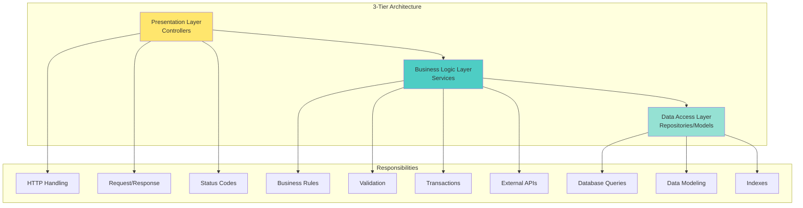
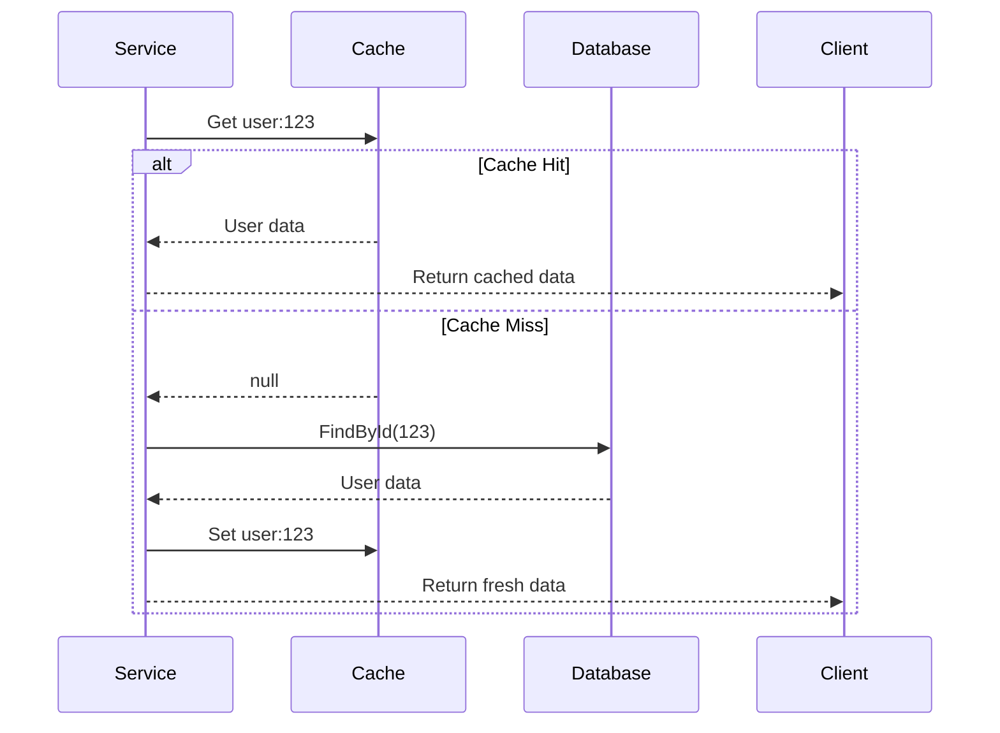
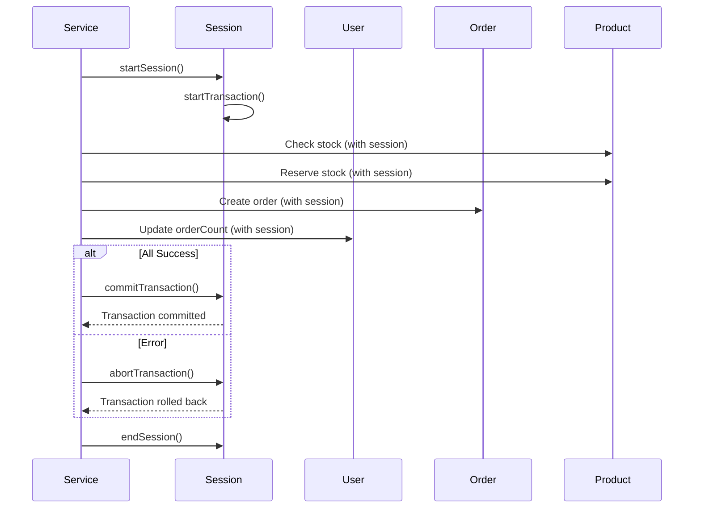
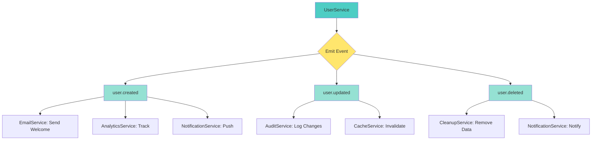
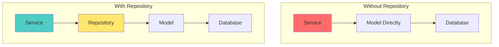

# 📘 **NESTJS MASTERY - Lesson 5: Services & Repository Pattern**

**Date**: 18-03-26  
**Level**: 🟢 Beginner → 🔴 Senior Engineer  
**Series**: NestJS Fundamentals  
**Time**: 55 minutes  
**Prerequisites**: Lesson 1 (Modules), Lesson 2 (Decorators & DI), Lesson 3 (Guards/Interceptors/Filters), Lesson 4 (DTOs & Validation)  

---

## 🎯 **LEARNING OBJECTIVES**

After completing this **comprehensive** lesson, you will:

1. ✅ **Understand Service Layer Architecture** - Purpose, responsibilities, best practices
2. ✅ **Master Service Patterns** - Basic services, stateless services, transactional services
3. ✅ **Implement Repository Pattern** - Data access abstraction, custom repositories
4. ✅ **Learn Service Communication** - Service-to-service calls, event-based communication
5. ✅ **Handle Transactions** - MongoDB sessions, multi-document transactions, rollback
6. ✅ **Implement Caching in Services** - Redis integration, cache-aside pattern, invalidation
7. ✅ **Production-Ready Services** - Error handling, logging, metrics, monitoring

---

## 📦 **PART 1: SERVICE LAYER FUNDAMENTALS**

### **What is a Service and Why It Matters**

**Service Layer** = **Business Logic Layer**



**Without Service Layer (❌ ANTI-PATTERN)**:
```typescript
@Controller('users')
export class UserController {
  @InjectModel('User') private userModel: Model<any>;
  
  // ❌ Business logic in controller
  @Post()
  async create(@Body() dto: CreateUserDto) {
    // Validation logic (should be in service)
    const existingUser = await this.userModel.findOne({ email: dto.email });
    if (existingUser) {
      throw new ConflictException('Email already exists');
    }
    
    // Password hashing (should be in service)
    const hashedPassword = await bcrypt.hash(dto.password, 10);
    
    // Create user (mixed concerns)
    const user = await this.userModel.create({
      ...dto,
      password: hashedPassword,
    });
    
    // Send email (should be in separate service)
    await this.sendWelcomeEmail(user.email);
    
    // Generate token (should be in auth service)
    const token = jwt.sign({ userId: user._id }, process.env.JWT_SECRET);
    
    return { user, token };
  }
  
  // This method doesn't belong in controller!
  private async sendWelcomeEmail(email: string) {
    // Email logic...
  }
}
```

**With Service Layer (✅ CORRECT)**:
```typescript
// Controller (THIN - only HTTP handling)
@Controller('users')
export class UserController {
  constructor(private userService: UserService) {}
  
  @Post()
  async create(@Body() dto: CreateUserDto) {
    // Delegate ALL business logic to service
    return this.userService.create(dto);
  }
}

// Service (FAT - all business logic)
@Injectable()
export class UserService {
  constructor(
    @InjectModel('User') private userModel: Model<any>,
    private bcryptService: BcryptService,
    private emailService: EmailService,
    private jwtService: JwtService,
  ) {}
  
  async create(dto: CreateUserDto) {
    // 1. Check for existing user
    await this.validateEmailUnique(dto.email);
    
    // 2. Hash password
    const hashedPassword = await this.bcryptService.hash(dto.password);
    
    // 3. Create user
    const user = await this.userModel.create({
      ...dto,
      password: hashedPassword,
    });
    
    // 4. Send welcome email
    await this.emailService.sendWelcome(user.email);
    
    // 5. Generate token
    const token = this.jwtService.sign({ userId: user._id });
    
    return { user, token };
  }
  
  private async validateEmailUnique(email: string) {
    const existingUser = await this.userModel.findOne({ email });
    if (existingUser) {
      throw new ConflictException('Email already exists');
    }
  }
}
```

---

### **Service Layer Responsibilities**

```mermaid
graph TB
    A[Service Layer] --> B[Business Logic]
    A --> C[Data Orchestration]
    A --> D[External Integration]
    A --> E[Transaction Management]
    A --> F[Caching]
    A --> G[Event Emission]
    
    B --> B1[Validation Rules]
    B --> B2[Calculations]
    B --> B3[State Changes]
    
    C --> C1[Multiple Models]
    C --> C2[Aggregations]
    C --> C3[Data Transformation]
    
    D --> D1[API Calls]
    D --> D2[Email/SMS]
    D --> D3[File Storage]
    
    E --> E1[Multi-Document]
    E --> E2[Rollback]
    E --> E3[Consistency]
    
    F --> F1[Cache Reads]
    F --> F2[Cache Writes]
    F --> F3[Invalidation]
    
    G --> G1[Domain Events]
    G --> G2[Message Queue]
    G --> G3[Webhooks]
    
    style A fill:#4ecdc4
    style B fill:#ffe66d
    style C fill:#ffe66d
    style D fill:#ffe66d
    style E fill:#ff6b6b
    style F fill:#95e1d3
    style G fill:#95e1d3
```



**DO in Services**:
- ✅ Business logic and rules
- ✅ Data validation (beyond DTO validation)
- ✅ Database transactions
- ✅ External API calls
- ✅ Email/SMS notifications
- ✅ File uploads
- ✅ Caching logic
- ✅ Event emission
- ✅ Error handling and transformation

**DON'T in Services**:
- ❌ HTTP-specific logic (status codes, headers)
- ❌ Request/Response objects
- ❌ Direct controller dependencies
- ❌ UI-specific formatting
- ❌ Console.log (use Logger instead)

---

## 📦 **PART 2: SERVICE PATTERNS**

### **Pattern 1: Basic CRUD Service**

```typescript
import { Injectable, NotFoundException, ConflictException } from '@nestjs/common';
import { InjectModel } from '@nestjs/mongoose';
import { Model, Types } from 'mongoose';
import { CreateUserDto } from './dto/create-user.dto';
import { UpdateUserDto } from './dto/update-user.dto';
import { User, UserDocument } from './user.schema';

@Injectable()
export class UserService {
  constructor(
    @InjectModel(User.name) private userModel: Model<UserDocument>,
  ) {}

  // ─────────────────────────────────────────────
  // CREATE: Create a new user
  // ─────────────────────────────────────────────
  async create(dto: CreateUserDto): Promise<UserDocument> {
    // Check for existing user
    const existingUser = await this.userModel.findOne({ email: dto.email });
    if (existingUser) {
      throw new ConflictException('Email already exists');
    }
    
    // Create user
    const user = await this.userModel.create(dto);
    
    // Populate and return
    return user.populate('createdBy');
  }

  // ─────────────────────────────────────────────
  // FIND ALL: Get all users with pagination
  // ─────────────────────────────────────────────
  async findAll(
    page: number = 1,
    limit: number = 10,
    filters?: any,
  ): Promise<{ data: UserDocument[]; total: number; page: number; totalPages: number }> {
    const query = filters || {};
    query.isDeleted = false;  // Exclude soft-deleted
    
    const [data, total] = await Promise.all([
      this.userModel
        .find(query)
        .skip((page - 1) * limit)
        .limit(limit)
        .sort({ createdAt: -1 })
        .lean(),
      
      this.userModel.countDocuments(query),
    ]);
    
    return {
      data,
      total,
      page,
      totalPages: Math.ceil(total / limit),
    };
  }

  // ─────────────────────────────────────────────
  // FIND ONE: Get user by ID
  // ─────────────────────────────────────────────
  async findById(id: string): Promise<UserDocument> {
    const user = await this.userModel.findById(id);
    
    if (!user || user.isDeleted) {
      throw new NotFoundException('User not found');
    }
    
    return user;
  }

  // ─────────────────────────────────────────────
  // UPDATE: Update user by ID
  // ─────────────────────────────────────────────
  async update(id: string, dto: UpdateUserDto): Promise<UserDocument> {
    // Check if user exists
    await this.findById(id);
    
    // Check email uniqueness (if email is being updated)
    if (dto.email) {
      const existingUser = await this.userModel.findOne({
        email: dto.email,
        _id: { $ne: id },  // Exclude current user
      });
      
      if (existingUser) {
        throw new ConflictException('Email already exists');
      }
    }
    
    // Update user
    const user = await this.userModel.findByIdAndUpdate(
      id,
      dto,
      { new: true, runValidators: true },
    );
    
    return user;
  }

  // ─────────────────────────────────────────────
  // DELETE: Soft delete user
  // ─────────────────────────────────────────────
  async softDelete(id: string): Promise<void> {
    // Check if user exists
    await this.findById(id);
    
    // Soft delete (set flag instead of removing)
    await this.userModel.findByIdAndUpdate(id, {
      isDeleted: true,
      deletedAt: new Date(),
    });
  }

  // ─────────────────────────────────────────────
  // HARD DELETE: Permanently remove user
  // ─────────────────────────────────────────────
  async hardDelete(id: string): Promise<void> {
    const result = await this.userModel.deleteOne({ _id: id });
    
    if (result.deletedCount === 0) {
      throw new NotFoundException('User not found');
    }
  }
}
```

---

### **Pattern 2: Service with Caching**

```typescript
import { Injectable, Inject } from '@nestjs/common';
import { InjectModel } from '@nestjs/mongoose';
import { Model, Types } from 'mongoose';
import { Cache } from 'cache-manager';
import { CACHE_MANAGER } from '@nestjs/cache-manager';
import { User, UserDocument } from './user.schema';

@Injectable()
export class UserServiceWithCache {
  private readonly CACHE_PREFIX = 'user:';
  private readonly CACHE_TTL = 300; // 5 minutes

  constructor(
    @InjectModel(User.name) private userModel: Model<UserDocument>,
    @Inject(CACHE_MANAGER) private cacheManager: Cache,
  ) {}

  // ─────────────────────────────────────────────
  // FIND BY ID with Cache-Aside Pattern
  // ─────────────────────────────────────────────
  async findById(id: string): Promise<UserDocument> {
    const cacheKey = this.getCacheKey(id);
    
    // Step 1: Try to get from cache
    const cachedUser = await this.cacheManager.get(cacheKey);
    if (cachedUser) {
      return cachedUser;
    }
    
    // Step 2: Cache miss - get from database
    const user = await this.userModel.findById(id);
    
    if (!user) {
      throw new NotFoundException('User not found');
    }
    
    // Step 3: Store in cache
    await this.cacheManager.set(cacheKey, user, this.CACHE_TTL * 1000);
    
    return user;
  }

  // ─────────────────────────────────────────────
  // CREATE with Cache Invalidation
  // ─────────────────────────────────────────────
  async create(dto: CreateUserDto): Promise<UserDocument> {
    // Create user
    const user = await this.userModel.create(dto);
    
    // Invalidate cache (we don't know the new ID yet)
    // Could invalidate user list cache
    await this.invalidateListCache();
    
    return user;
  }

  // ─────────────────────────────────────────────
  // UPDATE with Cache Invalidation
  // ─────────────────────────────────────────────
  async update(id: string, dto: UpdateUserDto): Promise<UserDocument> {
    // Update user
    const user = await this.userModel.findByIdAndUpdate(id, dto, { new: true });
    
    // Invalidate cache for this user
    await this.invalidateCache(id);
    
    // Invalidate list cache
    await this.invalidateListCache();
    
    return user;
  }

  // ─────────────────────────────────────────────
  // DELETE with Cache Invalidation
  // ─────────────────────────────────────────────
  async softDelete(id: string): Promise<void> {
    // Soft delete
    await this.userModel.findByIdAndUpdate(id, {
      isDeleted: true,
      deletedAt: new Date(),
    });
    
    // Invalidate cache
    await this.invalidateCache(id);
    await this.invalidateListCache();
  }

  // ─────────────────────────────────────────────
  // Helper: Generate Cache Key
  // ─────────────────────────────────────────────
  private getCacheKey(id: string): string {
    return `${this.CACHE_PREFIX}${id}`;
  }

  // ─────────────────────────────────────────────
  // Helper: Invalidate Single User Cache
  // ─────────────────────────────────────────────
  private async invalidateCache(id: string): Promise<void> {
    const cacheKey = this.getCacheKey(id);
    await this.cacheManager.del(cacheKey);
  }

  // ─────────────────────────────────────────────
  // Helper: Invalidate List Cache
  // ─────────────────────────────────────────────
  private async invalidateListCache(): Promise<void> {
    // Invalidate all user list caches
    const keys = await this.cacheManager.store.keys('user:list:*');
    await Promise.all(keys.map(key => this.cacheManager.del(key)));
  }
}
```

**Cache-Aside Pattern Flow**:


---

### **Pattern 3: Service with Transactions**

```typescript
import { Injectable } from '@nestjs/common';
import { InjectConnection, InjectModel } from '@nestjs/mongoose';
import { Connection, Model } from 'mongoose';
import { User, UserDocument } from './user.schema';
import { Order, OrderDocument } from '../order/order.schema';
import { Product, ProductDocument } from '../product/product.schema';

@Injectable()
export class OrderService {
  constructor(
    @InjectConnection() private connection: Connection,
    @InjectModel(User.name) private userModel: Model<UserDocument>,
    @InjectModel(Order.name) private orderModel: Model<OrderDocument>,
    @InjectModel(Product.name) private productModel: Model<ProductDocument>,
  ) {}

  // ─────────────────────────────────────────────
  // CREATE ORDER with Transaction
  // ─────────────────────────────────────────────
  async createOrder(userId: string, items: OrderItemDto[]): Promise<OrderDocument> {
    // Start session for transaction
    const session = await this.connection.startSession();
    
    try {
      // Start transaction
      session.startTransaction();
      
      // ─────────────────────────────────────────────
      // Step 1: Validate and reserve products
      // ─────────────────────────────────────────────
      for (const item of items) {
        const product = await this.productModel.findById(item.productId).session(session);
        
        if (!product) {
          throw new NotFoundException(`Product ${item.productId} not found`);
        }
        
        if (product.stock < item.quantity) {
          throw new BadRequestException(
            `Product ${product.name} has insufficient stock (${product.stock} < ${item.quantity})`,
          );
        }
        
        // Reserve stock
        await this.productModel.findByIdAndUpdate(
          item.productId,
          { $inc: { stock: -item.quantity } },
          { session },
        );
      }
      
      // ─────────────────────────────────────────────
      // Step 2: Create order
      // ─────────────────────────────────────────────
      const order = await this.orderModel.create(
        [{
          userId,
          items,
          status: 'pending',
          totalAmount: this.calculateTotal(items),
        }],
        { session },
      );
      
      // ─────────────────────────────────────────────
      // Step 3: Update user's order count
      // ─────────────────────────────────────────────
      await this.userModel.findByIdAndUpdate(
        userId,
        { $inc: { orderCount: 1 } },
        { session },
      );
      
      // Commit transaction
      await session.commitTransaction();
      
      return order[0];
      
    } catch (error) {
      // Abort transaction on error
      await session.abortTransaction();
      
      // Re-throw error
      throw error;
      
    } finally {
      // End session
      session.endSession();
    }
  }

  // ─────────────────────────────────────────────
  // CANCEL ORDER with Rollback
  // ─────────────────────────────────────────────
  async cancelOrder(orderId: string): Promise<void> {
    const session = await this.connection.startSession();
    
    try {
      session.startTransaction();
      
      // Get order
      const order = await this.orderModel.findById(orderId).session(session);
      
      if (!order) {
        throw new NotFoundException('Order not found');
      }
      
      if (order.status === 'cancelled') {
        throw new BadRequestException('Order already cancelled');
      }
      
      // ─────────────────────────────────────────────
      // Step 1: Restore product stock
      // ─────────────────────────────────────────────
      for (const item of order.items) {
        await this.productModel.findByIdAndUpdate(
          item.productId,
          { $inc: { stock: item.quantity } },
          { session },
        );
      }
      
      // ─────────────────────────────────────────────
      // Step 2: Update order status
      // ─────────────────────────────────────────────
      await this.orderModel.findByIdAndUpdate(
        orderId,
        {
          status: 'cancelled',
          cancelledAt: new Date(),
        },
        { session },
      );
      
      // ─────────────────────────────────────────────
      // Step 3: Update user's order count
      // ─────────────────────────────────────────────
      await this.userModel.findByIdAndUpdate(
        order.userId,
        { $inc: { orderCount: -1 } },
        { session },
      );
      
      await session.commitTransaction();
      
    } catch (error) {
      await session.abortTransaction();
      throw error;
      
    } finally {
      session.endSession();
    }
  }

  // ─────────────────────────────────────────────
  // Helper: Calculate Order Total
  // ─────────────────────────────────────────────
  private calculateTotal(items: OrderItemDto[]): number {
    return items.reduce((total, item) => {
      return total + (item.price * item.quantity);
    }, 0);
  }
}
```

**Transaction Flow**:


---

### **Pattern 4: Service with Event Emission**

```typescript
import { Injectable } from '@nestjs/common';
import { InjectModel } from '@nestjs/mongoose';
import { Model } from 'mongoose';
import { EventEmitter2 } from '@nestjs/event-emitter';
import { User, UserDocument } from './user.schema';
import { CreateUserDto } from './dto/create-user.dto';

// ─────────────────────────────────────────────
// Event Classes
// ─────────────────────────────────────────────
export class UserCreatedEvent {
  constructor(
    public readonly userId: string,
    public readonly email: string,
    public readonly timestamp: Date,
  ) {}
}

export class UserUpdatedEvent {
  constructor(
    public readonly userId: string,
    public readonly changes: Partial<UserDocument>,
    public readonly timestamp: Date,
  ) {}
}

export class UserDeletedEvent {
  constructor(
    public readonly userId: string,
    public readonly timestamp: Date,
  ) {}
}

@Injectable()
export class UserServiceWithEvents {
  constructor(
    @InjectModel(User.name) private userModel: Model<UserDocument>,
    private eventEmitter: EventEmitter2,
  ) {}

  async create(dto: CreateUserDto): Promise<UserDocument> {
    // Create user
    const user = await this.userModel.create(dto);
    
    // ─────────────────────────────────────────────
    // Emit Event
    // ─────────────────────────────────────────────
    this.eventEmitter.emit(
      'user.created',
      new UserCreatedEvent(user._id.toString(), user.email, new Date()),
    );
    
    return user;
  }

  async update(id: string, dto: UpdateUserDto): Promise<UserDocument> {
    const user = await this.userModel.findByIdAndUpdate(id, dto, { new: true });
    
    // ─────────────────────────────────────────────
    // Emit Event
    // ─────────────────────────────────────────────
    this.eventEmitter.emit(
      'user.updated',
      new UserUpdatedEvent(id, dto, new Date()),
    );
    
    return user;
  }

  async softDelete(id: string): Promise<void> {
    await this.userModel.findByIdAndUpdate(id, {
      isDeleted: true,
      deletedAt: new Date(),
    });
    
    // ─────────────────────────────────────────────
    // Emit Event
    // ─────────────────────────────────────────────
    this.eventEmitter.emit(
      'user.deleted',
      new UserDeletedEvent(id, new Date()),
    );
  }
}

// ─────────────────────────────────────────────
// Event Listeners (in separate files)
// ─────────────────────────────────────────────
@Injectable()
export class UserEventListener {
  constructor(
    private emailService: EmailService,
    private analyticsService: AnalyticsService,
  ) {}

  @OnEvent('user.created')
  async handleUserCreated(event: UserCreatedEvent) {
    // Send welcome email
    await this.emailService.sendWelcome(event.email);
    
    // Track analytics
    await this.analyticsService.track('user_registered', {
      userId: event.userId,
      timestamp: event.timestamp,
    });
  }

  @OnEvent('user.updated')
  async handleUserUpdated(event: UserUpdatedEvent) {
    // Log changes for audit
    await this.auditService.log('user_updated', {
      userId: event.userId,
      changes: event.changes,
    });
  }

  @OnEvent('user.deleted')
  async handleUserDeleted(event: UserDeletedEvent) {
    // Send deletion confirmation
    // Clean up related data
  }
}
```

**Event Flow**:


---

## 📦 **PART 3: REPOSITORY PATTERN**

### **What is Repository Pattern and Why Use It**

**Repository** = **Data Access Abstraction Layer**



**Benefits**:
- ✅ **Separation of Concerns**: Service doesn't know about database
- ✅ **Testability**: Mock repository instead of database
- ✅ **Reusability**: Common queries in one place
- ✅ **Flexibility**: Change database without changing service
- ✅ **Single Responsibility**: Repository handles data access only

---

### **Basic Repository Implementation**

```typescript
import { Injectable } from '@nestjs/common';
import { InjectModel } from '@nestjs/mongoose';
import { Model, Types, Document } from 'mongoose';
import { User, UserDocument } from './user.schema';

@Injectable()
export class UserRepository {
  constructor(
    @InjectModel(User.name) private userModel: Model<UserDocument>,
  ) {}

  // ─────────────────────────────────────────────
  // CREATE
  // ─────────────────────────────────────────────
  async create(data: Partial<UserDocument>): Promise<UserDocument> {
    return this.userModel.create(data);
  }

  // ─────────────────────────────────────────────
  // FIND BY ID
  // ─────────────────────────────────────────────
  async findById(id: string, populate?: string[]): Promise<UserDocument> {
    let query = this.userModel.findById(id);
    
    if (populate && populate.length > 0) {
      populate.forEach(field => {
        query = query.populate(field);
      });
    }
    
    return query.exec();
  }

  // ─────────────────────────────────────────────
  // FIND BY EMAIL
  // ─────────────────────────────────────────────
  async findByEmail(email: string): Promise<UserDocument> {
    return this.userModel.findOne({ email, isDeleted: false });
  }

  // ─────────────────────────────────────────────
  // FIND ALL with Pagination
  // ─────────────────────────────────────────────
  async findAll(
    page: number = 1,
    limit: number = 10,
    filters?: any,
    sortBy: string = '-createdAt',
  ): Promise<{ data: UserDocument[]; total: number }> {
    const query = this.buildQuery(filters);
    
    const [data, total] = await Promise.all([
      this.userModel
        .find(query)
        .sort(sortBy)
        .skip((page - 1) * limit)
        .limit(limit)
        .lean()
        .exec(),
      
      this.userModel.countDocuments(query),
    ]);
    
    return { data, total };
  }

  // ─────────────────────────────────────────────
  // UPDATE
  // ─────────────────────────────────────────────
  async update(id: string, data: Partial<UserDocument>): Promise<UserDocument> {
    return this.userModel
      .findByIdAndUpdate(id, data, { new: true, runValidators: true })
      .exec();
  }

  // ─────────────────────────────────────────────
  // DELETE (Soft)
  // ─────────────────────────────────────────────
  async softDelete(id: string): Promise<void> {
    await this.userModel.findByIdAndUpdate(id, {
      isDeleted: true,
      deletedAt: new Date(),
    });
  }

  // ─────────────────────────────────────────────
  // EXISTS
  // ─────────────────────────────────────────────
  async exists(id: string): Promise<boolean> {
    const count = await this.userModel.countDocuments({
      _id: id,
      isDeleted: false,
    });
    return count > 0;
  }

  // ─────────────────────────────────────────────
  // COUNT
  // ─────────────────────────────────────────────
  async count(filters?: any): Promise<number> {
    const query = this.buildQuery(filters);
    return this.userModel.countDocuments(query);
  }

  // ─────────────────────────────────────────────
  // Helper: Build Query with Filters
  // ─────────────────────────────────────────────
  private buildQuery(filters?: any): any {
    const query: any = { isDeleted: false };
    
    if (filters) {
      if (filters.email) {
        query.email = new RegExp(filters.email, 'i');
      }
      if (filters.role) {
        query.role = filters.role;
      }
      if (filters.isActive !== undefined) {
        query.isActive = filters.isActive;
      }
      if (filters.createdAtFrom) {
        query.createdAt = { $gte: new Date(filters.createdAtFrom) };
      }
      if (filters.createdAtTo) {
        query.createdAt = { ...query.createdAt, $lte: new Date(filters.createdAtTo) };
      }
    }
    
    return query;
  }
}
```

---

### **Service Using Repository**

```typescript
@Injectable()
export class UserService {
  constructor(
    private userRepository: UserRepository,
    private bcryptService: BcryptService,
    private emailService: EmailService,
  ) {}

  async create(dto: CreateUserDto): Promise<UserDocument> {
    // Check email uniqueness (using repository)
    const existingUser = await this.userRepository.findByEmail(dto.email);
    if (existingUser) {
      throw new ConflictException('Email already exists');
    }
    
    // Hash password
    const hashedPassword = await this.bcryptService.hash(dto.password);
    
    // Create user (using repository)
    const user = await this.userRepository.create({
      ...dto,
      password: hashedPassword,
    });
    
    // Send welcome email
    await this.emailService.sendWelcome(user.email);
    
    return user;
  }

  async findById(id: string): Promise<UserDocument> {
    const user = await this.userRepository.findById(id, ['createdBy']);
    
    if (!user) {
      throw new NotFoundException('User not found');
    }
    
    return user;
  }
}
```

---

## ✅ **PRODUCTION CHECKLIST**

```
Service Layer
[ ] All business logic in services (not controllers)
[ ] Services are stateless
[ ] Dependencies injected via constructor
[ ] Proper error handling with try-catch
[ ] Logging implemented (no console.log)
[ ] Transactions for multi-document operations
[ ] Caching implemented for read-heavy operations
[ ] Events emitted for important actions

Repository Pattern
[ ] Data access abstracted in repository
[ ] Common queries reusable
[ ] Query building separated from service logic
[ ] Repository methods are atomic
[ ] Pagination implemented consistently
[ ] Soft delete supported
[ ] Audit fields tracked (createdAt, updatedAt)

Testing
[ ] Services can be unit tested
[ ] Repositories can be mocked
[ ] Integration tests for transactions
[ ] Error scenarios tested
[ ] Performance tested with large datasets
```

---

## 🎯 **KNOWLEDGE CHECK**

### **Question 1: Service vs Controller**

What should be in a Service vs a Controller?

<details>
<summary>💡 Click to reveal answer</summary>

**Controller**:
- HTTP handling (request/response)
- Status codes
- Headers
- DTO validation (via pipes)
- Calling services

**Service**:
- Business logic
- Database operations
- External API calls
- Email/SMS notifications
- Transactions
- Caching
- Event emission

**Rule**: Controllers should be THIN, Services should be FAT.
</details>

---

### **Question 2: Transaction Use Cases**

When should you use transactions in MongoDB?

<details>
<summary>💡 Click to reveal answer</summary>

**Use transactions when**:
- Multiple documents must be updated atomically
- Data consistency is critical (e.g., orders, payments)
- Rollback is needed on failure

**Don't use transactions when**:
- Single document operations
- Eventual consistency is acceptable
- Performance is more important than consistency

**Note**: MongoDB transactions have performance overhead - use only when necessary.
</details>

---

### **Question 3: Repository Pattern Benefits**

What are the main benefits of Repository Pattern?

<details>
<summary>💡 Click to reveal answer</summary>

**Benefits**:
1. **Separation of Concerns**: Service doesn't know about database
2. **Testability**: Easy to mock repository in unit tests
3. **Reusability**: Common queries in one place
4. **Flexibility**: Change database without changing service
5. **Single Responsibility**: Repository handles data access only

**Trade-off**: Adds complexity for simple applications.
</details>

---

## 📚 **ADDITIONAL RESOURCES**

- **NestJS Services**: [Providers](https://docs.nestjs.com/providers)
- **MongoDB Transactions**: [Transactions Docs](https://www.mongodb.com/docs/manual/core/transactions/)
- **Repository Pattern**: [Martin Fowler](https://martinfowler.com/eaaCatalog/repository.html)
- **Caching**: [NestJS Caching](https://docs.nestjs.com/techniques/caching)
- **Events**: [EventEmitter](https://docs.nestjs.com/techniques/events)

---

## 🎓 **HOMEWORK**

1. ✅ Create a complete UserService with CRUD operations
2. ✅ Implement caching with cache-aside pattern
3. ✅ Add transaction support for multi-document operations
4. ✅ Create UserRepository with reusable query methods
5. ✅ Implement event emission for user actions
6. ✅ Add comprehensive error handling
7. ✅ Write unit tests for service layer
8. ✅ Write integration tests for transactions
9. ✅ Implement soft delete with audit fields
10. ✅ Add logging and metrics to all service methods

---

**Next Lesson**: Database & Mongoose Advanced  
**Date**: 18-03-26  
**Status**: ✅ Complete

---
-18-03-26
