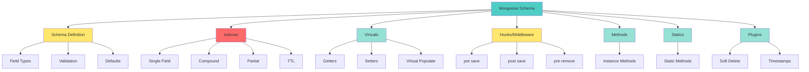
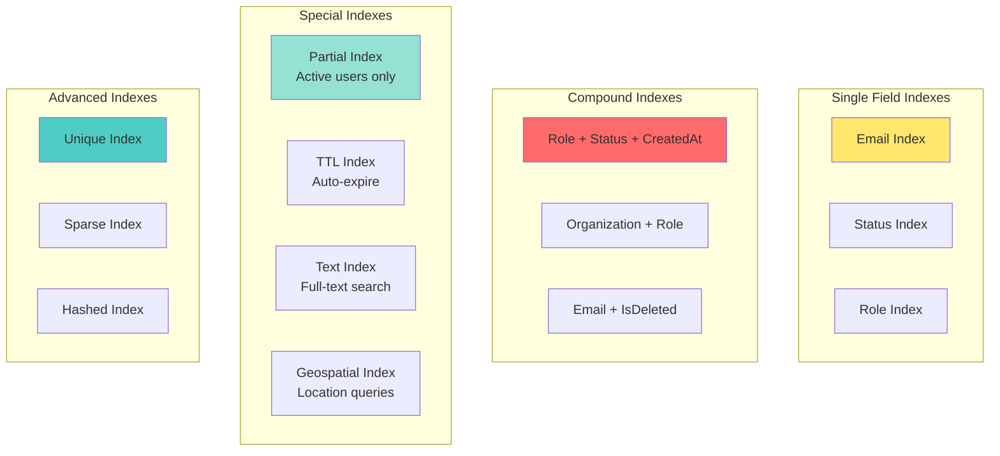
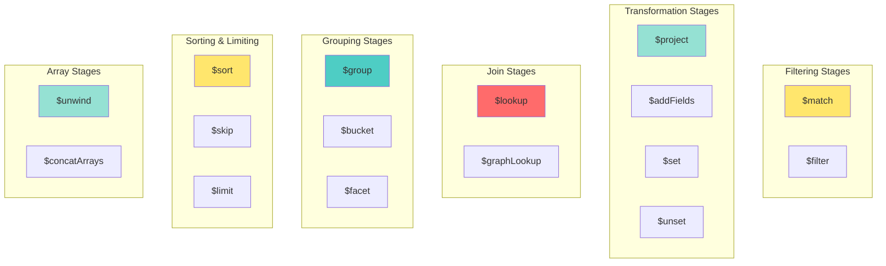

# 📘 **NESTJS MASTERY - Lesson 6: Database & Mongoose Advanced**

**Date**: 18-03-26  
**Level**: 🟢 Beginner → 🔴 Senior Engineer  
**Series**: NestJS Fundamentals  
**Time**: 60 minutes  
**Prerequisites**: Lesson 1 (Modules), Lesson 2 (Decorators & DI), Lesson 3 (Guards/Interceptors/Filters), Lesson 4 (DTOs & Validation), Lesson 5 (Services & Repository)  

---

## 🎯 **LEARNING OBJECTIVES**

After completing this **comprehensive** lesson, you will:

1. ✅ **Master Mongoose Schemas** - Advanced schema design, virtuals, hooks, plugins
2. ✅ **Understand Indexing Deeply** - Single, compound, partial, TTL indexes
3. ✅ **Learn Query Optimization** - Explain plans, query performance, N+1 problem
4. ✅ **Master Aggregation Pipeline** - Stages, lookups, facets, graph lookups
5. ✅ **Implement Advanced Patterns** - Polymorphic schemas, discriminators, transactions
6. ✅ **Handle Large Datasets** - Pagination, streaming, bulk operations
7. ✅ **Production Database Practices** - Monitoring, backup, scaling, sharding

---

## 📦 **PART 1: ADVANCED SCHEMA DESIGN**

### **Schema Anatomy Deep Dive**



---

### **Complete Schema Example**

```typescript
import { Prop, Schema, SchemaFactory } from '@nestjs/mongoose';
import { Document, Types, Schema as MongooseSchema } from 'mongoose';
import { ApiProperty, ApiPropertyOptional } from '@nestjs/swagger';

// ─────────────────────────────────────────────
// Enums for Type Safety
// ─────────────────────────────────────────────
export enum UserRole {
  USER = 'user',
  ADMIN = 'admin',
  MODERATOR = 'moderator',
}

export enum UserStatus {
  ACTIVE = 'active',
  INACTIVE = 'inactive',
  SUSPENDED = 'suspended',
  BANNED = 'banned',
}

// ─────────────────────────────────────────────
// Schema Definition
// ─────────────────────────────────────────────
@Schema({
  timestamps: true,              // Auto-manage createdAt, updatedAt
  toJSON: { virtuals: true },    // Include virtuals in JSON
  toObject: { virtuals: true },  // Include virtuals in objects
})
export class User {
  
  // ─────────────────────────────────────────────
  // Basic Fields
  // ─────────────────────────────────────────────
  @ApiProperty({ description: 'User email', example: 'user@example.com' })
  @Prop({
    type: String,
    required: [true, 'Email is required'],
    unique: true,
    lowercase: true,
    trim: true,
    maxlength: [255, 'Email cannot exceed 255 characters'],
    match: [/^\S+@\S+\.\S+$/, 'Please provide a valid email'],
  })
  email: string;
  
  @ApiProperty({ description: 'User password (hashed)', example: 'hashed_password' })
  @Prop({
    type: String,
    required: [true, 'Password is required'],
    minlength: [8, 'Password must be at least 8 characters'],
    select: false,  // Don't include in queries by default
  })
  password: string;
  
  @ApiProperty({ description: 'User full name', example: 'John Doe' })
  @Prop({
    type: String,
    required: [true, 'Name is required'],
    trim: true,
    maxlength: [100, 'Name cannot exceed 100 characters'],
  })
  name: string;
  
  // ─────────────────────────────────────────────
  // Enum Fields
  // ─────────────────────────────────────────────
  @ApiProperty({ 
    description: 'User role', 
    enum: UserRole,
    example: UserRole.USER,
    default: UserRole.USER,
  })
  @Prop({
    type: String,
    enum: {
      values: Object.values(UserRole),
      message: 'Invalid role. Must be one of: user, admin, moderator',
    },
    default: UserRole.USER,
  })
  role: UserRole;
  
  @ApiProperty({ 
    description: 'User status', 
    enum: UserStatus,
    example: UserStatus.ACTIVE,
    default: UserStatus.ACTIVE,
  })
  @Prop({
    type: String,
    enum: Object.values(UserStatus),
    default: UserStatus.ACTIVE,
    index: true,  // Frequently filtered
  })
  status: UserStatus;
  
  // ─────────────────────────────────────────────
  // Optional Fields
  // ─────────────────────────────────────────────
  @ApiPropertyOptional({ description: 'Phone number', example: '+1234567890' })
  @Prop({
    type: String,
    trim: true,
    match: [/^\+?[\d\s-()]+$/, 'Please provide a valid phone number'],
  })
  phoneNumber?: string;
  
  @ApiPropertyOptional({ description: 'Profile image URL', example: 'https://...' })
  @Prop({
    type: String,
    validate: {
      validator: function(v: string): boolean {
        return !v || /^https?:\/\//.test(v);
      },
      message: 'Profile image must be a valid URL',
    },
  })
  profileImage?: string;
  
  // ─────────────────────────────────────────────
  // Nested Objects
  // ─────────────────────────────────────────────
  @Prop({
    address: {
      street: String,
      city: String,
      state: String,
      zipCode: String,
      country: { type: String, default: 'USA' },
    },
    _id: false,  // Don't create _id for subdocument
  })
  address?: {
    street: string;
    city: string;
    state: string;
    zipCode: string;
    country: string;
  };
  
  // ─────────────────────────────────────────────
  // Arrays
  // ─────────────────────────────────────────────
  @ApiPropertyOptional({ description: 'User preferences', type: [String] })
  @Prop([{ type: String }])
  preferences?: string[];
  
  // ─────────────────────────────────────────────
  // References to Other Collections
  // ─────────────────────────────────────────────
  @ApiPropertyOptional({ description: 'Created by user ID', type: String })
  @Prop({ type: Types.ObjectId, ref: 'User' })
  createdBy?: Types.ObjectId;
  
  @ApiPropertyOptional({ description: 'Organization ID', type: String })
  @Prop({ type: Types.ObjectId, ref: 'Organization' })
  organization?: Types.ObjectId;
  
  // ─────────────────────────────────────────────
  // Audit Fields (auto-managed by timestamps)
  // ─────────────────────────────────────────────
  @ApiProperty({ description: 'Creation timestamp' })
  createdAt: Date;
  
  @ApiProperty({ description: 'Last update timestamp' })
  updatedAt: Date;
  
  // ─────────────────────────────────────────────
  // Soft Delete Fields
  // ─────────────────────────────────────────────
  @ApiProperty({ description: 'Soft delete flag', example: false })
  @Prop({ default: false, index: true })
  isDeleted: boolean;
  
  @ApiPropertyOptional({ description: 'Deletion timestamp' })
  @Prop({ type: Date })
  deletedAt?: Date;
  
  // ─────────────────────────────────────────────
  // Last Login Tracking
  // ─────────────────────────────────────────────
  @ApiPropertyOptional({ description: 'Last login timestamp' })
  @Prop({ type: Date })
  lastLoginAt?: Date;
  
  @ApiPropertyOptional({ description: 'Last login IP address' })
  @Prop({ type: String })
  lastLoginIp?: string;
}

// ─────────────────────────────────────────────
// Schema Factory
// ─────────────────────────────────────────────
export const UserSchema = SchemaFactory.createForClass(User);

// ─────────────────────────────────────────────
// Indexes
// ─────────────────────────────────────────────
// Single field indexes
UserSchema.index({ email: 1 });
UserSchema.index({ role: 1 });
UserSchema.index({ status: 1 });

// Compound indexes (for common query patterns)
UserSchema.index({ role: 1, status: 1, createdAt: -1 });
UserSchema.index({ organization: 1, role: 1, isDeleted: 1 });
UserSchema.index({ email: 1, isDeleted: 1 });

// Partial index (only index active users)
UserSchema.index(
  { lastLoginAt: 1 },
  { partialFilterExpression: { status: UserStatus.ACTIVE } }
);

// TTL index (auto-delete inactive users after 1 year)
UserSchema.index(
  { updatedAt: 1 },
  {
    expireAfterSeconds: 365 * 24 * 60 * 60,  // 1 year
    partialFilterExpression: { status: UserStatus.INACTIVE },
  }
);

// ─────────────────────────────────────────────
// Virtuals
// ─────────────────────────────────────────────
// Virtual: Get full profile URL
UserSchema.virtual('profileUrl').get(function() {
  return `/users/${this._id}`;
});

// Virtual: Get initials
UserSchema.virtual('initials').get(function() {
  const names = this.name.split(' ');
  if (names.length >= 2) {
    return `${names[0][0]}${names[names.length - 1][0]}`.toUpperCase();
  }
  return this.name.substring(0, 2).toUpperCase();
});

// Virtual: Check if user is new (registered within last 7 days)
UserSchema.virtual('isNewUser').get(function() {
  const sevenDaysAgo = new Date();
  sevenDaysAgo.setDate(sevenDaysAgo.getDate() - 7);
  return this.createdAt > sevenDaysAgo;
});

// Virtual Populate: Get user's tasks
UserSchema.virtual('tasks', {
  ref: 'Task',
  localField: '_id',
  foreignField: 'ownerUserId',
  options: {
    sort: { createdAt: -1 },
    limit: 10,
    match: { isDeleted: false },  // Only non-deleted tasks
  },
});

// Virtual Populate: Get user's organizations
UserSchema.virtual('organizations', {
  ref: 'Organization',
  localField: '_id',
  foreignField: 'members',
});

// ─────────────────────────────────────────────
// Pre Hooks (Middleware)
// ─────────────────────────────────────────────
// Pre-save hook: Hash password before saving
UserSchema.pre('save', async function(next) {
  // Only hash if password was modified
  if (!this.isModified('password')) {
    return next();
  }
  
  try {
    const bcrypt = await import('bcrypt');
    const salt = await bcrypt.genSalt(10);
    this.password = await bcrypt.hash(this.password, salt);
    next();
  } catch (error) {
    next(error as Error);
  }
});

// Pre-save hook: Normalize email
UserSchema.pre('save', function(next) {
  if (this.isModified('email') && this.email) {
    this.email = this.email.toLowerCase().trim();
  }
  next();
});

// Pre-remove hook: Soft delete instead of hard delete
UserSchema.pre('remove', async function(next) {
  // Convert hard delete to soft delete
  await this.updateOne({
    isDeleted: true,
    deletedAt: new Date(),
  });
  next();
});

// Pre-find hook: Exclude soft-deleted documents
UserSchema.pre('find', function(next) {
  this.where({ isDeleted: false });
  next();
});

UserSchema.pre('findOne', function(next) {
  this.where({ isDeleted: false });
  next();
});

// ─────────────────────────────────────────────
// Post Hooks
// ─────────────────────────────────────────────
// Post-save hook: Log user creation
UserSchema.post('save', function(doc) {
  console.log(`User created: ${doc.email} (${doc._id})`);
});

// Post-remove hook: Clean up related data
UserSchema.post('remove', async function(doc) {
  // Clean up user's sessions, tokens, etc.
  await this.model('Session').deleteMany({ userId: doc._id });
  await this.model('Token').deleteMany({ userId: doc._id });
});

// ─────────────────────────────────────────────
// Instance Methods
// ─────────────────────────────────────────────
UserSchema.methods.comparePassword = async function(candidatePassword: string): Promise<boolean> {
  const bcrypt = await import('bcrypt');
  return bcrypt.compare(candidatePassword, this.password);
};

UserSchema.methods.updateLastLogin = async function(ip: string) {
  this.lastLoginAt = new Date();
  this.lastLoginIp = ip;
  await this.save();
};

UserSchema.methods.isEligibleForBonus = function(): boolean {
  const thirtyDaysAgo = new Date();
  thirtyDaysAgo.setDate(thirtyDaysAgo.getDate() - 30);
  return this.createdAt < thirtyDaysAgo && this.status === UserStatus.ACTIVE;
};

// ─────────────────────────────────────────────
// Static Methods
// ─────────────────────────────────────────────
UserSchema.statics.findByEmail = async function(this: Model<User>, email: string) {
  return this.findOne({ email: new RegExp(`^${email}$`, 'i') });
};

UserSchema.statics.findActiveUsers = async function(this: Model<User>) {
  return this.find({
    status: UserStatus.ACTIVE,
    isDeleted: false,
  });
};

UserSchema.statics.searchUsers = async function(
  this: Model<User>,
  query: string,
  page: number = 1,
  limit: number = 10,
) {
  const searchRegex = new RegExp(query, 'i');
  
  return this.find({
    $or: [
      { name: searchRegex },
      { email: searchRegex },
      { phoneNumber: searchRegex },
    ],
    isDeleted: false,
  })
  .sort({ createdAt: -1 })
  .skip((page - 1) * limit)
  .limit(limit);
};

UserSchema.statics.getStatistics = async function(this: Model<User>) {
  const stats = await this.aggregate([
    {
      $match: { isDeleted: false },
    },
    {
      $group: {
        _id: '$status',
        count: { $sum: 1 },
      },
    },
    {
      $group: {
        _id: null,
        total: { $sum: '$count' },
        byStatus: {
          $push: {
            status: '$_id',
            count: '$count',
          },
        },
      },
    },
  ]);
  
  return stats[0] || { total: 0, byStatus: [] };
};

// ─────────────────────────────────────────────
// Plugins
// ─────────────────────────────────────────────
// Soft delete plugin
UserSchema.plugin(require('mongoose-softdelete'), {
  deletedAt: true,
  overrideMethods: 'all',
});

// Slug plugin (for URL-friendly identifiers)
UserSchema.plugin(require('mongoose-slug-updater'), {
  slug: 'name',
  source: ['name'],
});

// ─────────────────────────────────────────────
// Export
// ─────────────────────────────────────────────
export type UserDocument = User & Document;
export const UserModel = models.User || model<User>('User', UserSchema);

```

---

## 📦 **PART 2: ADVANCED INDEXING STRATEGIES**

### **Index Types Deep Dive**



---

### **Index Strategy by Query Pattern**

```typescript
// ─────────────────────────────────────────────
// Query Pattern 1: Filter by Role and Status
// ─────────────────────────────────────────────
// Query:
User.find({ role: 'admin', status: 'active' }).sort({ createdAt: -1 });

// ✅ Optimal Index:
UserSchema.index({ role: 1, status: 1, createdAt: -1 });

// ❌ Suboptimal (separate indexes):
UserSchema.index({ role: 1 });
UserSchema.index({ status: 1 });
UserSchema.index({ createdAt: -1 });

// ─────────────────────────────────────────────
// Query Pattern 2: Filter by Organization
// ─────────────────────────────────────────────
// Query:
User.find({ 
  organization: orgId,
  role: 'member',
  isDeleted: false 
});

// ✅ Optimal Index:
UserSchema.index({ organization: 1, role: 1, isDeleted: 1 });

// ─────────────────────────────────────────────
// Query Pattern 3: Email Lookup (Unique)
// ─────────────────────────────────────────────
// Query:
User.findOne({ email: 'user@example.com' });

// ✅ Optimal Index (unique constraint):
UserSchema.index({ email: 1 }, { unique: true });

// ─────────────────────────────────────────────
// Query Pattern 4: Partial Index (Active Users Only)
// ─────────────────────────────────────────────
// Query:
User.find({ status: 'active' }).sort({ lastLoginAt: -1 });

// ✅ Optimal Index (partial):
UserSchema.index(
  { lastLoginAt: -1 },
  { partialFilterExpression: { status: 'active' } }
);

// ─────────────────────────────────────────────
// Query Pattern 5: TTL for Session Expiry
// ─────────────────────────────────────────────
// Auto-delete sessions after 30 days
SessionSchema.index(
  { expiresAt: 1 },
  { expireAfterSeconds: 0 }
);

// Or auto-delete based on updatedAt
SessionSchema.index(
  { updatedAt: 1 },
  { expireAfterSeconds: 30 * 24 * 60 * 60 }  // 30 days
);

// ─────────────────────────────────────────────
// Query Pattern 6: Text Search
// ─────────────────────────────────────────────
// Query:
User.find({ $text: { $search: 'john doe' } });

// ✅ Text Index:
UserSchema.index({
  name: 'text',
  email: 'text',
  bio: 'text',
});

// ─────────────────────────────────────────────
// Query Pattern 7: Geospatial Queries
// ─────────────────────────────────────────────
// Query: Find users within 10km of location
User.find({
  location: {
    $near: {
      $geometry: { type: 'Point', coordinates: [lon, lat] },
      $maxDistance: 10000,  // 10km in meters
    },
  },
});

// ✅ Geospatial Index:
UserSchema.index({ location: '2dsphere' });
```

---

### **Index Performance Comparison**

```typescript
// Collection: 1,000,000 users

// ─────────────────────────────────────────────
// Without Index
// ─────────────────────────────────────────────
// Query:
User.find({ email: 'user@example.com' });

// Performance:
// - Type: COLLECTION SCAN (COLLSCAN)
// - Documents Examined: 1,000,000
// - Execution Time: ~5000ms
// - Index Used: null

// ─────────────────────────────────────────────
// With Single Field Index
// ─────────────────────────────────────────────
// Index:
UserSchema.index({ email: 1 });

// Query:
User.find({ email: 'user@example.com' });

// Performance:
// - Type: INDEX SCAN (IXSCAN)
// - Documents Examined: 1
// - Execution Time: ~5ms
// - Index Used: email_1
// - Improvement: 1000x faster

// ─────────────────────────────────────────────
// With Compound Index
// ─────────────────────────────────────────────
// Index:
UserSchema.index({ role: 1, status: 1, createdAt: -1 });

// Query:
User.find({ role: 'admin', status: 'active' }).sort({ createdAt: -1 });

// Performance:
// - Type: INDEX SCAN (IXSCAN)
// - Documents Examined: 500 (all matching docs)
// - Execution Time: ~10ms
// - Index Used: role_1_status_1_createdAt_-1
// - Improvement: 500x faster

// ─────────────────────────────────────────────
// With Partial Index
// ─────────────────────────────────────────────
// Index (only active users):
UserSchema.index(
  { lastLoginAt: -1 },
  { partialFilterExpression: { status: 'active' } }
);

// Query:
User.find({ status: 'active' }).sort({ lastLoginAt: -1 });

// Performance:
// - Index Size: 100MB (vs 500MB for full index)
// - Documents Examined: 100,000 (active users only)
// - Execution Time: ~50ms
// - Improvement: 80% smaller index, 5x faster
```

---

## 📦 **PART 3: QUERY OPTIMIZATION**

### **Explain Plans**

```typescript
// ─────────────────────────────────────────────
// How to Use Explain
// ─────────────────────────────────────────────
const query = User.find({ role: 'admin', status: 'active' })
  .sort({ createdAt: -1 })
  .populate('organization');

// Get execution stats
const explain = await query.explain('executionStats');

console.log(JSON.stringify(explain, null, 2));

// ─────────────────────────────────────────────
// Explain Output Analysis
// ─────────────────────────────────────────────
{
  "queryPlanner": {
    "winningPlan": {
      "stage": "FETCH",
      "inputStage": {
        "stage": "IXSCAN",
        "keyPattern": {
          "role": 1,
          "status": 1,
          "createdAt": -1
        },
        "indexName": "role_1_status_1_createdAt_-1",
        "isMultiKey": false,
        "indexBounds": {
          "role": ["[\"admin\", \"admin\"]"],
          "status": ["[\"active\", \"active\"]"],
          "createdAt": ["[MaxKey, MinKey]"]
        }
      }
    }
  },
  "executionStats": {
    "executionSuccess": true,
    "nReturned": 150,
    "executionTimeMillis": 12,
    "totalKeysExamined": 150,
    "totalDocsExamined": 150,
    "executionStages": {
      "stage": "FETCH",
      "nReturned": 150,
      "executionTimeMillisEstimate": 10,
      "works": 151,
      "advanced": 150,
      "needTime": 0,
      "needYield": 0,
      "saveState": 1,
      "restoreState": 1,
      "isEOF": 1,
      "invalidates": 0,
      "docsExamined": 150,
      "alreadyHasObj": 0
    }
  }
}

// ─────────────────────────────────────────────
// Key Metrics to Check
// ─────────────────────────────────────────────
// ✅ Good:
// - totalKeysExamined ≈ nReturned (using index efficiently)
// - totalDocsExamined ≈ nReturned (not scanning extra docs)
// - executionTimeMillis < 100ms
// - indexName shows correct index being used

// ❌ Bad:
// - totalKeysExamined >> nReturned (inefficient index)
// - totalDocsExamined >> nReturned (collection scan)
// - executionTimeMillis > 1000ms
// - stage: "COLLSCAN" (collection scan)
```

---

### **N+1 Query Problem & Solution**

```typescript
// ─────────────────────────────────────────────
// ❌ N+1 Problem
// ─────────────────────────────────────────────
// Get all users
const users = await User.find({ organization: orgId });

// N+1 queries: One query per user to get their tasks
for (const user of users) {
  const tasks = await Task.find({ ownerUserId: user._id });
  user.tasks = tasks;
}

// Result: 1 + N queries (1 for users, N for each user's tasks)
// With 100 users: 101 queries!

// ─────────────────────────────────────────────
// ✅ Solution 1: Populate
// ─────────────────────────────────────────────
const users = await User.find({ organization: orgId })
  .populate({
    path: 'tasks',
    match: { isDeleted: false },
    options: { sort: { createdAt: -1 }, limit: 10 },
  });

// Result: 2 queries (1 for users, 1 for all tasks)

// ─────────────────────────────────────────────
// ✅ Solution 2: Manual Populate
// ─────────────────────────────────────────────
// Get all users
const users = await User.find({ organization: orgId });

// Get all user IDs
const userIds = users.map(u => u._id);

// Get all tasks for these users in ONE query
const tasks = await Task.find({
  ownerUserId: { $in: userIds },
  isDeleted: false,
});

// Map tasks to users
const tasksByUserId = new Map();
tasks.forEach(task => {
  const userId = task.ownerUserId.toString();
  if (!tasksByUserId.has(userId)) {
    tasksByUserId.set(userId, []);
  }
  tasksByUserId.get(userId).push(task);
});

// Attach tasks to users
users.forEach(user => {
  user.tasks = tasksByUserId.get(user._id.toString()) || [];
});

// Result: 2 queries (more control than populate)

// ─────────────────────────────────────────────
// ✅ Solution 3: Aggregation with Lookup
// ─────────────────────────────────────────────
const users = await User.aggregate([
  { $match: { organization: orgId, isDeleted: false } },
  {
    $lookup: {
      from: 'tasks',
      localField: '_id',
      foreignField: 'ownerUserId',
      as: 'tasks',
      pipeline: [
        { $match: { isDeleted: false } },
        { $sort: { createdAt: -1 } },
        { $limit: 10 },
      ],
    },
  },
  { $limit: 100 },
]);

// Result: 1 query (most efficient for complex queries)
```

---

## 📦 **PART 4: AGGREGATION PIPELINE MASTERY**

### **Aggregation Stages Reference**



---

### **Complete Aggregation Examples**

```typescript
// ─────────────────────────────────────────────
// Example 1: User Statistics Dashboard
// ─────────────────────────────────────────────
async getUserStatistics() {
  const stats = await this.userModel.aggregate([
    // Stage 1: Filter active users
    {
      $match: {
        isDeleted: false,
        status: 'active',
      },
    },
    
    // Stage 2: Group by role
    {
      $group: {
        _id: '$role',
        count: { $sum: 1 },
        avgAge: { $avg: '$age' },
        earliestCreated: { $min: '$createdAt' },
        latestCreated: { $max: '$createdAt' },
      },
    },
    
    // Stage 3: Sort by count
    {
      $sort: { count: -1 },
    },
    
    // Stage 4: Project final format
    {
      $project: {
        _id: 0,
        role: '$_id',
        count: 1,
        avgAge: { $round: ['$avgAge', 2] },
        earliestCreated: 1,
        latestCreated: 1,
      },
    },
  ]);
  
  return stats;
}

// Output:
[
  {
    "role": "user",
    "count": 5000,
    "avgAge": 28.5,
    "earliestCreated": "2025-01-01T00:00:00.000Z",
    "latestCreated": "2026-03-18T10:30:00.000Z"
  },
  {
    "role": "admin",
    "count": 50,
    "avgAge": 35.2,
    "earliestCreated": "2025-01-01T00:00:00.000Z",
    "latestCreated": "2026-03-15T10:30:00.000Z"
  }
]

// ─────────────────────────────────────────────
// Example 2: User with Tasks (Lookup)
// ─────────────────────────────────────────────
async getUserWithTasks(userId: string) {
  const user = await this.userModel.aggregate([
    { $match: { _id: new Types.ObjectId(userId), isDeleted: false } },
    
    // Lookup tasks
    {
      $lookup: {
        from: 'tasks',
        localField: '_id',
        foreignField: 'ownerUserId',
        as: 'tasks',
        pipeline: [
          { $match: { isDeleted: false } },
          { $sort: { createdAt: -1 } },
          { $limit: 10 },
          {
            $project: {
              _id: 1,
              title: 1,
              status: 1,
              createdAt: 1,
              completedSubtasks: 1,
              totalSubtasks: 1,
            },
          },
        ],
      },
    },
    
    // Lookup organization
    {
      $lookup: {
        from: 'organizations',
        localField: 'organization',
        foreignField: '_id',
        as: 'organization',
        pipeline: [
          { $project: { _id: 1, name: 1, logo: 1 } },
        ],
      },
    },
    
    // Unwind organization (convert array to object)
    {
      $unwind: {
        path: '$organization',
        preserveNullAndEmptyArrays: true,
      },
    },
    
    // Project final format
    {
      $project: {
        password: 0,  // Exclude password
        __v: 0,
        isDeleted: 0,
      },
    },
  ]);
  
  return user[0] || null;
}

// ─────────────────────────────────────────────
// Example 3: Task Completion Funnel
// ─────────────────────────────────────────────
async getTaskCompletionFunnel(organizationId: string) {
  const funnel = await this.taskModel.aggregate([
    // Filter by organization
    {
      $match: {
        organization: new Types.ObjectId(organizationId),
        isDeleted: false,
      },
    },
    
    // Group by status
    {
      $group: {
        _id: '$status',
        count: { $sum: 1 },
        avgCompletionTime: {
          $avg: {
            $subtract: ['$completedTime', '$startTime'],
          },
        },
      },
    },
    
    // Calculate funnel metrics
    {
      $group: {
        _id: null,
        total: { $sum: '$count' },
        pending: {
          $sum: { $cond: [{ $eq: ['$_id', 'pending'] }, '$count', 0] },
        },
        inProgress: {
          $sum: { $cond: [{ $eq: ['$_id', 'inProgress'] }, '$count', 0] },
        },
        completed: {
          $sum: { $cond: [{ $eq: ['$_id', 'completed'] }, '$count', 0] },
        },
        avgCompletionTime: { $avg: '$avgCompletionTime' },
      },
    },
    
    // Calculate conversion rates
    {
      $project: {
        _id: 0,
        total: 1,
        pending: 1,
        inProgress: 1,
        completed: 1,
        completionRate: {
          $round: [
            { $multiply: [{ $divide: ['$completed', '$total'] }, 100] },
            2,
          ],
        },
        avgCompletionTimeInHours: {
          $round: [
            { $divide: ['$avgCompletionTime', 1000 * 60 * 60] },
            2,
          ],
        },
      },
    },
  ]);
  
  return funnel[0];
}

// Output:
{
  "total": 1000,
  "pending": 300,
  "inProgress": 200,
  "completed": 500,
  "completionRate": 50.00,
  "avgCompletionTimeInHours": 24.5
}

// ─────────────────────────────────────────────
// Example 4: Faceted Search (Multiple Results)
// ─────────────────────────────────────────────
async searchUsers(query: string) {
  const results = await this.userModel.aggregate([
    // Match search query
    {
      $match: {
        $or: [
          { name: { $regex: query, $options: 'i' } },
          { email: { $regex: query, $options: 'i' } },
        ],
        isDeleted: false,
      },
    },
    
    // Facet: Get multiple result sets in one query
    {
      $facet: {
        // Users matching query
        users: [
          { $sort: { createdAt: -1 } },
          { $limit: 10 },
          {
            $project: {
              _id: 1,
              name: 1,
              email: 1,
              role: 1,
              profileImage: 1,
            },
          },
        ],
        
        // Count by role
        countByRole: [
          { $group: { _id: '$role', count: { $sum: 1 } } },
        ],
        
        // Count by status
        countByStatus: [
          { $group: { _id: '$status', count: { $sum: 1 } } },
        ],
        
        // Total count
        totalCount: [
          { $count: 'count' },
        ],
      },
    },
  ]);
  
  return results[0];
}

// Output:
{
  "users": [...],
  "countByRole": [
    { "_id": "user", "count": 50 },
    { "_id": "admin", "count": 5 }
  ],
  "countByStatus": [
    { "_id": "active", "count": 45 },
    { "_id": "inactive", "count": 10 }
  ],
  "totalCount": [{ "count": 55 }]
}

// ─────────────────────────────────────────────
// Example 5: Graph Lookup (Hierarchical Data)
// ─────────────────────────────────────────────
async getUserHierarchy(userId: string) {
  const user = await this.userModel.aggregate([
    { $match: { _id: new Types.ObjectId(userId) } },
    
    // Graph lookup: Find all users created by this user (recursively)
    {
      $graphLookup: {
        from: 'users',
        startWith: '$_id',
        connectFromField: '_id',
        connectToField: 'createdBy',
        as: 'downline',
        maxDepth: 5,  // Maximum 5 levels deep
        depthField: 'level',
      },
    },
    
    // Project final format
    {
      $project: {
        password: 0,
        __v: 0,
        'downline.password': 0,
        'downline.__v': 0,
      },
    },
  ]);
  
  return user[0];
}

// Output: User with nested downline array showing hierarchy
```

---

## 📦 **PART 5: ADVANCED PATTERNS**

### **Pattern 1: Polymorphic Schemas with Discriminators**

```typescript
// ─────────────────────────────────────────────
// Base Event Schema
// ─────────────────────────────────────────────
@Schema({ timestamps: true, discriminatorKey: 'kind' })
export class Event {
  @Prop({ required: true })
  timestamp: Date;
  
  @Prop({ required: true })
  userId: Types.ObjectId;
  
  @Prop()
  description: string;
}

const EventSchema = SchemaFactory.createForClass(Event);

// ─────────────────────────────────────────────
// Login Event Discriminator
// ─────────────────────────────────────────────
@Schema()
export class LoginEvent extends Event {
  @Prop()
  ipAddress: string;
  
  @Prop()
  userAgent: string;
  
  @Prop({ default: true })
  success: boolean;
}

const LoginEventSchema = SchemaFactory.createForClass(LoginEvent);

// ─────────────────────────────────────────────
// Purchase Event Discriminator
// ─────────────────────────────────────────────
@Schema()
export class PurchaseEvent extends Event {
  @Prop()
  productId: Types.ObjectId;
  
  @Prop()
  amount: number;
  
  @Prop()
  currency: string;
  
  @Prop({ default: 'USD' })
  paymentMethod: string;
}

const PurchaseEventSchema = SchemaFactory.createForClass(PurchaseEvent);

// ─────────────────────────────────────────────
// Register Discriminators
// ─────────────────────────────────────────────
const EventModel = model('Event', EventSchema);
EventModel.discriminator('LoginEvent', LoginEventSchema);
EventModel.discriminator('PurchaseEvent', PurchaseEventSchema);

// ─────────────────────────────────────────────
// Usage
// ─────────────────────────────────────────────
// Create login event
await EventModel.create({
  kind: 'LoginEvent',  // Discriminator key
  timestamp: new Date(),
  userId: userId,
  ipAddress: '192.168.1.1',
  userAgent: 'Mozilla/5.0...',
  success: true,
});

// Create purchase event
await EventModel.create({
  kind: 'PurchaseEvent',
  timestamp: new Date(),
  userId: userId,
  productId: productId,
  amount: 99.99,
  currency: 'USD',
});

// Query all events
const allEvents = await EventModel.find();

// Query only login events
const loginEvents = await EventModel.find({ kind: 'LoginEvent' });

// Query only purchase events
const purchaseEvents = await EventModel.find({ kind: 'PurchaseEvent' });
```

---

### **Pattern 2: Soft Delete with Query Hooks**

```typescript
// ─────────────────────────────────────────────
// Soft Delete Plugin
// ─────────────────────────────────────────────
export function softDeletePlugin(schema: Schema) {
  // Add isDeleted field
  schema.add({
    isDeleted: { type: Boolean, default: false, index: true },
    deletedAt: { type: Date, default: null },
  });
  
  // Pre-find hooks: Exclude soft-deleted documents
  schema.pre('find', function(this: Query<any, any>, next) {
    this.where({ isDeleted: false });
    next();
  });
  
  schema.pre('findOne', function(this: Query<any, any>, next) {
    this.where({ isDeleted: false });
    next();
  });
  
  schema.pre('findOneAndUpdate', function(this: Query<any, any>, next) {
    this.where({ isDeleted: false });
    next();
  });
  
  // Override remove to soft delete
  schema.methods.softDelete = async function() {
    this.isDeleted = true;
    this.deletedAt = new Date();
    return this.save();
  };
  
  // Static method to find soft-deleted documents
  schema.statics.findDeleted = function() {
    return this.find({ isDeleted: true });
  };
  
  // Static method to restore soft-deleted documents
  schema.statics.restore = function(id: string) {
    return this.findByIdAndUpdate(id, {
      isDeleted: false,
      deletedAt: null,
    });
  };
  
  // Static method to permanently delete
  schema.statics.hardDelete = function(id: string) {
    return this.findByIdAndDelete(id);
  };
}

// Usage
@Schema()
export class User {
  @Prop()
  email: string;
  
  @Prop()
  name: string;
}

const UserSchema = SchemaFactory.createForClass(User);
UserSchema.plugin(softDeletePlugin);
```

---

## ✅ **PRODUCTION CHECKLIST**

```
Schema Design
[ ] All fields have appropriate types
[ ] Required fields marked with validation
[ ] Enums for fixed sets of values
[ ] Nested objects for complex data
[ ] References to other collections
[ ] Virtuals for computed fields
[ ] Virtual populate for relationships

Indexes
[ ] Single field indexes on frequently queried fields
[ ] Compound indexes for common query patterns
[ ] Partial indexes for filtered queries
[ ] TTL indexes for auto-expiry
[ ] Unique indexes for constraints
[ ] Text indexes for full-text search
[ ] Geospatial indexes for location queries

Query Optimization
[ ] Explain plans analyzed for slow queries
[ ] N+1 queries eliminated with populate/lookup
[ ] Projections used to limit fields returned
[ ] Lean queries for read-only operations
[ ] Cursor/streaming for large result sets

Aggregation
[ ] $match early in pipeline
[ ] $project to limit fields
[ ] $lookup with pipeline for filtered joins
[ ] $facet for multiple result sets
[ ] Indexes support aggregation stages

Production Practices
[ ] Connection pooling configured
[ ] Read preferences set (primary/secondary)
[ ] Write concerns configured
[ ] Retry logic for transient failures
[ ] Monitoring for slow queries
[ ] Backup strategy implemented
```

---

## 🎯 **KNOWLEDGE CHECK**

### **Question 1: Compound Index Order**

What's the correct order for compound index fields?

<details>
<summary>💡 Click to reveal answer</summary>

**Rule**: Equality → Sort → Range

```typescript
// Query:
User.find({ role: 'admin', status: 'active' })
  .sort({ createdAt: -1 });

// ✅ Correct Index:
UserSchema.index({ role: 1, status: 1, createdAt: -1 });

// Order:
// 1. role (equality: role = 'admin')
// 2. status (equality: status = 'active')
// 3. createdAt (sort)
```

**Why**: MongoDB can use the index for both filtering and sorting.
</details>

---

### **Question 2: Populate vs Lookup**

When should you use `populate()` vs `$lookup` in aggregation?

<details>
<summary>💡 Click to reveal answer</summary>

**Use `populate()` when**:
- Simple relationship (one-to-one, one-to-many)
- Virtuals already defined in schema
- Need automatic population
- Don't need complex filtering

**Use `$lookup` when**:
- Complex filtering on joined collection
- Need to transform joined data
- Multiple joins in one query
- Need aggregation on joined data
- Better performance (single query)

**Rule**: Start with `populate()`, switch to `$lookup` for complex scenarios.
</details>

---

### **Question 3: Partial vs Regular Index**

What's the benefit of a partial index?

<details>
<summary>💡 Click to reveal answer</summary>

**Partial Index**: Only indexes documents matching a filter

```typescript
// Regular index (indexes ALL users)
UserSchema.index({ lastLoginAt: -1 });
// Size: 500MB for 1M users

// Partial index (indexes active users only)
UserSchema.index(
  { lastLoginAt: -1 },
  { partialFilterExpression: { status: 'active' } }
);
// Size: 100MB for 200K active users
```

**Benefits**:
- ✅ Smaller index size (80% smaller in this case)
- ✅ Faster queries (less data to scan)
- ✅ Lower memory usage
- ✅ Faster writes (less index maintenance)

**Use when**: You frequently query a subset of data.
</details>

---

## 📚 **ADDITIONAL RESOURCES**

- **Mongoose Docs**: [Mongoose Documentation](https://mongoosejs.com/docs/)
- **MongoDB Indexes**: [Index Documentation](https://www.mongodb.com/docs/manual/indexes/)
- **Aggregation Pipeline**: [Aggregation Docs](https://www.mongodb.com/docs/manual/aggregation/)
- **Query Optimization**: [Query Optimization](https://www.mongodb.com/docs/manual/tutorial/optimize-queries/)
- **Schema Patterns**: [Schema Patterns](https://www.mongodb.com/docs/manual/application-patterns/)

---

## 🎓 **HOMEWORK**

1. ✅ Create a complete User schema with all field types
2. ✅ Add virtuals for computed fields
3. ✅ Implement virtual populate for relationships
4. ✅ Create compound indexes for common queries
5. ✅ Add partial index for filtered queries
6. ✅ Implement soft delete with query hooks
7. ✅ Write aggregation pipeline for dashboard statistics
8. ✅ Use $lookup to join multiple collections
9. ✅ Implement $facet for faceted search
10. ✅ Analyze query performance with explain()

---

**Next Lesson**: Caching Strategies with Redis  
**Date**: 18-03-26  
**Status**: ✅ Complete

---
-18-03-26
