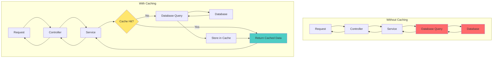
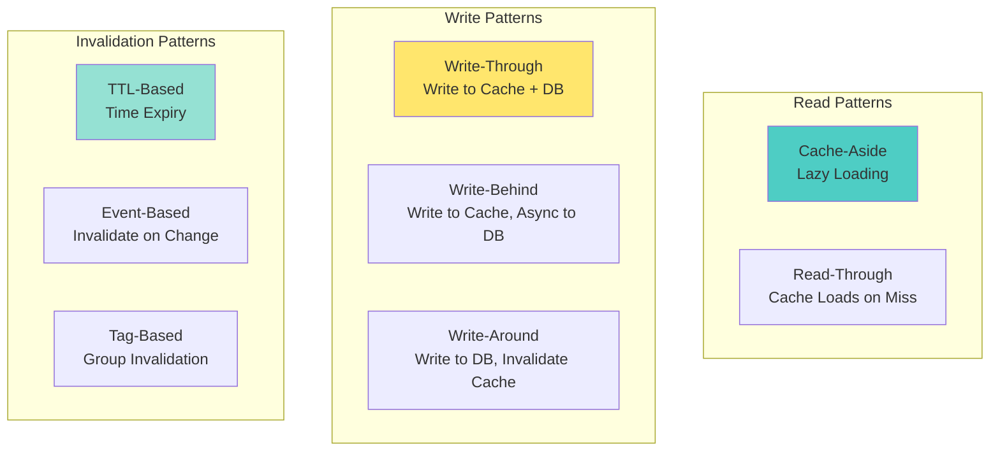

# 📘 **NESTJS MASTERY - Lesson 7: Caching Strategies with Redis**

**Date**: 18-03-26  
**Level**: 🟢 Beginner → 🔴 Senior Engineer  
**Series**: NestJS Fundamentals  
**Time**: 55 minutes  
**Prerequisites**: Lesson 1 (Modules), Lesson 2 (Decorators & DI), Lesson 3 (Guards/Interceptors/Filters), Lesson 4 (DTOs & Validation), Lesson 5 (Services & Repository), Lesson 6 (Database & Mongoose)  

---

## 🎯 **LEARNING OBJECTIVES**

After completing this **comprehensive** lesson, you will:

1. ✅ **Understand Caching Fundamentals** - Why cache, when to cache, cache patterns
2. ✅ **Master Redis Integration** - Setup, configuration, connection pooling
3. ✅ **Implement Cache-Aside Pattern** - Most common caching pattern
4. ✅ **Learn Write-Through & Write-Behind** - Cache invalidation strategies
5. ✅ **Master Cache Invalidation** - Tag-based, time-based, event-based invalidation
6. ✅ **Implement Advanced Patterns** - Distributed locks, rate limiting, sessions
7. ✅ **Production Caching** - Monitoring, metrics, troubleshooting, best practices

---

## 📦 **PART 1: CACHING FUNDAMENTALS**

### **Why Caching Matters**



**Performance Comparison**:

| Operation | Latency | Relative Speed |
|-----------|---------|----------------|
| **Redis Cache Read** | ~1ms | 1x (Fastest) |
| **MongoDB Query** | ~10-50ms | 10-50x Slower |
| **MongoDB Aggregation** | ~50-200ms | 50-200x Slower |
| **External API Call** | ~100-1000ms | 100-1000x Slower |

**Impact**:
- ✅ **80-90% reduction** in database load
- ✅ **10-100x faster** response times
- ✅ **Better user experience** (sub-100ms responses)
- ✅ **Cost savings** (smaller database tier possible)

---

### **When to Cache**

```mermaid
graph TB
    A[Data Access Pattern] --> B{Read vs Write Ratio}
    B -->|High Read (>80%)| C[✅ Good for Caching]
    B -->|High Write (>50%)| D[❌ Poor for Caching]
    
    A --> E{Data Volatility}
    E -->|Static/Rarely Changes| F[✅ Excellent for Caching]
    E -->|Frequently Changes| G[⚠️ Use Short TTL]
    
    A --> H{Query Complexity}
    H -->|Expensive Aggregations| I[✅ Perfect for Caching]
    H -->|Simple Lookups| J[⚠️ Optional]
    
    A --> K{Data Size}
    K -->|Small-Medium (<1MB)| L[✅ Good for Caching]
    K -->|Large (>10MB)| M[❌ Avoid Caching]
    
    style C fill:#4ecdc4
    style F fill:#4ecdc4
    style I fill:#4ecdc4
    style L fill:#4ecdc4
    style D fill:#ff6b6b
    style G fill:#ffe66d
    style J fill:#ffe66d
    style M fill:#ff6b6b
```

**✅ Excellent Candidates for Caching**:
- User profiles (read frequently, change rarely)
- Product catalogs (static data)
- Configuration settings (rarely change)
- Aggregation results (expensive to compute)
- Session data (frequently accessed)
- API responses (external API calls)

**❌ Poor Candidates for Caching**:
- Real-time stock prices (change constantly)
- Live chat messages (write-heavy)
- Temporary data (expires quickly)
- Large files (>10MB)
- Personalized data per user (cache fragmentation)

---

### **Cache Patterns Overview**



---

## 📦 **PART 2: REDIS SETUP & CONFIGURATION**

### **Redis Module Setup**

```typescript
// ─────────────────────────────────────────────
// app.module.ts
// ─────────────────────────────────────────────
import { Module, CacheModule } from '@nestjs/common';
import { redisStore } from 'cache-manager-redis-yet';
import { ConfigModule, ConfigService } from '@nestjs/config';

@Module({
  imports: [
    ConfigModule.forRoot({
      isGlobal: true,
      envFilePath: '.env',
    }),
    
    // ─────────────────────────────────────────────
    // Global Cache Module with Redis
    // ─────────────────────────────────────────────
    CacheModule.registerAsync({
      isGlobal: true,
      imports: [ConfigModule],
      useFactory: async (configService: ConfigService) => ({
        store: redisStore,
        
        // Redis connection
        host: configService.get('REDIS_HOST', 'localhost'),
        port: configService.get('REDIS_PORT', 6379),
        password: configService.get('REDIS_PASSWORD'),
        db: configService.get('REDIS_DB', 0),
        
        // Connection pooling
        max: 10,  // Maximum number of connections
        
        // Default TTL (5 minutes)
        ttl: 300000,
        
        // Key prefix (namespace)
        prefix: 'myapp:',
        
        // Error handling
        retryStrategy: (times: number) => {
          if (times > 3) {
            console.error('Redis connection failed after 3 retries');
            return null;
          }
          return Math.min(times * 50, 2000);
        },
      }),
      inject: [ConfigService],
    }),
  ],
})
export class AppModule {}

// ─────────────────────────────────────────────
// .env
// ─────────────────────────────────────────────
REDIS_HOST=localhost
REDIS_PORT=6379
REDIS_PASSWORD=your_secure_password
REDIS_DB=0
REDIS_TLS_ENABLED=false
```

---

### **Redis Service Wrapper**

```typescript
// ─────────────────────────────────────────────
// redis/redis.service.ts
// ─────────────────────────────────────────────
import { Injectable, Inject, OnModuleDestroy } from '@nestjs/common';
import { Cache, CACHE_MANAGER } from '@nestjs/cache-manager';
import { ConfigService } from '@nestjs/config';

@Injectable()
export class RedisService implements OnModuleDestroy {
  private readonly DEFAULT_TTL = 300; // 5 minutes
  private readonly KEY_PREFIX = 'myapp:';

  constructor(
    @Inject(CACHE_MANAGER) private cacheManager: Cache,
    private configService: ConfigService,
  ) {}

  // ─────────────────────────────────────────────
  // Basic Operations
  // ─────────────────────────────────────────────
  async get<T>(key: string): Promise<T | null> {
    const fullKey = this.getFullKey(key);
    return this.cacheManager.get<T>(fullKey);
  }

  async set(
    key: string,
    value: any,
    ttl?: number,
  ): Promise<void> {
    const fullKey = this.getFullKey(key);
    await this.cacheManager.set(fullKey, value, ttl || this.DEFAULT_TTL);
  }

  async del(key: string): Promise<void> {
    const fullKey = this.getFullKey(key);
    await this.cacheManager.del(fullKey);
  }

  async exists(key: string): Promise<boolean> {
    const fullKey = this.getFullKey(key);
    const value = await this.cacheManager.get(fullKey);
    return value !== undefined;
  }

  // ─────────────────────────────────────────────
  // Cache-Aside Pattern
  // ─────────────────────────────────────────────
  async wrap<T>(
    key: string,
    fetcher: () => Promise<T>,
    ttl?: number,
  ): Promise<T> {
    // Try to get from cache
    const cached = await this.get<T>(key);
    if (cached !== null) {
      return cached;
    }

    // Cache miss - fetch from source
    const data = await fetcher();

    // Store in cache
    await this.set(key, data, ttl);

    return data;
  }

  // ─────────────────────────────────────────────
  // Bulk Operations
  // ─────────────────────────────────────────────
  async mget<T>(keys: string[]): Promise<(T | null)[]> {
    const fullKeys = keys.map(k => this.getFullKey(k));
    return this.cacheManager.mget<T>(...fullKeys);
  }

  async mset(
    entries: Array<{ key: string; value: any; ttl?: number }>,
  ): Promise<void> {
    const promises = entries.map(entry =>
      this.set(entry.key, entry.value, entry.ttl),
    );
    await Promise.all(promises);
  }

  async mdel(keys: string[]): Promise<void> {
    const promises = keys.map(k => this.del(k));
    await Promise.all(promises);
  }

  // ─────────────────────────────────────────────
  // Tag-Based Invalidation
  // ─────────────────────────────────────────────
  async addToTag(key: string, tag: string): Promise<void> {
    const tagKey = `tag:${tag}`;
    const members = await this.cacheManager.get<string[]>(tagKey) || [];
    
    if (!members.includes(key)) {
      members.push(key);
      await this.set(tagKey, members, 86400); // 24 hours
    }
  }

  async invalidateByTag(tag: string): Promise<void> {
    const tagKey = `tag:${tag}`;
    const keys = await this.cacheManager.get<string[]>(tagKey) || [];
    
    if (keys.length > 0) {
      await this.mdel(keys);
      await this.del(tagKey);
    }
  }

  // ─────────────────────────────────────────────
  // Helper: Generate Full Key
  // ─────────────────────────────────────────────
  private getFullKey(key: string): string {
    return `${this.KEY_PREFIX}${key}`;
  }

  // ─────────────────────────────────────────────
  // Cleanup
  // ─────────────────────────────────────────────
  async onModuleDestroy() {
    await this.cacheManager.close();
  }
}

// ─────────────────────────────────────────────
// redis/redis.module.ts
// ─────────────────────────────────────────────
import { Module, Global } from '@nestjs/common';
import { RedisService } from './redis.service';

@Global()
@Module({
  providers: [RedisService],
  exports: [RedisService],
})
export class RedisModule {}
```

---

## 📦 **PART 3: CACHE-ASIDE PATTERN**

### **Basic Cache-Aside Implementation**

```typescript
// ─────────────────────────────────────────────
// user/user.service.ts
// ─────────────────────────────────────────────
@Injectable()
export class UserService {
  constructor(
    @InjectModel(User.name) private userModel: Model<UserDocument>,
    private redisService: RedisService,
  ) {}

  // ─────────────────────────────────────────────
  // FIND BY ID with Cache-Aside
  // ─────────────────────────────────────────────
  async findById(id: string): Promise<UserDocument> {
    const cacheKey = `user:${id}`;

    return this.redisService.wrap(
      cacheKey,
      async () => {
        // Cache miss - fetch from database
        const user = await this.userModel.findById(id).lean();
        
        if (!user) {
          throw new NotFoundException('User not found');
        }
        
        return user;
      },
      300, // TTL: 5 minutes
    );
  }

  // ─────────────────────────────────────────────
  // FIND BY EMAIL with Cache-Aside
  // ─────────────────────────────────────────────
  async findByEmail(email: string): Promise<UserDocument> {
    const cacheKey = `user:email:${email.toLowerCase()}`;

    return this.redisService.wrap(
      cacheKey,
      async () => {
        const user = await this.userModel
          .findOne({ email: email.toLowerCase() })
          .lean();
        
        if (!user) {
          throw new NotFoundException('User not found');
        }
        
        return user;
      },
      600, // TTL: 10 minutes
    );
  }

  // ─────────────────────────────────────────────
  // CREATE with Cache Invalidation
  // ─────────────────────────────────────────────
  async create(dto: CreateUserDto): Promise<UserDocument> {
    // Create user in database
    const user = await this.userModel.create(dto);

    // Invalidate related caches
    await this.invalidateUserCache(user._id.toString());

    return user;
  }

  // ─────────────────────────────────────────────
  // UPDATE with Cache Invalidation
  // ─────────────────────────────────────────────
  async update(id: string, dto: UpdateUserDto): Promise<UserDocument> {
    // Update in database
    const user = await this.userModel
      .findByIdAndUpdate(id, dto, { new: true })
      .lean();

    if (!user) {
      throw new NotFoundException('User not found');
    }

    // Invalidate cache
    await this.invalidateUserCache(id);

    return user;
  }

  // ─────────────────────────────────────────────
  // DELETE with Cache Invalidation
  // ─────────────────────────────────────────────
  async softDelete(id: string): Promise<void> {
    // Soft delete in database
    await this.userModel.findByIdAndUpdate(id, {
      isDeleted: true,
      deletedAt: new Date(),
    });

    // Invalidate cache
    await this.invalidateUserCache(id);
  }

  // ─────────────────────────────────────────────
  // Helper: Invalidate User Cache
  // ─────────────────────────────────────────────
  private async invalidateUserCache(userId: string): Promise<void> {
    // Get user to invalidate email-based cache
    const user = await this.userModel.findById(userId);
    
    if (user) {
      // Invalidate by ID
      await this.redisService.del(`user:${userId}`);
      
      // Invalidate by email
      await this.redisService.del(`user:email:${user.email}`);
      
      // Invalidate user list cache
      await this.redisService.del('users:list:all');
    }
  }
}
```

---

### **Cache-Aside with Tag-Based Invalidation**

```typescript
// ─────────────────────────────────────────────
// Enhanced Service with Tag-Based Invalidation
// ─────────────────────────────────────────────
@Injectable()
export class UserService {
  constructor(
    @InjectModel(User.name) private userModel: Model<UserDocument>,
    private redisService: RedisService,
  ) {}

  async findById(id: string): Promise<UserDocument> {
    const cacheKey = `user:${id}`;

    const user = await this.redisService.wrap(
      cacheKey,
      async () => {
        return this.userModel.findById(id).lean();
      },
      300,
    );

    // Add to tag for group invalidation
    await this.redisService.addToTag(cacheKey, `users:organization:${user.organization}`);

    return user;
  }

  async findByOrganization(orgId: string, page: number = 1): Promise<any> {
    const cacheKey = `users:org:${orgId}:page:${page}`;

    const users = await this.redisService.wrap(
      cacheKey,
      async () => {
        return this.userModel
          .find({ organization: orgId, isDeleted: false })
          .skip((page - 1) * 10)
          .limit(10)
          .lean();
      },
      300,
    );

    // Add to tag
    await this.redisService.addToTag(cacheKey, `users:organization:${orgId}`);

    return users;
  }

  // ─────────────────────────────────────────────
  // Bulk Invalidation by Organization
  // ─────────────────────────────────────────────
  async invalidateOrganizationUsers(orgId: string): Promise<void> {
    // Invalidate all caches for this organization
    await this.redisService.invalidateByTag(`users:organization:${orgId}`);
  }
}
```

---

## 📦 **PART 4: WRITE-THROUGH & WRITE-BEHIND**

### **Write-Through Pattern**

```typescript
// ─────────────────────────────────────────────
// Write-Through: Update cache and DB simultaneously
// ─────────────────────────────────────────────
@Injectable()
export class ProductService {
  constructor(
    @InjectModel(Product.name) private productModel: Model<ProductDocument>,
    private redisService: RedisService,
  ) {}

  async update(id: string, dto: UpdateProductDto): Promise<ProductDocument> {
    // ─────────────────────────────────────────────
    // Step 1: Update database
    // ─────────────────────────────────────────────
    const product = await this.productModel
      .findByIdAndUpdate(id, dto, { new: true })
      .lean();

    // ─────────────────────────────────────────────
    // Step 2: Update cache (write-through)
    // ─────────────────────────────────────────────
    const cacheKey = `product:${id}`;
    await this.redisService.set(cacheKey, product, 300);

    // ─────────────────────────────────────────────
    // Step 3: Invalidate list caches
    // ─────────────────────────────────────────────
    await this.redisService.del('products:list:all');
    await this.redisService.invalidateByTag(`products:category:${product.category}`);

    return product;
  }
}
```

---

### **Write-Behind Pattern (Async)**

```typescript
// ─────────────────────────────────────────────
// Write-Behind: Update cache immediately, DB asynchronously
// ─────────────────────────────────────────────
@Injectable()
export class AnalyticsService {
  constructor(
    @InjectModel('AnalyticsEvent') private eventModel: Model<any>,
    private redisService: RedisService,
    private queueService: QueueService,
  ) {}

  async trackEvent(event: AnalyticsEventDto): Promise<void> {
    const cacheKey = `analytics:${event.userId}:events`;

    // ─────────────────────────────────────────────
    // Step 1: Update cache immediately
    // ─────────────────────────────────────────────
    const events = await this.redisService.get<any[]>(cacheKey) || [];
    events.push({
      ...event,
      timestamp: new Date().toISOString(),
    });

    // Keep only last 100 events in cache
    await this.redisService.set(cacheKey, events.slice(-100), 3600);

    // ─────────────────────────────────────────────
    // Step 2: Queue database write (async)
    // ─────────────────────────────────────────────
    await this.queueService.addAnalyticsEvent(event);
  }
}

// ─────────────────────────────────────────────
// Queue Processor (processes async writes)
// ─────────────────────────────────────────────
@Processor('analytics')
export class AnalyticsProcessor {
  constructor(
    @InjectModel('AnalyticsEvent') private eventModel: Model<any>,
  ) {}

  @Process('save-event')
  async saveEvent(job: Job<AnalyticsEventDto>) {
    // Write to database asynchronously
    await this.eventModel.create(job.data);
  }
}
```

---

## 📦 **PART 5: ADVANCED CACHING PATTERNS**

### **Pattern 1: Multi-Level Caching**

```typescript
// ─────────────────────────────────────────────
// L1: In-Memory Cache (Node.js process)
// L2: Redis Cache (Shared across instances)
// L3: Database (Source of truth)
// ─────────────────────────────────────────────
@Injectable()
export class MultiLevelCacheService {
  private readonly l1Cache = new Map<string, { data: any; expiry: number }>();
  private readonly L1_TTL = 60000; // 1 minute
  private readonly L2_TTL = 300000; // 5 minutes

  constructor(
    private redisService: RedisService,
    @InjectModel(User.name) private userModel: Model<UserDocument>,
  ) {}

  async getUser(id: string): Promise<UserDocument> {
    const cacheKey = `user:${id}`;

    // ─────────────────────────────────────────────
    // Level 1: In-Memory Cache
    // ─────────────────────────────────────────────
    const l1Result = this.getL1(cacheKey);
    if (l1Result) {
      console.log('L1 Cache Hit');
      return l1Result;
    }

    // ─────────────────────────────────────────────
    // Level 2: Redis Cache
    // ─────────────────────────────────────────────
    const l2Result = await this.redisService.get<UserDocument>(cacheKey);
    if (l2Result) {
      console.log('L2 Cache Hit');
      this.setL1(cacheKey, l2Result);
      return l2Result;
    }

    // ─────────────────────────────────────────────
    // Level 3: Database
    // ─────────────────────────────────────────────
    console.log('Cache Miss - Fetching from DB');
    const user = await this.userModel.findById(id).lean();

    // Store in L2
    await this.redisService.set(cacheKey, user, this.L2_TTL);

    // Store in L1
    this.setL1(cacheKey, user);

    return user;
  }

  private getL1(key: string): any | null {
    const item = this.l1Cache.get(key);
    if (!item || Date.now() > item.expiry) {
      this.l1Cache.delete(key);
      return null;
    }
    return item.data;
  }

  private setL1(key: string, data: any): void {
    this.l1Cache.set(key, {
      data,
      expiry: Date.now() + this.L1_TTL,
    });
  }
}
```

---

### **Pattern 2: Distributed Locks**

```typescript
// ─────────────────────────────────────────────
// Prevent race conditions with distributed locks
// ─────────────────────────────────────────────
@Injectable()
export class LockService {
  constructor(private redisService: RedisService) {}

  async acquireLock(
    key: string,
    ttl: number = 10000,
    retries: number = 3,
  ): Promise<string | null> {
    const lockKey = `lock:${key}`;
    const lockValue = `${Date.now()}:${Math.random()}`;

    for (let i = 0; i < retries; i++) {
      // Try to set lock with NX (only if not exists)
      const acquired = await this.redisService.set(lockKey, lockValue, ttl);
      
      if (acquired) {
        return lockValue;
      }

      // Wait and retry
      await new Promise(resolve => setTimeout(resolve, 100 * (i + 1)));
    }

    return null;
  }

  async releaseLock(key: string, lockValue: string): Promise<void> {
    const lockKey = `lock:${key}`;
    const currentValue = await this.redisService.get<string>(lockKey);

    // Only release if we own the lock
    if (currentValue === lockValue) {
      await this.redisService.del(lockKey);
    }
  }

  async withLock<T>(
    key: string,
    operation: () => Promise<T>,
    ttl?: number,
  ): Promise<T> {
    const lockValue = await this.acquireLock(key, ttl);

    if (!lockValue) {
      throw new Error(`Failed to acquire lock for ${key}`);
    }

    try {
      return await operation();
    } finally {
      await this.releaseLock(key, lockValue);
    }
  }
}

// ─────────────────────────────────────────────
// Usage: Prevent Concurrent Updates
// ─────────────────────────────────────────────
@Injectable()
export class OrderService {
  constructor(
    private lockService: LockService,
    @InjectModel(Order.name) private orderModel: Model<OrderDocument>,
  ) {}

  async updateOrderStatus(orderId: string, status: string): Promise<void> {
    await this.lockService.withLock(`order:${orderId}`, async () => {
      // Only one instance can execute this at a time
      const order = await this.orderModel.findById(orderId);
      
      if (!order) {
        throw new NotFoundException('Order not found');
      }

      // Update status
      order.status = status;
      await order.save();
    });
  }
}
```

---

### **Pattern 3: Rate Limiting with Redis**

```typescript
// ─────────────────────────────────────────────
// Rate Limiter using Redis
// ─────────────────────────────────────────────
@Injectable()
export class RateLimiterService {
  constructor(private redisService: RedisService) {}

  async isRateLimited(
    key: string,
    limit: number,
    windowMs: number,
  ): Promise<{ allowed: boolean; remaining: number; resetAt: number }> {
    const rateKey = `rate:${key}`;
    const now = Date.now();
    const windowStart = now - windowMs;

    // Remove old entries
    await this.redisService.get().zremrangebyscore(rateKey, 0, windowStart);

    // Count current requests in window
    const count = await this.redisService.get().zcard(rateKey);

    if (count >= limit) {
      // Rate limited
      const oldestEntry = await this.redisService.get().zrange(rateKey, 0, 0, 'WITHSCORES');
      const resetAt = oldestEntry ? parseInt(oldestEntry[1]) + windowMs : now + windowMs;

      return {
        allowed: false,
        remaining: 0,
        resetAt,
      };
    }

    // Add current request
    await this.redisService.get().zadd(rateKey, now, `${now}:${Math.random()}`);
    await this.redisService.get().expire(rateKey, Math.ceil(windowMs / 1000));

    return {
      allowed: true,
      remaining: limit - count - 1,
      resetAt: now + windowMs,
    };
  }
}

// ─────────────────────────────────────────────
// Rate Limiting Guard
// ─────────────────────────────────────────────
@Injectable()
export class RateLimitGuard implements CanActivate {
  constructor(
    private rateLimiter: RateLimiterService,
    private reflector: Reflector,
  ) {}

  async canActivate(context: ExecutionContext): Promise<boolean> {
    const request = context.switchToHttp().getRequest();
    const handler = context.getHandler();

    // Get rate limit from decorator
    const limit = this.reflector.get<number>('rateLimit', handler) || 10;
    const windowMs = this.reflector.get<number>('rateLimitWindow', handler) || 60000;

    // Generate key (user ID or IP)
    const key = request.user?.userId || request.ip;

    // Check rate limit
    const result = await this.rateLimiter.isRateLimited(key, limit, windowMs);

    if (!result.allowed) {
      throw new TooManyRequestsException(
        `Rate limit exceeded. Try again in ${Math.ceil((result.resetAt - Date.now()) / 1000)}s`,
      );
    }

    // Set rate limit headers
    const response = context.switchToHttp().getResponse();
    response.setHeader('X-RateLimit-Limit', limit);
    response.setHeader('X-RateLimit-Remaining', result.remaining);
    response.setHeader('X-RateLimit-Reset', result.resetAt);

    return true;
  }
}

// ─────────────────────────────────────────────
// Usage in Controller
// ─────────────────────────────────────────────
@Controller('api')
export class ApiController {
  @Get('users')
  @RateLimit(30, 60000) // 30 requests per minute
  async getUsers() {
    return this.userService.findAll();
  }

  @Post('login')
  @RateLimit(5, 60000) // 5 requests per minute (stricter for login)
  async login(@Body() dto: LoginDto) {
    return this.authService.login(dto);
  }
}

// Custom decorator
export const RateLimit = (limit: number, windowMs: number) => {
  return SetMetadata('rateLimit', limit) && SetMetadata('rateLimitWindow', windowMs);
};
```

---

## 📦 **PART 6: CACHE INVALIDATION STRATEGIES**

### **Strategy Comparison**

```mermaid
graph TB
    subgraph "TTL-Based"
      A1[Set Cache with TTL] --> A2[Auto-Expire]
      style A1 fill:#4ecdc4
      style A2 fill:#95e1d3
    end
    
    subgraph "Event-Based"
      B1[Data Changes] --> B2[Publish Event]
      B2 --> B3[Invalidate Cache]
      style B1 fill:#ff6b6b
      style B2 fill:#ffe66d
      style B3 fill:#ff6b6b
    end
    
    subgraph "Tag-Based"
      C1[Add to Tag] --> C2[Invalidate by Tag]
      C2 --> C3[Multiple Keys Cleared]
      style C1 fill:#ffe66d
      style C2 fill:#ff6b6b
      style C3 fill:#ff6b6b
    end
    
    subgraph "Time-Based"
      D1[Fixed Schedule] --> D2[Clear at Specific Times]
      style D1 fill:#95e1d3
      style D2 fill:#4ecdc4
    end
```



---

### **Complete Invalidation Service**

```typescript
// ─────────────────────────────────────────────
// cache-invalidation.service.ts
// ─────────────────────────────────────────────
@Injectable()
export class CacheInvalidationService {
  constructor(
    private redisService: RedisService,
    private eventEmitter: EventEmitter2,
  ) {
    // Subscribe to domain events
    this.eventEmitter.on('user.created', this.handleUserCreated.bind(this));
    this.eventEmitter.on('user.updated', this.handleUserUpdated.bind(this));
    this.eventEmitter.on('user.deleted', this.handleUserDeleted.bind(this));
  }

  // ─────────────────────────────────────────────
  // Event-Based Invalidation
  // ─────────────────────────────────────────────
  async handleUserCreated(event: UserCreatedEvent) {
    // Invalidate user list caches
    await this.redisService.del('users:list:all');
    await this.redisService.invalidateByTag('users:organization:*');
  }

  async handleUserUpdated(event: UserUpdatedEvent) {
    // Invalidate specific user cache
    await this.redisService.del(`user:${event.userId}`);
    await this.redisService.del(`user:email:${event.changes.email}`);
    
    // Invalidate list caches
    await this.redisService.del('users:list:all');
  }

  async handleUserDeleted(event: UserDeletedEvent) {
    // Invalidate all user-related caches
    await this.redisService.del(`user:${event.userId}`);
    await this.redisService.invalidateByTag(`user:${event.userId}`);
  }

  // ─────────────────────────────────────────────
  // Scheduled Invalidation (Cron Job)
  // ─────────────────────────────────────────────
  @Cron('0 0 * * *') // Every hour
  async hourlyCacheCleanup() {
    // Clear stale caches
    await this.redisService.invalidateByTag('stale');
    
    // Log cache statistics
    const stats = await this.getCacheStats();
    console.log('Cache Statistics:', stats);
  }

  @Cron('0 3 * * *') // Daily at 3 AM
  async dailyCacheRefresh() {
    // Refresh critical caches
    await this.refreshCriticalCaches();
  }

  // ─────────────────────────────────────────────
  // Manual Invalidation API
  // ─────────────────────────────────────────────
  async invalidateUserCache(userId: string): Promise<void> {
    const keys = [
      `user:${userId}`,
      `user:${userId}:tasks`,
      `user:${userId}:orders`,
      `user:${userId}:analytics`,
    ];

    await this.redisService.mdel(keys);
  }

  async invalidateAllCaches(): Promise<void> {
    // ⚠️ DANGEROUS - Use with caution
    const pattern = 'myapp:*';
    const keys = await this.redisService.get().keys(pattern);
    
    if (keys.length > 0) {
      await this.redisService.get().del(...keys);
    }
  }

  // ─────────────────────────────────────────────
  // Cache Statistics
  // ─────────────────────────────────────────────
  async getCacheStats(): Promise<any> {
    const info = await this.redisService.get().info('stats');
    
    return {
      hits: this.parseRedisInfo(info, 'keyspace_hits'),
      misses: this.parseRedisInfo(info, 'keyspace_misses'),
      hitRate: this.calculateHitRate(info),
      memoryUsage: await this.getMemoryUsage(),
      keyCount: await this.getKeyCount(),
    };
  }

  private parseRedisInfo(info: string, key: string): number {
    const line = info.split('\n').find(l => l.includes(key));
    return line ? parseInt(line.split(':')[1]) : 0;
  }

  private calculateHitRate(info: string): number {
    const hits = this.parseRedisInfo(info, 'keyspace_hits');
    const misses = this.parseRedisInfo(info, 'keyspace_misses');
    const total = hits + misses;
    return total > 0 ? Math.round((hits / total) * 100 * 100) / 100 : 0;
  }

  private async getMemoryUsage(): Promise<number> {
    const info = await this.redisService.get().info('memory');
    return this.parseRedisInfo(info, 'used_memory');
  }

  private async getKeyCount(): Promise<number> {
    const keys = await this.redisService.get().keys('myapp:*');
    return keys.length;
  }
}
```

---

## ✅ **PRODUCTION CHECKLIST**

```
Redis Setup
[ ] Redis module configured with connection pooling
[ ] Environment variables for Redis config
[ ] TLS enabled for production
[ ] Password authentication enabled
[ ] Retry strategy implemented
[ ] Health check endpoint for Redis

Caching Patterns
[ ] Cache-aside implemented for read-heavy operations
[ ] Write-through for critical data consistency
[ ] Write-behind for async operations
[ ] Tag-based invalidation for related data
[ ] TTL set appropriately for each data type

Cache Invalidation
[ ] Invalidation on create/update/delete
[ ] Event-based invalidation implemented
[ ] Scheduled cleanup jobs running
[ ] Manual invalidation API available
[ ] Cache stampede prevention (locks)

Monitoring
[ ] Cache hit/miss metrics tracked
[ ] Memory usage monitored
[ ] Key count tracked
[ ] Slow queries logged
[ ] Alert on low hit rate (<50%)
[ ] Alert on high memory usage (>80%)

Security
[ ] Redis not exposed to public internet
[ ] Authentication required
[ ] TLS enabled
[ ] Key namespacing implemented
[ ] Sensitive data not cached
```

---

## 🎯 **KNOWLEDGE CHECK**

### **Question 1: Cache-Aside vs Read-Through**

What's the difference between cache-aside and read-through caching?

<details>
<summary>💡 Click to reveal answer</summary>

**Cache-Aside (Lazy Loading)**:
```typescript
const cached = await cache.get(key);
if (!cached) {
  const data = await db.find(id);
  await cache.set(key, data);
  return data;
}
return cached;
```
- Application manages cache
- Cache loaded on miss
- Most common pattern

**Read-Through**:
```typescript
// Cache handles everything
const data = await cache.get(key);
// Cache automatically loads from DB on miss
```
- Cache manages loading
- Transparent to application
- Requires cache library support

**Use Cache-Aside** for more control. **Use Read-Through** for simplicity.
</details>

---

### **Question 2: Cache Invalidation Strategies**

What's the best cache invalidation strategy?

<details>
<summary>💡 Click to reveal answer</summary>

**There's no single "best" - it depends on use case:**

**TTL-Based**:
- ✅ Simple, automatic
- ❌ Stale data until expiry
- **Use for**: User profiles, product catalogs

**Event-Based**:
- ✅ Immediate invalidation
- ❌ Complex to implement
- **Use for**: Critical data, real-time requirements

**Tag-Based**:
- ✅ Group invalidation
- ❌ Extra memory for tags
- **Use for**: Related data (user + user's tasks)

**Best Practice**: Combine TTL + Event-Based for most scenarios.
</details>

---

### **Question 3: Cache Stampede Prevention**

What is cache stampede and how do you prevent it?

<details>
<summary>💡 Click to reveal answer</summary>

**Cache Stampede**: Multiple requests simultaneously miss cache and all hit database

```
Time 0: Request 1 → Cache Miss → DB Query
Time 1: Request 2 → Cache Miss → DB Query
Time 2: Request 3 → Cache Miss → DB Query
Result: 3 DB queries for same data!
```

**Prevention Methods**:

1. **Distributed Lock**:
```typescript
await lock.acquire(`lock:${key}`, async () => {
  // Only one request fetches from DB
  const data = await db.find(id);
  await cache.set(key, data);
});
```

2. **Probabilistic Early Expiration**:
```typescript
// Add random jitter to TTL
const ttl = baseTTL + Math.random() * 60000;
```

3. **Background Refresh**:
```typescript
// Refresh cache before expiry
if (isAboutToExpire(cached)) {
  refreshInBackground(key);
}
```
</details>

---

## 📚 **ADDITIONAL RESOURCES**

- **Redis Docs**: [Redis Documentation](https://redis.io/documentation)
- **NestJS Caching**: [Cache Module](https://docs.nestjs.com/techniques/caching)
- **Cache Patterns**: [Martin Fowler](https://martinfowler.com/bliki/CachePattern.html)
- **Redis Best Practices**: [Redis Best Practices](https://redis.io/topics/best-practices)

---

## 🎓 **HOMEWORK**

1. ✅ Set up Redis module with connection pooling
2. ✅ Implement cache-aside pattern for user service
3. ✅ Add tag-based invalidation for related data
4. ✅ Implement distributed locks for critical operations
5. ✅ Add rate limiting with Redis
6. ✅ Create cache invalidation service with events
7. ✅ Implement multi-level caching (L1 + L2)
8. ✅ Add cache statistics monitoring
9. ✅ Set up scheduled cache cleanup jobs
10. ✅ Test cache performance with load testing

---

**Next Lesson**: Message Queues with BullMQ  
**Date**: 18-03-26  
**Status**: ✅ Complete

---
-18-03-26
