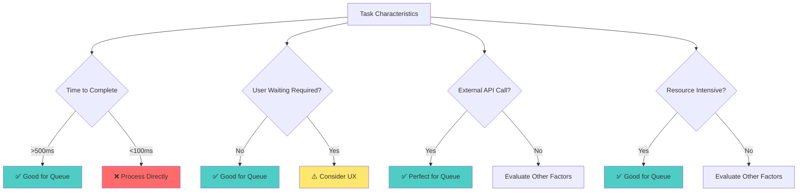
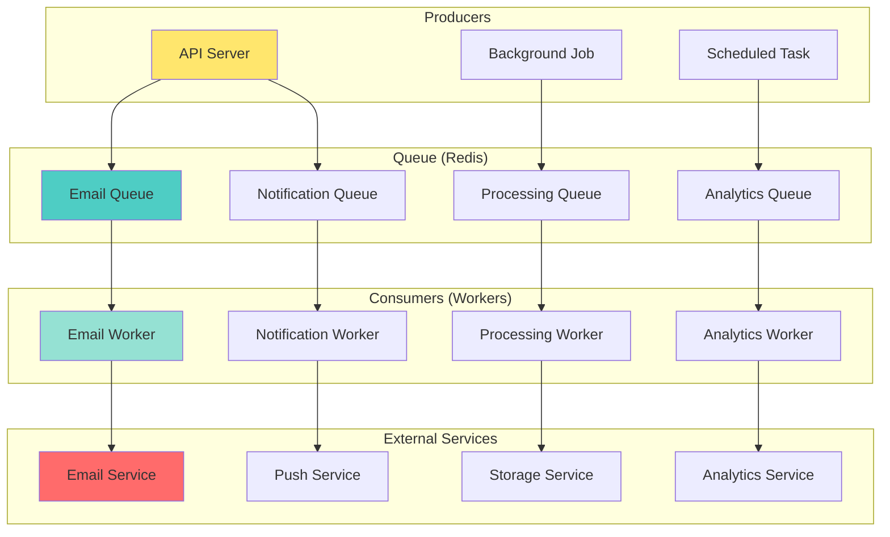

# 📘 **NESTJS MASTERY - Lesson 8: Message Queues with BullMQ**

**Date**: 18-03-26  
**Level**: 🟢 Beginner → 🔴 Senior Engineer  
**Series**: NestJS Fundamentals  
**Time**: 60 minutes  
**Prerequisites**: Lesson 1 (Modules), Lesson 2 (Decorators & DI), Lesson 3 (Guards/Interceptors/Filters), Lesson 4 (DTOs & Validation), Lesson 5 (Services & Repository), Lesson 6 (Database & Mongoose), Lesson 7 (Caching with Redis)  

---

## 🎯 **LEARNING OBJECTIVES**

After completing this **comprehensive** lesson, you will:

1. ✅ **Understand Message Queue Fundamentals** - Why queues, when to use, queue patterns
2. ✅ **Master BullMQ Setup** - Installation, configuration, connection pooling
3. ✅ **Implement Producer Pattern** - Adding jobs to queues
4. ✅ **Master Consumer Pattern** - Processing jobs, workers, concurrency
5. ✅ **Handle Job Failures** - Retries, backoff strategies, dead letter queues
6. ✅ **Implement Advanced Patterns** - Delayed jobs, scheduled jobs, job priorities
7. ✅ **Production Queue Management** - Monitoring, metrics, scaling workers

---

## 📦 **PART 1: MESSAGE QUEUE FUNDAMENTALS**

### **Why Message Queues Matter**

```mermaid
graph TB
    subgraph "Without Queue (Synchronous)"
        A1[User Request] --> B1[API Server]
        B1 --> C1[Send Email]
        C1 --> D1[Email Service]
        D1 --> C1
        C1 --> B1
        B1 --> A1
        
        style D1 fill:#ff6b6b
        style C1 fill:#ff6b6b
        note: User waits 2-5 seconds
    end
    
    subgraph "With Queue (Asynchronous)"
        A2[User Request] --> B2[API Server]
        B2 --> C2[Add to Queue]
        C2 --> A2
        B2 --> E2[Return Immediately]
        E2 --> A2
        
        C2 --> D2[Queue]
        D2 --> F2[Worker]
        F2 --> G2[Send Email]
        G2 --> F2
        
        style D2 fill:#4ecdc4
        style F2 fill:#95e1d3
        note: User waits <100ms
    end
```

**Performance Comparison**:

| Operation | Synchronous | Asynchronous (Queue) | Improvement |
|-----------|-------------|---------------------|-------------|
| Send Welcome Email | 2-5 seconds | <100ms | 20-50x faster |
| Generate PDF Report | 5-30 seconds | <100ms | 50-300x faster |
| Process Video Upload | 30-300 seconds | <100ms | 300-3000x faster |
| Send Push Notifications | 1-10 seconds | <100ms | 10-100x faster |

**Benefits**:
- ✅ **Better User Experience**: Sub-100ms response times
- ✅ **Reliability**: Jobs persist even if worker crashes
- ✅ **Scalability**: Add more workers during peak load
- ✅ **Decoupling**: Services don't need to be available simultaneously
- ✅ **Rate Limiting**: Control processing speed for external APIs

---

### **When to Use Queues**



**✅ Excellent Candidates for Queues**:
- Email/SMS notifications
- PDF/image generation
- Video/audio processing
- Data exports/imports
- Webhook delivery
- Scheduled tasks (cron jobs)
- Bulk operations
- Third-party API integrations

**❌ Poor Candidates for Queues**:
- Simple database CRUD (<100ms)
- User needs immediate result
- Real-time chat messages
- Session management
- Authentication checks

---

### **Queue Architecture Overview**



---

## 📦 **PART 2: BULLMQ SETUP & CONFIGURATION**

### **Installation & Module Setup**

```bash
# Install BullMQ and Redis
npm install bullmq ioredis
npm install --save-dev @types/ioredis
```

```typescript
// ─────────────────────────────────────────────
// bullmq.module.ts
// ─────────────────────────────────────────────
import { Module, DynamicModule, Global } from '@nestjs/common';
import { BullModule } from '@nestjs/bullmq';
import { ConfigModule, ConfigService } from '@nestjs/config';

@Global()
@Module({
  imports: [],
  providers: [],
  exports: [],
})
export class BullmqModule {
  static forRoot(): DynamicModule {
    return {
      module: BullmqModule,
      imports: [
        BullModule.forRootAsync({
          imports: [ConfigModule],
          useFactory: async (configService: ConfigService) => ({
            // Redis connection
            connection: {
              host: configService.get('REDIS_HOST', 'localhost'),
              port: configService.get('REDIS_PORT', 6379),
              password: configService.get('REDIS_PASSWORD'),
              db: configService.get('REDIS_DB', 0),
              
              // Connection pooling
              maxRetriesPerRequest: null,  // Required for BullMQ
              retryStrategy: (times: number) => {
                if (times > 3) {
                  console.error('Redis connection failed after 3 retries');
                  return null;
                }
                return Math.min(times * 50, 2000);
              },
            },
            
            // Default job options
            defaultJobOptions: {
              attempts: 3,  // Retry 3 times on failure
              backoff: {
                type: 'exponential',
                delay: 2000,  // Start with 2s delay
              },
              removeOnComplete: {
                count: 100,  // Keep last 100 completed jobs
              },
              removeOnFail: {
                count: 500,  // Keep last 500 failed jobs
              },
            },
          }),
          inject: [ConfigService],
        }),
      ],
      exports: [BullModule],
    };
  }
}

// ─────────────────────────────────────────────
// .env
// ─────────────────────────────────────────────
REDIS_HOST=localhost
REDIS_PORT=6379
REDIS_PASSWORD=your_secure_password
REDIS_DB=0
```

---

### **Queue Definitions**

```typescript
// ─────────────────────────────────────────────
// queues.ts - Central Queue Names
// ─────────────────────────────────────────────
export const QueueNames = {
  EMAIL: 'email',
  NOTIFICATION: 'notification',
  PROCESSING: 'processing',
  ANALYTICS: 'analytics',
  PAYMENT: 'payment',
  EXPORT: 'export',
} as const;

export type QueueName = typeof QueueNames[keyof typeof QueueNames];

// ─────────────────────────────────────────────
// queue-options.ts - Queue-Specific Options
// ─────────────────────────────────────────────
import { QueueOptions } from 'bullmq';

export const QueueOptions: Record<QueueName, Partial<QueueOptions>> = {
  [QueueNames.EMAIL]: {
    defaultJobOptions: {
      attempts: 5,  // Emails are important, retry more
      backoff: {
        type: 'exponential',
        delay: 3000,
      },
      removeOnComplete: { count: 200 },
      removeOnFail: { count: 1000 },
      timeout: 30000,  // 30 second timeout
    },
  },
  
  [QueueNames.NOTIFICATION]: {
    defaultJobOptions: {
      attempts: 3,
      backoff: {
        type: 'fixed',
        delay: 2000,
      },
      removeOnComplete: { count: 100 },
      removeOnFail: { count: 500 },
      timeout: 10000,  // 10 second timeout
    },
  },
  
  [QueueNames.PROCESSING]: {
    defaultJobOptions: {
      attempts: 3,
      backoff: {
        type: 'exponential',
        delay: 5000,
      },
      removeOnComplete: { count: 50 },
      removeOnFail: { count: 200 },
      timeout: 300000,  // 5 minute timeout for heavy processing
    },
  },
  
  [QueueNames.ANALYTICS]: {
    defaultJobOptions: {
      attempts: 2,
      backoff: {
        type: 'fixed',
        delay: 1000,
      },
      removeOnComplete: { count: 100 },
      removeOnFail: { count: 100 },
      timeout: 60000,  // 1 minute timeout
    },
  },
  
  [QueueNames.PAYMENT]: {
    defaultJobOptions: {
      attempts: 5,  // Payments are critical
      backoff: {
        type: 'exponential',
        delay: 5000,
      },
      removeOnComplete: { count: 500 },  // Keep longer for auditing
      removeOnFail: { count: 1000 },
      timeout: 60000,  // 1 minute timeout
    },
  },
  
  [QueueNames.EXPORT]: {
    defaultJobOptions: {
      attempts: 3,
      backoff: {
        type: 'exponential',
        delay: 10000,
      },
      removeOnComplete: { count: 20 },
      removeOnFail: { count: 50 },
      timeout: 600000,  // 10 minute timeout for large exports
    },
  },
};
```

---

## 📦 **PART 3: PRODUCER PATTERN**

### **Queue Service Wrapper**

```typescript
// ─────────────────────────────────────────────
// queue/queue.service.ts
// ─────────────────────────────────────────────
import { Injectable, Inject } from '@nestjs/common';
import { Queue } from 'bullmq';
import { QueueNames } from './queues';

@Injectable()
export class QueueService {
  constructor(
    @Inject(QueueNames.EMAIL) private emailQueue: Queue,
    @Inject(QueueNames.NOTIFICATION) private notificationQueue: Queue,
    @Inject(QueueNames.PROCESSING) private processingQueue: Queue,
    @Inject(QueueNames.ANALYTICS) private analyticsQueue: Queue,
    @Inject(QueueNames.PAYMENT) private paymentQueue: Queue,
    @Inject(QueueNames.EXPORT) private exportQueue: Queue,
  ) {}

  // ─────────────────────────────────────────────
  // Email Jobs
  // ─────────────────────────────────────────────
  async sendWelcomeEmail(userId: string, email: string): Promise<string> {
    const job = await this.emailQueue.add(
      'send-welcome-email',
      {
        userId,
        email,
        template: 'welcome',
      },
      {
        jobId: `welcome:${userId}`,  // Unique job ID (prevents duplicates)
        priority: 1,  // High priority for welcome emails
      },
    );
    
    return job.id;
  }

  async sendPasswordResetEmail(userId: string, email: string, token: string): Promise<string> {
    const job = await this.emailQueue.add(
      'send-password-reset',
      {
        userId,
        email,
        token,
        template: 'password-reset',
      },
      {
        jobId: `reset:${userId}:${Date.now()}`,
        priority: 2,  // Highest priority
      },
    );
    
    return job.id;
  }

  async sendNotificationEmail(
    userId: string,
    email: string,
    subject: string,
    body: string,
  ): Promise<string> {
    const job = await this.emailQueue.add(
      'send-notification',
      {
        userId,
        email,
        subject,
        body,
        template: 'notification',
      },
      {
        jobId: `notif:${userId}:${Date.now()}`,
        priority: 3,  // Normal priority
      },
    );
    
    return job.id;
  }

  // ─────────────────────────────────────────────
  // Notification Jobs
  // ─────────────────────────────────────────────
  async sendPushNotification(
    userId: string,
    title: string,
    body: string,
    data?: any,
  ): Promise<string> {
    const job = await this.notificationQueue.add(
      'send-push',
      {
        userId,
        title,
        body,
        data,
      },
      {
        jobId: `push:${userId}:${Date.now()}`,
        priority: 2,
      },
    );
    
    return job.id;
  }

  async sendSmsNotification(
    userId: string,
    phoneNumber: string,
    message: string,
  ): Promise<string> {
    const job = await this.notificationQueue.add(
      'send-sms',
      {
        userId,
        phoneNumber,
        message,
      },
      {
        jobId: `sms:${userId}:${Date.now()}`,
        priority: 2,
      },
    );
    
    return job.id;
  }

  // ─────────────────────────────────────────────
  // Processing Jobs
  // ─────────────────────────────────────────────
  async processVideoUpload(
    userId: string,
    videoId: string,
    videoUrl: string,
  ): Promise<string> {
    const job = await this.processingQueue.add(
      'process-video',
      {
        userId,
        videoId,
        videoUrl,
      },
      {
        jobId: `video:${videoId}`,
        priority: 3,
      },
    );
    
    return job.id;
  }

  async generatePdfReport(
    userId: string,
    reportType: string,
    params: any,
  ): Promise<string> {
    const job = await this.processingQueue.add(
      'generate-pdf',
      {
        userId,
        reportType,
        params,
      },
      {
        jobId: `pdf:${userId}:${reportType}:${Date.now()}`,
        priority: 3,
      },
    );
    
    return job.id;
  }

  // ─────────────────────────────────────────────
  // Analytics Jobs
  // ─────────────────────────────────────────────
  async trackAnalyticsEvent(event: AnalyticsEventDto): Promise<string> {
    const job = await this.analyticsQueue.add(
      'track-event',
      event,
      {
        jobId: `analytics:${event.userId}:${Date.now()}`,
        priority: 4,  // Lower priority
      },
    );
    
    return job.id;
  }

  // ─────────────────────────────────────────────
  // Payment Jobs
  // ─────────────────────────────────────────────
  async processPayment(
    userId: string,
    paymentId: string,
    amount: number,
    paymentMethod: string,
  ): Promise<string> {
    const job = await this.paymentQueue.add(
      'process-payment',
      {
        userId,
        paymentId,
        amount,
        paymentMethod,
      },
      {
        jobId: `payment:${paymentId}`,
        priority: 1,  // Highest priority for payments
      },
    );
    
    return job.id;
  }

  // ─────────────────────────────────────────────
  // Export Jobs
  // ─────────────────────────────────────────────
  async exportData(
    userId: string,
    exportType: string,
    filters: any,
  ): Promise<string> {
    const job = await this.exportQueue.add(
      'export-data',
      {
        userId,
        exportType,
        filters,
      },
      {
        jobId: `export:${userId}:${exportType}:${Date.now()}`,
        priority: 3,
      },
    );
    
    return job.id;
  }

  // ─────────────────────────────────────────────
  // Delayed Jobs
  // ─────────────────────────────────────────────
  async scheduleReminderEmail(
    userId: string,
    email: string,
    reminderTime: Date,
    message: string,
  ): Promise<string> {
    const delay = reminderTime.getTime() - Date.now();
    
    if (delay <= 0) {
      throw new Error('Reminder time must be in the future');
    }
    
    const job = await this.emailQueue.add(
      'send-reminder',
      {
        userId,
        email,
        message,
      },
      {
        jobId: `reminder:${userId}:${reminderTime.getTime()}`,
        delay,  // Delay in milliseconds
        priority: 2,
      },
    );
    
    return job.id;
  }

  // ─────────────────────────────────────────────
  // Job Management
  // ─────────────────────────────────────────────
  async getJobStatus(jobId: string): Promise<{
    status: string;
    progress: number;
    data: any;
    failedReason?: string;
  }> {
    // Search across all queues
    const queues = [
      this.emailQueue,
      this.notificationQueue,
      this.processingQueue,
      this.analyticsQueue,
      this.paymentQueue,
      this.exportQueue,
    ];
    
    for (const queue of queues) {
      const job = await queue.getJob(jobId);
      if (job) {
        const state = await job.getState();
        return {
          status: state,
          progress: job.progress,
          data: job.data,
          failedReason: job.failedReason,
        };
      }
    }
    
    throw new Error(`Job ${jobId} not found`);
  }

  async cancelJob(jobId: string): Promise<void> {
    const queues = [
      this.emailQueue,
      this.notificationQueue,
      this.processingQueue,
      this.analyticsQueue,
      this.paymentQueue,
      this.exportQueue,
    ];
    
    for (const queue of queues) {
      const job = await queue.getJob(jobId);
      if (job) {
        await job.remove();
        return;
      }
    }
    
    throw new Error(`Job ${jobId} not found`);
  }
}

```

---

### **Queue Module Registration**

```typescript
// ─────────────────────────────────────────────
// queue/queue.module.ts
// ─────────────────────────────────────────────
import { Module } from '@nestjs/common';
import { BullModule } from '@nestjs/bullmq';
import { QueueNames, QueueOptions } from './queues';
import { QueueService } from './queue.service';

@Module({
  imports: [
    // Register all queues
    BullModule.registerQueue(
      {
        name: QueueNames.EMAIL,
        ...QueueOptions[QueueNames.EMAIL],
      },
      {
        name: QueueNames.NOTIFICATION,
        ...QueueOptions[QueueNames.NOTIFICATION],
      },
      {
        name: QueueNames.PROCESSING,
        ...QueueOptions[QueueNames.PROCESSING],
      },
      {
        name: QueueNames.ANALYTICS,
        ...QueueOptions[QueueNames.ANALYTICS],
      },
      {
        name: QueueNames.PAYMENT,
        ...QueueOptions[QueueNames.PAYMENT],
      },
      {
        name: QueueNames.EXPORT,
        ...QueueOptions[QueueNames.EXPORT],
      },
    ),
  ],
  providers: [QueueService],
  exports: [QueueService, BullModule],
})
export class QueueModule {}
```

---

## 📦 **PART 4: CONSUMER PATTERN (WORKERS)**

### **Email Processor**

```typescript
// ─────────────────────────────────────────────
// processors/email.processor.ts
// ─────────────────────────────────────────────
import { Process, Processor } from '@nestjs/bullmq';
import { Job } from 'bullmq';
import { Logger } from '@nestjs/common';
import { QueueNames } from '../queues';
import { EmailService } from '../email/email.service';

@Processor(QueueNames.EMAIL)
export class EmailProcessor {
  private readonly logger = new Logger(EmailProcessor.name);

  constructor(private emailService: EmailService) {}

  @Process('send-welcome-email')
  async processWelcomeEmail(job: Job<any>) {
    const { userId, email } = job.data;
    
    this.logger.log(`Processing welcome email for user ${userId}`);
    
    try {
      // Update progress
      await job.updateProgress(10);
      
      // Get user data
      await job.updateProgress(30);
      
      // Send email
      await this.emailService.sendWelcome(email);
      await job.updateProgress(80);
      
      // Log success
      await job.updateProgress(100);
      this.logger.log(`Welcome email sent to ${email}`);
      
    } catch (error) {
      this.logger.error(`Failed to send welcome email: ${error.message}`, error.stack);
      throw error;  // BullMQ will retry based on configuration
    }
  }

  @Process('send-password-reset')
  async processPasswordReset(job: Job<any>) {
    const { userId, email, token } = job.data;
    
    this.logger.log(`Processing password reset for user ${userId}`);
    
    await job.updateProgress(20);
    
    const resetUrl = `https://app.example.com/reset-password?token=${token}`;
    await this.emailService.sendPasswordReset(email, resetUrl);
    
    await job.updateProgress(100);
    this.logger.log(`Password reset email sent to ${email}`);
  }

  @Process('send-notification')
  async processNotification(job: Job<any>) {
    const { userId, email, subject, body } = job.data;
    
    this.logger.log(`Processing notification email for user ${userId}`);
    
    await this.emailService.sendNotification(email, subject, body);
    
    this.logger.log(`Notification email sent to ${email}`);
  }
}
```

---

### **Payment Processor with Error Handling**

```typescript
// ─────────────────────────────────────────────
// processors/payment.processor.ts
// ─────────────────────────────────────────────
import { Process, Processor } from '@nestjs/bullmq';
import { Job } from 'bullmq';
import { Logger } from '@nestjs/common';
import { QueueNames } from '../queues';
import { PaymentService } from '../payment/payment.service';
import { NotificationService } from '../notification/notification.service';

@Processor(QueueNames.PAYMENT)
export class PaymentProcessor {
  private readonly logger = new Logger(PaymentProcessor.name);

  constructor(
    private paymentService: PaymentService,
    private notificationService: NotificationService,
  ) {}

  @Process('process-payment')
  async processPayment(job: Job<any>) {
    const { userId, paymentId, amount, paymentMethod } = job.data;
    
    this.logger.log(`Processing payment ${paymentId} for user ${userId}`);
    
    try {
      // Step 1: Validate payment
      await job.updateProgress(10);
      const isValid = await this.paymentService.validatePayment(paymentId);
      
      if (!isValid) {
        throw new Error('Invalid payment details');
      }
      
      // Step 2: Charge payment
      await job.updateProgress(30);
      const result = await this.paymentService.charge({
        paymentId,
        amount,
        paymentMethod,
      });
      
      // Step 3: Update database
      await job.updateProgress(60);
      await this.paymentService.recordPayment({
        paymentId,
        userId,
        amount,
        status: 'completed',
        transactionId: result.transactionId,
      });
      
      // Step 4: Send confirmation
      await job.updateProgress(80);
      await this.notificationService.sendPushNotification(
        userId,
        'Payment Successful',
        `Your payment of $${amount} has been processed successfully.`,
      );
      
      await job.updateProgress(100);
      this.logger.log(`Payment ${paymentId} processed successfully`);
      
      return {
        success: true,
        transactionId: result.transactionId,
      };
      
    } catch (error) {
      this.logger.error(`Payment ${paymentId} failed: ${error.message}`, error.stack);
      
      // Log failed payment
      await this.paymentService.recordPayment({
        paymentId,
        userId,
        amount,
        status: 'failed',
        errorMessage: error.message,
      });
      
      // Notify user of failure
      await this.notificationService.sendPushNotification(
        userId,
        'Payment Failed',
        `Your payment of $${amount} could not be processed. Please try again.`,
      );
      
      // Re-throw to trigger retry
      throw error;
    }
  }
}
```

---

### **Processing Worker with Concurrency**

```typescript
// ─────────────────────────────────────────────
// processors/processing.processor.ts
// ─────────────────────────────────────────────
import { Process, Processor } from '@nestjs/bullmq';
import { Job } from 'bullmq';
import { Logger } from '@nestjs/common';
import { QueueNames } from '../queues';
import { ProcessingService } from '../processing/processing.service';

@Processor(QueueNames.PROCESSING)
export class ProcessingProcessor {
  private readonly logger = new Logger(ProcessingProcessor.name);

  constructor(private processingService: ProcessingService) {}

  @Process({
    name: 'process-video',
    concurrency: 2,  // Only process 2 videos at a time (resource intensive)
  })
  async processVideo(job: Job<any>) {
    const { userId, videoId, videoUrl } = job.data;
    
    this.logger.log(`Processing video ${videoId} for user ${userId}`);
    
    // Listen to progress events
    job.progress(10);
    
    try {
      // Download video
      await job.progress(30);
      const localPath = await this.processingService.downloadVideo(videoUrl);
      
      // Transcode video
      await job.progress(50);
      await this.processingService.transcodeVideo(localPath);
      
      // Upload to CDN
      await job.progress(80);
      const cdnUrl = await this.processingService.uploadToCdn(localPath);
      
      // Update database
      await job.progress(90);
      await this.processingService.updateVideoRecord(videoId, {
        status: 'completed',
        cdnUrl,
      });
      
      await job.progress(100);
      this.logger.log(`Video ${videoId} processed successfully`);
      
    } catch (error) {
      this.logger.error(`Video ${videoId} processing failed: ${error.message}`, error.stack);
      
      // Update database with error
      await this.processingService.updateVideoRecord(videoId, {
        status: 'failed',
        errorMessage: error.message,
      });
      
      throw error;
    }
  }

  @Process({
    name: 'generate-pdf',
    concurrency: 5,  // Can process 5 PDFs concurrently
  })
  async generatePdf(job: Job<any>) {
    const { userId, reportType, params } = job.data;
    
    this.logger.log(`Generating ${reportType} report for user ${userId}`);
    
    try {
      await job.progress(20);
      
      // Generate PDF
      const pdfBuffer = await this.processingService.generatePdf(reportType, params);
      
      await job.progress(60);
      
      // Upload to storage
      const downloadUrl = await this.processingService.uploadPdf(pdfBuffer, userId);
      
      await job.progress(100);
      
      this.logger.log(`PDF report generated for user ${userId}`);
      
      return { downloadUrl };
      
    } catch (error) {
      this.logger.error(`PDF generation failed: ${error.message}`, error.stack);
      throw error;
    }
  }
}
```

---

## 📦 **PART 5: ADVANCED QUEUE PATTERNS**

### **Pattern 1: Delayed & Scheduled Jobs**

```typescript
// ─────────────────────────────────────────────
// Scheduled Jobs Example
// ─────────────────────────────────────────────
@Injectable()
export class ScheduledJobService {
  constructor(
    @Inject(QueueNames.EMAIL) private emailQueue: Queue,
    @Inject(QueueNames.NOTIFICATION) private notificationQueue: Queue,
  ) {}

  // Schedule email to be sent in 1 hour
  async scheduleEmailIn1Hour(data: any): Promise<void> {
    await this.emailQueue.add('send-notification', data, {
      delay: 60 * 60 * 1000,  // 1 hour in milliseconds
    });
  }

  // Schedule email for specific date/time
  async scheduleEmailForDate(sendDate: Date, data: any): Promise<void> {
    const delay = sendDate.getTime() - Date.now();
    
    if (delay <= 0) {
      throw new Error('Scheduled date must be in the future');
    }
    
    await this.emailQueue.add('send-notification', data, {
      delay,
      jobId: `scheduled:${sendDate.getTime()}:${data.userId}`,
    });
  }

  // Schedule recurring job (daily reminder)
  async scheduleDailyReminder(userId: string, email: string, hour: number): Promise<void> {
    // Calculate delay until next occurrence of specified hour
    const now = new Date();
    const nextOccurrence = new Date();
    nextOccurrence.setHours(hour, 0, 0, 0);
    
    if (nextOccurrence <= now) {
      nextOccurrence.setDate(nextOccurrence.getDate() + 1);
    }
    
    const delay = nextOccurrence.getTime() - now.getTime();
    
    await this.emailQueue.add('send-daily-reminder', {
      userId,
      email,
    }, {
      delay,
      repeat: {
        pattern: '0 * * * *',  // Cron: Every hour
      },
    });
  }
}
```

---

### **Pattern 2: Job Priorities**

```typescript
// ─────────────────────────────────────────────
// Priority Levels
// ─────────────────────────────────────────────
export enum JobPriority {
  CRITICAL = 1,   // Highest priority
  HIGH = 2,
  NORMAL = 3,
  LOW = 4,
  BACKGROUND = 5, // Lowest priority
}

// ─────────────────────────────────────────────
// Usage with Priorities
// ─────────────────────────────────────────────
@Injectable()
export class PriorityJobService {
  constructor(
    @Inject(QueueNames.EMAIL) private emailQueue: Queue,
  ) {}

  // Critical: Password reset (highest priority)
  async sendPasswordReset(email: string, token: string): Promise<void> {
    await this.emailQueue.add('send-password-reset', { email, token }, {
      priority: JobPriority.CRITICAL,
    });
  }

  // High: Welcome email
  async sendWelcomeEmail(email: string): Promise<void> {
    await this.emailQueue.add('send-welcome-email', { email }, {
      priority: JobPriority.HIGH,
    });
  }

  // Normal: Regular notification
  async sendNotification(email: string, subject: string): Promise<void> {
    await this.emailQueue.add('send-notification', { email, subject }, {
      priority: JobPriority.NORMAL,
    });
  }

  // Low: Newsletter
  async sendNewsletter(email: string): Promise<void> {
    await this.emailQueue.add('send-newsletter', { email }, {
      priority: JobPriority.LOW,
    });
  }

  // Background: Analytics
  async trackEvent(data: any): Promise<void> {
    await this.emailQueue.add('track-event', data, {
      priority: JobPriority.BACKGROUND,
    });
  }
}
```

---

### **Pattern 3: Bulk Jobs & Batches**

```typescript
// ─────────────────────────────────────────────
// Bulk Job Addition
// ─────────────────────────────────────────────
@Injectable()
export class BulkJobService {
  constructor(
    @Inject(QueueNames.EMAIL) private emailQueue: Queue,
  ) {}

  // Send emails to multiple users
  async sendBulkEmails(users: Array<{ userId: string; email: string }>): Promise<void> {
    const jobs = users.map(user => ({
      name: 'send-notification',
      data: {
        userId: user.userId,
        email: user.email,
        subject: 'Weekly Update',
        body: 'Here is your weekly update...',
      },
      opts: {
        jobId: `bulk:${user.userId}:${Date.now()}`,
        priority: JobPriority.LOW,
      },
    }));

    // Add all jobs at once (more efficient than individual adds)
    await this.emailQueue.addBulk(jobs);
  }

  // Process with rate limiting (10 emails per second)
  async sendRateLimitedEmails(users: Array<{ userId: string; email: string }>): Promise<void> {
    const jobs = users.map((user, index) => ({
      name: 'send-notification',
      data: {
        userId: user.userId,
        email: user.email,
      },
      opts: {
        jobId: `rate:${user.userId}:${Date.now()}`,
        delay: index * 100,  // 100ms delay between each email
        priority: JobPriority.LOW,
      },
    }));

    await this.emailQueue.addBulk(jobs);
  }
}
```

---

### **Pattern 4: Job Events & Monitoring**

```typescript
// ─────────────────────────────────────────────
// Job Event Listener
// ─────────────────────────────────────────────
import { Injectable, OnModuleInit } from '@nestjs/common';
import { InjectQueue } from '@nestjs/bullmq';
import { Queue, Job } from 'bullmq';
import { Logger } from '@nestjs/common';
import { QueueNames } from './queues';

@Injectable()
export class JobEventListener implements OnModuleInit {
  private readonly logger = new Logger(JobEventListener.name);

  constructor(
    @InjectQueue(QueueNames.EMAIL) private emailQueue: Queue,
    @InjectQueue(QueueNames.PAYMENT) private paymentQueue: Queue,
  ) {}

  onModuleInit() {
    // Listen to queue events
    this.emailQueue.on('completed', (job: Job, result: any) => {
      this.logger.log(`Job ${job.id} completed: ${job.data}`);
    });

    this.emailQueue.on('failed', (job: Job, error: Error) => {
      this.logger.error(`Job ${job.id} failed: ${error.message}`, error.stack);
      
      // Send alert for critical failures
      if (job.opts.priority === JobPriority.CRITICAL) {
        this.sendAlert(job, error);
      }
    });

    this.emailQueue.on('stalled', (job: Job) => {
      this.logger.warn(`Job ${job.id} stalled (worker crashed)`);
    });

    this.paymentQueue.on('completed', (job: Job, result: any) => {
      this.logger.log(`Payment ${job.id} completed successfully`);
    });

    this.paymentQueue.on('failed', (job: Job, error: Error) => {
      this.logger.error(`Payment ${job.id} failed: ${error.message}`);
      
      // Always alert for payment failures
      this.sendAlert(job, error);
    });
  }

  private async sendAlert(job: Job, error: Error) {
    // Send alert to monitoring system
    // Could be Slack, PagerDuty, email, etc.
    console.error(`ALERT: Job ${job.id} failed with error: ${error.message}`);
  }
}
```

---

## 📦 **PART 6: ERROR HANDLING & RETRIES**

### **Retry Strategies**

```typescript
// ─────────────────────────────────────────────
// Retry Configuration Examples
// ─────────────────────────────────────────────

// 1. Fixed Backoff (retry every 2 seconds)
{
  attempts: 5,
  backoff: {
    type: 'fixed',
    delay: 2000,
  },
}

// 2. Exponential Backoff (2s, 4s, 8s, 16s, 32s)
{
  attempts: 5,
  backoff: {
    type: 'exponential',
    delay: 2000,
  },
}

// 3. Custom Backoff
{
  attempts: 5,
  backoff: {
    type: 'custom',
    delay: async (attemptsMade: number) => {
      // Custom logic: 1s, 3s, 5s, 10s, 30s
      const delays = [1000, 3000, 5000, 10000, 30000];
      return delays[attemptsMade - 1] || 30000;
    },
  },
}

// 4. Conditional Retry
{
  attempts: 5,
  backoff: {
    type: 'exponential',
    delay: 2000,
  },
  // Only retry on specific errors
  attemptsBackoff: {
    type: 'exponential',
    delay: 2000,
  },
}
```

---

### **Dead Letter Queue Pattern**

```typescript
// ─────────────────────────────────────────────
// Dead Letter Queue for Failed Jobs
// ─────────────────────────────────────────────
@Processor(QueueNames.EMAIL)
export class EmailProcessorWithDLQ {
  private readonly logger = new Logger(EmailProcessorWithDLQ.name);

  constructor(
    private emailService: EmailService,
    @InjectQueue(QueueNames.EMAIL) private emailQueue: Queue,
  ) {}

  @Process('send-notification')
  async processNotification(job: Job<any>) {
    try {
      await this.emailService.send(job.data);
    } catch (error) {
      this.logger.error(`Email failed after ${job.attemptsMade} attempts`);
      
      // If max attempts reached, move to dead letter queue
      if (job.attemptsMade >= job.opts.attempts) {
        await this.moveToDeadLetterQueue(job, error);
      }
      
      throw error;  // Trigger retry
    }
  }

  private async moveToDeadLetterQueue(job: Job, error: Error) {
    const dlqName = `${this.emailQueue.name}:dlq`;
    
    // Create or get DLQ
    const dlq = new Queue(dlqName, {
      connection: this.emailQueue.opts.connection,
    });

    // Add to DLQ with error information
    await dlq.add('failed-job', {
      originalQueue: this.emailQueue.name,
      originalJobId: job.id,
      originalData: job.data,
      error: error.message,
      stack: error.stack,
      failedAt: new Date().toISOString(),
      attemptsMade: job.attemptsMade,
    }, {
      removeOnComplete: { count: 1000 },  // Keep failed jobs for analysis
    });

    this.logger.warn(`Job ${job.id} moved to dead letter queue`);
  }
}
```

---

## ✅ **PRODUCTION CHECKLIST**

```
Queue Setup
[ ] All queues registered with appropriate options
[ ] Redis connection pooling configured
[ ] Default job options set (attempts, backoff, timeout)
[ ] Queue-specific options configured
[ ] Job IDs are unique and deterministic

Producers
[ ] Job data validated before adding to queue
[ ] Unique job IDs to prevent duplicates
[ ] Appropriate priority levels set
[ ] Delayed jobs use correct delay calculation
[ ] Bulk jobs use addBulk for efficiency

Consumers (Workers)
[ ] Processors implemented for all job types
[ ] Concurrency limits set appropriately
[ ] Progress updates implemented
[ ] Error handling with proper logging
[ ] Failed jobs logged with stack traces

Error Handling
[ ] Retry strategies configured per queue
[ ] Backoff delays appropriate for job type
[ ] Dead letter queue for failed jobs
[ ] Alert system for critical failures
[ ] Failed job analysis process

Monitoring
[ ] Job completion events logged
[ ] Failed job alerts configured
[ ] Queue depth monitoring
[ ] Worker health checks
[ ] Performance metrics tracked

Scaling
[ ] Multiple workers can run concurrently
[ ] Worker count matches CPU cores
[ ] Queue separation for different workloads
[ ] Rate limiting for external APIs
[ ] Resource limits configured
```

---

## 🎯 **KNOWLEDGE CHECK**

### **Question 1: When to Use Queues**

When should you use a message queue vs synchronous processing?

<details>
<summary>💡 Click to reveal answer</summary>

**Use Queue When**:
- Operation takes >500ms
- User doesn't need immediate result
- External API call (email, SMS, payment)
- Resource intensive (video processing, PDF generation)
- Need to handle burst traffic

**Process Synchronously When**:
- Operation takes <100ms
- User needs immediate result
- Simple database CRUD
- Authentication/authorization checks

**Rule of Thumb**: If it makes the user wait >500ms, queue it!
</details>

---

### **Question 2: Retry Strategies**

What's the difference between fixed and exponential backoff?

<details>
<summary>💡 Click to reveal answer</summary>

**Fixed Backoff**:
```typescript
backoff: { type: 'fixed', delay: 2000 }
// Retries: 2s, 2s, 2s, 2s, 2s
```
- ✅ Predictable retry times
- ✅ Good for transient errors
- ❌ Doesn't account for load

**Exponential Backoff**:
```typescript
backoff: { type: 'exponential', delay: 2000 }
// Retries: 2s, 4s, 8s, 16s, 32s
```
- ✅ Reduces load on failing service
- ✅ Better for cascading failures
- ❌ Longer total retry time

**Use Fixed** for predictable retries. **Use Exponential** for external services that might be overloaded.
</details>

---

### **Question 3: Job Priorities**

How do job priorities work in BullMQ?

<details>
<summary>💡 Click to reveal answer</summary>

**Priority Levels** (1 = Highest):
```typescript
JobPriority.CRITICAL = 1    // Process first
JobPriority.HIGH = 2
JobPriority.NORMAL = 3      // Default
JobPriority.LOW = 4
JobPriority.BACKGROUND = 5  // Process last
```

**Usage**:
```typescript
await queue.add('job', data, {
  priority: JobPriority.HIGH,
});
```

**Important**:
- Lower number = Higher priority
- Jobs are sorted by priority within the queue
- Doesn't work with delayed jobs
- Use for urgent vs non-urgent work

**Example**: Password reset (priority 1) vs Newsletter (priority 4)
</details>

---

## 📚 **ADDITIONAL RESOURCES**

- **BullMQ Docs**: [BullMQ Documentation](https://docs.bullmq.io/)
- **NestJS BullMQ**: [NestJS BullMQ Module](https://docs.nestjs.com/techniques/queues)
- **Redis Streams**: [Redis Streams](https://redis.io/topics/streams-intro)
- **Queue Patterns**: [Enterprise Integration Patterns](https://www.enterpriseintegrationpatterns.com/patterns/messaging/)

---

## 🎓 **HOMEWORK**

1. ✅ Set up BullMQ module with 3 different queues
2. ✅ Create email processor with welcome/password reset emails
3. ✅ Implement payment processor with error handling
4. ✅ Add job progress tracking
5. ✅ Configure retry strategies with exponential backoff
6. ✅ Implement dead letter queue for failed jobs
7. ✅ Add job event listeners for monitoring
8. ✅ Create delayed/scheduled jobs
9. ✅ Implement job priorities
10. ✅ Test bulk job addition with addBulk

---

**Next Lesson**: Testing (Unit, Integration, E2E)  
**Date**: 18-03-26  
**Status**: ✅ Complete

---
-18-03-26
