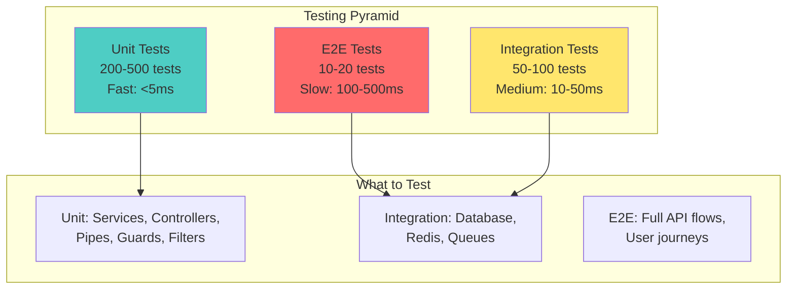

# 📘 **NESTJS MASTERY - Lesson 9: Testing with Vitest**

**Date**: 18-03-26  
**Level**: 🟢 Beginner → 🔴 Senior Engineer  
**Series**: NestJS Fundamentals  
**Time**: 65 minutes  
**Prerequisites**: Lesson 1 (Modules), Lesson 2 (Decorators & DI), Lesson 3 (Guards/Interceptors/Filters), Lesson 4 (DTOs & Validation), Lesson 5 (Services & Repository), Lesson 6 (Database & Mongoose), Lesson 7 (Caching with Redis), Lesson 8 (Message Queues with BullMQ)  

---

## 🎯 **LEARNING OBJECTIVES**

After completing this **comprehensive** lesson, you will:

1. ✅ **Understand Testing Pyramid** - Unit, integration, E2E testing strategies
2. ✅ **Master Vitest Setup** - Configuration, globals, test environment
3. ✅ **Write Unit Tests** - Services, controllers, pipes, guards
4. ✅ **Master Integration Tests** - Database, Redis, Queue integration
5. ✅ **Implement E2E Tests** - Full application testing with Supertest
6. ✅ **Mock Dependencies** - Services, repositories, external APIs
7. ✅ **Production Testing** - Coverage, CI/CD, test organization

---

## 📦 **PART 1: TESTING FUNDAMENTALS**

### **Testing Pyramid**



**Test Distribution**:
- **Unit Tests (70%)**: Fast, isolated, test individual components
- **Integration Tests (20%)**: Test component interactions
- **E2E Tests (10%)**: Slow, test full application flows

---

### **Why Vitest Over Jest**

| Feature | Vitest | Jest |
|---------|--------|------|
| **Speed** | ⚡ 10-50x faster (parallel threads) | 🐌 Slower (single thread) |
| **Config** | 📝 Vite config (simple) | 📋 Jest config (complex) |
| **ESM Support** | ✅ Native | ⚠️ Requires transformation |
| **TypeScript** | ✅ Native (via Vite) | ⚠️ Requires ts-jest |
| **Watch Mode** | ⚡ Instant | 🐌 Slow |
| **Coverage** | ✅ Built-in (c8) | ✅ Built-in (istanbul) |
| **Compatibility** | ✅ Jest APIs | N/A |
| **Bundle Size** | 📦 Small | 📦 Large |

**Vitest Advantages**:
- ✅ **10-50x faster** test execution
- ✅ **Native ESM** support
- ✅ **Native TypeScript** support
- ✅ **Jest-compatible** APIs (easy migration)
- ✅ **Vite ecosystem** integration

---

## 📦 **PART 2: VITEST SETUP & CONFIGURATION**

### **Installation**

```bash
# Install Vitest and dependencies
npm install -D vitest @vitest/ui @vitest/coverage-v8

# Install Supertest for E2E tests
npm install -D supertest @types/supertest

# Install test utilities
npm install -D @nestjs/testing tsconfig-paths
```

---

### **Vitest Configuration**

```typescript
// ─────────────────────────────────────────────
// vitest.config.ts
// ─────────────────────────────────────────────
import { defineConfig } from 'vitest/config';
import tsconfigPaths from 'vite-tsconfig-paths';

export default defineConfig({
  plugins: [tsconfigPaths()],
  
  test: {
    // ─────────────────────────────────────────────
    // Test Environment
    // ─────────────────────────────────────────────
    globals: true,  // Enable global test functions (describe, it, expect)
    environment: 'node',
    
    // ─────────────────────────────────────────────
    // Test Files
    // ─────────────────────────────────────────────
    include: [
      'src/**/*.spec.ts',      // Unit tests
      'test/**/*.spec.ts',     // Integration tests
      'test/**/*.e2e-spec.ts', // E2E tests
    ],
    exclude: [
      'node_modules',
      'dist',
      '.idea',
      '.git',
      '.cache',
    ],
    
    // ─────────────────────────────────────────────
    // Coverage
    // ─────────────────────────────────────────────
    coverage: {
      provider: 'v8',
      reporter: ['text', 'json', 'html', 'lcov'],
      reportsDirectory: './coverage',
      exclude: [
        'node_modules',
        'test',
        'dist',
        '**/*.d.ts',
        '**/*.interface.ts',
        '**/main.ts',
        '**/module.ts',
      ],
      thresholds: {
        global: {
          statements: 80,
          branches: 75,
          functions: 80,
          lines: 80,
        },
      },
    },
    
    // ─────────────────────────────────────────────
    // Test Execution
    // ─────────────────────────────────────────────
    pool: 'threads',  // Parallel execution
    poolOptions: {
      threads: {
        minThreads: 2,
        maxThreads: 4,
      },
    },
    
    // ─────────────────────────────────────────────
    // Test Timeout
    // ─────────────────────────────────────────────
    testTimeout: 10000,  // 10 seconds for E2E tests
    
    // ─────────────────────────────────────────────
    // Setup Files
    // ─────────────────────────────────────────────
    setupFiles: ['./test/setup.ts'],
    
    // ─────────────────────────────────────────────
    // Global Setup (runs once before all tests)
    // ─────────────────────────────────────────────
    globalSetup: ['./test/global-setup.ts'],
    
    // ─────────────────────────────────────────────
    // Watch Mode
    // ─────────────────────────────────────────────
    watch: false,  // Disable in CI
    
    // ─────────────────────────────────────────────
    // Reporting
    // ─────────────────────────────────────────────
    reporters: ['default', 'html'],
    outputFile: {
      html: './test-results/html/index.html',
      json: './test-results/results.json',
    },
  },
});
```

---

### **Test Setup Files**

```typescript
// ─────────────────────────────────────────────
// test/setup.ts - Runs before each test file
// ─────────────────────────────────────────────
import { beforeAll, afterAll, beforeEach, vi } from 'vitest';

// Mock console methods to reduce noise
beforeAll(() => {
  vi.spyOn(console, 'log').mockImplementation(() => {});
  vi.spyOn(console, 'error').mockImplementation(() => {});
  vi.spyOn(console, 'warn').mockImplementation(() => {});
});

// Restore console methods after all tests
afterAll(() => {
  vi.restoreAllMocks();
});

// Reset mocks before each test
beforeEach(() => {
  vi.resetAllMocks();
});

// ─────────────────────────────────────────────
// test/global-setup.ts - Runs once before all tests
// ─────────────────────────────────────────────
import { execSync } from 'child_process';

export default async function globalSetup() {
  console.log('🚀 Starting global test setup...');
  
  // Start test database (if using Docker)
  try {
    execSync('docker-compose -f docker-compose.test.yml up -d', {
      stdio: 'ignore',
    });
    
    // Wait for database to be ready
    await new Promise(resolve => setTimeout(resolve, 5000));
  } catch (error) {
    console.warn('⚠️ Docker not available, using in-memory database');
  }
  
  console.log('✅ Global setup complete');
}

// ─────────────────────────────────────────────
// test/global-teardown.ts - Runs once after all tests
// ─────────────────────────────────────────────
import { execSync } from 'child_process';

export default async function globalTeardown() {
  console.log('🧹 Starting global test cleanup...');
  
  // Stop test database
  try {
    execSync('docker-compose -f docker-compose.test.yml down', {
      stdio: 'ignore',
    });
  } catch (error) {
    // Ignore errors in teardown
  }
  
  console.log('✅ Global cleanup complete');
}
```

---

### **Package.json Scripts**

```json
{
  "scripts": {
    "test": "vitest run",
    "test:watch": "vitest",
    "test:ui": "vitest --ui",
    "test:coverage": "vitest run --coverage",
    "test:unit": "vitest run src/**/*.spec.ts",
    "test:integration": "vitest run test/integration/**/*.spec.ts",
    "test:e2e": "vitest run test/e2e/**/*.e2e-spec.ts",
    "test:changed": "vitest run --changed",
    "test:failed": "vitest run --failed"
  }
}
```

---

## 📦 **PART 3: UNIT TESTING**

### **Testing Services**

```typescript
// ─────────────────────────────────────────────
// user/user.service.spec.ts
// ─────────────────────────────────────────────
import { describe, it, expect, beforeEach, vi } from 'vitest';
import { getModelToken } from '@nestjs/mongoose';
import { Test, TestingModule } from '@nestjs/testing';
import { Model, Types } from 'mongoose';
import { UserService } from './user.service';
import { User, UserDocument } from './user.schema';
import { RedisService } from '../redis/redis.service';
import { NotFoundException, ConflictException } from '@nestjs/common';

describe('UserService', () => {
  let service: UserService;
  let userModel: Model<UserDocument>;
  let redisService: RedisService;

  // ─────────────────────────────────────────────
  // Mock Dependencies
  // ─────────────────────────────────────────────
  const mockUserModel = {
    findById: vi.fn(),
    findOne: vi.fn(),
    create: vi.fn(),
    findByIdAndUpdate: vi.fn(),
    countDocuments: vi.fn(),
    find: vi.fn(),
  };

  const mockRedisService = {
    get: vi.fn(),
    set: vi.fn(),
    del: vi.fn(),
    wrap: vi.fn(),
  };

  // ─────────────────────────────────────────────
  // Setup Test Module
  // ─────────────────────────────────────────────
  beforeEach(async () => {
    const module: TestingModule = await Test.createTestingModule({
      providers: [
        UserService,
        {
          provide: getModelToken(User.name),
          useValue: mockUserModel,
        },
        {
          provide: RedisService,
          useValue: mockRedisService,
        },
      ],
    }).compile();

    service = module.get<UserService>(UserService);
    userModel = module.get<Model<UserDocument>>(getModelToken(User.name));
    redisService = module.get<RedisService>(RedisService);

    // Reset all mocks before each test
    vi.clearAllMocks();
  });

  // ─────────────────────────────────────────────
  // CREATE Tests
  // ─────────────────────────────────────────────
  describe('create', () => {
    it('should create a new user successfully', async () => {
      // Arrange
      const createUserDto = {
        email: 'test@example.com',
        password: 'Password123!',
        name: 'Test User',
      };

      const createdUser = {
        _id: new Types.ObjectId(),
        ...createUserDto,
        role: 'user',
        status: 'active',
        createdAt: new Date(),
        updatedAt: new Date(),
      };

      mockUserModel.findOne.mockResolvedValue(null); // No existing user
      mockUserModel.create.mockResolvedValue(createdUser);

      // Act
      const result = await service.create(createUserDto);

      // Assert
      expect(result).toBeDefined();
      expect(result.email).toBe(createUserDto.email);
      expect(result.name).toBe(createUserDto.name);
      expect(mockUserModel.findOne).toHaveBeenCalledWith({
        email: createUserDto.email.toLowerCase(),
      });
      expect(mockUserModel.create).toHaveBeenCalledWith({
        ...createUserDto,
        email: createUserDto.email.toLowerCase(),
      });
    });

    it('should throw ConflictException if email already exists', async () => {
      // Arrange
      const createUserDto = {
        email: 'existing@example.com',
        password: 'Password123!',
        name: 'Test User',
      };

      mockUserModel.findOne.mockResolvedValue({
        _id: new Types.ObjectId(),
        email: createUserDto.email,
      });

      // Act & Assert
      await expect(service.create(createUserDto)).rejects.toThrow(
        ConflictException,
      );
      await expect(service.create(createUserDto)).rejects.toThrow(
        'Email already exists',
      );
    });
  });

  // ─────────────────────────────────────────────
  // FIND BY ID Tests
  // ─────────────────────────────────────────────
  describe('findById', () => {
    it('should return a user by id', async () => {
      // Arrange
      const userId = new Types.ObjectId().toString();
      const user = {
        _id: new Types.ObjectId(userId),
        email: 'test@example.com',
        name: 'Test User',
        role: 'user',
      };

      mockUserModel.findById.mockReturnValue({
        lean: vi.fn().mockResolvedValue(user),
      } as any);

      // Act
      const result = await service.findById(userId);

      // Assert
      expect(result).toBeDefined();
      expect(result._id.toString()).toBe(userId);
      expect(result.email).toBe('test@example.com');
      expect(mockUserModel.findById).toHaveBeenCalledWith(userId);
    });

    it('should throw NotFoundException if user not found', async () => {
      // Arrange
      const userId = new Types.ObjectId().toString();

      mockUserModel.findById.mockReturnValue({
        lean: vi.fn().mockResolvedValue(null),
      } as any);

      // Act & Assert
      await expect(service.findById(userId)).rejects.toThrow(
        NotFoundException,
      );
      await expect(service.findById(userId)).rejects.toThrow(
        'User not found',
      );
    });
  });

  // ─────────────────────────────────────────────
  // UPDATE Tests
  // ─────────────────────────────────────────────
  describe('update', () => {
    it('should update a user successfully', async () => {
      // Arrange
      const userId = new Types.ObjectId().toString();
      const updateDto = {
        name: 'Updated Name',
        phoneNumber: '+1234567890',
      };

      const updatedUser = {
        _id: new Types.ObjectId(userId),
        email: 'test@example.com',
        name: 'Updated Name',
        phoneNumber: '+1234567890',
      };

      mockUserModel.findByIdAndUpdate.mockReturnValue({
        lean: vi.fn().mockResolvedValue(updatedUser),
      } as any);

      // Act
      const result = await service.update(userId, updateDto);

      // Assert
      expect(result).toBeDefined();
      expect(result.name).toBe('Updated Name');
      expect(result.phoneNumber).toBe('+1234567890');
      expect(mockUserModel.findByIdAndUpdate).toHaveBeenCalledWith(
        userId,
        updateDto,
        { new: true, runValidators: true },
      );
    });
  });

  // ─────────────────────────────────────────────
  // WITH CACHE Tests
  // ─────────────────────────────────────────────
  describe('findById with caching', () => {
    it('should return cached user if available', async () => {
      // Arrange
      const userId = new Types.ObjectId().toString();
      const cachedUser = {
        _id: new Types.ObjectId(userId),
        email: 'test@example.com',
        name: 'Test User',
      };

      mockRedisService.wrap.mockResolvedValue(cachedUser);

      // Act
      const result = await service.findById(userId);

      // Assert
      expect(result).toEqual(cachedUser);
      expect(mockRedisService.wrap).toHaveBeenCalled();
      expect(mockUserModel.findById).not.toHaveBeenCalled();
    });

    it('should fetch from database if cache miss', async () => {
      // Arrange
      const userId = new Types.ObjectId().toString();
      const user = {
        _id: new Types.ObjectId(userId),
        email: 'test@example.com',
        name: 'Test User',
      };

      mockRedisService.wrap.mockImplementation(async (key, fetcher) => {
        return fetcher(); // Simulate cache miss
      });

      mockUserModel.findById.mockReturnValue({
        lean: vi.fn().mockResolvedValue(user),
      } as any);

      // Act
      const result = await service.findById(userId);

      // Assert
      expect(result).toEqual(user);
      expect(mockUserModel.findById).toHaveBeenCalled();
    });
  });
});
```

---

### **Testing Controllers**

```typescript
// ─────────────────────────────────────────────
// user/user.controller.spec.ts
// ─────────────────────────────────────────────
import { describe, it, expect, beforeEach, vi } from 'vitest';
import { Test, TestingModule } from '@nestjs/testing';
import { UserController } from './user.controller';
import { UserService } from './user.service';
import { CreateUserDto } from './dto/create-user.dto';
import { UpdateUserDto } from './dto/update-user.dto';

describe('UserController', () => {
  let controller: UserController;
  let service: UserService;

  const mockUserService = {
    create: vi.fn(),
    findAll: vi.fn(),
    findById: vi.fn(),
    update: vi.fn(),
    softDelete: vi.fn(),
  };

  beforeEach(async () => {
    const module: TestingModule = await Test.createTestingModule({
      controllers: [UserController],
      providers: [
        {
          provide: UserService,
          useValue: mockUserService,
        },
      ],
    }).compile();

    controller = module.get<UserController>(UserController);
    service = module.get<UserService>(UserService);

    vi.clearAllMocks();
  });

  describe('create', () => {
    it('should create a new user', async () => {
      // Arrange
      const createUserDto: CreateUserDto = {
        email: 'test@example.com',
        password: 'Password123!',
        name: 'Test User',
      };

      const createdUser = {
        _id: '123',
        ...createUserDto,
        role: 'user',
      };

      mockUserService.create.mockResolvedValue(createdUser);

      // Act
      const result = await controller.create(createUserDto);

      // Assert
      expect(result.success).toBe(true);
      expect(result.data).toEqual(createdUser);
      expect(result.message).toBe('User created successfully');
      expect(service.create).toHaveBeenCalledWith(createUserDto);
    });
  });

  describe('findAll', () => {
    it('should return paginated users', async () => {
      // Arrange
      const query = { page: 1, limit: 10 };
      const users = {
        data: [
          { _id: '1', email: 'user1@example.com' },
          { _id: '2', email: 'user2@example.com' },
        ],
        total: 50,
        page: 1,
        totalPages: 5,
      };

      mockUserService.findAll.mockResolvedValue(users);

      // Act
      const result = await controller.findAll(query);

      // Assert
      expect(result.success).toBe(true);
      expect(result.data).toEqual(users);
      expect(service.findAll).toHaveBeenCalledWith(query);
    });
  });

  describe('findOne', () => {
    it('should return a single user', async () => {
      // Arrange
      const userId = '123';
      const user = { _id: userId, email: 'test@example.com' };

      mockUserService.findById.mockResolvedValue(user);

      // Act
      const result = await controller.findOne(userId);

      // Assert
      expect(result.success).toBe(true);
      expect(result.data).toEqual(user);
      expect(service.findById).toHaveBeenCalledWith(userId);
    });
  });
});
```

---

### **Testing Guards**

```typescript
// ─────────────────────────────────────────────
// guards/auth.guard.spec.ts
// ─────────────────────────────────────────────
import { describe, it, expect, beforeEach, vi } from 'vitest';
import { AuthGuard } from './auth.guard';
import { JwtService } from '@nestjs/jwt';
import { UnauthorizedException } from '@nestjs/common';
import { ExecutionContext } from '@nestjs/common';

describe('AuthGuard', () => {
  let guard: AuthGuard;
  let jwtService: JwtService;

  const mockJwtService = {
    verifyAsync: vi.fn(),
  };

  beforeEach(() => {
    jwtService = mockJwtService as any;
    guard = new AuthGuard(jwtService);
    vi.clearAllMocks();
  });

  describe('canActivate', () => {
    it('should return true if token is valid', async () => {
      // Arrange
      const mockToken = 'valid-token';
      const mockPayload = { sub: 'user123', email: 'user@example.com' };

      mockJwtService.verifyAsync.mockResolvedValue(mockPayload);

      const mockContext = {
        switchToHttp: () => ({
          getRequest: () => ({
            headers: {
              authorization: `Bearer ${mockToken}`,
            },
          }),
        }),
      } as ExecutionContext;

      // Act
      const result = await guard.canActivate(mockContext);

      // Assert
      expect(result).toBe(true);
      expect(jwtService.verifyAsync).toHaveBeenCalledWith(mockToken);
    });

    it('should throw UnauthorizedException if token is missing', async () => {
      // Arrange
      const mockContext = {
        switchToHttp: () => ({
          getRequest: () => ({
            headers: {},
          }),
        }),
      } as ExecutionContext;

      // Act & Assert
      await expect(guard.canActivate(mockContext)).rejects.toThrow(
        UnauthorizedException,
      );
      await expect(guard.canActivate(mockContext)).rejects.toThrow(
        'Token not found',
      );
    });

    it('should throw UnauthorizedException if token is invalid', async () => {
      // Arrange
      const mockContext = {
        switchToHttp: () => ({
          getRequest: () => ({
            headers: {
              authorization: 'Bearer invalid-token',
            },
          }),
        }),
      } as ExecutionContext;

      mockJwtService.verifyAsync.mockRejectedValue(new Error('Invalid token'));

      // Act & Assert
      await expect(guard.canActivate(mockContext)).rejects.toThrow(
        UnauthorizedException,
      );
    });
  });
});
```

---

### **Testing Pipes**

```typescript
// ─────────────────────────────────────────────
// pipes/validation.pipe.spec.ts
// ─────────────────────────────────────────────
import { describe, it, expect, vi } from 'vitest';
import { ValidationPipe } from './validation.pipe';
import { BadRequestException } from '@nestjs/common';
import { plainToClass } from 'class-transformer';
import { validate } from 'class-validator';

describe('ValidationPipe', () => {
  let pipe: ValidationPipe;

  beforeEach(() => {
    pipe = new ValidationPipe();
  });

  it('should validate and transform DTO successfully', async () => {
    // Arrange
    const dto = {
      email: 'test@example.com',
      name: 'Test User',
      age: 25,
    };

    const metatype = class CreateUserDto {
      email: string;
      name: string;
      age: number;
    };

    const metadata = { metatype, type: 'body' } as any;

    // Act
    const result = await pipe.transform(dto, metadata);

    // Assert
    expect(result).toBeDefined();
    expect(result.email).toBe(dto.email);
    expect(result.name).toBe(dto.name);
    expect(result.age).toBe(dto.age);
  });

  it('should throw BadRequestException on validation failure', async () => {
    // Arrange
    const dto = {
      email: 'invalid-email',
      name: '',  // Required field missing
      age: 'not-a-number',
    };

    const metatype = class CreateUserDto {
      email: string;
      name: string;
      age: number;
    };

    const metadata = { metatype, type: 'body' } as any;

    // Act & Assert
    await expect(pipe.transform(dto, metadata)).rejects.toThrow(
      BadRequestException,
    );
  });
});
```

---

## 📦 **PART 4: INTEGRATION TESTING**

### **Database Integration Tests**

```typescript
// ─────────────────────────────────────────────
// test/integration/user.integration.spec.ts
// ─────────────────────────────────────────────
import { describe, it, expect, beforeAll, afterAll, beforeEach } from 'vitest';
import { Test, TestingModule } from '@nestjs/testing';
import { MongooseModule, getModelToken } from '@nestjs/mongoose';
import { User, UserSchema, UserDocument } from '../../src/user/user.schema';
import { UserService } from '../../src/user/user.service';
import { RedisService } from '../../src/redis/redis.service';
import { MongoMemoryServer } from 'mongodb-memory-server';

describe('User Integration Tests', () => {
  let module: TestingModule;
  let service: UserService;
  let mongod: MongoMemoryServer;
  let userModel: Model<UserDocument>;

  // ─────────────────────────────────────────────
  // Setup Test Database
  // ─────────────────────────────────────────────
  beforeAll(async () => {
    mongod = await MongoMemoryServer.create();
    const uri = mongod.getUri();

    module = await Test.createTestingModule({
      imports: [
        MongooseModule.forRoot(uri),
        MongooseModule.forFeature([{ name: User.name, schema: UserSchema }]),
      ],
      providers: [
        UserService,
        {
          provide: RedisService,
          useValue: {
            get: vi.fn(),
            set: vi.fn(),
            del: vi.fn(),
            wrap: vi.fn().mockImplementation(async (key, fetcher) => fetcher()),
          },
        },
      ],
    }).compile();

    service = module.get<UserService>(UserService);
    userModel = module.get<Model<UserDocument>>(getModelToken(User.name));
  });

  // ─────────────────────────────────────────────
  // Cleanup
  // ─────────────────────────────────────────────
  afterAll(async () => {
    await module.close();
    await mongod.stop();
  });

  // ─────────────────────────────────────────────
  // Clear database before each test
  // ─────────────────────────────────────────────
  beforeEach(async () => {
    await userModel.deleteMany({});
  });

  // ─────────────────────────────────────────────
  // CREATE Integration Test
  // ─────────────────────────────────────────────
  describe('create (Integration)', () => {
    it('should create a user in the database', async () => {
      // Arrange
      const createUserDto = {
        email: 'integration@example.com',
        password: 'Password123!',
        name: 'Integration Test',
      };

      // Act
      const user = await service.create(createUserDto);

      // Assert
      expect(user).toBeDefined();
      expect(user._id).toBeDefined();
      expect(user.email).toBe(createUserDto.email);
      expect(user.name).toBe(createUserDto.name);

      // Verify in database
      const foundUser = await userModel.findById(user._id);
      expect(foundUser).toBeDefined();
      expect(foundUser?.email).toBe(user.email);
    });

    it('should prevent duplicate emails', async () => {
      // Arrange
      const createUserDto = {
        email: 'duplicate@example.com',
        password: 'Password123!',
        name: 'First User',
      };

      // Create first user
      await service.create(createUserDto);

      // Act & Assert
      await expect(
        service.create({
          ...createUserDto,
          name: 'Second User',
        }),
      ).rejects.toThrow('Email already exists');
    });
  });

  // ─────────────────────────────────────────────
  // FIND BY ID Integration Test
  // ─────────────────────────────────────────────
  describe('findById (Integration)', () => {
    it('should find user by id', async () => {
      // Arrange
      const createUserDto = {
        email: 'find@example.com',
        password: 'Password123!',
        name: 'Find Test',
      };

      const createdUser = await service.create(createUserDto);

      // Act
      const foundUser = await service.findById(createdUser._id.toString());

      // Assert
      expect(foundUser).toBeDefined();
      expect(foundUser._id.toString()).toBe(createdUser._id.toString());
      expect(foundUser.email).toBe(createUserDto.email);
    });

    it('should return null for non-existent user', async () => {
      // Arrange
      const nonExistentId = new Types.ObjectId().toString();

      // Act & Assert
      await expect(service.findById(nonExistentId)).rejects.toThrow(
        'User not found',
      );
    });
  });

  // ─────────────────────────────────────────────
  // UPDATE Integration Test
  // ─────────────────────────────────────────────
  describe('update (Integration)', () => {
    it('should update user fields', async () => {
      // Arrange
      const createUserDto = {
        email: 'update@example.com',
        password: 'Password123!',
        name: 'Original Name',
      };

      const createdUser = await service.create(createUserDto);

      const updateDto = {
        name: 'Updated Name',
        phoneNumber: '+1234567890',
      };

      // Act
      const updatedUser = await service.update(
        createdUser._id.toString(),
        updateDto,
      );

      // Assert
      expect(updatedUser.name).toBe('Updated Name');
      expect(updatedUser.phoneNumber).toBe('+1234567890');
      expect(updatedUser.email).toBe(createUserDto.email); // Unchanged

      // Verify in database
      const dbUser = await userModel.findById(createdUser._id);
      expect(dbUser?.name).toBe('Updated Name');
    });
  });
});
```

---

## 📦 **PART 5: E2E TESTING**

### **E2E Test Setup**

```typescript
// ─────────────────────────────────────────────
// test/e2e/user.e2e-spec.ts
// ─────────────────────────────────────────────
import { describe, it, expect, beforeAll, afterAll, beforeEach } from 'vitest';
import { Test, TestingModule } from '@nestjs/testing';
import { INestApplication, ValidationPipe } from '@nestjs/common';
import * as request from 'supertest';
import { MongooseModule } from '@nestjs/mongoose';
import { MongoMemoryServer } from 'mongodb-memory-server';
import { AppModule } from '../../src/app.module';
import { User, UserSchema } from '../../src/user/user.schema';
import { JwtService } from '@nestjs/jwt';

describe('User E2E Tests', () => {
  let app: INestApplication;
  let mongod: MongoMemoryServer;
  let jwtService: JwtService;

  // ─────────────────────────────────────────────
  // Setup Test Application
  // ─────────────────────────────────────────────
  beforeAll(async () => {
    // Start in-memory MongoDB
    mongod = await MongoMemoryServer.create();
    const uri = mongod.getUri();

    // Create testing module
    const moduleFixture: TestingModule = await Test.createTestingModule({
      imports: [
        AppModule,
        MongooseModule.forRoot(uri),
      ],
    }).compile();

    app = moduleFixture.createNestApplication();
    
    // Setup global pipes
    app.useGlobalPipes(
      new ValidationPipe({
        transform: true,
        whitelist: true,
        forbidNonWhitelisted: true,
      }),
    );

    jwtService = moduleFixture.get<JwtService>(JwtService);

    // Start application
    await app.init();
  });

  // ─────────────────────────────────────────────
  // Cleanup
  // ─────────────────────────────────────────────
  afterAll(async () => {
    await app.close();
    await mongod.stop();
  });

  // ─────────────────────────────────────────────
  // Helper: Create Auth Token
  // ─────────────────────────────────────────────
  async function createAuthToken(userId: string, role: string = 'user') {
    return jwtService.sign({
      sub: userId,
      role,
      email: 'test@example.com',
    });
  }

  // ─────────────────────────────────────────────
  // CREATE User E2E Test
  // ─────────────────────────────────────────────
  describe('POST /api/v1/users', () => {
    it('should create a new user', () => {
      const createUserDto = {
        email: 'e2e@example.com',
        password: 'Password123!',
        name: 'E2E Test User',
      };

      return request(app.getHttpServer())
        .post('/api/v1/users')
        .send(createUserDto)
        .expect(201)
        .expect((res) => {
          expect(res.body.success).toBe(true);
          expect(res.body.data).toBeDefined();
          expect(res.body.data.email).toBe(createUserDto.email);
          expect(res.body.data.name).toBe(createUserDto.name);
          expect(res.body.data.password).toBeUndefined(); // Password should not be returned
        });
    });

    it('should return 400 for invalid email', () => {
      const createUserDto = {
        email: 'invalid-email',
        password: 'Password123!',
        name: 'Test User',
      };

      return request(app.getHttpServer())
        .post('/api/v1/users')
        .send(createUserDto)
        .expect(400)
        .expect((res) => {
          expect(res.body.success).toBe(false);
          expect(res.body.error).toBeDefined();
        });
    });

    it('should return 400 for weak password', () => {
      const createUserDto = {
        email: 'test@example.com',
        password: '123',  // Too short
        name: 'Test User',
      };

      return request(app.getHttpServer())
        .post('/api/v1/users')
        .send(createUserDto)
        .expect(400);
    });

    it('should return 409 for duplicate email', async () => {
      const createUserDto = {
        email: 'duplicate@example.com',
        password: 'Password123!',
        name: 'First User',
      };

      // Create first user
      await request(app.getHttpServer())
        .post('/api/v1/users')
        .send(createUserDto)
        .expect(201);

      // Try to create second user with same email
      return request(app.getHttpServer())
        .post('/api/v1/users')
        .send({
          ...createUserDto,
          name: 'Second User',
        })
        .expect(409)
        .expect((res) => {
          expect(res.body.error.message).toContain('Email already exists');
        });
    });
  });

  // ─────────────────────────────────────────────
  // FIND ALL Users E2E Test
  // ─────────────────────────────────────────────
  describe('GET /api/v1/users', () => {
    let authToken: string;

    beforeAll(async () => {
      // Create user and get token
      await request(app.getHttpServer())
        .post('/api/v1/auth/register')
        .send({
          email: 'test@example.com',
          password: 'Password123!',
          name: 'Test User',
        });

      const loginRes = await request(app.getHttpServer())
        .post('/api/v1/auth/login')
        .send({
          email: 'test@example.com',
          password: 'Password123!',
        });

      authToken = loginRes.body.data.accessToken;
    });

    it('should return paginated users', () => {
      return request(app.getHttpServer())
        .get('/api/v1/users?page=1&limit=10')
        .set('Authorization', `Bearer ${authToken}`)
        .expect(200)
        .expect((res) => {
          expect(res.body.success).toBe(true);
          expect(res.body.data).toBeDefined();
          expect(Array.isArray(res.body.data.data)).toBe(true);
          expect(res.body.data).toHaveProperty('total');
          expect(res.body.data).toHaveProperty('page');
          expect(res.body.data).toHaveProperty('totalPages');
        });
    });

    it('should return 401 without auth token', () => {
      return request(app.getHttpServer())
        .get('/api/v1/users')
        .expect(401);
    });
  });

  // ─────────────────────────────────────────────
  // FIND ONE User E2E Test
  // ─────────────────────────────────────────────
  describe('GET /api/v1/users/:id', () => {
    let createdUserId: string;
    let authToken: string;

    beforeAll(async () => {
      // Create user
      const createRes = await request(app.getHttpServer())
        .post('/api/v1/users')
        .send({
          email: 'findone@example.com',
          password: 'Password123!',
          name: 'Find One Test',
        });

      createdUserId = createRes.body.data._id;

      // Login
      const loginRes = await request(app.getHttpServer())
        .post('/api/v1/auth/login')
        .send({
          email: 'findone@example.com',
          password: 'Password123!',
        });

      authToken = loginRes.body.data.accessToken;
    });

    it('should return a single user', () => {
      return request(app.getHttpServer())
        .get(`/api/v1/users/${createdUserId}`)
        .set('Authorization', `Bearer ${authToken}`)
        .expect(200)
        .expect((res) => {
          expect(res.body.success).toBe(true);
          expect(res.body.data._id).toBe(createdUserId);
          expect(res.body.data.email).toBe('findone@example.com');
        });
    });

    it('should return 404 for non-existent user', () => {
      const nonExistentId = new Types.ObjectId().toString();

      return request(app.getHttpServer())
        .get(`/api/v1/users/${nonExistentId}`)
        .set('Authorization', `Bearer ${authToken}`)
        .expect(404);
    });
  });

  // ─────────────────────────────────────────────
  // UPDATE User E2E Test
  // ─────────────────────────────────────────────
  describe('PUT /api/v1/users/:id', () => {
    let createdUserId: string;
    let authToken: string;

    beforeAll(async () => {
      // Create user
      const createRes = await request(app.getHttpServer())
        .post('/api/v1/users')
        .send({
          email: 'update@example.com',
          password: 'Password123!',
          name: 'Original Name',
        });

      createdUserId = createRes.body.data._id;

      // Login
      const loginRes = await request(app.getHttpServer())
        .post('/api/v1/auth/login')
        .send({
          email: 'update@example.com',
          password: 'Password123!',
        });

      authToken = loginRes.body.data.accessToken;
    });

    it('should update user', () => {
      const updateDto = {
        name: 'Updated Name',
        phoneNumber: '+1234567890',
      };

      return request(app.getHttpServer())
        .put(`/api/v1/users/${createdUserId}`)
        .set('Authorization', `Bearer ${authToken}`)
        .send(updateDto)
        .expect(200)
        .expect((res) => {
          expect(res.body.success).toBe(true);
          expect(res.body.data.name).toBe('Updated Name');
          expect(res.body.data.phoneNumber).toBe('+1234567890');
        });
    });
  });

  // ─────────────────────────────────────────────
  // DELETE User E2E Test
  // ─────────────────────────────────────────────
  describe('DELETE /api/v1/users/:id', () => {
    let createdUserId: string;
    let authToken: string;

    beforeAll(async () => {
      // Create user
      const createRes = await request(app.getHttpServer())
        .post('/api/v1/users')
        .send({
          email: 'delete@example.com',
          password: 'Password123!',
          name: 'Delete Test',
        });

      createdUserId = createRes.body.data._id;

      // Login
      const loginRes = await request(app.getHttpServer())
        .post('/api/v1/auth/login')
        .send({
          email: 'delete@example.com',
          password: 'Password123!',
        });

      authToken = loginRes.body.data.accessToken;
    });

    it('should soft delete user', () => {
      return request(app.getHttpServer())
        .delete(`/api/v1/users/${createdUserId}`)
        .set('Authorization', `Bearer ${authToken}`)
        .expect(200)
        .expect((res) => {
          expect(res.body.success).toBe(true);
        });
    });

    it('should not return deleted user', async () => {
      const response = await request(app.getHttpServer())
        .get(`/api/v1/users/${createdUserId}`)
        .set('Authorization', `Bearer ${authToken}`)
        .expect(404);

      expect(response.body.error.message).toContain('User not found');
    });
  });
});
```

---

## 📦 **PART 6: MOCKING DEPENDENCIES**

### **Mock Factory Pattern**

```typescript
// ─────────────────────────────────────────────
// test/mocks/factories.ts
// ─────────────────────────────────────────────
import { Types } from 'mongoose';

export class UserFactory {
  static create(overrides?: Partial<any>) {
    return {
      _id: new Types.ObjectId(),
      email: `user${Date.now()}@example.com`,
      password: 'Password123!',
      name: 'Test User',
      role: 'user',
      status: 'active',
      isDeleted: false,
      createdAt: new Date(),
      updatedAt: new Date(),
      ...overrides,
    };
  }

  static createAdmin(overrides?: Partial<any>) {
    return this.create({
      role: 'admin',
      email: `admin${Date.now()}@example.com`,
      ...overrides,
    });
  }

  static createWithToken(overrides?: Partial<any>) {
    return {
      ...this.create(),
      refreshToken: 'refresh-token-123',
      ...overrides,
    };
  }
}

export class TaskFactory {
  static create(overrides?: Partial<any>) {
    return {
      _id: new Types.ObjectId(),
      title: 'Test Task',
      description: 'Test Description',
      status: 'pending',
      priority: 'medium',
      taskType: 'personal',
      ownerUserId: new Types.ObjectId(),
      startTime: new Date(),
      isDeleted: false,
      createdAt: new Date(),
      updatedAt: new Date(),
      ...overrides,
    };
  }

  static createCompleted(overrides?: Partial<any>) {
    return this.create({
      status: 'completed',
      completedTime: new Date(),
      ...overrides,
    });
  }
}

// ─────────────────────────────────────────────
// test/mocks/services.ts
// ─────────────────────────────────────────────
export const createMockUserService = () => ({
  create: vi.fn(),
  findAll: vi.fn(),
  findById: vi.fn(),
  update: vi.fn(),
  softDelete: vi.fn(),
  findByEmail: vi.fn(),
});

export const createMockRedisService = () => ({
  get: vi.fn(),
  set: vi.fn(),
  del: vi.fn(),
  wrap: vi.fn(),
  mget: vi.fn(),
  mset: vi.fn(),
  invalidateByTag: vi.fn(),
});

export const createMockJwtService = () => ({
  sign: vi.fn(),
  verify: vi.fn(),
  verifyAsync: vi.fn(),
  decode: vi.fn(),
});

export const createMockEmailService = () => ({
  send: vi.fn(),
  sendWelcome: vi.fn(),
  sendPasswordReset: vi.fn(),
  sendNotification: vi.fn(),
});
```

---

### **Using Mock Factories**

```typescript
// ─────────────────────────────────────────────
// Example: Using Mock Factories in Tests
// ─────────────────────────────────────────────
import { describe, it, expect, beforeEach, vi } from 'vitest';
import { UserService } from '../user.service';
import { UserFactory, createMockRedisService } from '../../test/mocks';

describe('UserService with Factories', () => {
  let service: UserService;
  let mockRedisService: ReturnType<typeof createMockRedisService>;

  beforeEach(() => {
    mockRedisService = createMockRedisService();
    service = new UserService(mockUserModel as any, mockRedisService as any);
  });

  it('should create user with factory data', async () => {
    // Arrange
    const userDto = UserFactory.create({
      email: 'factory@example.com',
      name: 'Factory User',
    });

    mockUserModel.create.mockResolvedValue(userDto);

    // Act
    const result = await service.create(userDto);

    // Assert
    expect(result.email).toBe('factory@example.com');
    expect(result.name).toBe('Factory User');
  });
});
```

---

## ✅ **PRODUCTION CHECKLIST**

```
Test Setup
[ ] Vitest configured with proper options
[ ] Test environment (MongoDB, Redis) configured
[ ] Global setup/teardown files created
[ ] Test utilities and factories created
[ ] Mock services created

Unit Tests
[ ] All services have unit tests
[ ] All controllers have unit tests
[ ] All guards have unit tests
[ ] All pipes have unit tests
[ ] All filters have unit tests
[ ] Mocks properly configured
[ ] Edge cases covered

Integration Tests
[ ] Database integration tested
[ ] Redis integration tested
[ ] Queue integration tested
[ ] External service mocks configured
[ ] Test isolation (cleanup between tests)

E2E Tests
[ ] Critical user flows tested
[ ] Authentication flows tested
[ ] Error scenarios tested
[ ] API response formats validated
[ ] Status codes validated

Coverage
[ ] Coverage threshold set (80%+)
[ ] HTML reports generated
[ ] CI/CD integration configured
[ ] Coverage badges in README

CI/CD
[ ] Tests run on every PR
[ ] Coverage reports uploaded
[ ] Test results published
[ ] Failed tests block deployment
```

---

## 🎯 **KNOWLEDGE CHECK**

### **Question 1: Unit vs Integration vs E2E**

What's the difference between unit, integration, and E2E tests?

<details>
<summary>💡 Click to reveal answer</summary>

**Unit Tests**:
- Test individual components in isolation
- Mock all dependencies
- Fast (<5ms per test)
- Example: Test service method with mocked repository

**Integration Tests**:
- Test component interactions
- Use real database/Redis
- Medium speed (10-50ms per test)
- Example: Test service with real MongoDB

**E2E Tests**:
- Test full application flows
- Make HTTP requests
- Slow (100-500ms per test)
- Example: Test complete user registration flow

**Ratio**: 70% Unit, 20% Integration, 10% E2E
</details>

---

### **Question 2: Vitest vs Jest**

Why choose Vitest over Jest?

<details>
<summary>💡 Click to reveal answer</summary>

**Vitest Advantages**:
1. **10-50x faster** (parallel threads vs single thread)
2. **Native ESM** support (no transformation needed)
3. **Native TypeScript** support (via Vite)
4. **Jest-compatible** APIs (easy migration)
5. **Better watch mode** (instant updates)
6. **Smaller bundle size**
7. **Vite ecosystem** integration

**Jest Advantages**:
1. More mature ecosystem
2. More plugins/extensions
3. Better documentation

**Verdict**: Vitest is better for new projects, especially with TypeScript/ESM.
</details>

---

### **Question 3: Test Isolation**

Why is test isolation important and how do you achieve it?

<details>
<summary>💡 Click to reveal answer</summary>

**Why Important**:
- Tests should be independent
- One test shouldn't affect another
- Easier debugging
- Reliable test results

**How to Achieve**:
1. **Reset mocks** before each test:
```typescript
beforeEach(() => {
  vi.clearAllMocks();
});
```

2. **Clean database** between tests:
```typescript
beforeEach(async () => {
  await userModel.deleteMany({});
});
```

3. **Use fresh instances** for each test:
```typescript
beforeEach(async () => {
  module = await Test.createTestingModule({...}).compile();
  service = module.get(UserService);
});
```

4. **Don't share state** between tests
5. **Use transactions** for database operations
</details>

---

## 📚 **ADDITIONAL RESOURCES**

- **Vitest Docs**: [Vitest Documentation](https://vitest.dev/)
- **Testing Library**: [Testing Library](https://testing-library.com/)
- **NestJS Testing**: [NestJS Testing Docs](https://docs.nestjs.com/fundamentals/testing)
- **Supertest**: [Supertest Docs](https://github.com/ladjs/supertest)
- **MongoDB Memory Server**: [mongodb-memory-server](https://www.npmjs.com/package/mongodb-memory-server)

---

## 🎓 **HOMEWORK**

1. ✅ Set up Vitest with proper configuration
2. ✅ Create unit tests for UserService (all methods)
3. ✅ Create unit tests for UserController
4. ✅ Create unit tests for AuthGuard
5. ✅ Create integration tests with MongoDB Memory Server
6. ✅ Create E2E tests for user CRUD operations
7. ✅ Create mock factories for User, Task, Organization
8. ✅ Set up test coverage with 80% threshold
9. ✅ Configure CI/CD to run tests on PR
10. ✅ Generate HTML test reports

---

**Next Lesson**: Production Deployment & Monitoring  
**Date**: 18-03-26  
**Status**: ✅ Complete

---
-18-03-26
